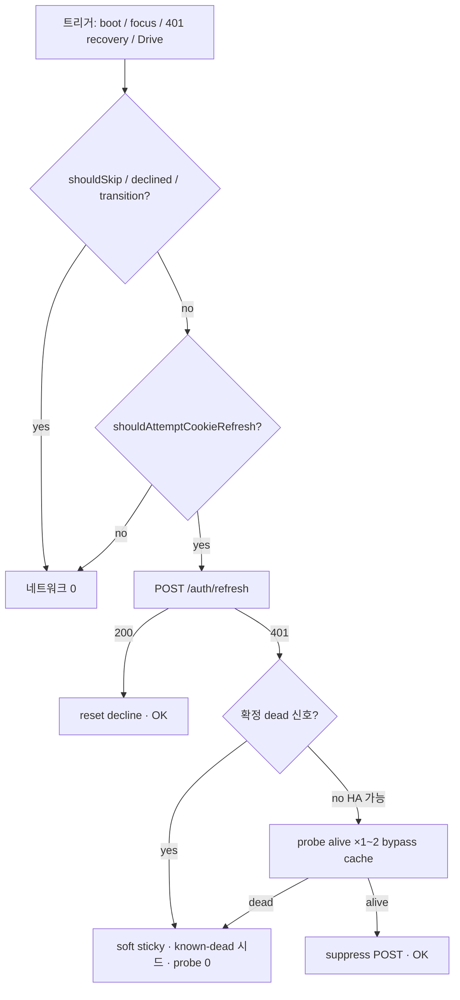
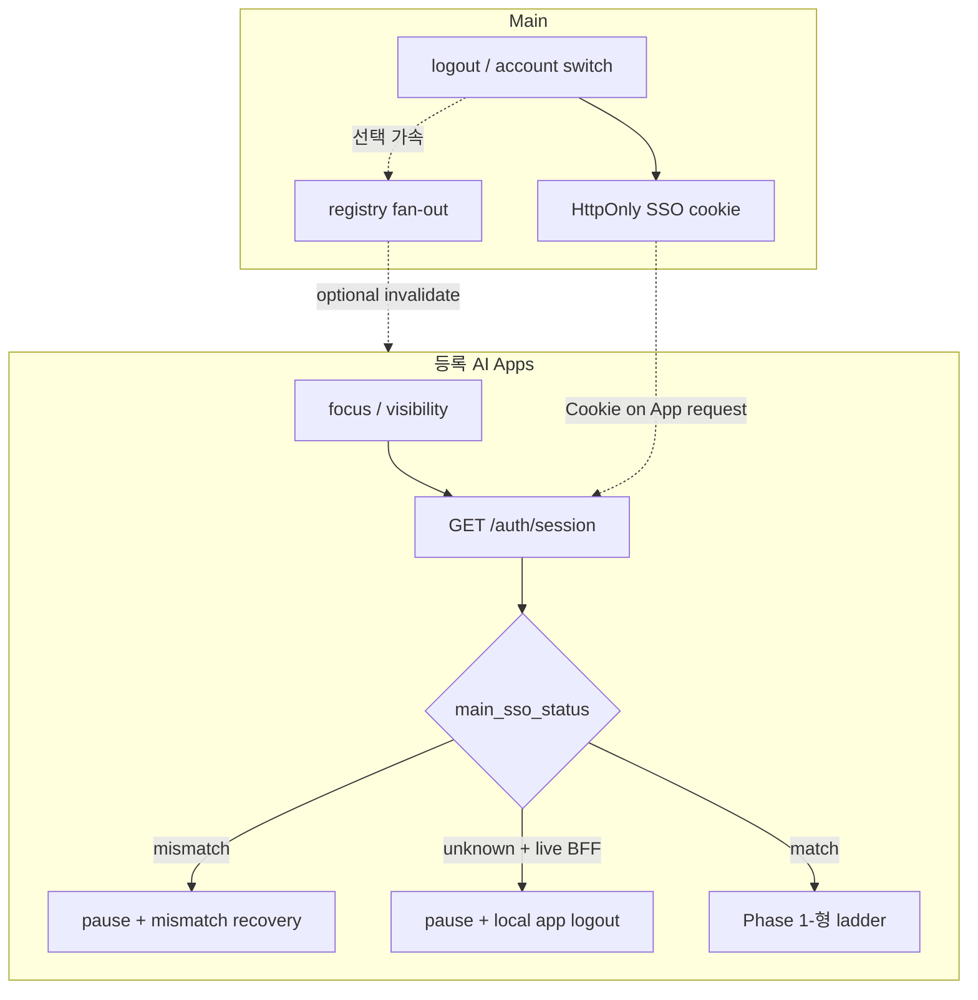

# BFF `session-probe` / `auth/refresh` 401 완전 해결 — 상위기획

| 항목 | 값 |
|------|-----|
| **문서 ID** | `0825-N01-1` |
| **역할** | 1 — 상위기획 / 기능요구 / 상위설계 |
| **작성일** | 2026-08-25 |
| **상태** | Phase 1 ☑ · Plan A G~I ☑ · **Phase 2b: FR-P0 기본 · fan-out 가속** ([0831-N01-1](./0831-N01-1-상위기획-[Apps_Main_auth_멀티앱_정합_구현후보].md)) |
| **대상 환경** | staging `stg-design.teamver.com` + `stg.teamver.com` (ALB 2노드) · production 동일 계약 · **후속 Apps(Docs 등) 동일 계약** |
| **성공 정의** | (1) DevTools **금지 패턴** `refresh 401 → probe 401 ×2` 부재. (2) Main logout/계정전환 후 **등록 AI App** 선제 정렬(Drive·자산 호출 전). (3) 크로스탭(동일 origin)·크로스앱(앱별 Plan A) auth 신호 일관. 정상 세션·HA 경합·「다시 시도」는 유지. |

---

## 0. TL;DR

**증상 (사용자 보고, staging):**

```text
POST https://stg-design.teamver.com/teamver-bff/auth/refresh          → 401
GET  https://stg-design.teamver.com/teamver-bff/auth/session-probe    → 401
GET  https://stg-design.teamver.com/teamver-bff/auth/session-probe    → 401
```

- DevTools initiator가 `provider.tsx:219` 로 보이는 것은 **analytics/global fetch 래퍼 스택**일 뿐, 실제 호출자는 `designBffClient.ts`의 `refreshDesignAuthCookie` → HA 복구 분기이다.
- **한 번의 refresh 401 직후**, 코드가 HA sibling 복구를 위해 `bypassNegativeCache: true` 로 **session-probe를 최대 2회** 친다. 세션이 이미 죽은 경우 이 2회가 **그대로 콘솔에 찍힌다.**

**왜 “이미 고쳤는데” 다시 보이나?**

| 과거 패치 | 막는 것 | 남는 구멍 |
|-----------|---------|-----------|
| [36](./36_BFF_auth_refresh_401_정리.md) | bare `authenticated:false` → refresh | “메모리상 authenticated=true” 또는 recovery 경로에서 refresh는 허용 |
| [43](./43_runtime_config_visibility_401.md) | runtime-config focus 401 | probe/refresh 자체는 별 경로 |
| 2026-08-05 폭풍 차단 ([00](./00_구현_내역_누적.md)) | boot 조기 공표 → probe×2 레이스 | refresh 401 **이후** HA probe×2는 `sessionProbeKnownDeadUntil` 미설정 시 **여전히 실행** |
| `pauseDesignBffAuthDuringTransition` | SSO mismatch/logout 전환 중 ladder | 호출 누락·타이밍 레이스 시 refresh가 먼저 나감 |

**완전 해결 방향 (한 줄):**  
인증 ladder를 **상태기계**로 고정하고, refresh 401 응답 body의 **확정 dead 코드**(`session_missing` / `session_cookie_invalid` / `session_expired` + cookie 부재)에서는 **HA probe를 0회**로 단축한다. “살아 있을 수도 있는 HA 경합”과 “분명히 죽은 세션”을 **서버 신호로 분리**한다.

---

## 1. 문제 정의

### 1.1 사용자·운영 영향

| 관점 | 영향 |
|------|------|
| 개발/QA | DevTools Network·Console이 401로 도배 → “또 인증 깨졌다” 오진, 회귀 검증 비용↑ |
| 실제 UX | soft sticky 후 카탈로그는 남을 수 있으나, 전환/로그아웃 직후 깜빡임·배너·이중 recovery 가능 |
| 인프라 | 불필요 BFF/nginx auth_request 부하 (2노드에서 증폭) |
| 보안 | 401 자체는 정상 거부. 문제는 **불필요 재시도**와 **상태 불일치** |

### 1.2 “완벽 해결” 성공 기준 (측정 가능)

| # | 시나리오 | 허용 Network | 금지 |
|---|----------|--------------|------|
| S1 | 비로그인 / 쿠키 없음 cold boot | session-probe **≤1** (또는 quiet 204 대체). refresh **0** | refresh 401, probe 반복 |
| S2 | 세션 absolute 만료 후 탭 focus | refresh **≤1** + (확정 dead면) probe **0** 추가. sticky decline | probe×2 + refresh 반복 |
| S3 | 정상 세션, focus/visibility | probe/refresh **0** (positive cache) | 불필요 401 |
| S4 | HA refresh 경합 (한 노드만 성공) | refresh 401 **1** + probe **1~2** 후 **200/204 회복** | soft sticky로 영구 로그아웃 오인 |
| S5 | Main SSO 계정 전환 / Design logout | transition pause 후 refresh/probe **0** (재바인딩 cold-start만) | mismatch 중 probe/refresh 폭풍 |
| S6 | 사용자 「다시 시도」 | `allowSoftForcePost` refresh **1** + 필요 시 ensure | 자동 백그라운드 재폭풍 |
| S7 | Drive/publish 정상 사용 | session_expired 루프 없음 ([39_10](./39_10_HA_세션쿠키_경합_해결.md) · [41](./41_Design_Drive_인증_계약_권고.md)) | Apps JWT로 Drive 재시도 |

### 1.3 비목표 (이번 Epic에서 하지 않음)

- Main Drive Dual-auth (Apps JWT 수용) — [45](./45_Main_SSO_Design_BFF_계정_불일치_예방_로드맵.md) Stage 4, 플랫폼 CTO 협의.
- BFF 세션 Redis 공유 (노드 간 refresh coalesce) — 장기 인프라.
- `provider.tsx` analytics 래퍼 제거 — initiator 표시만 바뀌고 근본과 무관.
- 정상 세션에서 auth API를 altogether 없애기 — boot/재로그인/「다시 시도」는 유지.

### 1.4 Phase 2 범위 확대 (2026-08-26 · 2026-08-31 멀티앱 개정)

**사용자 결정:** (1) Main Teamver 인증 변경 **허용**. (2) **AI Apps ↔ Main 연동을 동일 방식으로** 개선 — 앱이 N개로 늘어도 복제 가능한 **플랫폼 계약**을 Phase 2 SSOT에 포함 (§12.0).

| Phase | 범위 | 레포 | 상태 |
|-------|------|------|------|
| **1** | Design FE ladder (FR-1~5) | `ns-open-design` | ☑ 코드·vitest |
| **2** | **Plan A:** `/auth/session` 서버 `main_sso_status` + FE reconcile | Design BE/FE | ☑ **Design 첫 구현체** |
| **2a** | 45-1 pin · reconcile · logout bridge (Design 단건) | Design + Main FE | ☑ 코드 · **fan-out 미완** |
| **2b** | **Apps↔Main:** FR-P0 unknown 정합(기본) · Docs 포트 · fan-out(가속) | Design FE · Docs · (선택) Main | [0831-N01-1](./0831-N01-1-상위기획-[Apps_Main_auth_멀티앱_정합_구현후보].md) · 구현 대기 |
| **3** | 동일 origin 크로스탭 `main-user-changed` (45 Stage 3) | 각 App FE | P1 · **크로스앱 아님** |
| **4** | quiet probe · session-probe `code` (FR-6) | 각 App BE · nginx | 선택 |
| **5** | Plan B back-channel logout (**레지스트리 M2M**) · Plan C epoch | Main + 등록 Apps | P2~P3 · 선택 |
| **6** | Stage 4 Dual-auth (`aud` allowlist) | Main + Apps | Epic 밖 |

---

## 2. 증상 재현·관측

### 2.1 보고된 스택

```text
provider.tsx:219  POST .../auth/refresh 401
provider.tsx:219  GET  .../auth/session-probe 401
provider.tsx:219  GET  .../auth/session-probe 401
```

**해석:** Next/React analytics 또는 global `fetch` 계측이 스택 top에 올라온 것.  
실제 시퀀스는 `refreshDesignAuthCookie` 내부:

```text
postAuthRefreshCoordinated → 401
  → (sessionProbeKnownDeadUntil 미설정)
  → probeDesignBffSessionAlive({ bypassNegativeCache: true })  # 1
  → delay
  → probeDesignBffSessionAlive({ bypassNegativeCache: true })  # 2
  → (둘 다 실패) markAuthRefreshDeclined("soft")
```

코드 위치: `apps/web/src/teamver/designBffClient.ts` (`refreshDesignAuthCookie`, ~865–895행).

### 2.2 재현 조건 (staging)

1. BFF 세션 쿠키 없음/만료 상태에서 embed 홈·프로젝트 진입, 또는
2. 로그아웃 / Main 계정 전환 직후 Design 탭 잔류 API가 refresh를 트리거, 또는
3. memory `authenticated=true` 잔존 + 쿠키 실종 (boot 레이스·soft sticky 잔상).

단일 노드에서도 S2는 재현 가능. S4만 2노드 필요.

---

## 3. 원인 분해 (레이어 맵)

기존 문서와 겹치지 않게 **“콘솔 401 폭풍” 전용**으로 층을 정리한다.

| 층 | 이름 | 설명 | SSOT |
|----|------|------|------|
| **L0** | 정상 401 | 쿠키 없음/만료 시 refresh·probe가 401인 것은 **올바른 서버 동작** | design-api auth |
| **L1** | FE 오판 호출 | 세션이 없는데 refresh를 “한 번 더” 호출 | [36](./36_BFF_auth_refresh_401_정리.md) |
| **L2** | HA 복구 부수효과 | refresh 401 후 **무조건** probe×2 (`bypassNegativeCache`) | 본 문서 §4 — **현재 핵심 구멍** |
| **L3** | boot/레이스 | `authenticated=true` 조기 공표 → App/runtime-config probe 레이스 | 2026-08-05 · [43](./43_runtime_config_visibility_401.md) |
| **L4** | 전환 미게이트 | SSO mismatch/logout 중 ladder 미중단 | `pauseDesignBffAuthDuringTransition` · [45](./45_Main_SSO_Design_BFF_계정_불일치_예방_로드맵.md) |
| **L5** | HA Set-Cookie 경합 | stale cookie로 session_expired 루프 (Drive) | [39_10](./39_10_HA_세션쿠키_경합_해결.md) |
| **L6** | Main/Design 사용자 불일치 | Drive 403 → mismatch recovery | [45](./45_Main_SSO_Design_BFF_계정_불일치_예방_로드맵.md) |

**Phase 1 범위 (완료):** L1 + L2 + L3 + L4.  
**Phase 2 범위 (통합):** L4 잔여(크로스앱) + L6 선제 예방 + L7(신규) + FR-6.

| 층 | 이름 | Phase 2 조치 |
|----|------|----------------|
| **L7** | 크로스오리진 auth 신호 · HttpOnly blind spot | **Plan A:** `/auth/session` 서버 `main_sso_status` · session-first ordering |
| **L6** | Main/Design 사용자 불일치 | [45](./45_Main_SSO_Design_BFF_계정_불일치_예방_로드맵.md) Stage 1–3 · pin(☑) · server reconcile |
| **L5** | HA Set-Cookie | [39_10](./39_10_HA_세션쿠키_경합_해결.md) — 회귀만 |



---

## 4. 현재 코드 상태와 잔여 구멍

### 4.1 이미 있는 방어 (유지)

- `shouldSkipTeamverBffAuthCalls` — soft/hard sticky · offline · embed unauthenticated.
- session-probe **negative cache 60s** · **positive cache** · inflight coalesce.
- `sessionProbeKnownDeadUntil` — known-dead면 refresh 401 후 HA probe **스킵** (이미 구현).
- `pauseDesignBffAuthDuringTransition` — mismatch/logout 시 soft decline.
- boot nginx ladder 후 `authenticated` 공표 (08-05).
- refresh 401 body `code`: `session_missing` | `session_cookie_invalid` | `refresh_failed` (design-api).

### 4.2 잔여 구멍 (완벽 해결 대상)

| ID | 구멍 | 증거 | 영향 |
|----|------|------|------|
| **G1** | refresh 401 시 `sessionProbeKnownDeadUntil`가 **아직 안 깔린 첫 실패**에서 HA probe×2 강제 | `designBffClient.ts` 865–890 | 사용자 보고와 **동일 패턴** |
| **G2** | 확정 dead body(`session_missing` / `session_cookie_invalid`)여도 HA 분기를 **코드로 구분하지 않음** | refresh 경로가 status 401만 봄 | 쿠키 없는 401도 probe×2 |
| **G3** | memory `authenticated=true` + 쿠키 실종 → `shouldAttemptCookieRefresh` true | bootstrap/embed 분기 | 불필요 refresh 1회 유발 → G1 연쇄 |
| **G4** | transition pause **호출 누락** 경로 | logout/mismatch 일부 진입점 | 전환 중 폭풍 |
| **G5** | DevTools에 401이 “에러”로 보임 | 브라우저가 4xx를 콘솔에 기록 | quiet endpoint(204) 미도입 시 잔존 노이즈 (선택) |

### 4.3 관련 문서 (읽기 순서)

1. 본 문서 (Epic SSOT)
2. [36](./36_BFF_auth_refresh_401_정리.md) — refresh 억제 히스토리
3. [43](./43_runtime_config_visibility_401.md) — runtime-config 401
4. [39_10](./39_10_HA_세션쿠키_경합_해결.md) — HA 쿠키 (회귀 검증만)
5. [45](./45_Main_SSO_Design_BFF_계정_불일치_예방_로드맵.md) — mismatch (L4/L6)

---

## 5. 목표 아키텍처 — Auth Ladder 상태기계

### 5.1 상태

| 상태 | 의미 | 허용 호출 |
|------|------|-----------|
| `LIVE` | probe/session 최근 성공 | cache hit만. refresh 금지(만료 임박 제외) |
| `UNKNOWN` | boot 직후 · cache miss | probe **1** (coalesced). refresh는 probe 401 + 과거 LIVE/ authenticated 일 때만 |
| `HA_RECOVERING` | refresh 401 but body ≠ 확정 dead | probe **≤2** bypass cache · ensure 1 |
| `DEAD_SOFT` | 확정 만료/부재 · soft sticky | **refresh/probe 0** (「다시 시도」만 force) |
| `DEAD_HARD` | 400 / orphan JWT hard | probe survival만 (POST 금지) |
| `TRANSITION` | logout / SSO rebind | **전면 pause** → cold start |

### 5.2 확정 dead 판정 (서버 신호 우선)

refresh 또는 probe 응답에서 **다음 중 하나면 HA_RECOVERING 진입 금지** → 즉시 `DEAD_SOFT`:

1. HTTP 401 + body `code` ∈ {`session_missing`, `session_cookie_invalid`}
2. HTTP 401 + `detail`/`code` = `session_expired` **그리고** 요청에 BFF 세션 쿠키가 없었음(클라이언트 힌트) 또는 probe가 직전에 이미 401
3. `sessionProbeKnownDeadUntil` 유효
4. `TRANSITION` / `pauseDesignBffAuthDuringTransition` 활성

**HA_RECOVERING 허용:** refresh 401 + `code=refresh_failed` (또는 동등) + 최근 LIVE/쿠키 존재 힌트 — sibling Set-Cookie 가능성.

### 5.3 호출 예산 (탭당 쿨다운)

| 이벤트 | refresh | session-probe |
|--------|---------|-----------------|
| cold unauthenticated boot | 0 | ≤1 |
| 첫 확정 dead | ≤1 (이미 쳤다면 0 추가) | 0 after mark |
| HA recover | 1 | ≤2 |
| focus while DEAD_SOFT | 0 | 0 |
| 「다시 시도」 | 1 | ≤1 |

---

## 6. 기능 요구사항

### FR-1 (P0) — 확정 dead 시 HA probe×2 제거

- refresh 401이 확정 dead이면 `probeDesignBffSessionAlive(bypass…)` **호출하지 않음**.
- 즉시 `markAuthRefreshDeclined("soft")` + `sessionProbeKnownDeadUntil` 시드 + soft force cooldown.
- 단위 테스트: “refresh 401 `session_missing` → probe call count = 0”.

### FR-2 (P0) — `shouldAttemptCookieRefresh` 강화

- embed + bootstrap: **쿠키 부재 힌트**(document.cookie에 BFF 세션명 없음 · 또는 probe negative cache hit)이면 refresh **금지** (명시적 recovery/`allowSoftForcePost` 제외).
- “메모리 authenticated만으로 refresh” 경로를 좁힘 — boot ladder 완료 전 App이 refresh를 열지 않음 (기존 08-05 유지·회귀 테스트).

### FR-3 (P0) — Transition pause 누락 감사

- Main SSO mismatch recovery, Design logout, cold-start redirect, hard clear orphan JWT 진입점을 목록화하고 **전부** `pauseDesignBffAuthDuringTransition` 또는 동등 hard/soft decline을 **네트워크 이전**에 호출.
- 누락 경로 발견 시 수정 + 테스트.

### FR-4 (P1) — Auth ladder 단일 진입점

- boot / runtime-config gate / daemon 401 recovery / Drive recover / C1 escalate가 **각자 probe·refresh를 직접** 치지 않고, `ensureDesignAuthLadder(reason)` 같은 **단일 함수**로 모음 (점진 리팩터, 동작 동일 보장).
- reason별 예산·로깅 (`devLog`)으로 DevTools 디버깅 가능.

### FR-5 (P1) — 계측

- (옵션) staging에서 `code`·`reason`·`probeCount`를 짧게 console debug 또는 BFF access log 상관 ID로 남김 — 운영에서 “어느 FR이 깨졌는지” 판별.
- 성공 지표: 탭 세션당 refresh 401 횟수, probe 401 횟수 (수동 Network 또는 e2e assert).

### FR-6 (P2, 선택) — Quiet probe

- 확정 unauthenticated를 **204 + 빈 body** 또는 `HEAD`로 표현해 브라우저 Console 노이즈를 줄임.  
- nginx/design-api 계약 변경 → **별 슬라이스**. FR-1~3만으로 “반복 401”은 제거 가능.

### FR-7 (P2) — 문서·회귀 체크리스트 고정

- [36](./36_BFF_auth_refresh_401_정리.md)에 “HA probe×2는 확정 dead에서 금지” 절 추가.
- §1.2 S1–S7을 e2e/vitest로 가능한 범위 자동화.

---

## 7. 구현 단계 (문서 루프)

| 단계 | 문서 | 내용 | 완료 조건 |
|------|------|------|-----------|
| **N01-1** | 본 문서 | 상위기획 | git commit |
| **N01-2** | `0825-N01-2-구현설계-…` | 파일·함수·상태기계·테스트 목록 | 설계 리뷰 후 코드 |
| **N01-3** | `0825-N01-3-구현현황-…` | 슬라이스별 진행·검증 체크 | 매 슬라이스 갱신 |

### 슬라이스 제안 (N01-2에서 상세화)

| 슬라이스 | FR | 위험 | 회귀 포커스 |
|----------|----|------|-------------|
| **A** | FR-1 | 중 — HA 오탐 시 sticky 과다 | S4 HA 2노드 수동 확인 |
| **B** | FR-2 | 중 — 재로그인 직후 refresh 막힘 | S3·로그인 복귀 |
| **C** | FR-3 | 저 | S5 mismatch/logout |
| **D** | FR-4 | 중 — 대형 리팩터 금지, 래핑만 | 전체 auth 스모크 |
| **E** | FR-5·7 | 저 | 문서·테스트 |
| **F** | FR-6 | 저~중 (인프라) | 선택 |

**원칙:** 슬라이스마다 commit. **기존에 잘 되던** Drive publish, background run, soft sticky 카탈로그 보존, Stop mid-stream sanitizer 등과 **무관한 파일은 건드리지 않음.**

---

## 8. 위험 · 회귀 가드

| 위험 | 완화 |
|------|------|
| HA 경합을 확정 dead로 오판 → 사용자가 soft sticky에 갇힘 | body `code` + 쿠키 존재 힌트 이중 조건. `refresh_failed`는 HA 허용. 「다시 시도」/`allowSoftForcePost` 유지 |
| refresh를 과도 억제 → 재로그인 후 세션 안 붙음 | boot ladder · cold start exchange · explicit recovery만 allowlist |
| transition pause가 너무 넓음 → 정상 API skip | pause는 mismatch/logout/orphan clear에만 |
| 리팩터로 daemon 401 recovery 회귀 | FR-4는 래핑 우선, `teamver-bff-cookie-auth-recovery` · `teamver-runtime-config-auth-gate` · `teamver-design-auth-session` 전부 green |
| staging만 고치고 production 계약 불일치 | design-api `code` 필드 production 동일 배포 확인 |

**절대 금지:**

- 전체 OD upstream merge로 auth 교체.
- sticky decline를 제거해 “항상 refresh 재시도”.
- Drive에 Apps JWT 재도입 ([41](./41_Design_Drive_인증_계약_권고.md) 위반).

---

## 9. 검증 계획

### 9.1 자동화 (필수)

- `apps/web` vitest:
  - `teamver-bff-cookie-auth-recovery.test.ts` — refresh 401 `session_missing` → **probe 0**
  - `teamver-runtime-config-auth-gate.test.ts` — negative cache · boot skip
  - `teamver-design-auth-session.test.ts` — bare authenticated:false → refresh 0
  - (신규) transition pause 호출 경로 단위 테스트
- design-api: refresh 401 `code` 계약 테스트 유지

### 9.2 staging 수동 (필수, §1.2)

| ID | 절차 | Pass |
|----|------|------|
| S1 | 시크릿·비로그인으로 stg-design 진입 | refresh 0, probe ≤1 |
| S2 | 로그인 후 쿠키 삭제 또는 대기 만료 → focus | refresh≤1, **추가 probe 0**, soft sticky |
| S3 | 정상 세션 5분 사용 · 탭 전환 | 401 없음 |
| S4 | 2노드 · Drive 모달 연속 오픈 | 경합 후 회복 또는 1회 soft 후 「다시 시도」로 회복 (영구 루프 없음) |
| S5 | Main 다른 계정 로그인 → Design 복귀 | pause 후 재바인딩, probe/refresh 폭풍 없음 |
| S6 | soft sticky에서 「다시 시도」 | refresh 1회 후 LIVE 또는 로그인 |
| S7 | Drive list/publish | session_expired 루프 없음 |

### 9.3 완료 보고 조건

- N01-3에 S1–S7 체크리스트 ☑
- DevTools 스크린샷 또는 Network HAR에서 **금지 패턴(refresh→probe→probe) 부재**
- 관련 vitest green
- [00](./00_구현_내역_누적.md) · [36](./36_BFF_auth_refresh_401_정리.md) 갱신

---

## 10. 우선순위 요약

| 우선 | 항목 | 이유 |
|------|------|------|
| **P0** | FR-1 확정 dead → HA probe 0 | 사용자 보고 패턴과 1:1 |
| **P0** | FR-2 refresh 시도 조건 강화 | G1의 유발 차단 |
| **P0** | FR-3 transition 감사 | 로그아웃/계정전환 폭풍 |
| **P1** | FR-4 단일 ladder · FR-5/7 | 재발 방지·관측 |
| **P2** | FR-6 quiet probe | 콘솔 미관 (기능 필수는 아님) |

---

## 12. Phase 2 — 통합 완전 해결 (Plan A 우선 · 멀티앱 플랫폼)

### 12.0 Apps ↔ Main 플랫폼 계약 (2026-08-31 · **재검토 반영**)

**전제:** Featured AI Apps는 `docs` · `design` (`FeaturedExternalAppKey`)이며 Canvas 등 **N개**로 늘어난다.

**구현 후보·재검토 SSOT:** [0831-N01-1](./0831-N01-1-상위기획-[Apps_Main_auth_멀티앱_정합_구현후보].md)  
**채택:** Plan A(후보 A) + **unknown 정합(후보 B)** = 기본. Main 레지스트리 fan-out(후보 C) = **가속(선택)**.

#### 12.0.1 계층 분리 (유지 · [41](./41_Design_Drive_인증_계약_권고.md))

| 계층 | 쿠키 / 토큰 | Domain | 소유 |
|------|-------------|--------|------|
| Main SSO | `teamver_access_token` (HS256) | `.teamver.com` | Main — **앱 공통 1개** |
| App BFF | `teamver_{app_key}_bff_session` (Apps RS256) | **앱 host-only** | 각 App BE |

앱이 늘어도 **부모 SSO 1 + 앱별 host BFF N** 구조는 불변. parent-domain BFF 쿠키는 **금지**.

#### 12.0.2 사건 분리 · 앱 BFF 공통 계약

| 사건 | `main_sso_status` | 기본 조치 (채택) |
|------|-------------------|------------------|
| 계정 전환 | **`mismatch`** | pause + mismatch recovery |
| Main 로그아웃 | **`unknown`** (BFF는 살아 있을 수 있음) | **`unknown` ∧ BFF authenticated → 앱 로컬 logout** (후보 B) |
| 정상 | **`match`** | Phase 1-형 ladder |

모든 AI App BFF가 **동일 스키마**를 제공한다. Design = **reference**.

| 엔드포인트 | 계약 |
|------------|------|
| `GET /api/v1/auth/session` | `main_sso_status`: `match` \| `mismatch` \| `unknown` · `main_sso_identity_hash` (선택) |
| `POST /api/v1/auth/refresh` | Apps JWT 회전 · 확정 dead `code` |
| `GET /api/v1/auth/session-probe` | nginx auth_request · 204/401 |
| `POST /api/v1/auth/logout` | 해당 앱 BFF 세션 폐기 |
| `GET|페이지 /auth/logout-bridge` | Main iframe용 (가속 fan-out용 · 선택) |
| `POST /internal/auth/main-logout` | M2M (가속 · 선택) |

**앱 FE 공통 순서 (Plan A + unknown 정합):**

```text
focus / visibility (authenticated)
  → GET /auth/session          # ladder보다 먼저 · force
  → mismatch?  → pause + mismatch recovery
  → unknown && hadLiveBff? → pause + POST /auth/logout(앱) + UI unauth
  → match → Phase 1-형 ladder
```

#### 12.0.3 Main fan-out — **가속(선택)** · 필수 아님

**현재:** Main `clearDesignBffSessionViaLogoutBridge`는 Design만. orphan은 **앱 focus + FR-P0(unknown 정합)** 으로 정리하는 것이 **기본**.

| 요구 ID | 우선 | 내용 | 소유 |
|---------|------|------|------|
| **FR-P0** | **P0** | unknown ∧ authenticated → 로컬 BFF 폐기 (후보 B) | 각 App FE (Design 먼저) |
| **FR-P4** | P1 | Docs(후속) Plan A + FR-P0 포트 | 각 App 팀 |
| **FR-P1** | **P1 선택** | Main logout iframe **레지스트리 fan-out** (즉시성) | Main FE |
| **FR-P2** | P1 선택 | 앱 레지스트리 SSOT (fan-out 시) | Main · 플랫폼 |
| **FR-P3** | P2 선택 | M2M `main-logout` 레지스트리 | Main BE · Apps |
| **FR-P5** | P2 선택 | mismatch recovery 시 형제 bridge | Main · Apps |

```text
# 기본 (필수): 앱 스스로
focus → session → mismatch | unknown→local logout

# 가속 (선택): Main이 밀어줌
Main logout → for app in registry: iframe logout-bridge / M2M
```

**금지:** 앱마다 Main에 `clearXxxBffSessionOnLogout.ts` hardcode 복제.  
**fan-out을 쓸 때만** 단일 레지스트리 표.

#### 12.0.4 크로스탭 vs 크로스앱

| 신호 | 범위 | 비범위 |
|------|------|--------|
| BroadcastChannel `main-user-changed` (FR-13) | **동일 앱 origin** 탭 | Design↔Docs |
| Plan A + FR-P0 | **앱마다 독립** focus | Main push 불필요(기본) |
| Main fan-out (선택) | 등록 앱 **즉시** BFF 폐기 | 기본 경로의 대체재 |

크로스앱 정렬의 **기본 SSOT = 앱별 Plan A + FR-P0**. fan-out은 가속.

#### 12.0.5 Stage 4 Dual-auth (Epic 밖)

`aud` allowlist (`teamver-design` · `teamver-docs` · …). Drive 사용 앱 N개 ROI가 커지면 [41] 방안 B · [0831-N01-1 후보 E](./0831-N01-1-상위기획-[Apps_Main_auth_멀티앱_정합_구현후보].md).

#### 12.0.6 구현 우선순위 (멀티앱 · 재검토)

```text
[완료] Design Plan A (G~I)
[다음 P0] FR-P0 Design unknown 정합 → S12a
[다음 P1] FR-P4 Docs Plan A+P0 → S13
[선택]    FR-P1·P2 Main fan-out → S12b
[선택]    FR-P3 M2M · FR-13 · Dual-auth 재평가
```

---

### 12.1 설계 원칙 (2026-08-26 · 08-31 재검토)

| 순위 | 접근 | Main 변경 | 표준성 |
|------|------|-----------|--------|
| **Plan A + P0** | `main_sso_status` + unknown 정합 | **앱만** (기본) | BFF session 판정 — **1순위** |
| **Plan B fan-out** | iframe/M2M 레지스트리 | Main FE/BE | OIDC 동형 — **가속** |
| **Plan C epoch** | readable epoch | BE cookie | **P0 bake 후에만** |

**401 폭풍** = Phase 1형 ladder. Phase 2 = mismatch 선제 + **logout orphan 정합** + (선택) 즉시 fan-out.

### 12.2 Plan A — Session 서버 판정 (핵심 · Design reference)

브라우저는 앱 요청(예: `stg-design.teamver.com`)에 `.teamver.com` 쿠키를 **항상** 보낸다. 앱 BFF는 **HttpOnly Main JWT를 서버에서** 읽을 수 있다 (Drive gate와 동일).

**BE** `GET /auth/session` 응답 확장 (§12.0.2 공통 계약):

```json
{
  "authenticated": true,
  "main_sso_identity_hash": "abc…",
  "main_sso_status": "match" | "mismatch" | "unknown"
}
```

| `main_sso_status` | 조건 |
|-------------------|------|
| `match` | pin(또는 bff user) == live Main cookie user |
| `mismatch` | 둘 다 존재 · 불일치 |
| `unknown` | Main 쿠키 없음 · pin 없음(legacy) · BFF 비인증 |

**FE** (Design: `fetchDesignAuthSession` 중앙 gate · focus `force` · **FR-P0 unknown 정합 추가 예정**):

```text
1. GET /auth/session
2. mismatch → pause + mismatch recovery
3. unknown && hadLiveBff → pause + app logout + UI unauth   # FR-P0
4. else → Phase 1 ladder
```

**45-1 Stage 2 한계 보완:** `document.cookie` probe는 HttpOnly에서 `unknown` 다수 → reconcile 입력은 **`session.mainSsoStatus` 우선**.

### 12.3 Plan B — iframe / M2M fan-out (**가속 · 선택**)

[45-1 §5](./45-1-구현설계-Main_SSO_Design_계정_정합_Stage1-2.md) Design iframe은 **☑ 단건**. orphan 기본 정리는 **FR-P0**. 제품이 **즉시** N앱 폐기를 요구할 때만 레지스트리 fan-out ([0831-N01-1 후보 C](./0831-N01-1-상위기획-[Apps_Main_auth_멀티앱_정합_구현후보].md)).

```text
Main POST /auth/logout
  → for app in registry:   # 선택 경로만
       iframe {app}/auth/logout-bridge
       [P2] M2M {app}/internal/auth/main-logout
```

### 12.4 Plan C — Epoch 쿠키 (보류 · P3)

FR-P0 + Plan A bake 후에도 전환 직전 refresh 401이 남을 때만. N앱일수록 복잡도↑ — **최후 수단**.

### 12.5 통합 상태기계



### 12.6 Phase 2 기능 요구사항

| ID | 우선 | 요구 | 소유 | 상태 |
|----|------|------|------|------|
| **FR-8** | P0 | `/auth/session` `main_sso_status` | Design BE → 앱 공통 | ☑ Design |
| **FR-9** | P0 | FE `mainSsoStatus` 우선 reconcile | Design FE → 앱 공통 | ☑ Design |
| **FR-10** | P0 | session → reconcile → ladder · focus `force` | Design FE | ☑ Design |
| **FR-P0** | **P0** | **unknown ∧ authenticated → 로컬 BFF 폐기** | Design FE → 앱 공통 | ☐ |
| **FR-11·12** | — | pin · reconcile hook | Design | ☑ |
| **FR-13** | P1 | same-origin `main-user-changed` only | 각 App FE | ☐ |
| **FR-14** | P2 | quiet probe | 각 App BE | ☐ |
| **FR-15·P3** | P2 선택 | M2M 레지스트리 fan-out | Main · Apps | ☐ |
| **FR-16** | 보류 | epoch | Main · Apps | 보류 |
| **FR-P4** | P1 | Docs Plan A + FR-P0 포트 | Docs/후속 | ☐ |
| **FR-P1·P2** | **P1 선택** | Main logout 레지스트리 iframe | Main FE | ☐ |
| **FR-P5** | P2 선택 | recovery 형제 bridge | Main · Apps | ☐ |

### 12.7 Phase 2 성공 기준

| # | 시나리오 | Pass |
|---|----------|------|
| S8 | Main logout → Design focus | session → pause · refresh/probe **0** |
| S9 | Main A→B → Design | Drive 전 `mismatch` → recovery |
| S10 | **동일 앱** 4탭 | broadcast 또는 focus — 45s 내 |
| S11 | HttpOnly only | 서버 status로 mismatch |
| **S12a** | Main logout → Design(+Docs) | **다음 focus**에서 BFF 미인증 (FR-P0) — **필수** |
| **S12b** | (선택) Main logout | iframe/M2M으로 **즉시** BFF 폐기 |
| **S13** | A→B · Design·Docs 동시 | 각 앱 Plan A mismatch (fan-out 불필요) |

### 12.8 구현 슬라이스

| 슬라이스 | FR | 레포 | 의존 |
|----------|----|------|------|
| **G~I** | FR-8~10 | Design | ☑ |
| **R** | **FR-P0** | Design FE | G~I |
| **Q** | FR-P4 | Docs | R |
| **P** | FR-P1·P2 | Main FE | 선택 · S12b |
| **L** | FR-13 | 각 App FE | same-origin |
| **N** | FR-15·P3·P5 | Main · Apps | 선택 |
| **O** | FR-16 | — | 보류 |

**배포:** Design G~I → **R(FR-P0)** → S12a → Q(Docs) → S13.  
**선택:** P → S12b.

---

## 13. 의사결정 (갱신)

1. **Plan A (G~I):** Design reference ☑. N앱 계약 §12.0 · [0831-N01-1](./0831-N01-1-상위기획-[Apps_Main_auth_멀티앱_정합_구현후보].md).
2. **기본 멀티앱 해:** Plan A + **FR-P0 unknown 정합** (fan-out 필수 아님).
3. **Fan-out / M2M:** 즉시성 UX — **가속 선택**.
4. **Plan C epoch:** FR-P0 bake 후 재평가.
5. **Stage 3:** same-origin only.
6. **Stage 4 Dual-auth:** Epic 밖 · aud allowlist.

---

## 변경 이력

| 일시 (KST) | 내용 |
|------------|------|
| 2026-08-31 15:20 | **재검토** — FR-P0 기본 · fan-out 가속 · [0831-N01-1](./0831-N01-1-상위기획-[Apps_Main_auth_멀티앱_정합_구현후보].md) · S12a/b |
| 2026-08-31 15:05 | 멀티앱 플랫폼 계약 §12.0 · FR-P1~P5 (fan-out P0이었음 → 개정) |
| 2026-08-26 15:45 | Phase 2 Plan A 1순위 · epoch Plan C |
| 2026-08-26 11:30 | Phase 2 epoch 중심 (폐기) |
| 2026-08-26 10:38 | Epic 착수 |
| 2026-08-25 17:40 | 초안 |
