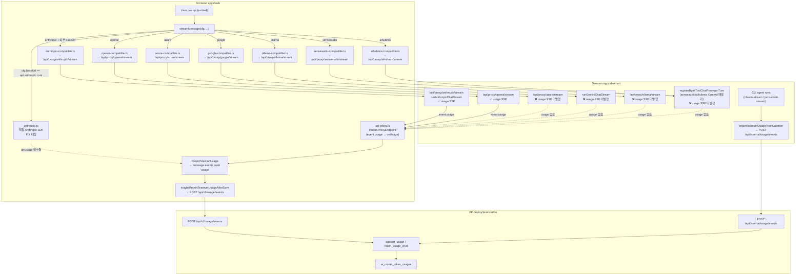

# 24. AI API Usage Capture 경로별 분석 (FE BYOK 0-token 원인 분석)

> 트래킹 이슈: `ATU-FO5LT28NQBB5` (`model='claude-sonnet-4-5'`, `input_tokens=0`, `output_tokens=0`, `billing_status='not_attempted'`, `token_count_source='unknown'`)

## 1. TL;DR

Teamver embed 의 기본 BYOK pin (`baseUrl='https://api.anthropic.com'`) 은 daemon proxy 대신 **직접 Anthropic SDK 경로**(`apps/web/src/providers/anthropic.ts`) 를 탄다.
이 경로는 `client.messages.stream(...)` 의 `text` 이벤트로 텍스트는 잘 받고 `stream.finalMessage()` 까지 호출하지만, **`handlers.onUsage` 를 한 번도 호출하지 않는다.**

결과:

```
anthropic.ts (no onUsage)
  → message.events 에 kind:'usage' 부재
  → extractLatestUsageFromEvents() = null
  → maybeReportTeamverUsageAfterSave → POST { input_tokens: 0, output_tokens: 0, token_count_source: 'unknown' }
  → BE Pydantic default → billing_status='not_attempted'
  → ai_model_token_usages 0-token row 적재 (사용자 리포트 row)
```

동일 패턴은 **6 개 BYOK compatible provider의 daemon proxy 경로**(azure / google / ollama / senseaudio tool-loop / aihubmix tool-loop / OpenAI tool-loop) 에도 일부 존재한다. FE proxy 클라이언트(`api-proxy.ts`) 는 `event:'usage'` SSE 프레임을 정상 처리하지만, daemon proxy 가 그 프레임을 **발행하지 않으면** 같은 0-token 증상이 그대로 재현된다.

## 2. 사용자 리포트 컬럼 alias 매핑

쿼리 도구가 보여준 컬럼 이름과 `design-api` 의 `ai_model_token_usages` 실제 스키마는 일부 alias 가 있다.

| 사용자 리포트 컬럼 | `ai_model_token_usages` 스키마 컬럼 | 비고 |
|--------------------|-----------------------------------------------|------|
| `id`               | `id`                                          | `ATU-…` ULID |
| `model`            | `model_name`                                  | 예: `claude-sonnet-4-5` |
| `input_tokens`     | `input_tokens`                                | |
| `output_tokens`    | `output_tokens`                               | |
| `user_id`          | `user_id`                                     | |
| `workspace_id`     | `workspace_id`                                | |
| `created_at`       | `created_at`                                  | |
| `engine`           | `operation`                                   | 예: `design_run` |
| `run_id`           | `run_id`                                      | FE: `message.id`(UUID), daemon: `run.id` |
| `conversation_id`  | (테이블에 없음)                                | 쿼리 도구 alias / 별도 view |
| `status`           | `run_status`                                  | 예: `succeeded` |
| `actor`            | `token_count_source`                          | `unknown` ↔ provider usage 미캡처 |
| `billing_status`   | `billing_status`                              | `not_attempted` ↔ FE only write default |
| `credits_committed`| `credits_committed`                           | |
| `updated_at`       | `updated_at`                                  | created 와 ~7ms 차이 → background `aupsert_usage` insert + same-writer dedupe (race 아님) |

사용자 row 의 `actor='unknown'` + `billing_status='not_attempted'` 조합은 **"FE 가 토큰 0 으로 사용량을 보고했고 daemon billing 라이프사이클은 한 번도 돌지 않았다"** 라는 신호다.

## 3. 경로별 Token Capture SSOT



## 4. Provider 별 현황 표 (SSOT)

`✅` = `handlers.onUsage` 호출 가능, `❌` = 0-token 누락, `⚠️` = upstream 응답 의존.

### 4.1 FE provider 코드 자체

| FE file | 호출 대상 | onUsage 캡처 | 비고 |
|---------|-----------|----------------|------|
| `anthropic.ts` 직접 SDK 분기 | `@anthropic-ai/sdk` | ❌ **FIX** | finalMessage.usage 미사용 — embed 기본 경로 |
| `anthropic-compatible.ts` | `/api/proxy/anthropic/stream` | ✅ (proxy 의존) | api-proxy `event:usage` |
| `openai-compatible.ts` | `/api/proxy/openai/stream` | ✅ (proxy 의존) | 동상 |
| `azure-compatible.ts` | `/api/proxy/azure/stream` | ✅ (proxy 의존) | api-proxy 자체는 OK, daemon proxy 가 발행 안 함 |
| `google-compatible.ts` | `/api/proxy/google/stream` | ✅ (proxy 의존) | 동상 |
| `ollama-compatible.ts` | `/api/proxy/ollama/stream` | ✅ (proxy 의존) | 동상 |
| `senseaudio-compatible.ts` | `/api/proxy/senseaudio/stream` | ✅ (proxy 의존) | 동상 |
| `aihubmix-compatible.ts` | `/api/proxy/aihubmix/stream` | ✅ (proxy 의존) | 동상 |

> 즉 **FE-only 코드 수정이 필요한 곳은 `anthropic.ts` 직접 SDK 분기 하나** 다. 나머지 6 개 compatible 은 `api-proxy.ts streamProxyEndpoint` 에 `event:'usage'` 핸들러 (L124-139) 가 있어 proxy 가 발행만 해주면 그대로 흐른다.

### 4.2 Daemon proxy SSE 발행 측

| 경로 | 추출 위치 | 발행 | 상태 |
|------|-----------|------|------|
| `/api/proxy/anthropic/stream` `runAnthropicChatStream` | `message_start.usage.input_tokens` / `message_delta.usage.output_tokens` | `sendProxyUsageIfPresent` | ✅ |
| `/api/proxy/openai/stream` | `data.usage.prompt_tokens/completion_tokens` | ✅ | ✅ (`stream_options.include_usage` 추가 필요) |
| `/api/proxy/azure/stream` | (추출 없음) | (발행 없음) | ❌ **FIX** |
| `runGeminiChatStream` (google + aihubmix gemini family) | (추출 없음) | (발행 없음) | ❌ **FIX** (`usageMetadata.promptTokenCount/candidatesTokenCount`) |
| `/api/proxy/ollama/stream` | (추출 없음) | (발행 없음) | ❌ **FIX** (NDJSON final `prompt_eval_count`/`eval_count`) |
| `registerByokToolChatProxy.runTurn` (OpenAI 패밀리, senseaudio / aihubmix non-claude/gemini) | (추출 없음) | (발행 없음) | ❌ **FIX** (OpenAI `stream_options.include_usage` + final chunk `data.usage`) |
| Anthropic native tool loop (aihubmix claude*) | message_start/message_delta usage | (발행 없음) | ❌ **FIX** (per-turn 합산) |
| Gemini native tool loop (aihubmix gemini*) | usageMetadata | (발행 없음) | ❌ **FIX** (per-turn 합산) |

### 4.3 Daemon CLI run (BYOK 외 경로)

CLI agent (`apps/daemon/src/claude-stream.ts`, `json-event-stream.ts`) 는 `kind:'usage'` 이벤트를 적극 emit 하므로 본 분석의 0-token 이슈와는 무관. 사용자 row 처럼 `billing_status='not_attempted'` 가 보이는 것은 **FE-only 경로** 의 signature.

## 5. 사용자 row 매핑 (재구성)

`ATU-FO5LT28NQBB5` row:

| 컬럼 | 값 | 해석 |
|------|----|------|
| `model_name` | `claude-sonnet-4-5` | Teamver embed pin 기본값 (`pinnedExecutionConfig.ts` L37-38) |
| `operation` | `design_run` | FE & daemon 공통 default |
| `run_status` | `succeeded` | run 자체는 성공 — 응답이 도착했음 |
| `input/output_tokens` | `0 / 0` | **`message.events` 에 usage 이벤트가 없음** ↔ `anthropic.ts` direct SDK 경로 |
| `token_count_source` | `unknown` | `resolveTokenCountSource` 가 0-token 일 때 `'unknown'` 반환 |
| `billing_status` | `not_attempted` | FE 요청 페이로드에 `billing_status` 미포함 → Pydantic default (`usage_event.py` L55) |
| `credits_committed` | `false` | 청구 라이프사이클 미시작 |
| `updated_at - created_at` | ~7ms | upsert 단일 row insert + same-writer dedupe (race 아님) |

**결정:** 사용자 row 는 **`anthropic.ts` direct SDK 분기의 onUsage 누락**으로 인한 단일 root cause. embed pin 기본값이 `api.anthropic.com` 이라 `usesAnthropicProxy(cfg) === false` ([utils/apiProtocol.ts L55](../apps/web/src/utils/apiProtocol.ts)) 가 되어 daemon proxy 를 우회하고 FE 가 직접 SDK 를 부르며 token 캡처가 무산된다.

## 6. 수정 범위 (Loop 390)

### 6.1 FE direct SDK (root cause)

- `apps/web/src/providers/anthropic.ts` — `stream.finalMessage().usage` 에서 input/output/cache 토큰 정규화 후 `handlers.onUsage?.({ inputTokens, outputTokens, model })` 호출. `onDone` 직전.

### 6.2 Daemon proxy SSE 발행 보강

- `/api/proxy/openai/stream` — payload 에 `stream_options.include_usage: true` 추가 (이미 usage extraction 은 존재).
- `/api/proxy/azure/stream` — payload include_usage + OpenAI 호환 SSE 의 `data.usage` 추출 + `sendProxyUsageIfPresent` 호출.
- `runGeminiChatStream` — `usageMetadata.promptTokenCount/candidatesTokenCount` 누적, 종료 시점에 `sendProxyUsageIfPresent` 호출.
- `/api/proxy/ollama/stream` — NDJSON 최종 chunk 의 `prompt_eval_count`/`eval_count` 추출, `sendProxyUsageIfPresent` 호출.
- `registerByokToolChatProxy.runTurn` (OpenAI 패밀리) — payload 에 `stream_options.include_usage: true` 추가, 각 turn 누적 후 `text_end` / bounded 종료 직전에 `sendProxyUsageIfPresent` 발행.
- `runAnthropicToolTurn` / `runGeminiToolTurn` (aihubmix native) — turn 별 usage 합산 → outer loop 종료 시 `sendProxyUsageIfPresent`.

### 6.3 회귀 테스트

- `apps/web/tests/providers/anthropic-usage-capture.test.ts` — 모의 Anthropic SDK 스트림으로 `onUsage` 호출 + payload 정확성 검증 (input/output/cache_creation/cache_read 합산 포함).
- `apps/daemon/tests/proxy-routes.test.ts` — azure/google/ollama/openai 각 경로에서 mock upstream usage 가 `event:usage` SSE 로 발행되는지 검증.
- `apps/web/tests/teamver-report-usage.test.ts` (또는 동급) — direct SDK → `inputTokens>0`/`tokenCountSource='provider_usage'` 단대단 보고.

### 6.4 문서 갱신

- `00_구현_내역_누적.md` — loop 390 entry (FE BYOK usage capture gap fix).
- `11_Usage·Drive_Publish_보강.md` §4.7 U-G6 — direct SDK / daemon proxy 갭 마감 상태 명시.
- `22_Drive_인증_Usage_연동_검토.md` §4.3 — 0-token 회귀 close.

## 6A. Production Hardening (Loop 404)

Loop 390 은 **성공 path** 의 token capture 갭을 닫는 데 집중했다. Production 배포 직전 review 에서 **실패 / abort / mid-stream provider error** path 에서 동일한 0-token 회귀가 재현 가능함을 확인 → 본 loop 에서 차단.

### 6A.1 핵심 invariant

> Provider 가 `input_tokens` 를 청구한 모든 시점부터, FE/daemon 은 그 토큰을 ledger 에 반영해야 한다.

Provider 별 청구 시점:
- **Anthropic Messages**: `message_start.usage.input_tokens` 가 도착하는 순간. 응답을 끝까지 받지 않아도 청구됨.
- **OpenAI / Azure / Gemini**: stream 첫 chunk 직전. usage chunk 가 마지막에 도착하지만, error mid-stream 이라도 prompt 부분은 청구됨.
- **Ollama**: terminal `done:true` chunk 도착 전 까지는 알 수 없음 (best-effort).

### 6A.2 fe/anthropic.ts (직접 SDK)

- 기존: try 블록 안의 `await stream.finalMessage()` 가 reject 하면 catch 분기로 빠져 onUsage 미발행.
- 변경: catch 분기에서 `stream.currentMessage?.usage` (SDK 가 `message_start` → `message_delta` 로 채워 두는 snapshot) 를 읽어 best-effort emit. `usageEmitted` 플래그로 finalMessage 성공 경로와 중복 방지.
- abort 분기 (`err.name === 'AbortError'`) 도 동일하게 currentMessage 기반 emit 후 onError 미호출.

### 6A.3 daemon proxy SSE ordering

`api-proxy.ts` (FE) 가 `event:error` 수신 시 즉시 return 하므로 **usage frame 은 error frame 보다 반드시 먼저 SSE 에 실려야 한다**. 모든 proxy / tool-loop 에 다음 패턴 적용:

```
sendProxyUsageIfPresent(sse, inputTokens, outputTokens, model);  // usage 먼저
sendProxyError(sse, message, { code, details });                  // 그 다음 error
```

수정 경로 (catch 블록 + 모든 mid-stream `error`/`streamError` 분기):
- `runAnthropicChatStream` — `inputTokens/outputTokens` 를 try 바깥으로 hoist, error 이벤트 + catch 모두 usage 선행.
- `/api/proxy/openai/stream` — 동일.
- `/api/proxy/azure/stream` — 동일.
- `runGeminiChatStream` — streamError + `extractGeminiBlockMessage` + catch 모두 usage 선행.
- `/api/proxy/ollama/stream` — catch 분기에서 누적된 `prompt_eval_count/eval_count` 선행 emit.

Tool-loop (다중 turn 누적):
- `registerByokToolChatProxy.runTurn` — `!response.ok` (prior-turn usage flush) + `providerError` + outer-loop catch 모두 누적 `turnUsage` 선행. outer-loop `kind:'error'` 처리는 runTurn 이 이미 emit 했으므로 no-op.
- `runAnthropicToolTurn` / `runGeminiToolTurn` — `!response.ok` + `providerError` + outer-loop catch 모두 누적 `anthTurnUsage` / `geminiTurnUsage` 선행.

### 6A.4 FE concurrency hardening

`apps/web/src/teamver/maybeReportTeamverUsageAfterSave.ts`:
- `inFlightRunIds` Set 추가 — 동일 runId 의 두 호출이 await 사이에 race 될 때 두 번째 호출이 첫 호출 완료를 대기하지 않고 즉시 skip. 메모리는 동시 호출 수에 비례 (수개 수준).
- `await resolveActiveTeamverWorkspaceIdForEmbed()` 이후 `reportedRunIds` / `inFlightRunIds` 양쪽 재확인 — async resolution 도중 sibling call 이 완료한 경우 보호.
- try/finally 로 inFlight 해제 보장 → 네트워크 throw 가 발생해도 stuck 되지 않음.

`reportTeamverDesignUsage` 가 모든 5xx/네트워크 에러를 내부에서 swallow 하므로 maybeReport 는 throw 하지 않음 (caller 의 `void` 안전).

### 6A.5 Observability beacon (production alarm)

`teamver_usage_zero_tokens` 구조화 로그 추가. 단말 run 이 0/0 으로 ledger 에 올라갈 때 console.warn JSON 으로 워크스페이스/모델/이벤트 카운트와 함께 발행:

```json
{"metric":"teamver_usage_5xx","stage":"usage.zero_tokens","ts":...,
 "runId":"...","workspaceId":"...","modelName":"...","tokenCountSource":"unknown",
 "eventCount":N}
```

- **FE**: `maybeReportTeamverUsageAfterSave` — `emitClientUsageZeroMarker` (`stage="fe.maybe_report"`).
- **daemon**: `reportTeamverUsageFromDaemon` — 기존 `emitUsage5xxMarker` 재활용 (`stage="usage.zero_tokens"`).

CloudWatch metric filter 가 이미 `metric=teamver_usage_5xx` 를 알람 대상으로 잡고 있으므로 (`deploy/teamver/scripts/print_cloudwatch_alarm_commands.sh`), provider 응답 형식 변경으로 인한 capture 회귀를 billing dispute 이전에 감지 가능.

### 6A.6 추가 회귀 테스트

- `apps/web/tests/providers/anthropic-usage-capture.test.ts` (+ 3 case, 누계 9): currentMessage 기반 best-effort / abort / 동시 finalMessage·currentMessage 중복 방지.
- `apps/daemon/tests/proxy-routes.test.ts` (+ 3 case, 누계 13): Anthropic/OpenAI/Gemini mid-stream error 시 usage 가 error 보다 먼저 SSE 에 실리는지.
- `apps/daemon/tests/teamver-usage-bridge.test.ts` (+ 2 case, 누계 8): zero_tokens beacon 발행 / 정상 usage 시 미발행.
- `apps/web/tests/teamver-usage-report.test.ts` (+ 1 case, 누계 17): 동일 runId concurrent race 시 단일 POST.

## 7. 비-스코프 (별도 트랙)

- BYOK billing reserve/commit/refund (U-G6) — token capture 가 선제 조건. 이번 loop 으로 capture 가 정상화된 뒤 별도 loop 에서 처리.
- **U-G11** ✅ — daemon message PUT + M2M (`teamver-byok-usage-bridge.ts`). FE hook no-op — [11 §4.11](./11_Usage·Drive_Publish_보강.md).
- Main BE Registry 변경 — 무관.
- Anthropic SDK 자체 upgrade — 현재 버전(`@anthropic-ai/sdk`) 에서도 `MessageStream.finalMessage()` 의 `.usage` 가 노출되므로 불필요.

## 8. 변경 이력

- 2026-06-25 — 신규 작성 (loop 390 분석 산출물).
- 2026-06-25 — §6A Production hardening 추가 (loop 404). abort/error path usage emit + SSE ordering + FE concurrency + zero-token beacon.
