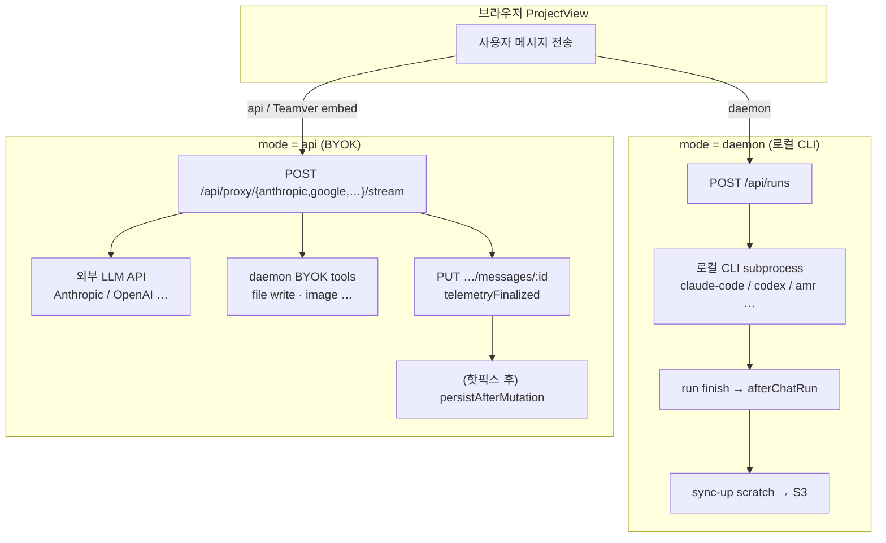

# BYOK `mode=api` vs `POST /api/runs` — 아키텍처·원인·해결 방향

**SSOT:** embed Teamver BYOK 채팅이 왜 `POST /api/runs` 를 거치지 않는지, S3 sync-up 이 왜 빠졌는지, 근본 fix 를 어떻게 할지.  
**관련:** [16 S3 저장 시점](./16_S3_데이터_저장_시점_SSOT.md) · [27 메시지 Persist PUT](./27_메시지_Persist_PUT_아키텍처.md) · [24 usage capture](./24_AI_API_usage_capture_경로별_분석.md) · [02 design-app ↔ daemon](./02_design-app_daemon_연동.md)

---

## 0. 한 줄 요약 (바쁠 때)

| 질문 | 답 |
|------|-----|
| BYOK 가 `POST /api/runs` 를 안 쓰는 게 버그인가? | **의도된 분기**였으나, BYOK 가 artifact(슬라이드) 를 만들게 진화하면서 **가정이 깨진 설계 부채**다. |
| sync-up 이 왜 안 됐나? | sync-up hook 이 **`POST /api/runs` run 종료(`afterChatRun`)** 에만 붙어 있었고, BYOK 는 그 경로를 안 탄다. |
| GET `/api/runs` 는 왜 호출하나? | UI **polling**(진행 중 run 표시). BYOK 에서는 run 이 없어 **항상 `[]`**. POST 와 무관. |
| 핫픽스(2026-06-29) | BYOK terminal message PUT + idle-evict sync 가드 → **데이터 손실 봉합**. 배포 필수. |
| 근본 fix 는? | **`mode=api` 유지 가능**. 다만 server-side lifecycle hook 을 **한곳(SSOT)** 으로 모으거나, 중기에 daemon 이 proxy 를 run 으로 감싸는 **서버 주도 통합**이 적절. |
| 브라우저가 `POST /api/runs` 를 호출해야 하나? | **필수는 아님**. 부하도 POST 자체가 문제가 아님(아래 §7). cancel/resume UX 까지 맞추려면 **선택적** 장기 과제. |

---

## 1. 두 가지 채팅 실행 경로

Open Design 웹 UI(`ProjectView`) 는 `config.mode` 에 따라 **완전히 다른 코드 경로**로 LLM 을 호출한다.



### 1.1 `mode = daemon` — “run 중심”

| 항목 | 내용 |
|------|------|
| **누가 LLM 을 부르나** | daemon 이 로컬 CLI 를 subprocess 로 실행 |
| **브라우저가 호출하는 API** | `POST /api/runs` → SSE `GET /api/runs/:id/events` |
| **daemon run row** | ✅ 생성 (`runId`, status, events) |
| **S3 sync-up** | run 종료 시 `afterChatRun` (기본 경로) |
| **Teamver embed 에서** | ❌ 사용 불가 (사용자 PC 에 CLI 없음) |

코드: `apps/web/src/components/ProjectView.tsx` → `streamViaDaemon()` → `apps/web/src/providers/daemon.ts` `fetch('/api/runs', { method: 'POST' })`.

### 1.2 `mode = api` — “프록시 중심” (Teamver embed 기본)

| 항목 | 내용 |
|------|------|
| **누가 LLM 을 부르나** | 브라우저가 daemon **proxy** 를 통해 외부 API 호출 |
| **브라우저가 호출하는 API** | `POST /api/proxy/anthropic/stream` 등 ( **`POST /api/runs` 없음** ) |
| **daemon run row** | ❌ 없음 |
| **S3 sync-up (핫픽스 전)** | ❌ run hook 없음 → **미동기 scratch 만 존재** |
| **S3 sync-up (핫픽스 후)** | terminal message PUT → `persistAfterMutation` + idle-evict 가드 |
| **Teamver embed** | ✅ **강제** (`applyTeamverRuntimeConfig` → `mode: "api"`) |

코드: `ProjectView.tsx` → `streamMessage()` → `streamProxyEndpoint('/api/proxy/anthropic/stream')`.

---

## 2. Teamver embed 가 무조건 `mode=api` 인 이유

`apps/web/src/teamver/applyTeamverRuntimeConfig.ts`:

- design-api `runtime-config` 로 워크스페이스 BYOK 키·모델·baseUrl 주입
- **`mode: "api"` 고정** — 브라우저 iframe 안에서는 사용자 로컬 CLI 가 없음
- `mode: "daemon"` 은 “내 PC 에 설치된 codex/claude-code 를 daemon 이 돌린다”는 **데스크탑 제품** 가정

→ Teamver SaaS 사용자는 **100% BYOK proxy 경로**만 탄다. 이 자체는 합리적 선택이다.

---

## 3. 어디서 깨졌나 — “가정의 부패 (assumption rot)”

### 3.1 원래 OD 가정 (2024~)

> **`mode=api` = chat-only.** 도구·파일 생성 없음. S3 sync-up 도 필요 없음.

그래서:

- `/api/runs` lifecycle (sync-down/up, run registry, cancel, resume) 을 **daemon run 전용**으로 설계
- `/api/proxy/*` 는 **단순 SSE 중계** (LLM 응답만 흘려보냄)

### 3.2 Teamver 요구사항

> **슬라이드/HTML artifact 생성**이 핵심 가치.

그래서 daemon 에 **BYOK tools** 가 추가됨 (`byok-tools.ts`, proxy stream handler):

- LLM 이 tool call → daemon 이 **scratch 에 HTML/이미지 기록**
- 사용자는 `GET /raw/*`, `GET /files` 로 미리보기 가능

### 3.3 누락된 연결

| 새로 생긴 것 | 연결됐어야 할 것 | 실제 |
|--------------|------------------|------|
| BYOK tool → scratch write | run 종료 또는 mutation 후 **sync-up** | ❌ hook 없음 |
| Teamver embed → `mode=api` | 위 경로의 lifecycle | ❌ `POST /api/runs` 미사용 |
| idle scratch evict | sync-up 후 evict | ❌ (핫픽스 전) 그냥 삭제 |

### 3.4 loop 192 운영 사고 타임라인

```text
1. 사용자 embed BYOK 로 슬라이드 생성
2. proxy + tools → scratch 에 HTML 저장 (S3 PUT 없음)
3. GET /files 304 → lazy sync-down 만 (S3→scratch, 읽기 전용)
4. ~10분 idle → OD_SCRATCH_EVICT_IDLE 이 scratch 삭제
5. S3 tenant prefix 0 객체 → 프로젝트 영구 손실
```

**핵심:** run 은 “끝난 것처럼” 보였지만 daemon 입장에 **run 이라는 개념 자체가 없었다** (`curl /api/runs?projectId=…` → `[]`).

---

## 4. GET `/api/runs` vs POST `/api/runs` — 왜 GET 만 보이나?

둘은 **역할이 다르다**. 같은 리소스를 “읽기 vs 만들기”.

| HTTP | 호출 주체 | 목적 | BYOK embed 에서 |
|------|-----------|------|-----------------|
| **GET** `/api/runs` | FE polling (`listProjectRuns`, `listActiveChatRuns`) | 진행 중 run 배지·stuck 감지·reattach | **항상 `runs: []`** (만든 run 없음) |
| **POST** `/api/runs` | `streamViaDaemon()` only | run 생성 + CLI/agent 실행 시작 | **호출 코드 없음** |

GET 이 보이는 이유: UI 컴포넌트가 **모드와 무관하게** “혹시 active run 있나?” 를 주기적으로 확인한다. BYOK 에서는 빈 응답이지만 **비용은 작은 JSON polling** (과거 2초 간격이 부하 이슈였고, 현재 adaptive 5s/30s/120s — [00 구현 내역 loop 404](./00_구현_내역_누적.md)).

POST 가 없는 이유: `ProjectView` 의 `if (config.mode === 'daemon')` 분기 밖에서는 **`streamViaDaemon` 자체를 호출하지 않기 때문**. 설계상 의도된 분기다.

---

## 5. 2026-06-29 핫픽스 (배포 필수)

커밋: `fix(daemon): persist BYOK chats to S3 + guard idle-evict from data loss` (`5b42c2970`)

### Fix A — BYOK terminal message PUT
### Fix B — idle-evict S3 SSOT 가드
### Fix C — sticky tenant remote cache

**상세:** [16 §5.5b · §6.5](./16_S3_데이터_저장_시점_SSOT.md)

---

## 5b. 2026-06-29 P1 — BYOK proxy stream server hook (Option B)

커밋: `feat(daemon): BYOK proxy stream materialization hooks (mode=api server-side)`

**선택한 방향:** `mode=api` **유지** + daemon 이 proxy SSE lifecycle 에 materialization hook 부착. 브라우저는 `POST /api/runs` 를 호출하지 않음.

| 단계 | 시점 | 동작 |
|------|------|------|
| ① proxy stream 시작 | `POST /api/proxy/*/stream` handler, SSE 시작 **직전** | `beforeChatRun` (sync-down, sticky remote cache) |
| ② stream 중 | BYOK tools → scratch write | (기존과 동일) |
| ③ HTTP response finish/close | proxy SSE `res.end()` 후 | `afterChatRun` (sync-up scratch → S3) |
| ④ (병행) terminal message PUT | FE `telemetryFinalized` | Fix A `persistAfterMutation` — **defense in depth** |

**코드:** `apps/daemon/src/storage/byok-proxy-materialization.ts` · `chat-routes.ts` (모든 `/api/proxy/*/stream`) · `server.ts` (`createByokProxyMaterializationHooks`).

**env:** `OD_BYOK_PROXY_MATERIALIZATION=1` (default on, S3 mode only). `0` 으로 비활성.

**왜 message PUT hook 과 병행?** proxy finish 가 네트워크 drop 등으로 `afterChatRun` 을 못 타도 terminal PUT 이 2차 sync-up. 반대로 PUT 이 throttle/실패해도 proxy finish 가 1차 sync-up.

---

## 6. 근본 fix 옵션 비교

“근본 fix” = **앞으로 새 기능(billing, analytics, cancel, sync-up)을 BYOK 경로마다 따로 붙이지 않게** lifecycle SSOT 를 하나로 만드는 것.

### Option A — 현재 + server-side hook 점진 보강 (핫픽스 계열)

| | |
|--|--|
| **내용** | `mode=api` 유지. sync-up / billing / evict 등 필요한 지점에 daemon hook 추가 |
| **장점** | FE 변경 최소, **즉시 출시 가능**, 이미 핫픽스로 손실 봉합 |
| **단점** | 기능 추가마다 “BYOK 는 어디에 hook?” 질문 반복. cancel/resume/stuck-run UX 불완전 |
| **적합** | **지금~production 1차 출시** |

### Option B — daemon 이 proxy stream 을 **서버 내부 run** 으로 감싸기 (권장 중기)

| | |
|--|--|
| **내용** | 브라우저는 계속 `POST /api/proxy/…/stream` 호출. daemon 이 stream 시작 시 **내부 ephemeral run** 생성 → 종료 시 `afterChatRun` (기존 hook 재사용). FE 변경 거의 없음. |
| **장점** | sync-up·billing·metrics **한 경로**. 브라우저 부하·API 표면 변경 없음 |
| **단점** | daemon 구현·테스트 부담. run row 가 생기면 GET `/api/runs` 가 비어 있지 않게 됨 |
| **적합** | **출시 직후 P1** — SSOT 통합 without FE churn |

### Option C — 브라우저가 `POST /api/runs` (`runMode: byok-proxy`)

| | |
|--|--|
| **내용** | Teamver embed FE 가 daemon mode 와 동일하게 run 생성. daemon 이 run 안에서 proxy+tools 실행 |
| **장점** | cancel/resume/feedback/stuck-run **UX 완전 parity**. 아키텍처적으로 가장 “정석” |
| **단점** | FE `ProjectView` 대규모 분기 정리, 회귀 테스트 넓음 |
| **적합** | **장기 (P2)** — Option B 로 server hook 검증 후 FE 통합 |

### Option D — design-api 가 run orchestration (브라우저 ↔ design-api)

| | |
|--|--|
| **내용** | 채팅을 design-api 가 받아 daemon/internal 호출 |
| **장점** | 키·과금·감사를 BE 한곳에서 |
| **단점** | OD realtime SSE·tool loop 를 BE 로 옮기는 **대규모 재설계**. 출시 일정과 불리 |
| **적합** | **현 단계 비권장** |

---

## 7. 서버 부하 — `POST /api/runs` 가 문제인가?

### 7.1 결론

**`POST /api/runs` 자체가 부하의 원인은 아니다.**  
BYOK embed 의 daemon 부하는 이미 **`POST /api/proxy/…/stream` (장시간 SSE)** + **message PUT** + **GET /files** 에 집중되어 있다.

### 7.2 턴당 요청 비교 (대략)

| 경로 | 채팅 1턴당 daemon HTTP | 비고 |
|------|------------------------|------|
| **현재 BYOK** | 1× proxy POST (SSE 수분) + N× message PUT (throttle ~5s) + 간헐적 GET /files | run row 없음 |
| **Option C (POST /api/runs)** | 1× POST /api/runs + 1× SSE events + message PUT (감소 가능) | run row 1개 |
| **차이** | POST /api/runs 는 **작은 JSON 1회**. LLM streaming 시간이 지배적 | CPU/네트워크 지배 = **모델 API** |

### 7.3 실제로 부하 이슈였던 것

| 이슈 | 상태 |
|------|------|
| GET `/api/runs` **2초 고정 polling** | ✅ adaptive 5s / 30s / 120s 로 완화 (loop 404) |
| GET `/teamver-bff/auth/session` 과다 | ✅ cache·throttle |
| 스트리밍 중 message PUT 과다 | ✅ throttle 5s ([27](./27_메시지_Persist_PUT_아키텍처.md)) |

### 7.4 “브라우저에서 POST /api/runs 를 호출할 필요가 있나?”

| 목적 | 브라우저 POST 필요? | 대안 |
|------|---------------------|------|
| **S3 sync-up** | ❌ 불필요 | terminal PUT hook (핫픽스) 또는 proxy 종료 hook (Option B) |
| **billing/usage** | ❌ 불필요 | terminal PUT → daemon M2M (U-G11, 이미 적용) |
| **cancel 버튼** | ✅ runId 필요 | Option B/C |
| **stuck-run watchdog / reattach** | ✅ runId 필요 | Option B/C |
| **run analytics (langfuse 등)** | △ run row 있으면 쉬움 | Option B/C |

→ **데이터 영속화·과금만** 보면 **`mode=api` + server hook 으로 충분**.  
→ **운영 UX(cancel/resume)** 까지 맞추려면 run 개념이 필요하고, 그건 **브라우저 POST 없이 daemon 내부 run(Option B)** 도 가능.

---

## 8. 권장 로드맵

```text
[완료 · P0]  핫픽스 staging/production 배포
             └─ BYOK terminal sync-up + idle-evict 가드

[완료 · P1]  Option B — proxy stream server hook (daemon only, mode=api 유지)
             └─ beforeChatRun / afterChatRun on /api/proxy/*/stream finish
             └─ terminal PUT hook 과 defense-in-depth 병행

[안정화 후 · P2]  Option C 검토 — FE 가 POST /api/runs 로 통합할지 (cancel/resume UX)
             └─ Option B 운영 데이터로 “FE 통합 ROI” 판단
             └─ ROI 낮으면 B 유지 (브라우저는 proxy 그대로)

[비권장]  Option D design-api orchestration — 출시 이후 별도 프로그램
```

### 8.1 `mode=api` 를 계속 써도 되는 조건

아래가 **server-side SSOT** 로 보장되면 `mode=api` 는 Teamver embed 에 **적절**하다:

1. ✅ artifact scratch write 후 **S3 sync-up** (핫픽스 + P1 proxy hook)
2. ✅ idle-evict 전 sync-up 또는 defer (핫픽스)
3. ✅ terminal billing/usage (U-G11)
4. ✅ (P1) proxy stream start/end ↔ `beforeChatRun` / `afterChatRun`
5. ☐ (P2) cancel/resume 필요 시 run row (Option C — FE `POST /api/runs`)

### 8.2 `POST /api/runs` 를 브라우저에서 쓰는 게 적절한 경우

- cancel/resume/stuck-run 을 **daemon mode 와 동일 UX** 로 제공해야 할 때
- run 단위 analytics·feedback·Langfuse trace 를 **FE 변경 없이** daemon 표준 경로로 통일할 때
- **부하 때문이 아니라**, **제품 일관성·운영 도구** 때문

---

## 9. FAQ

### Q1. “run 이 끝났는데 왜 sync-up 이 없었나?”

daemon 기준으로는 **run 이 없었다**. FE·사용자 UI 는 “채팅 턴 완료”를 run 완료처럼 보지만, daemon run registry 는 비어 있었다.

### Q2. usage/billing 이벤트는 갔는데 S3 는 왜 비었나?

usage/billing 은 **design-api Postgres** 경로. S3 는 **daemon materialization** 경로. **서로 독립** ([16 §1](./16_S3_데이터_저장_시점_SSOT.md)).

### Q3. GET `/api/runs` 를 BYOK 에서 끄면 되나?

가능하지만 stuck-run·multi-tab reattach 등 **daemon mode 잔재 UX** 가 깨질 수 있다. 부하가 문제면 polling 간격만 유지하면 된다. BYOK 에서 GET 은 가벼운 empty JSON.

### Q4. 핫픽스만으로 production 출시해도 되나?

**데이터 손실(P0) 관점에서는 Yes** — 단, staging 에서 아래 smoke 필수:

```bash
# 1) 턴 종료 후 daemon 로그
docker logs teamver-open-design-daemon 2>&1 | grep -E 'lazy sync-up|idle-evict sync-up'

# 2) S3 tenant prefix
aws s3 ls "s3://teamver-design-staging-data/design/ws_…/user_…/proj_…/" --recursive

# 3) 10분 idle 후에도 files API 200
curl -sS -H "Authorization: Bearer $TOKEN" -H "X-Workspace-Id: $WS" \
  "https://stg-design.teamver.com/api/projects/$PID/files"
```

### Q5. 근본 fix 없이 feature 추가하면?

매번 “daemon run 경로 vs BYOK proxy 경로” **이중 구현** 위험. [24 usage capture](./24_AI_API_usage_capture_경로별_분석.md) 에서 이미 billing 경로 분기 경험 있음.

---

## 10. 코드·문서 인덱스

| 주제 | 경로 |
|------|------|
| mode 분기 | `apps/web/src/components/ProjectView.tsx` (~3858, ~4047) |
| Teamver mode pin | `apps/web/src/teamver/applyTeamverRuntimeConfig.ts` |
| POST /api/runs | `apps/web/src/providers/daemon.ts` `streamViaDaemon` |
| BYOK proxy | `apps/web/src/providers/anthropic-compatible.ts`, `api-proxy.ts` |
| proxy + tools (daemon) | `apps/daemon/src/chat-routes.ts`, `byok-tools.ts` |
| sync-up run hook | `apps/daemon/src/storage/project-materialization-runtime.ts` |
| BYOK terminal sync-up | `apps/daemon/src/server.ts` (message PUT) |
| idle-evict 가드 | `apps/daemon/src/storage/scratch-idle-eviction.ts` |
| S3 시점 SSOT | [16](./16_S3_데이터_저장_시점_SSOT.md) |
| message PUT | [27](./27_메시지_Persist_PUT_아키텍처.md) |

---

## 11. 변경 이력

| 날짜 | 내용 |
|------|------|
| 2026-06-29 | §5b P1 BYOK proxy stream server hook 구현 · 로드맵 P0/P1 완료 표시 |
| 2026-06-29 | 초版 — assumption rot, GET vs POST, 핫픽스, Option A~D, 부하 분석, 권장 로드맵 |
