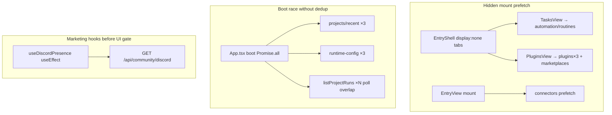

# embed home boot API 최적화

**목적:** Teamver Design embed(`stg-design.teamver.com`)에서 **`/` 접속만**으로 발생하던 **50+ HTTP 요청**의 원인 분석, 개선 설계, 구현·검증 체크리스트 SSOT.

**관련 문서**

| 문서 | 역할 |
|------|------|
| [28 embed 숨김 UI API 점검](./28_embed_숨김_UI_API_점검.md) | API별 gate 표 · Network 체크리스트 |
| [12 embed 로컬 UX 제거](./12_embed_로컬UX_제거_체크리스트.md) | UI surface ↔ API 매핑 (S-6~S-14) |
| [27 메시지 Persist PUT](./27_메시지_Persist_PUT_아키텍처.md) | 스트리밍 PUT throttle (별도 부하 축) |
| [13 embed 슬라이드 MVP](./13_embed_슬라이드_MVP_기능게이트.md) | `slideOnlyMvp` 브랜딩 플래그 |

**코드 SSOT:** `apps/web/src/teamver/embedDaemonFetchPolicy.ts`

---

## 1. 문제 정의

### 1.1 관측 (2026-06-29 staging)

embed 로그인 후 **`/` (홈)만** 열었을 때 Network 탭에 다음 패턴이 반복됨:

- 동일 endpoint **3~15회** 중복 (`/api/plugins`, `/api/runs`, `/api/projects/recent`, `runtime-config`, `auth/session`)
- **숨겨진 nav 탭** API (`automation-*`, `routines`, `marketplaces`, `connectors*`)
- **데스크톱 전용** API (`agents?stream=1`, AMR/Vela, `recent-dirs`, `memory/events`)
- **마케팅** API (`community/discord`, github stars, social-share)
- (부가) **자동 project 진입** 시 project subresource burst — 홈-only 측정과 구분 필요

### 1.2 근본 원인 (3가지)



1. **Hidden tab mount** — React `display:none`은 **unmount가 아님**. `TasksView`/`PluginsView`가 홈에서도 mount → useEffect가 daemon 호출.
2. **Boot 병렬 + 캐시 없음** — workspace sync, embed session hook, project list refresh가 동시에 같은 BFF/daemon endpoint 호출.
3. **Hook이 UI보다 먼저 실행** — marketing hook이 `enabled=false` UI return **이전**에 fetch.

---

## 2. 설계: `embedDaemonFetchPolicy`

중앙 정책 모듈. **“embed에서 이 HTTP 호출을 해도 되는가?”** 를 한곳에서 판단.

```typescript
// apps/web/src/teamver/embedDaemonFetchPolicy.ts (요약)
shouldFetchMarketingCommunityApis()   // discord, github
shouldFetchSocialSharePayload(hideExternalLinks)
shouldFetchAgentRegistryOnBoot()       // GET /api/agents?stream=1
shouldFetchAmrIntegrationApis()        // vela, amr/models
shouldFetchPromptTemplateCatalog()     // slide-only → skip
shouldFetchMediaProviderConfig()       // slide-only → skip
shouldFetchConnectorCatalog()          // hideComposerIntegrations
shouldFetchAutomationTaskApis()        // hideNavViews.tasks
shouldMountPluginRegistryView()        // hideNavViews.plugins
shouldFetchRecentLinkedDirs()          // hideLocalWorkspaceControls
shouldSubscribeMemoryEvents()          // embed 전체 skip
shouldFetchAihubmixMediaCatalog()      // slide-only → skip
shouldFetchAppVersionAboutPanel()      // About 중복 version skip
```

**원칙**

- **Core product path는 유지:** `app-config`, `projects`, messages, `design-templates?mode=deck`, `skills`, BFF session/runtime-config.
- **UI가 없으면 mount 자체를 막는다** (display:none prefetch 금지).
- **Hook은 `enabled` prop + policy** — UI early-return만으로는 부족.

---

## 3. 구현 변경 요약

### 3.1 Hidden tab → conditional unmount

| 파일 | 변경 |
|------|------|
| `EntryShell.tsx` | `shouldFetchAutomationTaskApis()` / `shouldMountPluginRegistryView()` 일 때만 `TasksView`/`PluginsView` render |
| `EntryView.tsx` | connector catalog fetch/listener 전부 `shouldFetchConnectorCatalog()` gate |

**효과:** embed slide MVP에서 `/api/automation-*`, `/api/routines`, `/api/marketplaces`, `/api/plugins`(PluginsView 3회), `/api/connectors*` 제거.

### 3.2 Boot fetch gate (`App.tsx`)

| API | gate |
|-----|------|
| `fetchAgentsStream` | `shouldFetchAgentRegistryOnBoot()` |
| AMR/Vela poll | `shouldFetchAmrIntegrationApis()` |
| `fetchPromptTemplates` | `shouldFetchPromptTemplateCatalog()` |
| `fetchMediaProvidersFromDaemon` | `shouldFetchMediaProviderConfig()` |
| `fetchAppVersionInfo` | `shouldFetchAppVersionAboutPanel()` |

### 3.3 Component-level gate

| 컴ponent | API | gate |
|----------|-----|------|
| `useDiscordPresence` / `useGithubStars` | marketing | `enabled` + policy |
| `EntrySettingsMenu` / `FileViewer` | social-share | `shouldFetchSocialSharePayload` |
| `HomeView` / `ChatComposer` | recent-dirs | `shouldFetchRecentLinkedDirs()` |
| `MemoryToast` | memory SSE | `shouldSubscribeMemoryEvents()` |
| `HomeView` | aihubmix models | `shouldFetchAihubmixMediaCatalog()` |

### 3.4 In-flight dedup (중복 완화)

| 함수 | 파일 | 동작 |
|------|------|------|
| `listProjectRuns()` | `providers/daemon.ts` | 동시 호출 1회로 coalesce |
| `listRecentProjects()` | `state/projects.ts` | limit별 in-flight coalesce |
| `fetchTeamverRuntimeConfig()` | `designBffClient.ts` | 60s cache + in-flight (workspace switch는 `{ force: true }`) |
| `fetchDesignAuthSession()` | `designBffClient.ts` | 기존 60s cache 유지 |

### 3.5 daemon 인프라 (부가, 동일 PR)

| 변경 | 목적 |
|------|------|
| project access middleware → `server.ts` (materialization **앞**) | 미등록 project 502 대신 404 |
| transient deny TTL 1.5s | create race 후 빠른 재시도 |
| SPA `index.html` no-cache | deploy 후 stale bundle 방지 |

### 3.6 메시지 persist throttle (별축)

스트리밍 중 daemon `PUT …/messages/:id` 빈도 — `VITE_MESSAGE_PERSIST_THROTTLE_MS=5000` (embed 기본).  
→ [27 메시지 Persist PUT](./27_메시지_Persist_PUT_아키텍처.md)

---

## 4. Before / After (embed `/` only)

| 구분 | Before (관측) | After (목표) |
|------|---------------|--------------|
| 총 요청 수 | ~80+ | ~20–30 |
| `/api/plugins` | 3–4 | 1 (deck 칩) |
| `/api/runs` | 10–15 (boot overlap) | 1 + poll (idle 30s) |
| `/api/projects/recent` | 3 | 1 |
| `/runtime-config` | 3 | 1 (60s cache) |
| `/auth/session` | 5 | 1–2 (60s cache + focus) |
| automation/connectors/marketing | 다수 | **0** |

**유지 (정상):** `app-config`, `skills`, `design-templates`, `design-systems`, `health`, `analytics/config`, BFF projects registry.

---

## 5. 검증 방법

### 5.1 Network 측정 조건

1. Chrome **시크릿** — localStorage/session 깨끗한 상태
2. `stg-design.teamver.com` 로그인 → **`/`에서 멈춤** (project 자동 진입 없이)
3. DevTools Network — **Disable cache** 켠 상태, hard reload 1회
4. **Document + Fetch/XHR** 필터

### 5.2 없어야 하는 URL (체크리스트)

- [ ] `/api/community/discord`
- [ ] `/api/github/open-design`
- [ ] `/api/automation-templates`, `/api/routines`, `/api/automation-proposals`
- [ ] `/api/marketplaces`
- [ ] `/api/connectors`, `/api/connectors/status`, `/api/connectors/discovery`
- [ ] `/api/recent-dirs`
- [ ] `/api/memory/events`
- [ ] `/api/agents?stream=1`
- [ ] `/api/prompt-templates`, `/api/media/config` (slide-only)
- [ ] `/api/media/providers/aihubmix/models` (slide-only)

### 5.3 단위 테스트

```bash
cd apps/web
npm test -- --run \
  tests/teamver/embedDaemonFetchPolicy.test.ts \
  tests/components/useDiscordPresence.test.ts \
  tests/state/messagePersistSchedule.test.ts \
  tests/teamver/bootFetchDedup.test.ts
```

### 5.4 배포

정책은 **Vite static bundle** — daemon Docker **재빌드** 필요:

```bash
# deploy/teamver — staging 예시
bash deploy/teamver/scripts/deploy.sh --staging --rds
```

`VITE_MESSAGE_PERSIST_THROTTLE_MS` 변경 시 `.env.staging` + rebuild.

---

## 6. 남은 개선 (P1/P2)

| ID | 항목 | 설명 |
|----|------|------|
| P1 | BFF `teamver-bff/projects` boot 1회화 | registry sync vs list warm — 호출 경로 통합 검토 |
| P1 | `/api/templates` 2회 | consumer 통합 또는 SWR |
| P2 | project auto-open burst | last-opened project deep link — 홈-only와 분리 문서화 |
| P2 | plugin `/preview` iframe | community gallery off 시 0 — gallery mount 재확인 |

---

## 7. 변경 파일 인덱스

```
apps/web/src/teamver/embedDaemonFetchPolicy.ts     # SSOT (신규)
apps/web/src/App.tsx
apps/web/src/components/EntryShell.tsx
apps/web/src/components/EntryView.tsx
apps/web/src/components/HomeView.tsx
apps/web/src/components/ChatComposer.tsx
apps/web/src/components/MemoryToast.tsx
apps/web/src/components/useDiscordPresence.ts
apps/web/src/components/useGithubStars.ts
apps/web/src/components/EntrySettingsMenu.tsx
apps/web/src/components/FileViewer.tsx
apps/web/src/providers/daemon.ts
apps/web/src/state/projects.ts
apps/web/src/state/messagePersistSchedule.ts
apps/web/src/teamver/designBffClient.ts
apps/daemon/src/server.ts
apps/daemon/src/teamver-project-access.ts
apps/daemon/src/project-routes.ts
deploy/Dockerfile
deploy/teamver/docker-compose.yml
deploy/teamver/.env.staging.example
deploy/teamver/.env.production.example
```

---

## 8. 변경 이력

| 날짜 | 내용 |
|------|------|
| 2026-06-29 | 초版 — hidden unmount, embedDaemonFetchPolicy, dedup, daemon access/SPA cache |
