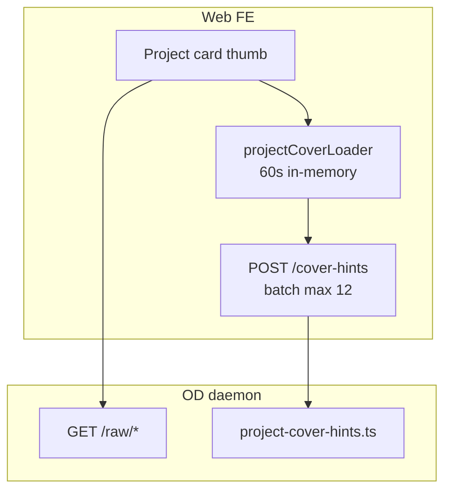

# Design — 프로젝트·레지스트리 썸네일 / 커버 로딩 개선

**SSOT:** 본 문서 · [04 구현 우선순위](./04_구현_우선순위.md) · [09 저장소·격리](./09_Design_저장소_격리_출시게이트.md) · [20 Hybrid 저장소](./20_Design_Hybrid_저장소_로컬_S3_가이드.md)  
**진행 갱신:** [00 구현 내역](./00_구현_내역_누적.md)

---

## 한 줄 결론

> **OD 레지스트리(프로젝트 목록) 미리보기는 동적 HTML/live asset이 SSOT**이다. Cloud CDN·브라우저 캐시는 **이미지·로고·(향후) pre-render cover**에 적용하고, **편집 중 HTML은 동적 미리보기를 유지**한다.

---

## 1. 문제 정의

### 증상

- 홈 recent rail · 프로젝트 탭 grid/kanban 카드 썸네일 로딩이 느리거나 CPU를 많이 씀
- 동일 프로젝트를 다시 열어도 `/raw/` HTML을 매번 daemon 경유
- Drive import grid 썸네일은 presigned URL에 의존 (별도 경로)

### 사용자 요구 (확정)

| 요구 | 정책 |
|------|------|
| **OD 레지스트리(프로젝트 카드) 미리보기** | **동적** — 편집 반영된 live HTML/deck 첫 슬라이드 |
| **목록용 정적 PNG SSOT** | ❌ 현재 필수 아님 — 중기 옵션(아래 §5) |
| **Cloud CDN** | cover **정적 에셋** 분리 후 적용 — `/api/` HTML 전체 CDN ❌ |

---

## 2. As-Is 아키텍처



### 데이터 흐름

1. **`POST /api/projects/cover-hints`** — sqlite metadata + shallow scan (full `/files` listing 없음)
2. FE **`projectCoverLoader`** — batch coalesce; DesignsTab/list surface는 hints-only, **홈 recent rail(≤6)은 bounded `/files` fallback**
3. 카드 **`buildProjectCardCover`** → **`GET /api/projects/:id/raw/{path}`**
4. **HTML deck** — iframe live render 또는 (deck) fetch HTML → srcDoc 첫 슬라이드

### 썸네일 형태 (현재)

| 종류 | 렌더 방식 | HTTP 캐시 (변경 전) |
|------|-----------|---------------------|
| HTML / deck | iframe 또는 srcDoc | 없음 |
| image / logo / video | `` / `<video>` | 없음 |
| hint miss | gradient + initial | — |
| Drive import | S3 presigned | URL TTL |
| Next static / plugin | CDN `immutable` | ✅ |

### 인증·CDN 제약

- 카드 `/raw/`는 **BFF session + nginx auth_request** 경유 → **세션 쿠키 있는 API는 edge CDN cache 부적합**
- nginx `/api/`: `proxy_cache off`
- FileViewer preview scope: `Cache-Control: no-store` (의도적)

---

## 3. 병목 (우선순위)

| # | 병목 | 영향 |
|---|------|------|
| B1 | HTML iframe N개 동시 layout | 프로젝트 탭 grid scroll 시 CPU/GPU |
| B2 | deck 최적화 홈만 적용 | DesignsTab은 raw iframe |
| B3 | `/raw/` HTTP 캐시·ETag 없음 | 재방문 시 daemon round-trip |
| B4 | 카드 URL `?v=` 없음 | stale preview / cache reuse 불가 |
| B5 | S3 lazy materialize cold start | 첫 `/raw/` hit 지연 |
| B6 | cover-hints miss → gradient only | embed list surface는 hints-only; **홈 recent(≤6)만** bounded `/files` fallback |

---

## 4. 단계별 개선 로드맵

### Phase 0 — 즉시 (코드만, CDN 불필요) ✅ 2026-07-02

| 항목 | 내용 | 파일 |
|------|------|------|
| P0-1 | **DeckCoverThumb 공유** — 홈·DesignsTab 동일 srcDoc 첫 슬라이드 | `ProjectCardHtmlCover.tsx`, `DesignsTabProjectThumb.tsx`, `RecentProjectsStrip.tsx` |
| P0-2 | **cover-hints `coverVersion`** — cover file mtime → FE `?v=` | `project-cover-hints.ts`, contracts `ProjectCoverHint`, `projectCoverMediaUrl.ts` |
| P0-3 | **`/raw/` ETag + Cache-Control** — HTML `no-cache`, image/video `private max-age=300` | `project-routes.ts` `sendProjectFile` |
| P0-4 | Drive chip `deferUntilVisible` 회귀 수정 (별도 커밋) | `TeamverLatestPublishChip`, `DesignsTab` |

**동적 미리보기 유지:** HTML은 `Cache-Control: private, no-cache` + ETag revalidation. `?v=mtime` 변경 시 URL이 바뀌어 새 HTML fetch.

### Phase 1 — 단기 (1~2 sprint)

| 항목 | 내용 |
|------|------|
| P1-1 | 홈 recent 6장 **viewport lazy** (IntersectionObserver) |
| P1-2 | cover-hints batch를 scroll sentinel과 연동 (12장 초과 목록) |
| P1-3 | `useLazyProjectCover` viewport 즉시 판정 (publish chip과 동일 패턴) |
| P1-4 | run 완료 시 cover-hints cache warm (`prefetchDesignsTabViewport`) |

### Phase 2 — 중기 (CDN 전제)

| 항목 | 내용 |
|------|------|
| P2-1 | run/save hook → **optional** `.od-cover.webp` (headless screenshot) |
| P2-2 | cover-hints `coverKind: thumbnail` — **목록 fallback**으로만 사용; 클릭/편집은 여전히 live HTML |
| P2-3 | thumbnail을 S3 업로드 + `Cache-Control: immutable` + CloudFront |
| P2-4 | workspace-scoped presigned 또는 path IAM — tenant 격리 유지 |

> **주의:** P2는 “동적 미리보기 대체”가 아니라 “목록 카드 부하 경감용 스냅샷”이다. FileViewer·편집 surface는 live `/raw/` 또는 preview scope 유지.

### Phase 3 — 인프라

| 대상 | 설정 |
|------|------|
| Design static (`/teamver/*.png`, `/_next/*`) | 이미 nginx `immutable` ✅ |
| S3 cover object | `public, max-age=31536000, immutable` (workspace prefix) |
| `/api/` HTML | origin only, CDN ❌ |
| Drive presigned thumbnail | S3 object metadata `Cache-Control` on upload |

---

## 5. “정적 썸네일 vs 동적 미리보기” 정책

```
┌─────────────────────────────────────────────────────────┐
│  Surface          │  Preview mode   │  Cache strategy   │
├───────────────────┼─────────────────┼───────────────────┤
│  Project card     │  Dynamic HTML   │  ?v=mtime,        │
│  (registry list)  │  (deck srcDoc)  │  ETag, no-cache   │
├───────────────────┼─────────────────┼───────────────────┤
│  FileViewer       │  Live + sandbox │  no-store scope   │
├───────────────────┼─────────────────┼───────────────────┤
│  Card thumbnail   │  Optional static│  CDN immutable    │
│  (Phase 2)        │  .od-cover.webp │  (fallback only)  │
├───────────────────┼─────────────────┼───────────────────┤
│  Drive import     │  Presigned img  │  S3 metadata      │
└─────────────────────────────────────────────────────────┘
```

**OD 레지스트리 = 동적** 이라는 요구는 Phase 2에서도 **primary path는 live HTML**로 유지하고, static cover는 **성능 옵션(fallback)** 으로만 도입한다.

---

## 6. API 계약

### `POST /api/projects/cover-hints`

```typescript
interface ProjectCoverHint {
  projectId: string;
  entryFile?: string | null;
  coverKind?: "html" | "image" | "video" | "logo" | null;
  coverPath?: string | null;
  /** Cover file mtime (ms) — FE `?v=` cache bust */
  coverVersion?: number | null;
}
```

### `GET /api/projects/:id/raw/*` (Phase 0 headers)

| MIME | Cache-Control | ETag |
|------|---------------|------|
| `text/html` | `private, no-cache` | `od-{mtime}-{size}` |
| `image/*`, `video/*`, `audio/*` | `private, max-age=300` | 동일 |
| 기타 | (default) | ETag만 |

---

## 7. FE SSOT 파일

| 파일 | 역할 |
|------|------|
| `projectCoverLoader.ts` | hints batch, 60s cache, embed hints-only |
| `projectCoverHints.ts` | cover-hints client |
| `projectCardCover.ts` | card cover model + URL |
| `projectCoverMediaUrl.ts` | `?v=` helper |
| `ProjectCardHtmlCover.tsx` | HTML/deck thumb shared |
| `DesignsTabProjectThumb.tsx` | grid/kanban lazy thumb |
| `RecentProjectsStrip.tsx` | home recent rail |

---

## 8. 검증

```bash
# web
pnpm --filter @open-design/web exec vitest run \
  tests/teamver-project-card-cover.test.ts \
  tests/teamver-project-cover-hints.test.ts \
  tests/teamver-project-cover-loader.test.ts

# daemon
pnpm --filter @open-design/daemon exec vitest run tests/project-cover-hints.test.ts
```

**수동:** deck 프로젝트 — 홈·프로젝트 탭 모두 첫 슬라이드 srcDoc; HTML 편집 후 `coverVersion` 변경 시 카드 갱신.

---

## 9. 관련 문서

- [30 embed home boot API 최적화](./30_embed_home_boot_API_최적화.md) — 목록 API fan-out
- [16 S3 데이터 저장 시점 SSOT](./16_S3_데이터_저장_시점_SSOT.md) — materialize 타이밍
- [14 Drive 연동](./14_Design_Drive_연동_설계.md) — import thumbnail presign

---

## 10. 변경 이력

| 날짜 | 내용 |
|------|------|
| 2026-07-02 | 초안 + Phase 0 구현 (DeckCover 공유, coverVersion, /raw/ cache headers) |
