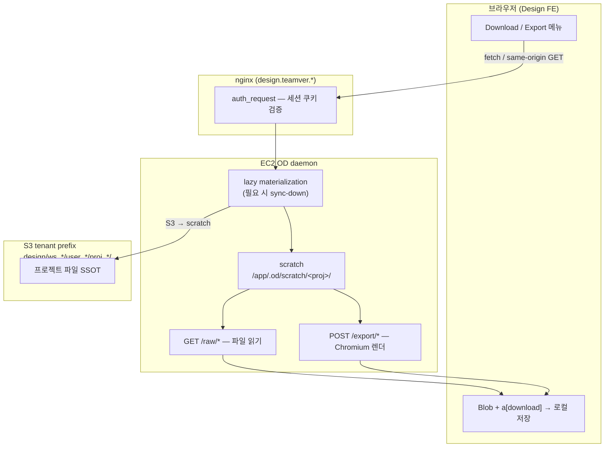

# Design — 프로젝트 다운로드·Export 아키텍처

**목적:** “다운로드” 버튼을 누르면 **어디서 파일이 오는지** — FE가 S3를 직접 치는지, EC2 scratch를 거치는지 — 를 **한 문서로 고정**한다.  
**관련:** [16 S3 저장 시점](./16_S3_데이터_저장_시점_SSOT.md) · [14 Drive 연동](./14_Design_Drive_연동_설계.md) §3.3.1 · [20 Hybrid 저장소](./20_Design_Hybrid_저장소_로컬_S3_가이드.md) · [32 썸네일 cover](./32_프로젝트_썸네일_커버_로딩_개선.md) · **[34 Export 성능 개선](./34_Export_성능_개선_로드맵.md)** (부하·개선 로드맵)

---

## 0. 한 줄 결론 (헷갈릴 때 이것만)

> **Design FE는 프로젝트 파일 다운로드 시 S3 presigned URL을 직접 호출하지 않는다.**  
> 브라우저는 항상 **`/api/projects/...` (nginx → EC2 daemon)** 를 호출하고, daemon이 **필요 시 S3→scratch sync-down** 후 **scratch에서 읽거나 export를 생성**한다.  
> 최종 저장은 브라우저가 받은 바이트를 **로컬 디스크에 저장** (`Blob` + `<a download>`).

---

## 1. “다운로드”가 가리키는 것

FileViewer·프로젝트 화면의 **Download / Export** 메뉴는 크게 세 갈래다.

| 사용자 행동 | FE가 호출하는 API | daemon이 하는 일 | S3 직접? |
|-------------|-------------------|------------------|----------|
| **원본 파일 받기** (이미지·HTML·CSV 등) | `GET /api/projects/:id/raw/{path}` | sync-down → scratch에서 파일 스트리밍 | ❌ FE 직접 |
| **렌더링 Export** (HTML·PDF·ZIP·PNG/JPEG/WebP) | `POST /api/projects/:id/export/{html\|pdf\|zip\|image}` | sync-down → scratch 읽기 → headless Chromium 렌더 → 바이트 응답 | ❌ FE 직접 |
| **Markdown 등 소스 그대로** | (없음 — 이미 FE에 로드된 텍스트) | 브라우저에서 Blob 생성 | ❌ |
| **Drive에 발행** (다운로드 아님) | design-api `POST …/publish-drive` | daemon export → **Main BE Drive presigned PUT** | ❌ FE 직접 |

**Drive에서 Design으로 import**·**Drive 썸네일 표시**는 “다운로드”와 별개 — §6 참고.

---

## 2. 전체 경로 (staging/prod, `OD_PROJECT_STORAGE=s3`)



**핵심:** S3는 **daemon 내부**에서만 접근한다. FE URL 바에는 `/api/projects/...` 만 보인다.

---

## 3. scratch와 S3 — 다운로드 시점에 무슨 일이 일어나는가

### 3.1 scratch란?

- EC2 디스크上的 **작업 디렉터리**: `/app/.od/scratch/<projectId>/`
- agent run·파일 upload·export·`/raw` 읽기는 **여기를 기준**으로 동작
- 상세: [16 §2](./16_S3_데이터_저장_시점_SSOT.md) · [20 Hybrid 저장소](./20_Design_Hybrid_저장소_로컬_S3_가이드.md)

### 3.2 sync-down (읽기 전 materialize)

`/raw/*`, `/export/*`, `/files/*` 등 **프로젝트 파일 접근 API**는 daemon middleware에서 materialization 대상이다.

1. 요청 수신 (`ensureMaterialized`)
2. (TTL 만료 시) **S3 tenant prefix → scratch** 로 파일 복사 (**sync-down**)
3. scratch에서 `readProjectFile` / headless export

같은 프로젝트를 짧은 시간 안에 다시 열면 TTL(`OD_PROJECT_LAZY_SYNC_TTL_MS`, 기본 60s) 안에서는 sync-down을 **생략**하고 scratch 캐시를 쓸 수 있다.

### 3.3 sync-up (저장) — 다운로드와의 관계

다운로드 **자체**는 sync-up을 트리거하지 **않는다** (읽기 전용).

- run 종료 · 파일 mutating API 성공 · import upload 2xx 등에서 sync-up → S3 반영 ([16 §4](./16_S3_데이터_저장_시점_SSOT.md))
- **run 직후 아직 sync-up 전**이면 S3에는 이전 버전만 있고, scratch에는 최신본이 있을 수 있다 → **다운로드는 scratch 기준 최신**을 받는다 (sync-down이 최신 S3를 가져오거나, 이미 warm scratch 사용)

---

## 4. 다운로드 종류별 상세

### 4.1 원본 파일 다운로드 (`GET /raw/`)

**UI:** FileViewer 툴바 “다운로드” 링크  
**FE 코드:** `projectFileUrl()` → `/api/projects/:id/raw/{path}`  
**동작:**

```text
<a href="/api/projects/p1/raw/index.html" download>
  → 브라우저 same-origin GET (세션 쿠키 포함)
  → nginx auth_request
  → daemon: sync-down (필요 시) → scratch 파일 stream
  → Content-Disposition / MIME → 사용자 로컬 저장
```

- **미리보기 iframe**도 동일 `/raw/` URL 사용 (live HTML — [32](./32_프로젝트_썸네일_커버_로딩_개선.md) 참고)
- HTML: `Cache-Control: private, no-cache` + ETag (편집 반영)
- image/video/audio: `private, max-age=300` + ETag/304

### 4.2 Export — HTML / ZIP / PDF / 이미지

**UI:** FileViewer Download 메뉴 (PDF, HTML, ZIP, PNG/JPEG/WebP 등)  
**FE 코드:** `apps/web/src/runtime/exports.ts` — `fetchTeamverDaemon('/api/projects/:id/export/...')`  
**daemon 코드:** `apps/daemon/src/import-export-routes.ts`

| 포맷 | API | daemon 처리 |
|------|-----|-------------|
| HTML | `POST /export/html` | scratch HTML → headless snapshot (deck slide 펼침·nav 제거·resource inline) |
| ZIP | `POST /export/zip` | 위 snapshot을 `index.html` 로 ZIP 패키징 |
| PDF | `POST /export/pdf` | headless Chromium → PDF bytes |
| PNG/JPEG/WebP | `POST /export/image` | headless 캡처 (deck slide index 지원) |

**FE 쪽 마무리:**

```text
resp.blob()
  → URL.createObjectURL(blob)
  → <a download="artifact.pdf"> 클릭
  → 사용자 Downloads 폴더
```

**Teamver embed 정책:** rendered export 실패 시 **깨진 fallback 파일을 내리지 않고** toast/alert ([14 §3.3.1](./14_Design_Drive_연동_설계.md)). Drive publish와 동일한 “완성된 스냅샷” 품질을 목표로 한다.

> **부하·개선:** export는 `fetch`+`blob`·Chromium render·EC2 proxy·전역 직렬 큐로 CPU/RAM/대기 시간이 커진다. Phase 0~3 개선안 — [34 Export 성능 개선](./34_Export_성능_개선_로드맵.md).

**fallback (standalone OD):** daemon export 실패 시 inline HTML·browser print·raw archive 등 ([14 §3.3.1](./14_Design_Drive_연동_설계.md)).

### 4.3 Markdown / JSX 등 (브라우저 전용)

- FileViewer에 이미 로드된 **source 문자열**을 FE에서 Blob으로 저장
- 서버·S3·scratch **추가 round-trip 없음**

### 4.4 프로젝트 아카이브 ZIP (fallback)

- `GET /api/projects/:id/archive?...` — 프로젝트 파일 트리를 ZIP으로 (rendered export 실패 시 fallback)
- 역시 **daemon 경유**, FE S3 직접 ❌

---

## 5. Publish to Drive vs 로컬 다운로드

| | **로컬 다운로드** | **Drive 발행** |
|--|-------------------|----------------|
| **목적** | 사용자 PC에 파일 저장 | Teamver Drive에 버전 저장 |
| **FE 호출** | daemon `/raw` 또는 `/export` | design-api `POST …/publish-drive` |
| **파일 생성** | daemon export (HTML/PDF/ZIP) | 동일 daemon export 경로 재사용 |
| **최종 저장소** | 사용자 로컬 디스크 | **Main BE Drive S3** (Design project-data 버킷 ❌) |
| **presigned** | 사용 안 함 | BE가 Drive **presigned PUT** |

흐름 (발행): [16 §9.C](./16_S3_데이터_저장_시점_SSOT.md)

```text
daemon export (sync-down → scratch → render)
  → design-api bytes
  → Main BE presigned PUT → Drive bucket
  → RDS design_outputs row
```

---

## 6. presigned URL이 등장하는 경우 (다운로드와 구분)

Design **프로젝트 다운로드**와 presigned가 겹치지 않는다. presigned는 **다른 기능**에서만 쓰인다.

| 기능 | presigned 방향 | **누가** S3/Drive URL 호출? | FE 직접? |
|------|----------------|----------------------------|----------|
| 프로젝트 `/raw`·`/export` 다운로드 | — | daemon (IAM/instance profile) | ❌ |
| Drive → Design **import** | GET (Drive asset) | **design-api BE** → stream → daemon upload | ❌ |
| Design → Drive **publish** | PUT (Drive bucket) | **design-api BE** | ❌ |
| Drive import **썸네일** | GET (object-url batch) | FE `` | ✅ **표시만** (다운로드 아님) |
| Publish history “Drive 열기” | — | Drive asset deep link (UI) | Drive 앱/웹 |

**import 상세:** `drive_import_service.py` — Main BE `create_download_url` → BE가 presigned GET으로 chunk stream → daemon `POST /upload` → scratch → sync-up ([14 §4.2](./14_Design_Drive_연동_설계.md)).

---

## 7. 인증·네트워크

| 계층 | 동작 |
|------|------|
| **FE → nginx** | same-origin `/api/*` + `credentials: include` (embed) — `teamver_access_token` 등 |
| **nginx** | `auth_request` — Main BE session-check |
| **daemon → S3** | EC2 instance profile / env creds — **브라우저에 노출 안 됨** |
| **edge CDN** | `/api/` HTML·export는 **세션 게이트** → 전체 CDN cache 부적합 ([32 §2](./32_프로젝트_썸네일_커버_로딩_개선.md)) |

---

## 8. 코드 SSOT (빠른 점프)

| 역할 | 경로 |
|------|------|
| FE export helpers | `apps/web/src/runtime/exports.ts` |
| FE raw URL | `apps/web/src/providers/registry.ts` — `projectRawUrl()` |
| FileViewer Download UI | `apps/web/src/components/FileViewer.tsx` |
| daemon export routes | `apps/daemon/src/import-export-routes.ts` |
| PDF/HTML input (scratch read) | `apps/daemon/src/pdf-export.ts` |
| lazy sync-down middleware | `apps/daemon/src/storage/lazy-project-materialization.ts` |
| `/raw/` cache headers | `apps/daemon/src/project-routes.ts` — `sendProjectFile` |
| Drive import (BE presigned GET) | `deploy/teamver/be/app/services/drive_import_service.py` |
| Drive publish (BE presigned PUT) | `deploy/teamver/be/app/services/publish_service.py` |

---

## 9. 자주 묻는 질문 (FAQ)

### Q1. FE가 S3 URL을 직접 받아 다운로드하나?

**아니다.** URL은 항상 `/api/projects/:id/raw/...` 또는 `/export/...` 형태다. S3 tenant prefix URL은 FE에 내려가지 않는다.

### Q2. 다운로드할 때마다 S3에서 EC2로 전체 복사하나?

**항상은 아니다.** lazy materialization + TTL 캐시. cold scratch이거나 TTL 만료 시 sync-down. warm scratch면 디스크에서 바로 읽는다.

### Q3. 채팅 run 중 저장 안 된 파일도 다운로드되나?

**scratch에 있으면 된다.** run 중 변경은 scratch에만 있을 수 있고, sync-up 전 S3에는 없을 수 있다. `/raw`·`/export`는 **scratch SSOT**로 읽는다.

### Q4. Export HTML과 미리보기 iframe HTML은 같은가?

**다르다.**

| | 미리보기 (`/raw/`) | Export (`/export/html`) |
|--|-------------------|-------------------------|
| 목적 | live 편집 반영·인터랙션 | 오프라인 공유용 **정적 스냅샷** |
| 렌더 | 브라우저 iframe live | daemon headless flatten + inline |
| deck nav/script | 유지 (deck) | 제거·첫 슬라이드/전체 flatten |

### Q5. ZIP 다운로드와 Drive 발행 ZIP은 같은가?

**로컬 ZIP** (`/export/zip`)은 단일 rendered `index.html` 패키지. **Drive 발행**은 HTML/PDF 중심(정책상 ZIP은 로컬 전용 옵션 — [14 §3.3.1](./14_Design_Drive_연동_설계.md)).

### Q6. 로컬 dev (`OD_PROJECT_STORAGE=local`)에서는?

S3 sync 없음. daemon이 `<OD_DATA_DIR>/projects/<id>/` (로컬 디스크)에서 직접 읽는다. **FE 관점 URL·흐름은 동일** (`/api/projects/...`).

### Q7. Export가 EC2/브라우저에 부담이 되지 않나?

**된다.** raw 다운로드와 달리 export는 Chromium render + FE `blob()` 이중 메모리 + (현재) export **전역 직렬 큐**가 겹친다. 상세 분석·개선 로드맵 — [34 Export 성능 개선](./34_Export_성능_개선_로드맵.md).

---

## 10. 장애·진단 힌트

| 증상 | 확인 |
|------|------|
| 다운로드 401/302 signin | embed 쿠키·nginx auth_request · `fetchTeamverDaemon` credentials |
| export 500 / empty PDF | daemon headless Chromium · `[export/pdf]` 로그 |
| S3에는 있는데 다운로드 404 | scratch evict 직후 cold sync-down 실패 · `[project-materialization] sync-down failed` |
| import는 되는데 다운로드만 실패 | `/raw` vs `/export` route · project access gate |

**관련 점검:** [26 Usage·DB·S3 동작 점검](./26_Usage·DB·S3_동작_점검.md) · [16 §10](./16_S3_데이터_저장_시점_SSOT.md) 진단 표 · export 부하 [34](./34_Export_성능_개선_로드맵.md)

---

## 11. 변경 이력

| 날짜 | 내용 |
|------|------|
| 2026-07-02 | §4 export 부하 → doc 34 링크 · FAQ Q7 |
| 2026-07-02 | 초판 — FE non-S3 다운로드 SSOT, scratch/sync-down, Export·Drive·presigned 구분 |
