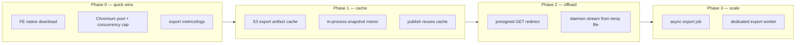
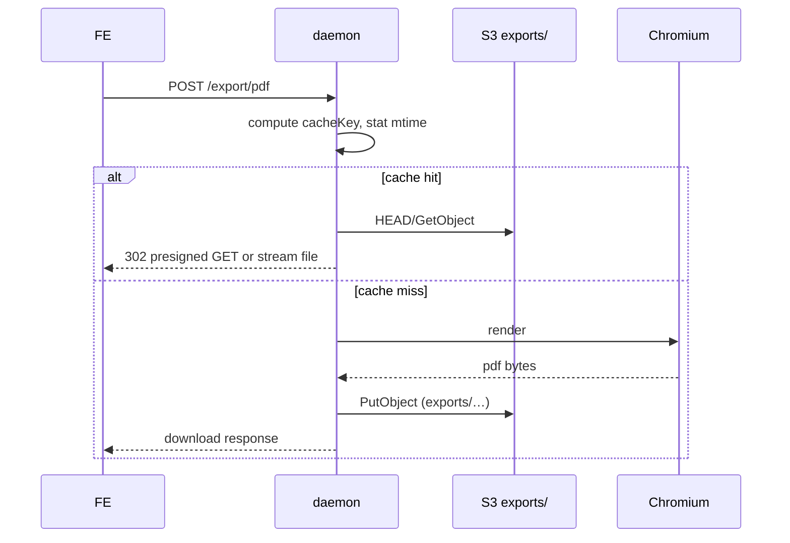

# Design — Export(HTML/PDF/ZIP/이미지) 성능·부하 개선 로드맵

**목적:** `/export/*` 경로의 **EC2·브라우저·네트워크 부하**를 분석하고, 단계별 개선안·우선순위·트레이드오프를 SSOT로 고정한다.  
**전제:** [33 다운로드·Export 아키텍처](./33_프로젝트_다운로드_Export_아키텍처.md) — raw `/raw/` 다운로드는 상대적으로 가볍고, **문제의 중심은 rendered export**이다.  
**관련:** [14 Drive 연동 §3.3.1](./14_Design_Drive_연동_설계.md) · [16 S3 저장 시점](./16_S3_데이터_저장_시점_SSOT.md) · [32 썸네일 cover](./32_프로젝트_썸네일_커버_로딩_개선.md) · [19 S3 prefix](./19_S3_버킷_prefix_역할.md)

---

## 0. 한 줄 결론

> **Export 부하는 “바이트 크기”보다 headless Chromium 렌더 + 메모리 이중화 + EC2 proxy 전송이 합쳐진 문제다.**  
> **단기(Phase 0~1):** FE native download + export 결과 캐시(S3) + Chromium pool/동시성 튜닝.  
> **중기(Phase 2):** presigned GET offload + publish/download 공유 캐시.  
> **장기(Phase 3):** async export job (대형 deck).

---

## 1. 왜 Export만 문제인가

### 1.1 raw 다운로드 vs export

| | `GET /raw/` (원본) | `POST /export/*` (렌더링) |
|--|-------------------|---------------------------|
| FE | `<a href download>` — **네이티브 다운로드** | `fetch` → **`resp.blob()`** — 메모리에 전체 적재 |
| daemon CPU | 디스크 read (+ video는 stream) | **Chromium launch·render·PDF/ZIP 생성** |
| daemon RAM | stream 또는 단일 buffer | **flatten HTML / PDF / ZIP 전체 buffer** |
| 품질 | live 원본 그대로 | **오프라인용 정적 스냅샷** (deck slide 펼침·inline) |
| 동시성 | nginx/daemon I/O | **전역 직렬 큐** (아래 §2.3) |

raw는 “파일 복사”에 가깝고, export는 **매번 미니 빌드 파이프라인**이다.

### 1.2 비용이 쌓이는 4곳

```text
① sync-down     S3 → scratch (cold project, TTL 만료)
② Chromium      launch → page → wait fonts/images → render (CPU·RAM·시간)
③ daemon buffer flattened HTML / PDF / ZIP 전체를 메모리에 생성
④ 전송 이중화   daemon → nginx → FE blob() → createObjectURL → disk
                  (publish 시 design-api가 bytes 전체를 한 번 더 보유)
```

**deck 10+ 슬라이드 HTML export**는 ②③에서 HTML이 **수 MB~수십 MB**까지 커질 수 있다 (1920×1080 block-flow × N slide + inlined CSS/img).

---

## 2. As-Is 구현 (코드 SSOT)

### 2.1 FE — `apps/web/src/runtime/exports.ts`

| 함수 | API | FE 수신 방식 |
|------|-----|-------------|
| `exportProjectAsHtml` | `POST …/export/html` | `resp.blob()` → `triggerDownload` |
| `exportProjectAsZip` | `POST …/export/zip` | 동일 |
| `exportProjectAsPdf` | `POST …/export/pdf` | 동일 |
| `exportProjectImageBlob` | `POST …/export/image` | blob (FileViewer modal) |

**Teamver embed:** `requireRenderedExport: true` — daemon 실패 시 **깨진 fallback 금지** ([14 §3.3.1](./14_Design_Drive_연동_설계.md)).

**문제:** `fetch` + `blob()`은 브라우저가 **응답 body 전체를 JS heap에 복제**한다. 20MB PDF면 FE만 20MB+ (GC 전까지).

### 2.2 daemon — `apps/daemon/src/import-export-routes.ts`

```text
POST /export/html  → buildDesktopPdfExportInput → renderHeadlessHtmlSnapshot → res.send(Buffer)
POST /export/zip   → renderHeadlessHtmlSnapshot → JSZip.generateAsync(nodebuffer) → res.send
POST /export/pdf   → renderHeadlessPdf → res.send(pdf Buffer)
POST /export/image → renderHeadlessImage → res.send
```

- HTML/ZIP은 **동일 headless snapshot**을 공유 (ZIP = snapshot 1파일 압축).
- 응답은 **스트리밍 없이** `res.send(Buffer)` — nginx·FE까지 **한 덩어리**.

### 2.3 headless — `apps/daemon/src/headless-export.ts`

| 항목 | 현재 값 | 의미 |
|------|---------|------|
| `EXPORT_TIMEOUT_MS` | 30_000 | page/render 타임아웃 |
| Chromium | **요청마다 launch → close** | cold start 비용 큼 |
| `runExclusive` | **전역 Promise 큐** | 동시 export **1개만** 실행, 나머지 대기 |
| deck | 1920×1080 flatten, resource inline | CPU·RAM·HTML 크기 ↑ |
| image | `deviceScaleFactor: 2` | 픽셀 4배 → PNG/JPEG 크기 ↑ |

```text
export 요청 A ──┐
export 요청 B ──┼── runExclusive 큐 ── launch Chromium ── render ── close
export 요청 C ──┘         (B,C는 A 완료까지 blocking)
```

**장점:** EC2 OOM·Chromium 폭주 방지.  
**단점:** 2번째 사용자는 **1번째 export 전체 시간(수십 초)** 만큼 추가 대기.

### 2.4 publish 경로 — design-api도 bytes 전체 보유

`publish_service.py` → `OdDaemonClient.get_export_pdf/html` → `response.content` (전체 bytes) → Drive presigned PUT.

```text
daemon export buffer
  → httpx response.content (design-api RAM)
  → presigned PUT body
```

**로컬 다운로드 + Drive 발행**을 연속하면 **동일 artifact에 대해 Chromium render가 2회** (캐시 없음).

### 2.5 읽기 전 sync-down

`/export/*`는 lazy materialization 대상 ([33 §3.2](./33_프로젝트_다운로드_Export_아키텍처.md)). cold scratch면 export **전에** S3→scratch 복사 latency 추가.

---

## 3. 부하 시나리오 (언제 터지나)

| 시나리오 | 병목 | 심각도 |
|----------|------|--------|
| deck 15 slide PDF 1회 | Chromium + 큰 PDF buffer | 중 |
| 동시 3명 export | **직렬 큐** → 2·3번째 60~90s+ 대기 | **高** |
| HTML export 직후 ZIP export | Chromium **2회** (snapshot 재사용 없음) | 중 |
| export 직후 Drive publish (PDF) | Chromium **2회** + design-api **2× bytes** | **高** |
| image modal에서 slide flip × N | slide마다 `POST /export/image` | 중~高 |
| run 직후 sync-up 전 export | sync-down skip(warm scratch) — OK | 低 |
| cold project 첫 export | sync-down + Chromium | 중 |

**현재 scale 가정:** embed 사용자 **수동·저빈도** 1-click → staging은 견딤. **팀 동시 사용·대형 deck**에서 EC2 latency/OOM/redis queue 체감.

---

## 4. 개선 원칙 (Trade-off 가드레일)

1. **품질 SSOT 유지** — embed/Drive는 **daemon rendered snapshot**이 SSOT ([14 §3.3.1](./14_Design_Drive_연동_설계.md)). “Chromium 생략” fallback은 standalone만.
2. **세션 게이트** — presigned GET을 쓰더라도 **발급 API**는 `/api/` + auth_request. URL TTL·scope 제한.
3. **캐시 키 = 콘텐츠 버전** — `entryFile mtime` / `coverVersion` / `project.updatedAt` ([32 Phase 0](./32_프로젝트_썸네일_커버_로딩_개선.md))와 동일 철학.
4. **측정 후 튜닝** — export duration, queue wait, chromium launch ms, artifact bytes, 5xx rate.

---

## 5. 개선안 전체 맵



---

## 6. Phase 0 — 즉시 적용 가능 (코드 변경 작음)

### 6.1 FE: `fetch`+`blob` → native attachment download

**As-Is**

```typescript
const resp = await fetchTeamverDaemon('/export/pdf', { method: 'POST', body });
const blob = await resp.blob();
triggerDownload(blob, filename);
```

**To-Be (옵션 A — POST 후 redirect token)**

```text
POST /export/pdf → 201 { downloadUrl: "/api/projects/p1/export/downloads/{token}" }
window.location.href = downloadUrl   // 또는 hidden <a download>
```

**To-Be (옵션 B — GET export with query + POST body 대체)**

- export 파라미터를 **짧은-lived export ticket** (daemon memory/Redis)에 저장
- FE는 `GET /export/downloads/{ticket}` — **브라우저 네이티브 다운로드**

**효과**

| | blob() | native download |
|--|--------|-----------------|
| FE peak RAM | artifact 크기 | **~0** (스트림→디스크) |
| 구현 | 현재 | ticket + GET route 추가 |

**리스크:** 낮음. embed `requireRenderedExport` 정책과 무관 (여전히 daemon render).

**코드 터치:** `exports.ts`, `import-export-routes.ts`, FileViewer error handling.

---

### 6.2 daemon: Chromium browser pool + concurrency cap

**As-Is (코드, 2026-07):** 매 export `launch()` → `close()`, `runExclusive` = **동시 1** (`headless-export.ts`).  
`OD_EXPORT_MAX_CONCURRENT` 등 export ENV는 **Phase 0 구현됨** (`export-runtime.ts`). 아래는 **상용 권장 default** (§13.1).

**To-Be**

```text
BrowserPool (N idle Chromium — OD_EXPORT_BROWSER_POOL_SIZE)
  + Semaphore(OD_EXPORT_MAX_CONCURRENT)
  + per-export newPage() → close page (browser reuse)
```

| | As-Is (코드) | Pool + 상용 cap |
|--|--------------|-----------------|
| 동시 export | **1** (전역 직렬) | staging **4** / production **6~8** |
| cold launch | 매 요청 ~1–3s | pool hit 시 **생략** |
| 10명 동시 클릭 | 9명 **수십 초~분 대기** | cap만큼 병렬 + 나머지 queue |

> **Phase 0 문서 초안의 `2`는 “첫 pool PR 스모크”용 보수값이었고, 상용 오픈 목표가 아니다.**  
> 상용은 아래 **§13.1·§17** 표를 SSOT로 한다.

**전제 (필수):** concurrency를 올리려면 **`OD_MEM_LIMIT`·`NODE_OPTIONS`를 먼저** 올려야 한다.  
compose default `512m` / `--max-old-space-size=512` 상태에서 concurrent만 키우면 **Chromium OOM → daemon restart**가 난다.

**코드:** `headless-export.ts` — `runExclusive` → pool + semaphore, ENV wired.

---

### 6.2.1 상용 오픈 — concurrency vs 메모리 (왜 2만으로는 부족한가)

Chromium headless 1회(deck PDF) 피크 RAM **~400–900MB** (슬라이드 수·inline 리소스에 비례).  
Node heap + daemon baseline **~300–500MB** 추가.

| 환경 | EC2 (권장) | `OD_MEM_LIMIT` (권장) | `OD_EXPORT_MAX_CONCURRENT` | `OD_EXPORT_BROWSER_POOL_SIZE` |
|------|------------|------------------------|----------------------------|-------------------------------|
| **Staging** | `t3.large` 8GiB | `1536m`~`2g` ([.env.staging.example](../deploy/teamver/.env.staging.example)) | **3~4** | **2** |
| **Production (상용 오픈)** | `t3.2xlarge` 32GiB ([07 §3.2](./07_VM_배포_인프라.md)) | **`6g`~`8g`** | **6~8** | **3** |
| **Production (피크 대비)** | `t3.2xlarge`+ 또는 export worker 분리 | `8g`~`10g` | **8~10** | **3~4** |

**vCPU 가이드:** concurrent 1슬롯 ≈ **0.5~1 vCPU** (PDF/deck).  
`t3.large`(2 vCPU)에서 concurrent **4** = CPU saturated 가능 → queue wait은 RAM보다 CPU에서 먼저 올 수 있음.  
`t3.2xlarge`(8 vCPU) + concurrent **6~8**이 상용 1호기 **단일 daemon** 현실적 상한. design-api **`UVICORN_WORKERS=5`** ([07 §4](./07_VM_배포_인프라.md)).

**동시 사용자 ≠ concurrent:** export는 **수동·저빈도**이지만 오픈 직후 “팀이 동시에 PDF 받기” 이벤트는 있다.  
10명이 동시 클릭 시 concurrent=2면 8명이 **앞 4 job × ~20–40s** 대기 → 체감 장애. concurrent=6이면 4명만 대기.

**concurrency만 키우면 부족한 이유:** HTML→ZIP→PDF→Publish 연속 시 **동일 snapshot Chromium 4회** — §7 cache 없이 concurrent를 10으로만 올려도 CPU/RAM 낭비. **Phase 1 cache가 상용 필수 동반**.


### 6.3 Observability (필수 선행)

structured log / metric 필드:

| 필드 | 용도 |
|------|------|
| `od_export_format` | html/pdf/zip/image |
| `od_export_deck` | bool |
| `od_export_duration_ms` | end-to-end |
| `od_export_chromium_launch_ms` | pool 효과 측정 |
| `od_export_queue_wait_ms` | 직렬 큐 병목 |
| `od_export_bytes` | response size |
| `od_export_cache` | miss/hit (Phase 1+) |
| `od_export_project_id` | (hash) per-tenant |

CloudWatch 필터: `[export/pdf] failed`, `headless Chromium unavailable`.

---

## 7. Phase 1 — Export artifact cache (효과 큼, 중간 난이도)

### 7.1 문제: 동일 snapshot 반복 render

| 트리거 | Chromium |
|--------|----------|
| HTML 다운로드 | 1회 |
| ZIP 다운로드 (직후) | **+1회** (동일 snapshot) |
| PDF 다운로드 | **+1회** |
| Drive publish PDF | **+1회** |

### 7.2 캐시 키 (제안)

```text
cacheKey = SHA256(
  tenantS3Prefix
  + entryFile path
  + source mtimeMs (scratch stat)
  + format: html|pdf|zip|png|jpeg|webp
  + deck: bool
  + slideIndex (image only)
)
```

- `coverVersion` / file mtime과 **동일 SSOT** — 파일 수정 시 자동 miss.
- run 중 scratch-only 변경: mtime 갱신 → miss (의도적).

### 7.3 저장 위치 옵션

| 옵션 | 경로 | 장점 | 단점 |
|------|------|------|------|
| **A. tenant prefix sub** | `design/…/proj_…/.od-export/{hash}.pdf` | 기존 IAM·lifecycle | tenant listing noise |
| **B. dedicated exports prefix** | `exports/{ws}/{proj}/{hash}.pdf` | 분리·TTL lifecycle 쉬움 | prefix 규칙 추가 |
| **C. scratch only** | `/app/.od/scratch/.../.export-cache/` | 구현 빠름 | **evict 시 소실**, multi-instance ❌ |

**권장:** **B** (staging) — S3 lifecycle `exports/` 7~30일 expire. 프로젝트 SSOT 파일과 분리.

### 7.4 조회 흐름



### 7.5 publish 연동

`publish_service.py`가 daemon export bytes를 매번 받는 대신:

1. daemon `POST /export/pdf` → cache hit 시 **S3 key 반환** (bytes skip)
2. design-api: presigned GET stream → presigned PUT pipe (**RAM 상한**)

또는 daemon이 **Drive PUT까지 proxy** (scope 큼 — 비권장).

**최소 win:** publish가 **cached S3 object**에서 stream read → PUT (Chromium 1회만).

### 7.6 in-process memo (HTML→ZIP 같은 요청)

동일 HTTP 요청/짧은 TTL 내:

```text
renderHeadlessHtmlSnapshot() 결과 string → ZIP export가 재사용
```

Phase 1a — S3 없이 **daemon memory LRU** (key + 60s TTL, max 32MB entry). HTML+ZIP 연속 클릭 완화.

---

## 8. Phase 2 — presigned GET offload (EC2 bandwidth)

### 8.1 목표

```text
POST /export/pdf  (auth, render or cache hit)
  → 201 { url: "https://s3.../exports/…?X-Amz-…", expiresIn: 300 }
FE: window.location = url  OR  <a href download>
```

**EC2가 큰 body를 proxy하지 않음** — S3→브라우저 직접 (CloudFront optional).

### 8.2 보안

| 요구 | 구현 |
|------|------|
| 인증 | presigned **발급** 시 session check (design-api 또는 daemon) |
| TTL | 60~300s |
| scope | 단일 object key, GET only |
| replay | 1회성 token id (optional) |

**세션 없는 CDN cache는 여전히 ❌** — presigned URL 자체가 secret.

### 8.3 Drive publish와 대칭

| 방향 | presigned |
|------|-----------|
| Publish | PUT → Drive bucket |
| Download | GET ← exports bucket |

동일 **“바이트는 object storage, API는 메타+권한”** 패턴.

---

## 9. Phase 3 — Async export (대형 deck·타임아웃)

### 9.1 언제 필요한가

- deck 30+ slide PDF > `EXPORT_TIMEOUT_MS` (30s)
- export queue wait > UX 허용 (예 60s)
- HTTP proxy timeout (nginx `proxy_read_timeout`)

### 9.2 설계 스케치

```text
POST /export/jobs  { format, fileName, deck }
  → 202 { jobId, status: "queued" }

GET /export/jobs/:jobId
  → { status: "running"|"ready"|"failed", downloadUrl?, error? }

Worker (daemon sidecar or queue consumer):
  Chromium render → S3 exports/ → status=ready
```

**FE:** FileViewer spinner + poll / SSE. 완료 시 presigned GET (Phase 2).

**Job store:** RDS `design_export_jobs` 또는 Redis (TTL).

---

## 10. 옵션 비교표 (한눈에)

| 개선안 | EC2 CPU | EC2 RAM | FE RAM | 네트워크 EC2 | 구현 난이도 | embed 품질 |
|--------|---------|---------|--------|--------------|-------------|------------|
| FE native download | — | — | **↓↓** | — | 낮음 | 유지 |
| Chromium pool | **↓** | ↑(상한) | — | — | 중 | 유지 |
| concurrency 2~3 | — | ↑ | — | — | 낮 | 유지 |
| in-proc HTML memo | **↓** | ↑ | — | — | 낮 | 유지 |
| S3 export cache | **↓↓↓** | **↓** | — | **↓** | 중 | 유지 |
| presigned GET | — | **↓** | **↓** | **↓↓↓** | 중 | 유지 |
| async jobs | **↓**(분산) | **↓** | — | **↓** | 높음 | 유지 |
| Chromium 생략 fallback | **↓↓↓** | ↓ | — | ↓ | 낮 | **❌ embed** |

---

## 11. 권장 로드맵 (실행 순서)

### Sprint 1 — Phase 0 (1~2주) — ✅ 코드 완료 (배포 대기)

| # | 작업 | owner | 상태 |
|---|------|-------|------|
| 0.1 | export structured metrics (§6.3) | daemon | ✅ `export-runtime.ts` (`od_export_done` / `od_export_failed`) |
| 0.2 | FE native download (ticket + GET) | web + daemon | ✅ `delivery: ticket` + `GET …/export/downloads/:token` |
| 0.3 | Chromium browser pool + `OD_EXPORT_MAX_CONCURRENT` (staging **4** / prod **6** — §13.1) | daemon | ✅ `runHeadlessExportJob` + pool |
| 0.4 | 503 UX + Retry-After (`OD_EXPORT_QUEUE_MAX`) | web + daemon | ✅ `ExportQueueFullError` + FE 재시도 메시지 |
| 0.5 | staging 부하 스크립트: 3 concurrent PDF → queue_wait 측정 | ops | ⏳ 배포 후 |

**성공 기준:** FE heap spike 제거; 동시 2 export 시 3번째만 대기; p95 export duration 가시화.

### Sprint 2 — Phase 1a/1d (2~3주) — ✅ 완료 (§20.1~§20.4 · staging 반영)

| # | 작업 | 상태 |
|---|------|------|
| 1.1 | in-process memo (RAM LRU + TTL) — `MemoExportCacheStore` | ✅ 완료 — `export-cache-memo.ts` |
| 1.2 | export artifact cache 저장소 결정 (§20) — **EBS `od-data/.od-export-cache/`**, S3는 multi-instance 시 승격 | ✅ 완료 — EBS local 결정 (§19.3) |
| 1.3 | cacheKey SSOT (`sha256(projectId + entryFile + mtimeMs + format + deck + slideIndex + codeVersion)`) | ✅ 완료 — `export-cache-key.ts` |
| 1.4 | daemon local cache hit → filePath stream (ticket + direct) — `LocalFileExportCacheStore` + sweep | ✅ 완료 — `export-cache-local.ts` + `respondExportPayload` |
| 1.5 | route 통합 (PDF/HTML/ZIP/image) + `runCachedExport` chain | ✅ 완료 — `import-export-routes.ts` + `export-cache-runtime.ts` |
| 1.6 | metrics 확장 (`cache=miss|hit-memo|hit-local`, `cacheKey`, `cacheAgeMs`) | ✅ 완료 — `export-runtime.ts` |
| 1.d | Publish stream (§20.4) — design-api RAM 이중화 제거 | ✅ 완료 — PDF/HTML Drive publish가 daemon export ticket + presigned PUT stream 사용 + 64MB bytes fallback safety net (`od_daemon_client.py`, `publish_service.py`) |

#### 1.7 Cache Hit 운영 확인 방법

staging 배포 후 같은 프로젝트·같은 파일·같은 export 옵션으로 PDF/HTML을 2회 이상 요청해서 아래를 확인한다.

| 확인 위치 | 기대값 |
|---|---|
| daemon 로그 | 첫 요청은 `cache=miss`, 반복 요청은 `cache=hit-memo` 또는 `cache=hit-local` |
| design-api 로그 (Drive publish) | `publish export stream PUT succeeded ... export_cache=hit-memo|hit-local` 또는 fallback 시 `publish fallback bytes PUT succeeded ... export_cache=...` |
| 응답 ticket JSON (직접 확인 시) | `cache` 필드가 `miss`, `hit-memo`, `hit-local` 중 하나 |
| 체감/계측 | 반복 export에서 Chromium render 시간이 줄고, `od_export_duration_ms`가 감소 |
| 로컬 cache dir | `OD_EXPORT_CACHE_DIR` 또는 기본 `${OD_DATA_DIR}/.od-export-cache` 아래 payload/meta 파일 생성 |

**주의:** `cache=miss`가 계속 나와도 즉시 버그는 아니다. HTML 파일 mtime 변경, `OD_EXPORT_CACHE_VERSION` 변경, `fresh=1`, 다른 `deck/slideIndex/format/title` 조합이면 cacheKey가 달라져 정상 miss가 난다.

### Sprint 3 — Phase 1b + 2 (3~4주)

| # | 작업 | 상태 |
|---|------|------|
| 2.1a | ticket 응답 계약 확장 (`deliveryMode=stream|redirect`, `singleUse`) + design-api redirect-follow 준비 | ✅ 완료 — presigned GET 전환 전 호환 가드 |
| 2.1b-0 | `exports/ws_{workspace}/proj_{project}/{cacheHash}.{ext}` object key SSOT + sanitizing | ✅ 완료 — `export-offload-key.ts` |
| 2.1b-1 | `OD_EXPORT_OFFLOAD_ENABLED` feature flag (default off) | ✅ 완료 — staging에서 명시적으로 켜기 전 offload 메타 비노출 |
| 2.1b | presigned GET 발급 API (session-gated) | ⏳ |
| 2.2 | publish_service: cache hit 시 Chromium skip (daemon ticket/local cache reuse) | ✅ 완료 — single-node EBS cache 기준 / S3 object 반환은 1c 이후 |
| 2.3 | FE Download + Publish 공통 cache benefit E2E | ⏳ |

### Backlog — Phase 3

- async job API + FileViewer UX
- dedicated export worker (Chromium isolate)
- deck slide count soft cap + “대형 deck은 PDF만” UX

---

## 12. 구현 스케치 — API 계약 (Phase 0+2)

### 12.1 Export ticket (제안)

```typescript
// POST /api/projects/:id/export/pdf
// Request: { fileName, deck, title, delivery: "ticket" }
// Response 201:
{
  "delivery": "ticket",
  "deliveryMode": "stream",
  "downloadUrl": "/api/projects/:id/export/downloads/01JABC…",
  "filename": "My Deck.pdf",
  "mime": "application/pdf",
  "bytes": 2457600,
  "sizeBytes": 2457600,
  "singleUse": true,
  "cache": "miss",
  "expiresAt": "2026-07-02T06:00:00Z"
}
```

```typescript
// GET /api/projects/:id/export/downloads/:token
// → Content-Disposition: attachment
// → stream from temp/cache file
// 향후 Phase 2.1b: deliveryMode="redirect"이면 302 to presigned S3 가능
```

### 12.2 Cache hit (Phase 1)

```typescript
// POST response when cached:
{
  "delivery": "ticket",
  "deliveryMode": "stream",
  "downloadUrl": "/api/projects/:id/export/downloads/01JABC…",
  "filename": "My Deck.pdf",
  "bytes": 2457600,
  "cache": "hit-local",
  "expiresAt": "…"
}
```

---

## 13. ENV / 운영

### 13.1 상용 오픈 SSOT (권장 default)

| ENV | Staging | Production (상용) | 의미 |
|-----|---------|-------------------|------|
| `UVICORN_WORKERS` | **`2`** | **`5`** | design-api process count ([07 §4](./07_VM_배포_인프라.md)) |
| `DB_POOL_SIZE` / `MAX_OVERFLOW` | `10`/`10` | **`8`/`8`** | worker당 SQLAlchemy pool (5×16=80 conn) |
| `OD_MEM_LIMIT` | `1536m`~`2g` | **`6g`~`8g`** | daemon cgroup — Chromium 전제 |
| `NODE_OPTIONS` | `--max-old-space-size=1024` | **`--max-old-space-size=4096`** | Node heap (MEM_LIMIT의 ~50%) |
| `OD_EXPORT_MAX_CONCURRENT` | **`4`** | **`6`** (피크 **`8`**) | 동시 headless render 슬롯 |
| `OD_EXPORT_BROWSER_POOL_SIZE` | **`2`** | **`3`** | warm browser 수 (≤ concurrent) |
| `OD_EXPORT_QUEUE_MAX` | **`32`** | **`64`** | 초과 시 503 + retry-after (OOM 방지) |
| `OD_EXPORT_CACHE_ENABLED` | `1` (Phase 1 후) | **`1`** | S3 artifact cache |
| `OD_EXPORT_CACHE_TTL_SEC` | `604800` | `604800` | exports/ lifecycle hint |
| `OD_EXPORT_OFFLOAD_ENABLED` | `0` | `0` → 안정화 후 `1` | presigned GET/offload rollout flag |
| `OD_EXPORT_TICKET_TTL_SEC` | `300` | `300` | download token |
| `OD_EXPORT_MAX_BYTES` | `52428800` | `52428800` | 50MB cap |

**As-Is (2026-06-30):** Phase 0 구현됨 — `export-runtime.ts`, `export-download-store.ts`, ticket delivery, pool + semaphore. ENV는 [§13.1](#131-상용-오픈-ssot-권장-default) 및 `deploy/teamver/.env.{staging,production}` 참고.

**Phase 0 PR-only 스모크 (비상용):** `MAX_CONCURRENT=2`, `POOL=1` — pool 동작 검증용. **상용 deploy에 2 고정 금지.**

### 13.2 전체 ENV 표

| ENV | default (코드 fallback) | 의미 |
|-----|---------------------|------|
| `OD_EXPORT_MAX_CONCURRENT` | 코드: **1** (직렬) / 상용: **§13.1** | Chromium 동시 render |
| `OD_EXPORT_BROWSER_POOL_SIZE` | **§13.1** | idle browser 수 |
| `OD_EXPORT_QUEUE_MAX` | **§13.1** | 대기 큐 상한 |
| `OD_EXPORT_CACHE_ENABLED` | `0` → 상용 `1` | S3 export cache |
| `OD_EXPORT_CACHE_TTL_SEC` | `604800` | exports/ lifecycle hint |
| `OD_EXPORT_OFFLOAD_ENABLED` | `0` | offload key / presigned GET 단계적 활성화 |
| `OD_EXPORT_TICKET_TTL_SEC` | `300` | download token |
| `OD_EXPORT_MAX_BYTES` | `52428800` | 50MB cap |

**nginx:** native download stream 시 `proxy_buffering off` for large files.  
**ALB:** export POST timeout — deck PDF 30s+ 가능 → idle_timeout 3600s는 SSE용; export route `proxy_read_timeout` **120s** 검토 ([07 §3.2](./07_VM_배포_인프라.md)).

---

## 14. FAQ

### Q1. S3 presigned GET이면 FE가 S3 직접 호출하는 거 아닌가?

**발급**은 세션 `/api/`로 하고, **다운로드 body**만 S3에서 받는다. [33 §6](./33_프로젝트_다운로드_Export_아키텍처.md)의 “프로젝트 tenant prefix 직접 노출”과 다름 — **short-lived exports/** 객체.

### Q2. 캐시면 편집 반영이 안 되지 않나?

cacheKey에 **source file mtime** 포함 → 저장/sync-up 후 mtime 변경 → miss → re-render. run 중 scratch-only 편집도 mtime으로 반영.

### Q3. 왜 Chromium을 없애지 않나?

embed/Drive 품질 SSOT가 **headless flatten snapshot**이다. Vite dist·deck absolute layout·font load는 pure HTML parse로 재현 어렵다.

### Q4. runExclusive 제거만 하면?

동시 launch 폭주 → **EC2 OOM·CPU steal** → daemon 전체 장애. **pool + cap + OD_MEM_LIMIT** 선행. cap 없이 제거 금지.

### Q5. `OD_EXPORT_MAX_CONCURRENT=2`면 상용에 충분한가?

**아니다.**

- **현재 코드**는 ENV 없이 **동시 1** — 2보다 더 나쁨.
- 문서 초안 `2`는 Phase 0 **첫 PR 검증용** — 10명 동시 export 시 8명 장기 대기.
- **상용 SSOT:** staging **4**, production **6~8** ([§13.1](#131-상용-오픈-ssot-권장-default)).  
  단, **`OD_MEM_LIMIT` 4g+ (prod)** 없이 concurrent만 올리면 OOM.
- concurrent만 키우는 것보다 **Phase 1 S3 cache** (재다운로드·publish)가 체감 latency에 더 크다.

### Q6. raw `/raw/` HTML 다운로드로 export 대체?

**미리보기용 live HTML** ≠ **오프라인 snapshot**. deck nav/script·외부 URL·auth-gated asset 문제. export 목적에 부적합.

---

## 17. 상용 오픈 체크리스트 (Export)

| # | 항목 | priority | 상태 |
|---|------|----------|------|
| 1 | `OD_MEM_LIMIT` production **≥8g** (`t3.2xlarge` SSOT) | **P0** | ✅ `.env.production` + example 8g 반영 |
| 2 | `OD_EXPORT_*` pool + semaphore **코드 구현** | **P0** | ✅ Phase 0 |
| 3 | staging concurrent **4** / prod **6** 로드 테스트 (3~5명 동시 PDF) | **P0** | ⏳ 배포 후 |
| 4 | export metrics (`queue_wait_ms`, OOM restart) CloudWatch | P0 | ⏳ 배포 후 대시보드 |
| 5 | Phase 1 export cache (재다운로드·HTML→ZIP·slide-flip) — memo + EBS local | **P1 (오픈 2주 내)** | ✅ §20.1~§20.3 (배포 대기) |
| 5b | Publish stream (design-api RAM 이중화 제거) — §20.4 | P1 (오픈 직후) | ✅ daemon ticket stream + capped bytes fallback + failure classification |
| 6 | FE native download (blob 이중 메모리 제거) | P1 | ✅ Phase 0 (ticket + GET) |
| 7 | `OD_EXPORT_QUEUE_MAX` 초과 시 503 UX | P2 | ✅ Phase 0 (503 + `ExportQueueFullError`) |
| 8 | async job (30s+ deck) | P2 | ⏳ |

**용량 산식 (rough):**

```text
OD_MEM_LIMIT ≥ NODE_heap + (POOL × 350MB) + (CONCURRENT × 600MB) + 512MB 여유
```

예: prod `POOL=3`, `CONCURRENT=6`, `NODE_heap=3g`  
→ 3g + 1.05g + 3.6g + 0.5g ≈ **8.2g** → `OD_MEM_LIMIT=6g`는 deck PDF 동시 6에 **빡빡** → concurrent **6** + MEM **6g** 또는 concurrent **4** + MEM **4g** 조합 튜닝.

---

## 19. Phase 1 재검토 — “S3 exports/ cache가 정말 최선인가”

### 19.1 Phase 0 이후 남은 실제 병목 (재확인)

Phase 0로 해결된 것:

| 문제 | 해결 |
|------|------|
| 동시 export 직렬 큐 | `ExportSemaphore` + browser pool |
| FE `blob()` 이중 메모리 | ticket + GET native download |
| queue 폭주 → OOM | `OD_EXPORT_QUEUE_MAX` + 503 UX |

**아직 살아있는 병목** (§1.2 ①~④ 기준):

| # | 시나리오 | Chromium 횟수 | 절약 가능 |
|---|----------|--------------|----------|
| A | 같은 project HTML 다운로드 후 ZIP 다운로드 | **2회** (ZIP도 HTML snapshot 필요) | in-process memo만으로 -1 |
| B | 같은 project 로컬 PDF + Publish PDF | **2회** (`OdDaemonClient.get_export_pdf`로 재요청) | artifact cache -1 |
| C | 같은 project 재다운로드 (사용자 다른 브라우저·재클릭) | 매번 1회 | artifact cache로 hit |
| D | image modal에서 slide flip N회 (같은 project · 다른 slideIndex) | **N회** | per-slide cache로 대량 절감 |
| E | Publish가 daemon export bytes를 design-api RAM에 통째로 (§2.4) | 1회 + RAM 이중 | Publish용 stream/redirect |

**scale 가정 (오픈 2주 내):**
- daemon 인스턴스 **1대** (§13.1 t3.2xlarge single-node).
- export peak ≈ **팀 단위 동시 3~10명** — cache hit rate는 **B/C/D 시나리오 실제 발생 빈도**에 좌우.
- multi-instance는 **오픈 후 성능 리뷰 이후**에나 트리거될 이슈.

### 19.2 저장소 옵션 비교 (원안 §7.3 재정렬)

| 옵션 | 저장 위치 | multi-instance | 구현 LOC 예상 | 리스크 | 이 시점 적합성 |
|------|-----------|----------------|---------------|--------|--------------|
| **1a** In-process memo | daemon RAM (LRU 60s TTL) | ❌ | ~100줄 | 낮음 (RAM cap) | 🟢 즉시 도입 |
| **1b** EBS local file cache | `od-data/.od-export-cache/{hash}.pdf` (별도 volume subdir) | ❌ | ~300줄 (write/read/evict) | 중 (evict·path escape·size) | 🟢 오픈 2주 내 우선 |
| **1c** S3 `exports/` prefix | `exports/{ws}/{proj}/{hash}.pdf` + presigned GET | ✅ | ~700줄 (upload/HEAD/presign/lifecycle) | 중~높 (IAM·lifecycle·publish 재사용 계약) | 🟡 multi-instance 결정 후 |
| **1d** Publish-only (§2.4 ④ 축소) | daemon → tmp file → design-api stream (Chromium은 매번 그대로) | ❌ | ~200줄 (tmp file stream API) | 낮~중 (계약 변경 없음) | 🟢 병행 가능 |

### 19.3 판단 근거 — 왜 원안(S3 full)을 바로 하면 과잉인가

1. **현재 인프라는 single-node** — S3 cache의 최대 강점(“여러 daemon이 warm cache 공유”)이 오픈 초기에는 발현되지 않는다.
2. **EBS `od-data` volume은 이미 확보** (`teamver-design` 인프라, §07 §3.2) — 로컬 파일 캐시의 저장 매체·백업·모니터링 이미 존재. S3 IAM/lifecycle 신설 없음.
3. **hit rate 실측 필요** — B/C/D의 실제 재요청 비율은 사용 지표(§0.4/§17-3 로드테스트)로 얻는다. hit rate < 20%면 S3 왕복 latency가 오히려 손해가 될 수도 있다. **로컬 캐시로 먼저 지표 얻고 S3 승격 결정**하는 편이 안전.
4. **§2.4 publish 이중 bytes**는 “Chromium 2회”보다 “design-api RAM 폭탄”이 더 큰 위험 — **1d를 1c보다 먼저**하는 편이 상용 안정성에 유리 (Chromium 절약은 부차, RAM cap이 SLO).
5. **cacheKey는 옵션과 무관** — 어느 저장소든 `SHA256(tenant + path + mtime + format[+slide])`은 재사용 가능. **1a→1b→(1c) 확장 시 코드 재작성 불필요**하도록 인터페이스만 잘 짜면 됨.

### 19.4 권장 실행 순서 (P1 조정안)

```text
Sprint 2 (2주)
  ├── 1a. in-process memo (LRU) ─────────── HTML→ZIP·동시 재요청 즉시 완화
  │       key: cacheKey(mem), TTL 60s, max 32MB entry, max 4 entries
  │
  ├── 1b. EBS local file cache ─────────── 재다운로드·image slide-flip 완화
  │       path: /app/.od/data/.od-export-cache/{hash}.{ext}
  │       evict: total-size LRU (예 5GB) + max-age 7d
  │       cacheKey SSOT: sha256(tenantPrefix + entryFile + mtimeMs + format + deck [+ slideIdx])
  │
  └── 1d. Publish stream/tmp-file 계약 ── design-api RAM 이중화 제거
          daemon POST /export/pdf → 201 { downloadUrl: "…/downloads/{token}" }
          design-api: streaming GET → presigned Drive PUT (RAM 상한 유지)

Sprint 3 (2~3주 뒤 · 측정 이후)
  └── 1c. S3 exports/ 승격 ─────────── multi-instance / cross-restart 지속성이 필요할 때
```

**결정 게이트 (1c로 승격할 조건):**
- 오픈 후 4주간 daemon export **hit rate ≥ 20%** 실측 (1b 로그).
- 또는 EC2 스케일아웃 결정 (2+ daemon).
- 또는 EBS `.od-export-cache/` 용량이 5GB 상한을 반복 초과.

### 19.5 이 접근의 트레이드오프

**이점:**
- 코드/인프라 리스크 낮음 — S3 lifecycle 신설·IAM 확장 없이 즉효.
- 오픈 지연 위험 없음 — Sprint 2에서 1a+1b 커버, 1c는 optional.
- Phase 1c로 자연 승격 가능 — cacheKey/API 계약은 그대로 두고 storage adapter만 교체.

**리스크:**
- **single-node cache** — daemon 재기동 시 warm 유실 (1b는 EBS라 재기동에 살아남지만 인스턴스 교체 시 소실).
- **multi-instance 시 재구현** — 하지만 storage adapter 인터페이스로 격리 가능.
- **§7.5 원안의 “publish presigned PUT” 최적화가 지연됨** — 1d는 stream만 개선, presigned PUT은 1c와 함께.

### 19.6 이 §19가 옳다는 것을 검증할 신호

Sprint 2 종료 시 다음 지표가 개선되면 §19 판단 유지:

| 지표 | Phase 0 종료 시점 | Sprint 2 종료 목표 |
|------|-------------------|--------------------|
| p50 export duration (PDF, deck 5 slide) | 8~15s | ≤ 3s (cache hit 시) |
| daemon RAM peak during publish | export bytes × 2 (design-api 별도) | export bytes × 1 (stream) |
| 재다운로드 Chromium launch | 100% | ≤ 30% (hit rate ≥ 70%) |
| `od_export_cache` hit ratio | — (측정 안 됨) | 로그 추가 후 관찰 |

지표가 위 목표에 도달 못 하고 hit rate ≥ 20%면 **1c(S3 승격) 트리거**.

---

## 20. Phase 1 세부 설계 (Sprint 2 구현 SSOT)

**목표:** 상용 오픈 직전 2주 내 Sprint 2 (1a + 1b + 1d) 완료. 1c(S3 승격)은 storage adapter만 교체할 수 있게 인터페이스를 미리 격리한다.

### 20.1 공통 계약 — cacheKey / storage adapter

#### 20.1.1 cacheKey (모든 layer가 동일 SSOT)

```typescript
// apps/daemon/src/export-cache-key.ts (new)
export type ExportCacheKeyInput = {
  projectId: string;                 // tenant boundary (multi-tenant 안전)
  entryFile: string;                 // POST body.fileName (normalize)
  mtimeMs: number;                   // fs.stat(source).mtimeMs — Drive/S3 sync 후에도 갱신
  format: 'pdf' | 'html' | 'zip' | 'png' | 'jpeg' | 'webp';
  deck: boolean;
  slideIndex?: number;               // image only, deck slide capture
  codeVersion?: string;              // OD_EXPORT_CACHE_VERSION — 렌더 알고리즘 breaking change 시 강제 miss
};

export function computeExportCacheKey(input: ExportCacheKeyInput): string {
  const canonical = [
    input.projectId,
    input.entryFile.replace(/^\/+/, ''),
    String(input.mtimeMs),
    input.format,
    input.deck ? 'deck' : 'flat',
    input.slideIndex != null ? `slide=${input.slideIndex}` : 'slide=-',
    input.codeVersion ?? 'v1',
  ].join('|');
  return crypto.createHash('sha256').update(canonical).digest('hex');
}
```

**mtime 조회:** `buildDesktopPdfExportInput` 이전에 `fs.stat(projectRoot/projectId/entryFile)` 1회. Vite dist fallback 시 `dist/index.html`의 mtime 사용 (`resolveRenderableHtmlSource` 결과 반영).

**보안 노트:** cacheKey는 hash이므로 tenant 격리는 **저장 경로 자체**에서도 확보한다 (`{projectId}/{hash}`).

#### 20.1.2 Storage adapter 인터페이스

```typescript
// apps/daemon/src/export-cache-store.ts (new)
export interface ExportCacheEntry {
  key: string;
  filePath?: string;      // local: file path (stream via fs.createReadStream)
  buffer?: Buffer;        // memo: in-RAM
  mime: string;
  bytes: number;
  storedAt: number;
}

export interface ExportCacheStore {
  get(key: string): Promise<ExportCacheEntry | null>;
  put(key: string, body: Buffer | string, meta: { mime: string }): Promise<ExportCacheEntry>;
  invalidate?(key: string): Promise<void>;
  metrics(): { entries: number; totalBytes: number };
}
```

**구현 순서:**
- `MemoExportCacheStore` (1a) — Map + insertion-order LRU + TTL + max entries + max bytes.
- `LocalFileExportCacheStore` (1b) — EBS backing, memo를 뒤로 chain.
- `S3ExportCacheStore` (1c, 미구현) — 나중에 chain의 tail로 붙임.

`runHeadlessExportJob` 앞에 `withExportCache(key, mime, () => renderer())` wrapper 하나만 노출.

### 20.2 Sprint 2 — 1a: in-process memo (RAM LRU)

**목표:** 같은 요청이 짧은 시간 안에 반복될 때 (HTML→ZIP, image slide-flip 첫 몇 초, publish 직후 로컬 다운로드) Chromium 완전 스킵.

**정책 (ENV):**

| ENV | default | 의미 |
|-----|---------|------|
| `OD_EXPORT_CACHE_MEMO_ENABLED` | `1` | on/off 스위치 |
| `OD_EXPORT_CACHE_MEMO_TTL_SEC` | `120` | entry TTL |
| `OD_EXPORT_CACHE_MEMO_MAX_ENTRIES` | `32` | LRU cap |
| `OD_EXPORT_CACHE_MEMO_MAX_ENTRY_BYTES` | `33554432` (32MB) | 큰 PDF 제외 |
| `OD_EXPORT_CACHE_MEMO_MAX_TOTAL_BYTES` | `268435456` (256MB) | 전체 heap cap |

**동작:**

```text
POST /export/pdf → cacheKey 계산
  ├── memo.get(key) → hit? → 바로 응답 (ticket 발급 또는 direct)
  └── miss? → runHeadlessExportJob() → memo.put(key, buffer)
              (buffer.length > MAX_ENTRY_BYTES면 skip)
```

**Metric 필드 추가:**

```json
{"marker":"od_export_done","cache":"hit-memo","cacheKey":"sha256:..."}
{"marker":"od_export_done","cache":"miss","cacheKey":"sha256:..."}
```

**리스크:** 없음에 가까움. `MAX_TOTAL_BYTES` 상한으로 daemon RAM에 이중 부담 안 걸림 (POOL·CONCURRENT × 600MB 대비 256MB는 작음).

### 20.3 Sprint 2 — 1b: EBS local file cache

**목표:** memo TTL 지난 재요청 / daemon 재기동 후 warm hit / image slide-flip N개 미리 warm.

**경로:**

```text
/app/.od/data/.od-export-cache/{hashPrefix2}/{fullHash}.{ext}
             ↑ RUNTIME_DATA_DIR         ↑ hash[:2] fanout
```

- **`OD_EXPORT_CACHE_DIR` (env)** — 기본 `${OD_DATA_DIR}/.od-export-cache`. **`scratch/`와 분리** → §33 lazy materialization의 `OD_SCRATCH_EVICT_AFTER_RUN` 정책에 영향받지 않음.
- **파일명에 projectId 포함 안 함** — hash에 이미 포함 (`computeExportCacheKey`). 별도 index file로 metadata 관리.
- **Content-type / filename**은 별도 sibling `.meta.json`:
  ```json
  { "mime": "application/pdf", "filename": "…", "bytes": 2457600, "storedAt": 1720000000000, "cacheKey": "…" }
  ```

**Evict 정책 (ENV):**

| ENV | default | 의미 |
|-----|---------|------|
| `OD_EXPORT_CACHE_LOCAL_ENABLED` | `1` | on/off |
| `OD_EXPORT_CACHE_LOCAL_MAX_TOTAL_BYTES` | `5368709120` (5GB) | 전체 디렉토리 상한 |
| `OD_EXPORT_CACHE_LOCAL_MAX_AGE_SEC` | `604800` (7d) | atime/mtime 기반 만료 |
| `OD_EXPORT_CACHE_LOCAL_SWEEP_INTERVAL_SEC` | `3600` | 주기적 sweep |

**Sweep 로직:**

1. Daemon 부팅 시 1회 + interval마다.
2. 전체 파일 스캔 → `mtimeMs + MAX_AGE`보다 오래된 파일 삭제.
3. 남은 총 용량 > `MAX_TOTAL_BYTES`면 **오래된 순 (mtime asc)** 삭제해서 상한 이하로.
4. `.meta.json`은 짝이 되는 payload가 지워지면 함께 지움 (orphan sweep).

**동시 write 방지:**
- 같은 cacheKey가 동시에 요청되면 → `pendingRenders: Map<key, Promise<Buffer>>` 로 dedupe (memo layer가 처리 가능).
- **File write는 임시 파일 → rename atomic** (`fs.writeFile(tmp)` → `fs.rename(tmp, final)`).

**Path escape 방지:**
- hash는 hex only, `.meta.json` 접미만 허용. `path.join(dir, hash + ext)` + `startsWith(dir)` 검증.

**Multi-instance 안전 (미래 대비):**
- 다른 daemon이 같은 EBS를 마운트할 일은 없음 (현 인프라). 나중에 문제 되면 S3(1c)로.

### 20.4 Sprint 2 — 1d: Publish stream (design-api RAM 이중화 제거)

**Before (현재):**

```text
design-api publish_service:
  daemon.get_export_pdf() → response.content (전체 bytes → asyncio heap)
                        → aioboto3 put_object(Body=bytes) → Drive PUT
  peak RAM per publish = pdf_bytes + Drive PUT buffer ≈ 2× pdf_bytes
```

**After (implemented, 2026-07-02):**

```text
design-api publish_service:
  POST /api/projects/{od_id}/export/pdf { fileName, deck, title, delivery: "ticket" }
    ← 201 { downloadUrl: "/api/projects/{od_id}/export/downloads/{token}", bytes }
  httpx.AsyncClient.stream("GET", <daemon>+downloadUrl) as response:
      httpx PUT presigned_url content=response.aiter_bytes()
  peak RAM per publish = 1× chunk (~64KB)
```

**변경점:**

| 파일 | 변경 |
|------|------|
| `apps/daemon/src/import-export-routes.ts` / `export-download-store.ts` | ticket 응답에 `bytes`/`sizeBytes` 포함. cache-owned file ticket은 파일 복사 없이 같은 path를 참조 |
| `deploy/teamver/be/app/services/od_daemon_client.py` | `request_export_pdf_ticket`, `request_export_html_ticket`, `stream_export_ticket_to_presigned_put` 추가 |
| `deploy/teamver/be/app/services/publish_service.py` | PDF/HTML publish 모두 bytes download 대신 ticket → Drive presigned PUT stream 사용. upload request의 `file_size`는 ticket `bytes` 사용. 스트림 PUT 거부 시 `TEAMVER_DRIVE_PUBLISH_STREAM_FALLBACK_MAX_BYTES` 이하만 legacy bytes PUT 1회 재시도. publish 로그에 `export_cache=miss|hit-memo|hit-local` 포함 |

**HTML publish도 동일 패턴** (`get_export_inline` → ticket) — HTML은 크기가 작아서 (< 5MB) chunk 없이도 되지만 계약 일관성.

**리스크:**
- Drive presigned PUT이 `Content-Length`가 명시된 async stream body를 staging S3에서 정상 수용하는지 실증 필요. chunked encoding은 피하기 위해 daemon ticket `bytes`를 `content-length`로 전달한다.
- 실증 전 배포 안전장치: endpoint가 stream body를 거부하면 64MB 이하(`TEAMVER_DRIVE_PUBLISH_STREAM_FALLBACK_MAX_BYTES`, 0이면 disable)에서만 기존 bytes PUT으로 1회 fallback한다. fallback fetch도 streaming read + `max_bytes` cap으로 읽어 한도를 넘는 순간 중단한다. 대형 deck은 fallback하지 않아 design-api RAM 폭증을 막는다.
- staging 실증 포인트: design-api 로그의 `publish export stream PUT succeeded ... export_cache=...` / `publish fallback bytes PUT succeeded ... export_cache=...` 를 확인해 stream PUT 성공 여부와 cache hit 효과를 동시에 본다.
- ticket TTL(300s) 안에 stream이 끝나야 함 — 큰 deck PDF (수십 MB) 도 문제 없음.

**병행 최적화:**
- cache hit이면 daemon이 `downloadUrl`을 이미 pre-existing file path로 발급 → design-api 입장에서는 동일 API, Chromium은 0회.

### 20.5 라우팅 통합

`respondExportPayload`를 확장:

```typescript
// import-export-routes.ts
async function respondExportPayload(res, options: {
  projectId: string;
  cacheKey: string;                  // NEW
  body?: Buffer | string;            // miss render 결과 (put + respond)
  cachedFilePath?: string;           // hit 시 local cache path (stream, no put)
  filename: string;
  mime: string;
  ticket: boolean;
}) { /* ticket=true → storeExportDownload가 cachedFilePath를 참조하면 copy 없이 재사용 */ }
```

- **ticket + cache hit**: `export-download-store.ts`가 파일을 **복사하지 않고** 참조 (readonly). expiresAt 관리만.
- **ticket + cache miss**: 렌더 결과를 memo/local put + ticket store 파일 write (기존 로직).
- **direct + cache hit**: `fs.createReadStream(cachedFilePath).pipe(res)`.

`storeExportDownload`에 옵션 `sourceFilePath?: string`을 추가하고, 있으면 파일 복사 스킵.

### 20.6 테스트 계획

| 파일 (new/updated) | 커버 |
|-------|------|
| `apps/daemon/tests/export-cache-key.test.ts` | key 결정성, 정규화, deck/slide 반영 |
| `apps/daemon/tests/export-cache-store-memo.test.ts` | LRU / TTL / entry cap / total cap |
| `apps/daemon/tests/export-cache-store-local.test.ts` | write/read, atomic rename, sweep, path escape |
| `apps/daemon/tests/export-cache-integration.test.ts` | POST /export/pdf 두 번 → 2번째 hit-memo → 3번째 (TTL 경과) hit-local |
| `deploy/teamver/be/tests/test_publish_stream.py` | ticket 흐름 + chunk stream + Drive PUT stub |
| `apps/daemon/tests/export-runtime.test.ts` (updated) | cache hit 시 semaphore·pool 미획득 확인 |

### 20.7 배포 순서 (병렬 가능)

```text
Day 1     : 20.1 공통 (cache-key + adapter 인터페이스)
Day 2     : 20.2 memo store + wrapper + POST /export/* 통합
Day 3-4   : 20.3 local store + sweep + tests
Day 5-6   : 20.4 publish stream (design-api ↔ daemon 계약)
Day 7     : E2E: staging에서 로컬 export 재요청 hit + publish RAM 관찰
```

**출시 blocking 순위:** 1a → 1b → 1d. 1d는 publish OOM 가능성 없다면 오픈 후 2주로 미룰 수 있음. 1a+1b만으로도 재다운로드/HTML→ZIP은 완결.

### 20.8 관측 (§6.3 확장)

`od_export_metrics` payload에 추가:

| 필드 | 값 |
|------|----|
| `cache` | `hit-memo` \| `hit-local` \| `miss` \| `disabled` |
| `cacheKey` | sha256 (redact 필요 시 prefix 12자만) |
| `cacheAgeSec` | hit 시 storedAt 대비 |
| `cacheStoreSizeBytes` | miss 후 put 시 |

CloudWatch 대시보드 위젯:
- p50/p95 export duration by `cache` field.
- `cache=hit-*` 비율 시계열 (§19.6 hit rate ≥ 20% 게이트).
- `MAX_TOTAL_BYTES` 대비 실사용률.

---

## 18. 변경 이력

| 날짜 | 내용 |
|------|------|
| 2026-07-15 | Export ticket `offloadEnabled` 메타 추가 — offload flag 활성 상태를 ticket JSON·design-api parser·publish 로그에서 구분 가능하게 해 presigned GET rollout 관측성을 보강 |
| 2026-07-15 | `OD_EXPORT_OFFLOAD_ENABLED` feature flag 추가 — 기본 off 상태에서는 ticket JSON에 `offloadKey`를 노출하지 않고, staging에서 명시적으로 켤 때만 offload 메타를 검증하도록 변경 |
| 2026-07-15 | Export ticket 응답에 Teamver scope 기반 `offloadKey` 준비 필드 연결 — 실제 presigned URL 발급 전 cacheKey→exports object key 매핑을 ticket JSON·design-api parser·publish 로그에서 검증할 수 있게 함 |
| 2026-07-15 | Export offload object key SSOT 추가 — `exports/ws_{workspace}/proj_{project}/{cacheHash}.{ext}` 규칙과 scope sanitizing을 코드·테스트로 고정해 presigned GET/S3 lifecycle 구현 전 object naming drift를 차단 |
| 2026-07-15 | Drive publish export stream 로그 보강 — 성공/실패/fallback 로그에 `export_delivery`, `export_single_use`를 추가해 stream/redirect 전환 상태를 운영 로그에서 확인 가능하게 함 |
| 2026-07-15 | Export ticket GET 응답 헤더 보강 — `Content-Length`, `Cache-Control: private, no-store`, `X-OD-Export-Delivery-Mode`, `X-OD-Export-Single-Use` 추가로 다운로드 크기·보안·운영 확인성을 명확화. `npm test -- export-ticket-download-route.test.ts export-download-store.test.ts` 8 passed |
| 2026-07-15 | Export P2 착수 — ticket 응답에 `deliveryMode=stream|redirect`, `singleUse` 계약을 추가하고 design-api Drive publish 스트림이 향후 presigned GET redirect를 따라가도록 `follow_redirects=True` 보강. `PYTHONPATH=. pytest tests/test_od_daemon_client.py tests/test_publish_service.py` 30 passed, `npm test -- export-download-store.test.ts` 6 passed |
| 2026-07-07 | Publish stream ticket-download network 오류 분류 보강 — daemon download 연결 실패를 `od_daemon_export_ticket_download_failed`로 수렴하고, fallback 불가/초과 시에도 error_code가 `bad_gateway`로 뭉개지지 않게 유지. targeted pytest 27 passed |
| 2026-07-07 | Publish stream 실패 복구 보강 — presigned PUT transport 예외를 `drive_presigned_put_failed_network`로 분류하고, ticket download 실패도 64MB cap 이내에서는 legacy bytes PUT fallback으로 복구. targeted pytest 25 passed |
| 2026-07-07 | Publish stream 관측성 보강 — daemon export ticket의 `cache`를 design-api가 파싱하고 publish stream/fallback 성공 로그에 `export_cache`로 남김. fallback too-large는 `drive_presigned_put_fallback_too_large`로 분류, targeted pytest 23 passed |
| 2026-07-07 | staging 최신 merge 후 Publish stream fallback cap 보강 — bytes fallback fetch를 `response.content` 대신 streaming read + `max_bytes` 중단으로 변경, `PYTHONPATH=. pytest tests/test_publish_service.py tests/test_od_daemon_client.py` 22 passed |
| 2026-07-03 | **PDF export `teamver_project_s3_prefix_required` 502 해소** — FE prefetch(`waitForTeamverProjectStoragePrefix`) + 최대 3회 자동 재시도, daemon `/export/*`·`/archive` 라우트에서 scratch-only soft-fallback (`od_s3_export_scratch_only_fallback` metric). 회귀 테스트 5 case 추가 |
| 2026-07-03 | §20.4 Publish stream 배포 안전장치 추가 — presigned stream PUT 실패 시 64MB 이하 legacy bytes PUT fallback, staging/production env 예시 추가, `PYTHONPATH=. pytest tests/test_publish_service.py tests/test_od_daemon_client.py` 21 passed |
| 2026-07-02 | §20.4 Publish stream 1차 구현 — daemon export ticket에 bytes 포함, design-api PDF/HTML Drive publish를 ticket download stream → presigned PUT으로 전환, `PYTHONPATH=. pytest tests/test_publish_service.py tests/test_od_daemon_client.py` 20 passed |
| 2026-07-02 | §20.1~§20.3 코드 구현 완료 — cacheKey SSOT, memo/local 캐시, route 통합, ticket sourceFilePath 지원, 49 tests pass (미배포) |
| 2026-07-02 | §19 Phase 1 재검토 (single-node·EBS 우선) + §20 Sprint 2 세부 설계 (memo + local + publish stream) |
| 2026-07-02 | §11·§17 Phase 0 완료 항목 체크 (코드) |
| 2026-06-30 | Phase 0 코드·ENV·503 UX·ticket download 라우트 구현 (미배포) |
| 2026-07-02 | §6.2·§13.1·§17 — 상용 concurrent (staging 4 / prod 6~8), `2`는 Phase 0 스모크용 명시 |
| 2026-07-02 | 초판 — export 부하 분석, Phase 0~3 로드맵 |

| | |
|--|--|
| FE export | `apps/web/src/runtime/exports.ts` |
| headless | `apps/daemon/src/headless-export.ts` |
| routes | `apps/daemon/src/import-export-routes.ts` |
| publish bytes | `deploy/teamver/be/app/services/publish_service.py`, `od_daemon_client.py` |
| 아키텍처 | [33](./33_프로젝트_다운로드_Export_아키텍처.md) |
| Drive render 정책 | [14 §3.3.1](./14_Design_Drive_연동_설계.md) |

---

## 15. 관련 코드·문서
