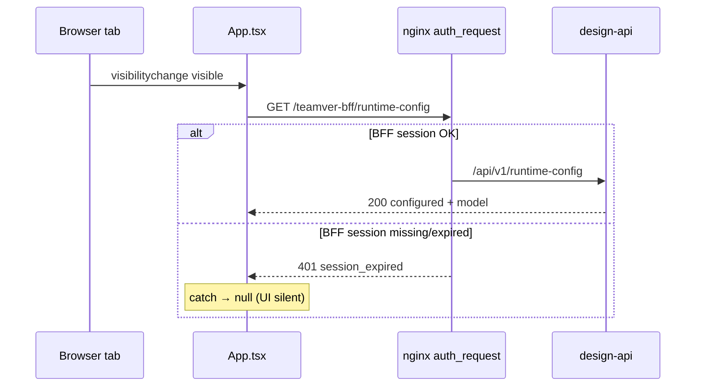

# runtime-config visibility 401 정리

**목적:** embed에서 `GET /teamver-bff/runtime-config` 가 탭 focus마다 `401 {"detail":"session_expired"}` 로 Network에 반복 찍히는 현상의 원인·대안 비교·채택안 SSOT.

**관련**

| 문서 | 역할 |
|------|------|
| [36 BFF auth/refresh 401](./36_BFF_auth_refresh_401_정리.md) | 불필요 `POST /auth/refresh` 억제 — **별개 증상** |
| [30 embed home boot API](./30_embed_home_boot_API_최적화.md) | boot 중복·숨김 API 억제 |
| [10 세션·OD패치](./10_세션·OD패치_보강.md) | BFF 세션·cold start |
| design-api `GET /api/v1/runtime-config` | 서버 managed API mode (모델·프로토콜·`apiKeyConfigured`) |

**코드 SSOT**

- `apps/web/src/teamver/designBffClient.ts` — `fetchTeamverRuntimeConfig`
- `apps/web/src/teamver/applyTeamverRuntimeConfig.ts` — merge / reload
- `apps/web/src/App.tsx` — `pageshow` / `visibilitychange` reload
- `apps/web/src/teamver/teamverEmbedSessionBoot.ts` — boot 후속 fetch
- nginx `teamver-design-od-bff.inc.conf` — `/teamver-bff/*` → `auth_request` → `@teamver_od_bff_unauthorized` → `401 session_expired`

---

## 1. 증상

```text
GET https://stg-design.teamver.com/teamver-bff/runtime-config
→ 401 Unauthorized
{"detail":"session_expired"}
```

- **주기적**으로 보이지만 `setInterval` 폴링이 아님.
- 탭을 다시 보거나(`visibilitychange`), bfcache 복귀(`pageshow`)할 때마다 FE가 reload를 시도한다.
- BFF 세션 쿠키가 없거나 만료된 상태면 nginx `auth_request`가 본 API에 도달하기 전에 401을 반환한다.
- FE는 catch로 `null`을 삼키므로 UX는 조용하지만 **DevTools Network에는 401이 계속 남는다**.

---

## 2. 왜 이 API가 존재하는가

| 질문 | 답 |
|------|----|
| 굳이 호출해야 하나? | **boot·workspace 전환·재로그인 직후는 필요.** managed API mode의 모델/프로토콜/`apiKeyConfigured`를 design-api가 내려준다. 브라우저에 `apiKey`는 내려주지 않는다(P0 보안). |
| 인증이 필요한가? | **예.** 과거 평문 key 노출 사고 이후 authenticated-only. |
| focus마다 필요한가? | **운영 편의(키/모델 로테이션 반영)일 뿐, 세션이 죽은 뒤에는 무의미.** |

---

## 3. 원인 분해



1. **의도된 reload 훅** — `App.tsx`가 sleep/standby/백그라운드 복귀와 BE env 로테이션을 위해 focus마다 `reloadTeamverRuntimeConfig()` 호출.
2. **짧은 클라이언트 캐시** — `RUNTIME_CONFIG_CACHE_MS = 60s`. 60초 넘긴 focus는 다시 네트워크.
3. **세션 부재와 무관한 재시도** — 로그아웃·세션 만료·Main/Design 세션 분리 이후에도 focus 핸들러가 동일하게 호출.
4. **boot 비인증 경로** — `runTeamverEmbedSessionBoot`가 unauthenticated 분기 후에도 `fetchTeamverRuntimeConfig()`를 호출해, 로그인 전 cold boot에서도 401이 날 수 있었음.

`POST /auth/refresh` 401([36](./36_BFF_auth_refresh_401_정리.md))과 **같은 Network 노이즈 계열**이지만 엔드포인트·트리거가 다르다.

---

## 4. 대안 비교

| ID | 방안 | 효과 | 장점 | 단점 | 판정 |
|----|------|------|------|------|------|
| **A** | endpoint 공개(auth 제거) | 401 소멸 | Network 깨끗 | managed 설정·존재 여부 노출, 과거 key 사고와 정책 충돌 | ❌ |
| **B** | focus reload **완전 제거** | 주기 401 소멸 | 단순 | 모델/키 로테이션·장시간 탭 복귀 시 재로드 필요 | △ 보조만 |
| **C** | **세션 가드** — `isTeamverEmbedSessionAuthenticated()===false` 이면 HTTP 생략 | 비로그인·명시 로그아웃 후 401 차단 | 기존 embed 세션 SSOT 재사용, 추가 RTT 없음 | 플래그가 stale `true`인 채 쿠키만 죽은 경우엔 한 번은 401 | ✅ 필수 |
| **D** | **401 백오프** — 한 번 `session_expired`면 재인증 전까지 opportunistic fetch 금지 | stale 세션 플래그·만료 쿠키에도 Network 반복 차단 | [36] refresh 억제와 대칭 | force/재로그인 시 플래그 해제 필요 | ✅ 필수 |
| **E** | visibility 핸들러에서만 세션 체크 (App.tsx only) | 일부 완화 | 한 줄 수정 | boot·다른 caller는 그대로 401 | △ 불충분 alone |
| **F** | 캐시 TTL 대폭 연장(예: 1h) | 빈도↓ | 간단 | 세션 죽으면 여전히 주기 401, 로테이션 지연 | △ 보조 |
| **G** | 서버 304 / ETag | 대역↓ | — | **인증 실패는 304 전에 401** — 본 문제 미해결 | ❌ |

### 채택: **C + D** (+ E를 defense-in-depth)

- **C**로 “세션 없다고 아는” 구간의 불필요 호출을 막는다.
- **D**로 “세션 있다고 착각하지만 쿠키는 죽은” 구간에서 401이 **한 번 이상 반복**되지 않게 한다.
- **E**로 App focus 경로를 이중 차단한다.
- **B/F**는 로테이션 UX를 해치거나 근본 원인을 남기므로 1차 채택에서 제외. 필요 시 TTL만 소폭 조정 가능.

**의도적으로 유지하는 호출**

| 시점 | force | 조건 |
|------|-------|------|
| embed boot (authenticated) | false | 세션 확정 후 |
| workspace switch / session restored | true | authenticated |
| pageshow/visibility | false | authenticated **and** not auth-blocked |

---

## 5. 구현 요약

### 5.1 `fetchTeamverRuntimeConfig` (SSOT)

1. embed이고 `!isTeamverEmbedSessionAuthenticated()` → **네트워크 없이** `null`(또는 유효 캐시만, 재검증 없음).
2. `runtimeConfigAuthBlocked && !force` → 네트워크 생략.
3. HTTP 성공 → `runtimeConfigAuthBlocked = false`, 캐시 갱신.
4. `NetworkError` status `401` → `runtimeConfigAuthBlocked = true`, `null`.
5. 백오프 해제:
   - `setTeamverEmbedSessionAuthenticated(true)` (이미 true여도 해제 — stale true + 죽은 쿠키 복구).
   - cross-tab `embed-session-changed` authenticated=true 릴레이 (재broadcast 없이 `clearTeamverRuntimeConfigAuthBlock`만).

### 5.2 `App.tsx` visibility

```ts
if (document.visibilityState !== "visible") return;
if (!isTeamverEmbedSessionAuthenticated()) return;
void reloadTeamverRuntimeConfig();
```

### 5.3 boot

`runTeamverEmbedSessionBoot`는 **authenticated 분기에서만** `fetchTeamverRuntimeConfig()`를 호출한다. unauthenticated boot는 login redirect 후 `null` — `/runtime-config` 401을 만들지 않는다. `fetchTeamverRuntimeConfig` 세션 가드는 다른 caller용 belt-and-suspenders.

---

## 6. 검증

- unit: `tests/teamver-runtime-config-auth-gate.test.ts`
  - unauthenticated → http.get 미호출
  - 401 이후 재호출 생략
  - `setTeamverEmbedSessionAuthenticated(true)` 후 재개
- staging Network:
  - 로그아웃아웃(또는 BFF 쿠키 삭제) 후 탭 전환 반복 → `/runtime-config` 401이 **반복되지 않음**(최대 1회 후 침묵 또는 0회).
  - 재로그인 후 boot/workspace → `200` + `configured`/`model`.
  - 정상 세션에서 탭 복귀 → 60s 캐시 내 재요청 없음, 만료 후 200.

---

## 7. 운영 노트

- Network에 `/runtime-config` 401이 **한 번** 보이는 것은 세션이 방금 죽은 직후일 수 있다. **반복**이면 본 패치 미적용 또는 다른 탭/구버전 번들.
- Drive `403 error.forbidden` / exchange `405` 와 혼동하지 말 것 — 각각 ACL·nginx HA 이슈([41](./41_Design_Drive_인증_계약_권고.md), staging http.conf).
- Main 로그아웃이 Design BFF를 즉시 지우지 않는 것은 **의도된 Apps 캐시 설계**(CTO). 그 상태에서 focus reload가 401을 찍던 것이 본 이슈의 흔한 재현이다.

---

## 변경 이력

| 날짜 | 내용 |
|------|------|
| 2026-07-16 | 증상·대안 비교·C+D 채택·구현 SSOT 기록 |
