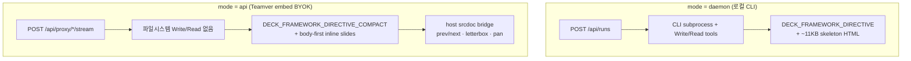

# body-first compact deck — 아키텍처 검토 및 0716 이후 변경 판단 SSOT

**작성:** 2026-07-23  
**범위:** Teamver embed slide-only MVP (`staging`) — API/BYOK 경로 중심  
**목적:** “왜 body-first인가?”, “0716 이후 수정이 맞는가?”, “무엇을 유지·개선·롤백할 것인가?”를 **나중에 다시 볼 수 있도록** 한 문서에 고정한다.

**관련 SSOT (읽는 순서 권장):**

| 순서 | 문서 | 역할 |
|------|------|------|
| 1 | [29 BYOK api mode vs runs](./29_BYOK_api_mode_vs_runs_아키텍처.md) | embed가 `POST /api/runs`를 쓰지 않는 이유 |
| 2 | [46 embed 슬라이드 품질 원인분석](./46_embed_슬라이드_품질_원인분석_개선로드맵.md) | 품질 trade-off·Phase 1~3 로드맵 |
| 3 | **이 문서 (47)** | body-first 결정·0716 이후 변경 판단·유지/롤백 매트릭스 |
| 4 | [00 구현 내역 누적](./00_구현_내역_누적.md) | 날짜별 커밋·검증 기록 |

---

## 0. 한 줄 결론 (바쁠 때)

| 질문 | 답 |
|------|-----|
| body-first를 왜 쓰나? | API/BYOK 단일 스트리밍에서 full skeleton(~11KB)을 prompt에 넣으면 모델이 `<head>`/CSS/JS를 먼저 쓰다 `</html>` 전에 끊겨 `incomplete_output`이 반복됐기 때문 |
| 좋은 방법인가? | **embed API 제약 안에서는 합리적 trade-off.** 완료율 우선; 시각 풍부함은 Phase 1(레이아웃 어휘·DS·template signature)으로 보완 |
| 0716 전체 롤백? | **비권장.** UX 버그 수정·recovery·preview 스코핑은 유지. full skeleton API 복귀는 truncation 재발 위험으로 **금지** |
| 근본 해법은? | 중기: daemon이 proxy를 run으로 감싸 full framework + Write tool 경로 복원 ([29 §근본 fix](./29_BYOK_api_mode_vs_runs_아키텍처.md)) |

---

## 1. 배경 — 0716 vs 현재 staging

### 1.1 2026-07-16(0716) 기준 “정상”이었던 것

운영·내부 테스트에서 0716 전후 embed 슬라이드 생성이 비교적 안정적이었던 시점의 특징:

- Quick brief(question-form)가 turn-1에 표시되고, turn-2에서 덱이 생성됨
- 선택한 템플릿(simple-deck 등)의 **시각적 정체성**이 생성물에 비교적 잘 반영됨
- prev/next 미리보기가 동작 (또는 full framework 덱의 nav가 내장)

### 1.2 0716 이후 사용자·운영이 체감한 회귀

| 증상 | 대표 원인 축 |
|------|----------------|
| `incomplete_output` / 빈 미리보기 | head-only shell, truncation, strict deliverable 판정 + auto-continue 루프 |
| Quick brief 미표시 / 파싱 실패 | lean prompt + question-form JSON 오염 |
| 미리보기가 HTML 스크롤처럼 보임 | compact `section.slide` + `min-height:100vh` + bridge 미적용 |
| **품질 저하** (인라인·단순 덱) | **compact API prompt** — full template/skill seed 복사 경로 차단 |
| Deliverable directive가 사용자 메시지에 노출 | `ProjectView` slide-only 첫 메시지 directive |

**중요:** upstream OD `main` 전체 merge가 직접 원인은 **아님** ([40 OD upstream 반영 검토](./40_OD_upstream_main_반영_검토.md), [46 §3.1](./46_embed_슬라이드_품질_원인분석_개선로드맵.md)).

### 1.3 production vs staging (2026-07-21 메모)

- 2026-07-21: slide 생성 장애 시 production은 **0716 기준으로 우선 복구**, staging에는 hotfix 누적.
- 문서 권고: hotfix를 더 쌓지 말고, 실패가 반복되면 `ProjectView` 생성 경로 **파일 단위 rollback** ([00 §2026-07-21](./00_구현_내역_누적.md)).
- **2026-07-23 판단:** staging의 compact + recovery + preview 스코핑이 안정화됐으므로 **전체 파일 롤백은 불필요**. 선택적 UX만 0716과 A/B 비교.

---

## 2. 아키텍처 — 두 가지 덱 계약

Teamver embed와 OD desktop은 **같은 “슬라이드” 제품**이지만 **실행 경로가 다르다**.



### 2.1 Full framework 경로 (daemon / desktop)

| 항목 | 내용 |
|------|------|
| Prompt | `DECK_FRAMEWORK_DIRECTIVE` + `DECK_SKELETON_HTML` (~11KB) |
| 모델 역할 | skeleton **verbatim 복사** 후 SLOT 채우기 |
| Nav/scale/print | 덱 HTML 내부 `<script>` + `@media print` |
| 코드 | `packages/contracts/src/prompts/deck-framework.ts` |
| 적합한 이유 | daemon이 Write tool로 파일을 쓰고, 여러 턴에 걸쳐 SLOT을 채울 수 있음 |

### 2.2 Compact body-first 경로 (embed API)

| 항목 | 내용 |
|------|------|
| Prompt | `composeTeamverSlideApiPrompt()` + `DECK_FRAMEWORK_DIRECTIVE_COMPACT` |
| 모델 역할 | **visible slide body 먼저**, no-head static shape 우선 |
| Artifact | `<artifact type="deck">` (not `text/html`) |
| Nav/scale | 호스트 `injectDeckBridge` + `compact-api-stacked-deck` (compact만) |
| 코드 | `packages/contracts/src/prompts/system.ts`, `apps/web/src/runtime/srcdoc.ts` |
| 적합한 이유 | 단일 스트리밍 응답에서 출력 토큰을 **슬라이드 콘텐츠**에 써야 `</html>`까지 도달 |

### 2.3 body-first가 필요한 실패 메커니즘 (재현 가능한 시나리오)

1. API prompt에 full skeleton 또는 `<head><style>` 예시가 포함됨
2. 모델이 artifact를 열고 CSS/JS/chrome을 먼저 스트리밍
3. `max_tokens` 또는 스트림 종료 시점에 `</html>` 미도달
4. `isIncompleteHtmlDocumentShell()` → persist 거부 → `incomplete_output`
5. auto-continue cap(기본 3회) 소진 → emergency deck 또는 수동 재시도

**관측된 shell 크기:** ~40바이트 (`<!doctype html><html><head>` 수준) — [00 §2026-07-21 incomplete HTML shell](./00_구현_내역_누적.md).

---

## 3. body-first compact contract 상세

### 3.1 산출물 형태 (정상)

compact API 덱의 **의도된** 특징:

- `artifact type="deck"` — Teamver 계약 ([60dcaa9ef](https://github.com/NeuralStudioKr/ns-open-design) 계열)
- `<!doctype html><html><body>` — `<head>` 생략 가능 (no-head static shape)
- `section.slide` + **인라인 style** + `min-height:100vh`
- full framework의 scale-to-fit JS, print CSS, deck-counter **없음**
- 호스트가 prev/next, 16:9 letterbox, pan/zoom 제공 (`looksLikeCompactApiStackedDeck`)

**이 형태 자체는 버그가 아니라 현재 API contract의 설계 결과** ([46 §3.2](./46_embed_슬라이드_품질_원인분석_개선로드맵.md)).

### 3.2 prompt 스택 (embed API)

`composeTeamverSlideApiPrompt()` 조립 순서 (요약):

1. `API_MODE_OVERRIDE` + `TEAMVER_SLIDE_ONLY_SCOPE`
2. turn-1: `TEAMVER_SLIDE_ONLY_FIRST_TURN_OVERRIDE` (한국어 quick brief JSON)
3. design system / metadata / pluginBlock
4. **Selected template visual signature** (HTML 전체 복사 대신 palette·font·class cue)
5. **API-safe skill summary** (`summarizeApiModeSkillBody` — template Read/복사 지시 제거)
6. `DECK_FRAMEWORK_DIRECTIVE_COMPACT`
7. **READ LAST:** unified/direct streaming rule (body-first, `type="deck"`)

### 3.3 slideCount 정책 (2026-07-23 정합)

SSOT 상수: `COMPACT_DECK_SLIDE_COUNT_GUIDANCE` (`deck-framework.ts`)

```
Honor slideCount (Project metadata / Plugin inputs), quick-brief `scale`, or an explicit user count;
use 6–8 slides only when none is specified.
```

| 소스 | 우선순위 |
|------|----------|
| Plugin inputs `slideCount` | 높음 |
| Quick brief `scale` (예: "8~10장") | 높음 |
| 사용자 메시지 명시 | 높음 |
| 미지정 시 fallback | 6–8장 |

**주의:** Home footer의 `6-8 pages`는 **placeholder**일 뿐; 실제 생성은 brief/plugin/user 입력을 따른다 (`dfcc37805`, `fd56a5208`).

**auto-continue recovery (2026-07-23):** `extractRequestedSlideCountHintFromMessages()`가 plugin inputs / form answers / 사용자 메시지에서 장수를 복구해 `buildAutoContinueIncompleteOutputPrompt()`에 `[이 대화의 슬라이드 분량 — 반드시 준수:]` 블록으로 주입한다 (`52942affa`). cap 소진 직전에도 brief에 `12장`이 있으면 generic 6–8로 덮어쓰지 않는다.

---

## 4. 0716 이후 변경 — 커밋 타임라인·판단 매트릭스

### 4.1 타임라인 (staging, 2026-07-16 ~ 2026-07-23)

```
[품질·계약 전환]
fb216ed22  dedicated lean API prompt (composeTeamverSlideApiPrompt)
8eeaed882  Phase 1 compact deck quality prompt
3d67c6172  Phase 1 review — align prompts, dead code removal
2ab9ac7bd  docs: 46 embed 슬라이드 품질 원인분석

[UX·워크플로]
e94430cd6  Quick brief when question-form JSON fails
88390d79b  keep quick brief out of deck artifacts
0f17e6d33  prev/next for stacked section.slide decks
1f63245b3  stop appending deliverable text to user messages

[미리보기·bridge]
16928e300  letterbox compact API decks to 16:9
1a9e89790  scope letterbox to compact API decks only
50b5222b2  restore prev/next after flex !important regression
40f84ed35  deck preview pan, center zoom, compact typography

[완료율·recovery]
8e08d48ed  recover incomplete_output (stale HTML, auto-continue cap)
57b36c6c5  slide-deliverable-recovery SSOT
808a99758  preserve attachment refs during deck recovery

[템플릿·품질 보강]
edceabc33  restore compact deck quality hints
02dfbd195  compact template visual signature
e8c71edc5  enforce selected deck template cues
966f8bd75  prioritize selected template over compact samples
7f2ff943a  plugin-local SKILL.md into API-mode prompts
f371954c3  canvas slide template through skillIds

[slideCount·정합]
dfcc37805  honor user-selected slide counts (not hardcode 6-8)
fd56a5208  auto-continue slide count aligns with COMPACT_DECK_SLIDE_COUNT_GUIDANCE
```

### 4.2 유지 (롤백 금지)

| 변경군 | 이유 |
|--------|------|
| body-first + `DECK_FRAMEWORK_DIRECTIVE_COMPACT` | `incomplete_output` 근본 원인 제거 |
| `artifact type="deck"` | Teamver 산출물 계약 |
| `composeTeamverSlideApiPrompt` | discovery + full charter + seed copy 충돌 해소 |
| Quick brief / question-form persist 차단 | turn-1이 deck.html로 저장되는 회귀 방지 |
| stacked deck prev/next + compact-only letterbox | UX + legacy framework 덱 보호 |
| `slide-deliverable-recovery.ts` | reload/BYOK/cap 소진 복구 |
| Phase 1 layout vocabulary + template signature | full skeleton 없이 품질 보완 |
| plugin SKILL.md + canvas skillIds | 0716 템플릿 충실도 회복 통로 |
| `COMPACT_DECK_SLIDE_COUNT_GUIDANCE` | 사용자/플러그인/brief 장수 존중 |

### 4.3 유지하되 단순화·관측 필요

| 변경군 | 판단 | 후속 |
|--------|------|------|
| auto-continue 3회/cap | 필요하지만 복잡 | body-first 안정 후 cap 소진 빈도 모니터링 |
| emergency deck fallback | cap 소진 시 최소 미리보기 | 품질 낮음 — 로그로 빈도 추적 |
| visual signature 추출 | prompt budget 18k 이내 | A/B로 template별 반영도 측정 |
| 이중 경로 (daemon vs API prompt) | 구조적 부채 | daemon이 contracts composer 재사용 검토 |

### 4.4 롤백·금지 목록

| 항목 | 판단 |
|------|------|
| full `DECK_FRAMEWORK_DIRECTIVE`를 API prompt에 복귀 | **금지** — truncation 재발 |
| upstream `main` 전체 merge | **금지** |
| 0716 `ProjectView` 생성 경로 전체 rollback | **현 시점 비권장** — hotfix가 이미 안정화 |
| compact를 버리고 daemon-only로 embed 전환 | **불가** — embed에 CLI 없음 |

---

## 5. 품질 trade-off — 왜 0716이 “더 예뻤나”

| 0716 (상대적) | 현재 compact |
|---------------|--------------|
| skill `assets/template.html` + layouts.md Read/복사 유도 | API-safe summary + inline layout vocabulary |
| full CSS/JS framework in deck | 인라인 style, host bridge |
| template seed가 곧 시각 계약 | visual signature + DS tokens + skill rhythm |
| daemon tool로 여러 턴 SLOT 채우기 가능 | **단일 스트리밍 턴**에 완결 덱 필요 |

**1~2분에 6~8장 완료**는 compact 하에서 **정상** — “AI가 일을 안 한 것”이 아님 ([46 §2](./46_embed_슬라이드_품질_원인분석_개선로드맵.md)).

품질 개선 축 (full skeleton 복귀 **없이**):

1. **P1 layout vocabulary** — cover/body/big-stat/split/timeline/quote/closing (`DECK_COMPACT_INLINE_LAYOUT_VOCABULARY`)
2. **template visual signature** — palette, font-family, class cue (`renderTeamverTemplateVisualSignature`)
3. **quick-brief binding** — audience/tone/must_include/scale turn-2 필수 반영
4. **design system mandatory** — inline style에 token bind
5. **plugin-local SKILL.md** — embed API prompt gap 해소 (`fetchPluginLocalSkill`)

---

## 6. 코드·파일 인덱스

| 파일 | 역할 |
|------|------|
| `packages/contracts/src/prompts/deck-framework.ts` | `DECK_FRAMEWORK_DIRECTIVE` vs `_COMPACT`, `COMPACT_DECK_SLIDE_COUNT_GUIDANCE` |
| `packages/contracts/src/prompts/system.ts` | `composeTeamverSlideApiPrompt`, streaming rules, skill 요약 |
| `apps/web/src/components/ProjectView.tsx` | artifact persist, deliverable, recovery orchestration |
| `apps/web/src/runtime/slide-deliverable-recovery.ts` | terminal/reload recovery SSOT, reference·slideCount 복구 |
| `apps/web/src/runtime/resume.ts` | auto-continue prompts (cap, sentinel) |
| `apps/web/src/runtime/compact-api-stacked-deck.ts` | compact 덱 감지 (letterbox 대상 한정) |
| `apps/web/src/runtime/srcdoc.ts` | deck bridge, `injectDeckBridge` |
| `apps/web/src/teamver/canvasSlideLaunch.ts` | Canvas → 슬라이드 compact deliverable hint |
| `apps/web/src/teamver/fetchPluginLocalSkill.ts` | API mode plugin SKILL.md 로드 |
| `design-templates/simple-deck/references/layouts.md` | full 경로 레이아웃 SSOT (API는 축약본 주입) |

---

## 7. 검증 명령

```bash
# contracts — API prompt + compact contract
pnpm --filter @open-design/contracts exec vitest run \
  tests/system-prompt-api-mode.test.ts \
  tests/deck-framework-compact.test.ts

# web — recovery, preview, canvas, message load
pnpm --filter @open-design/web exec vitest run -c vitest.config.ts \
  tests/runtime/slide-deliverable-recovery.test.ts \
  tests/runtime/compact-api-stacked-deck.test.ts \
  tests/runtime/resume.test.ts \
  tests/teamver-canvas-slide-launch.test.ts \
  tests/project-view-message-load.test.ts
```

**staging 배포 후 수동 체크리스트:**

1. 새 프로젝트 → Quick brief → turn-2 deck (`artifact type="deck"`)
2. prev/next, letterbox, pan/zoom (compact 덱)
3. 사용자 지정 장수 / plugin slideCount / brief `scale` 반영
4. 선택 템플릿 visual identity (0716 A/B)
5. `incomplete_output` / emergency deck / auto-continue 회귀
6. Canvas → 슬라이드: source brief 반영, HTML 복사본이 아닌 새 deck

---

## 8. 장기 로드맵 (body-first 유지 전제)

| 단계 | 내용 | 문서 |
|------|------|------|
| 단기 (현재) | Phase 1 prompt + recovery + preview 스코핑 | [46](./46_embed_슬라이드_품질_원인분석_개선로드맵.md) |
| 중기 | daemon이 BYOK proxy를 **run으로 감싸** full framework + tool 경로 | [29 §근본 fix](./29_BYOK_api_mode_vs_runs_아키텍처.md) |
| 장기 | embed에서도 runs lifecycle + sync-up SSOT 단일화 | [16 S3 저장 시점](./16_S3_데이터_저장_시점_SSOT.md), [27 Persist PUT](./27_메시지_Persist_PUT_아키텍처.md) |

---

## 9. 의사결정 기록 (2026-07-23)

| 결정 | 근거 |
|------|------|
| **body-first compact 유지** | embed API truncation 데이터가 full skeleton 복귀보다 강함 |
| **전체 롤백 거부** | UX/recovery/preview 수정은 0716에 없던 필수 보강 |
| **품질은 Phase 1으로** | template signature·layout vocabulary·brief binding |
| **auto-continue slideCount SSOT 정합** | `fd56a5208` — recovery도 `COMPACT_DECK_SLIDE_COUNT_GUIDANCE` 사용 |
| **이 문서(47)를 SSOT로 고정** | 재검토 시 46(로드맵) + 47(판단) + 00(커밋) 순으로 읽기 |

---

## 10. 변경 이력

| 날짜 | 내용 |
|------|------|
| 2026-07-23 | 초판 — body-first 결정 배경, 0716 이후 타임라인·유지/롤백 매트릭스, 코드 인덱스, 검증·장기 로드맵 |
