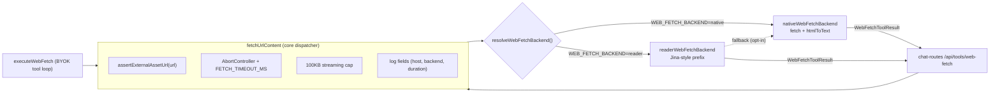

# 48-1 구현설계 — daemon `web_fetch` backend adapter

**문서 번호:** 48-1  
**작성:** 2026-07-27 (KST)  
**상위 SSOT:** [48 웹 fetch 외부화 OpenAI 검토 ADR](./48_웹_fetch_외부화_OpenAI_검토_ADR.md) §5 ADR (O2) “계약 유지 + backend 교체”  
**대상 코드:** `apps/daemon/src/byok-url-tools.ts`, `apps/daemon/src/chat-routes.ts`, `apps/daemon/src/byok-tools.ts`  
**대상 브랜치:** `feat/web-fetch-adr` (base: `origin/staging`)  
**상태:** In progress — Phase B (설계 확정 · Phase C 진입 대기)

---

## 1. 목표 / Non-goals

### 목표
1. Design daemon의 `fetchUrlContent`를 **backend 교체 가능한 dispatcher** 구조로 리팩터한다.
2. Backend 하나만 있어도 (`native`) 기존 동작이 완전히 보존된다 — Phase C 로 무동작 리팩터가 끝난다.
3. Reader SaaS 스타일 adapter (`reader`) 를 신설해서 **원본 URL 대신 reader endpoint 로 outbound** 하는 경로를 열어 둔다.
4. env 스위치로 **런타임에** backend 를 선택 (`WEB_FETCH_BACKEND=native|reader`). staging 은 기본 `native` 유지 — 이번 PoC 는 코드 병합만 하고 실환경 스위치는 별도 ops task 로 남긴다.
5. `reader` 가 5xx / timeout 이면 optional `WEB_FETCH_READER_FALLBACK_TO_NATIVE=1` 로 native 1회 fallback 가능하게 한다. (기본 off — silent degrade 를 강요하지 않음.)

### Non-goals (이번 PoC 밖)
- reader SaaS 실계약 · 과금 · prod key 배포 (별도 ops task)
- Managed Anthropic / Gemini vendor `web_search` tool loop (Phase 3)
- Main BFF 통합 (Phase 4)
- OpenAI Responses API `web_search` route 신설 (기각된 O1 의 부분 옵션)
- daemon 외부 (`ns-teamver-be`, `ns-teamver-fe-v2`) 코드 변경

---

## 2. 불변식 (adapter 리팩터에서 절대 깨지면 안 되는 것)

| # | 불변식 | 검증 지점 |
|---|--------|------------|
| I1 | `POST /api/tools/web-fetch` 요청 body(`{ url }`) · 응답 shape(`WebFetchToolResult`) · error envelope(`sendApiError('WEB_FETCH_FAILED', ...)`)  | `apps/daemon/src/chat-routes.ts:101-113` |
| I2 | BYOK tool loop `executeWebFetch(args, ctx)` public signature | `apps/daemon/src/byok-tools.ts:482-492` |
| I3 | `<web-fetch-context>` XML shape · 삽입 위치 · truncation 표기 | chat-routes 프리페치 경로 (기존) |
| I4 | **SSRF 는 항상 원본 URL 에 대해** `assertExternalAssetUrl` 통과 후에만 outbound 발생 | `byok-url-tools.ts:99` → 신규 `web-fetch/core.ts` 로 이동 |
| I5 | 100KB post-fetch cap · 12s timeout · **safe redirect follow** (`redirect: 'manual'`, max 3 hops, per-hop SSRF — [48-2](./48-2-웹_fetch_native_redirect_apex_www_이슈.md)) · UA `TeamverDesignBot/1.0` | core dispatcher; hop logic in native backend |
| I6 | 실패 시 예외를 던지지 않고 `{ ok: false, error }` 반환 | 모든 backend + core |
| I7 | `apps/daemon/tests/byok-url-tools.test.ts` 무수정 통과 | Phase C 종료 조건 |

> Phase C 는 **native-only 리팩터** 이며, 이 시점에서 I1~I7 이 모두 유지되지 않으면 Phase D 진행 금지.

---

## 3. 아키텍처



### 3.1 책임 분리

| Layer | 책임 | 파일 |
|-------|------|------|
| **Public API** | `fetchUrlContent(rawUrl, requestInit?)` — 시그니처 그대로. | `apps/daemon/src/byok-url-tools.ts` (thin re-export) |
| **Core dispatcher** | 입력 validation · **SSRF (원본 URL)** · timeout · streaming cap · backend 선택 · fallback · 로그 · error 정규화 | `apps/daemon/src/web-fetch/core.ts` (신규) |
| **Backend interface** | 하나의 원본 URL 을 받아 raw bytes/text + metadata 반환 (cap/timeout 은 core 가 감쌈) | `apps/daemon/src/web-fetch/backend.ts` |
| **Native backend** | 기존 `fetch` + `htmlToText` 로직 이동, 동작 무변 | `apps/daemon/src/web-fetch/native-backend.ts` |
| **Reader backend** | reader endpoint 로 outbound, 이미 stripped text 를 반환하므로 htmlToText 스킵 | `apps/daemon/src/web-fetch/reader-backend.ts` (Phase D) |
| **Select** | env 파싱 · backend factory · fallback flag | `apps/daemon/src/web-fetch/select.ts` (Phase D) |

> `byok-url-tools.ts` 는 **breaking 회피용 shim** 만 남긴다 (`export { fetchUrlContent } from './web-fetch/core.js'; export type { WebFetchToolResult } from './web-fetch/types.js';`). Phase C 커밋 diff 를 크게 만들지 않기 위해 초기에는 파일 자체를 이동하지 않고 내부 구현만 `web-fetch/` 하위로 이관.

### 3.2 Backend interface

```ts
// apps/daemon/src/web-fetch/backend.ts (신규)
export interface WebFetchBackendCtx {
  /** SSRF-검증이 끝난 원본 URL. backend 는 다시 검증하지 않는다. */
  readonly url: string;
  /** core 에서 관리되는 abort signal. backend 는 이 signal 을 outbound fetch 에 그대로 전달. */
  readonly signal: AbortSignal;
  /** BYOK tool loop 경로에서 전달되는 undici dispatcher 등 optional init. */
  readonly requestInit?: Pick<RequestInit, 'dispatcher' | 'signal'>;
}

export interface WebFetchBackendResult {
  ok: boolean;
  /** UTF-8 text. reader backend 는 여기에 이미 stripped markdown 을 넣는다. */
  text?: string;
  /** 원본 HTML 이 넘어온 경우에만 채운다. core 가 이 flag 로 htmlToText 를 돌릴지 결정. */
  isHtml?: boolean;
  /** 문서 title (backend 가 알 수 있으면 채우고, 없으면 core 가 htmlToText 결과에서 추출). */
  title?: string;
  /** truncation 은 core streaming cap 에서 판단하는 것이 원칙이지만,
   *  backend 가 자체적으로 truncate 한 경우 이 flag 로 알린다. */
  truncated?: boolean;
  error?: string;
}

export interface WebFetchBackend {
  readonly name: 'native' | 'reader';
  fetchOnce(ctx: WebFetchBackendCtx): Promise<WebFetchBackendResult>;
}
```

### 3.3 Native backend

- 기존 `fetchUrlContent` 의 fetch/streaming 로직을 그대로 이동.
- **주의:** streaming cap 을 native backend 안에서 계속 돌리되, `WebFetchBackendResult.truncated` 로 core 에 노출한다 (core 는 backend-agnostic 하게 100KB 이하로 잘라내는 fail-safe 를 한 번 더 적용).
- SSRF/UA/timeout 관련 로직은 이미 core 로 옮겨졌으므로 native 는 **원본 URL 로 GET, safe redirect follow (아래), body 스트리밍** 만 수행.

#### 3.3.1 Redirect policy (2026-07-28 갱신)

**배경:** 이전 구현은 SSRF 방어를 위해 `redirect: 'error'` 를 설정했다 (`connectionTest.ts` 주석 §"pair with redirect: 'error' to also block a 3xx hop into private space"). 이 결정은 apex 도메인 하나만 입력해도 `neuralstudio.kr → www.neuralstudio.kr` 같은 정상 리다이렉트조차 즉시 실패시키는 부작용을 낳았다 (staging 실측).

**정공법:** `redirect: 'manual'` 로 바꾸고 **매 hop 마다 SSRF 를 재검증**한다 — attacker 원본이 3xx 로 loopback/RFC1918/link-local/metadata IP 로 hop 하려 해도 `assertExternalAssetUrl` 이 매 hop 마다 재차 거부한다. 표준 curl/wget/browser 정책과 동일:

| 항목 | 값 | 근거 |
|------|-----|------|
| `MAX_REDIRECT_HOPS` | `3` | 정상 케이스 (apex→www, http→https) 는 1–2 hop. 3 이면 apex→www→login 도 커버. 5+ 는 tracking 이라 오히려 위험 |
| 매 hop `assertExternalAssetUrl` | ✅ | DNS resolve → loopback/RFC1918/link-local/metadata IP 차단. SSRF 방어 재현 |
| http → https upgrade | ✅ 허용 | 안전성 향상 |
| https → http downgrade | ❌ 거부 | TLS 유출 방지 · `curl --proto-redir =https` 와 동일 |
| Non-http(s) scheme (`ftp://`, `data:`) | ❌ 거부 | 스킴 확장 통한 공격 벡터 차단 |
| Cross-origin | ✅ 허용 | CDN/vanity domain 정상 케이스가 대부분. 안전성은 per-hop SSRF 로 확보 |
| 검증 순서 | (1) scheme, (2) **SSRF**, (3) downgrade | SSRF 가 가장 강력한 방어라 우선. attacker→metadata IP 는 스킴 무관하게 SSRF 로 attribution |
| `Location` 없는 3xx | ❌ 거부 | `redirect_malformed` |
| Cap 초과 (`hops > 3`) | ❌ 거부 | `redirect_max` |

**로그 필드:** `WebFetchBackendResult.hops` 에 "consumed 3xx 개수" 를 실어 보내고, core 의 `logWebFetchCall` 이 `hops > 0` 일 때만 `hops=N` 을 라인에 붙인다 (healthy default 는 노이즈 zero). 블록된 hop 도 카운트 — ops 대시보드는 "얼마나 hopping 했는가" 와 "성공/실패" 를 별개 축으로 관찰 가능.

**Error code buckets (`classifyErrorCode`):**

- `redirect_max` — cap 초과
- `redirect_blocked` — SSRF 재검증 실패 · downgrade · non-http(s) scheme
- `redirect_malformed` — Location 헤더 없음 · Location URL 파싱 실패

**Public API 영향:** 없음. `WebFetchToolResult` 에 `hops` 는 노출하지 않는다 (LLM/FE 는 볼 필요 없음). `<web-fetch-context>` 계약 무변.

**회귀:** `apps/daemon/tests/web-fetch-redirect.test.ts` (9 케이스, 33/33 pass).

### 3.4 Reader backend (Phase D)

- Configured `WEB_FETCH_READER_URL` (예: `https://r.jina.ai/`) 뒤에 **원본 URL 문자열을 append** 하여 outbound.
- `WEB_FETCH_READER_API_KEY` 가 있으면 `Authorization: Bearer <key>` 헤더 추가.
- 응답이 이미 markdown/plain 이므로 `isHtml: false` 로 반환 → core 가 htmlToText 를 skip.
- reader 자체의 rate-limit(429) 은 error 로 반환 (fallback flag 가 true 면 core 가 native 로 1회 재시도).
- reader outbound 는 **원본 URL 이 아닌 configured host** 로 나가므로 `assertExternalAssetUrl` 재검증 대상이 아님. 대신 `WEB_FETCH_READER_URL` 이 https 스킴이며 사설 IP 가 아님을 **부트 타임에** 검증 (`select.ts::validateReaderEndpoint`).

### 3.5 Select / fallback

```ts
// apps/daemon/src/web-fetch/select.ts (신규, Phase D)
export function resolveWebFetchBackend(env: NodeJS.ProcessEnv): {
  primary: WebFetchBackend;
  fallback: WebFetchBackend | null; // reader 이고 flag=1 일 때만 native
};
```

- 파싱 실패(예: `WEB_FETCH_BACKEND=reader` 인데 URL 미설정) 는 첫 `fetchUrlContent` 호출 시점(select 캐시 초기화 시)에 **`console.warn` 후 native fallback** — daemon 이 뜨는 걸 막지 않는다.
- 런타임 fallback 은 **최대 1회**, 최초 backend 가 `error` 를 반환한 경우에 한해서 발생. `console.warn('web_fetch.reader_fallback primary=<name> url_host=<host> error=<msg>')` 로그 후 native 재시도. 성공하면 최종 log line 에 `reader_fallback=1` 이 함께 붙는다.

---

## 4. Env schema (신설, daemon-only)

| 키 | 기본 | 상태 | 의미 |
|----|------|------|------|
| `WEB_FETCH_BACKEND` | `native` | ✅ 활성 | `native` \| `reader` — 미설정 시 `native` |
| `WEB_FETCH_READER_URL` | — | 🚫 정책 pending | reader base URL (Jina-style prefix; adapter 가 원본 URL 을 append) |
| `WEB_FETCH_READER_API_KEY` | — | 🚫 정책 pending | 있으면 `Authorization: Bearer <key>` |
| `WEB_FETCH_READER_TIMEOUT_MS` | `12000` | 🚫 정책 pending | reader 전용 timeout — core 의 12s 와 별개 |
| `WEB_FETCH_READER_FALLBACK_TO_NATIVE` | `0` | 🚫 정책 pending | `1` 이면 reader 실패 시 native 1회 재시도 |

**🚫 정책 pending (v1.2 — 2026-07-28):** `WEB_FETCH_READER_*` 계열 env 는 **staging/prod 어느 곳에도 세팅 금지**. 조직 정책상 새 SaaS 구독 (Jina/Firecrawl/Browserless 등 reader-계열) 이 금지되었기 때문 ([48 §5.1.1](./48_웹_fetch_외부화_OpenAI_검토_ADR.md#511-정책-갱신-v12--2026-07-28)). 코드 (`reader-backend.ts`, `select.ts` reader 분기) 는 dead-code 로 보존해 Phase 3 (vendor hosted `web_search`) 에서 재활용 후보로 유지. `.env.staging.example` 에는 강조 주석과 함께 예시만 남김.

---

## 5. 로그 (본문 미로그, host 만)

기존 daemon 로그 스타일(`console.log('web_fetch ...')`) 유지, 다음 키를 통일해서 찍는다. 실제 코드는 `apps/daemon/src/web-fetch/core.ts::logWebFetchCall`, 회귀는 `apps/daemon/tests/web-fetch-log.test.ts` 참조.

| 필드 | 값 | 언제 |
|------|----|------|
| `web_fetch.backend` | `native` \| `reader` \| `-` (SSRF pre-guard) | 요청 종료 |
| `url_host` | `new URL(url).host` (path/query 제외) | 요청 종료 |
| `duration_ms` | number | 요청 종료 |
| `status` | `ok` \| `error` | 요청 종료 |
| `text_bytes` | number | `status=ok` 시 |
| `truncated=1` | flag | 100KB cap 이 잘라낸 경우 |
| `error_code` | `timeout` \| `http_4xx` \| `http_5xx` \| `http_other` \| `network` \| `read_failed` \| `ssrf` \| `backend_bug` \| `unknown` | `status=error` 시 |
| `error` | backend 가 반환한 짧은 원문 (title/body 포함 없음) | `status=error` 시 |
| `reader_fallback=1` | flag | reader → native fallback 발동 후 최종 line 에 append |

예시:

```
web_fetch.backend=native url_host=example.com duration_ms=137 status=ok text_bytes=8213
web_fetch.backend=native url_host=example.com duration_ms=42 status=error error_code=http_4xx error=http 404 Not Found
web_fetch.backend=native url_host=example.com duration_ms=531 status=ok text_bytes=1024 reader_fallback=1
web_fetch.backend=- url_host=169.254.169.254 duration_ms=1 status=error error_code=ssrf error=Internal IPs blocked
```

Fallback 은 `console.warn('web_fetch.reader_fallback primary=<name> url_host=<host> error=<msg>')` 로 별도 라인이 하나 더 남는다.

> 본문/title/path/query 는 절대 로그로 남기지 않음 (개인정보 · PII · 저작권 노출 방지). backend 가 반환하는 error 문자열은 이미 짧고 body 를 포함하지 않는 계약이므로 verbatim 노출.

---

## 6. 에지 케이스 · 실패 분기

| 상황 | 기대 동작 |
|------|-----------|
| `url` 미지정 / 빈 문자열 | core 에서 즉시 `{ ok: false, error: 'url is required' }` — SSRF/backend 호출 없음 |
| `file://`, `ftp://`, `javascript:`, `data:` | core 에서 즉시 `{ ok: false, error: 'only http(s) URLs are supported' }` |
| SSRF 실패 (loopback, private ip 등) | core 에서 즉시 `{ ok: false, error: <assertExternalAssetUrl 메시지> }` — backend 호출 없음 |
| Native: DNS 실패 / connection reset | `{ ok: false, error: 'fetch failed: ...' }` |
| Native: timeout(12s 초과) | `{ ok: false, error: 'request timed out after 12000ms' }` |
| Native: HTTP 4xx/5xx | `{ ok: false, error: 'http <status> <statusText>' }` |
| Native: redirect (redirect: 'error') | `{ ok: false, error: 'fetch failed: ...' }` (기존 동작 유지) |
| Native: body > 100KB | `truncated: true`, text 는 잘려서 반환 |
| Reader: 4xx (unauthorized/paywall) | error 로 반환, fallback flag=1 이면 native 재시도, 아니면 그대로 실패 |
| Reader: 5xx / timeout / network | error 로 반환, fallback flag=1 이면 native 재시도 |
| Reader: 응답이 예상보다 큼 | core 의 100KB fail-safe cap 이 잘라냄 |
| Reader endpoint 자체가 사설/loopback | 부트 타임 `validateReaderEndpoint` 실패 → `WEB_FETCH_BACKEND` 값이 무엇이든 강제 `native` + warn 로그 |

---

## 7. 테스트 전략

### 7.1 기존 회귀 (Phase C 종료 조건)

- `pnpm --filter @open-design/daemon exec vitest run tests/byok-url-tools.test.ts` — **수정 없이** 전 케이스 통과.
- 이 파일의 3 케이스가 I4, I5, I6 을 모두 커버하므로 리팩터의 안전판 역할을 한다.

### 7.2 신규 (Phase D)

- `apps/daemon/tests/web-fetch-select.test.ts`
  - env 조합 4가지: (미설정) / `WEB_FETCH_BACKEND=native` / `=reader` + URL / `=reader` + URL 누락(fallback native + warn 스파이).
  - `WEB_FETCH_READER_FALLBACK_TO_NATIVE=1` 시 select 결과 `fallback !== null`.
- `apps/daemon/tests/web-fetch-reader-backend.test.ts`
  - `vi.stubGlobal('fetch', ...)` 로 reader 응답 목킹.
  - 성공: reader 가 markdown 을 반환 → `text` 에 그대로, `isHtml: false`, htmlToText 미적용 (특수 태그 문자열 보존으로 검증).
  - 401 → error `http 401 ...` 반환, fallback flag=0 이면 그대로 실패.
  - fallback flag=1 + reader 5xx → 두 번째 호출이 원본 URL 로 native fetch (mocked) 를 태우고 성공.
  - Authorization 헤더가 API key 설정 시에만 붙는지 verify.
- (선택, Phase D 마지막) 로그 필드 스냅샷: `console.log` 스파이로 `web_fetch.backend` / `web_fetch.reader_fallback` 문자열 존재 확인.

---

## 8. 롤백 계획

| 시나리오 | 롤백 절차 |
|----------|-----------|
| Phase C 이후 native 회귀 발견 | `git revert <phase C commit>` — Phase B(문서) 는 그대로 두어 SSOT 유지. 코드만 원상복구. |
| Phase D 이후 reader backend 결함 | env `WEB_FETCH_BACKEND=native` 로 즉시 kill switch (재빌드 불필요, daemon restart 만). |
| reader 도입 후 fallback 이 트래픽 폭증을 유발 | `WEB_FETCH_READER_FALLBACK_TO_NATIVE=0` 로 즉시 차단, ops 대시보드에서 429 확인 후 재검토. |

Phase 별 커밋 단위가 작아 revert 비용은 파일 5–8개 수준으로 유지된다.

---

## 9. 브랜치 · 커밋 계획 (요약)

| Phase | commit | 파일 | CI |
|-------|--------|------|-----|
| A | `docs(teamver): add 48 web-fetch externalization ADR (worktree base)` | 48 신규 + 15/04/README 링크 | — |
| B | `docs(teamver): 48-1 web-fetch adapter design + progress (POC scope)` | 48-1 구현설계 + 48-1 구현현황 (본 문서 · 다음 문서) | — |
| C | `refactor(daemon/web-fetch): extract native backend behind dispatcher` | `web-fetch/{core,backend,native-backend}.ts` + `byok-url-tools.ts` shim | 회귀 테스트 pass |
| D | `feat(daemon/web-fetch): reader backend + WEB_FETCH_* env + optional fallback` | `web-fetch/{reader-backend,select}.ts` + tests 2개 | 신규 테스트 pass |
| E | `docs(teamver): 48 checklist + 15 FAQ 표 + 00 누적 + .env.staging.example 주석` | 48/15/00/`.env.staging.example` + 48-1 현황 최종 | — |

CI 관제: Design fork 는 `ns_cicd` 대상이 아님 → 별도 CICD subagent 기동 없음. push 는 GitHub 확인만.

---

## 10. 오픈 이슈

### 10.1 확정된 것 (Phase D)

- reader backend 응답이 markdown 이 아닌 raw HTML 을 준다면? → `isHtml: true` 로 마킹해서 core 가 htmlToText 를 태우도록 함 (interface 가 이 케이스를 이미 지원).
- reader endpoint 가 부분 실패(2xx 응답 body 안에 error json) 를 낸다면? → PoC 범위에서는 status code 만 신뢰. 추후 vendor-specific parsing 은 별 adapter 로 분리 (`jina-reader-backend.ts` 등).
- streaming cap 을 backend 안에서 이중으로 돌릴지, core 만 돌릴지? → **1차 원칙: backend 가 스스로 스트리밍 캡을 적용, core 는 최종 fail-safe (`text.slice(0, MAX_TEXT_BYTES)`) 만 한 번 더 걸어 준다.** — 대용량 응답이 backend 를 통과해서 프로세스 heap 을 소모하는 최악의 경우 방지.

### 10.2 v1.2 정책 갱신 이후 이월 (Phase 3 · 48-2 ADR 대상)

reader-SaaS enable 이 정책상 금지되면서 (48 §5.1.1), 다음 결정들은 이 문서 밖에서 재정합한다:

- **크롤 품질 근본 개선 경로:** OpenAI Responses `web_search` (Teamver 이미 OpenAI key 보유) vs Anthropic hosted `web_search` (Teamver 이미 Anthropic key 보유). 두 vendor 모두 새 SaaS 구독 필요 없음. 통합 위치 두 갈래 — (가) `WebFetchBackend` 슬롯에 `openai-backend.ts` 를 새로 채워 fetcher 위임, (나) `TEAMVER_OD_API_PROTOCOL` 을 확장해 답변 turn 안에서 vendor tool loop 실행 (ChatGPT UX 그대로).
- **원문 verbatim 보장:** OpenAI/Anthropic 은 요약 개입 위험 있음. 프롬프트로 "원문만 반환" 강제 vs 요약 허용 정책.
- **SSRF 경계:** vendor hosted tool 은 outbound URL 이 vendor 도메인 — daemon 이 원본 URL SSRF 를 여전히 통과시키더라도 vendor 가 리다이렉트해서 내부망 접근할 리스크는 vendor 정책 신뢰.
- **비용·usage bridge:** vendor 요금(search fee + tokens) 을 `ns-teamver-be` usage/registry 파이프와 정합.

**후속 문서:** 48-2 ADR (별 파일, 이번 브랜치 밖).

---

## 11. 관련 SSOT

- 상위 결정: [48 ADR](./48_웹_fetch_외부화_OpenAI_검토_ADR.md) §5 (O2 · §5.1.1 정책 갱신), §7 (Phase 로드맵)
- 현재 구현: [15 웹참조 BYOK web_fetch FAQ](./15_웹참조_BYOK_web_fetch_FAQ.md) §5
- 우선순위: [04 구현 우선순위](./04_구현_우선순위.md) L-472 / L-473
- 진행 상황: [48-1 구현현황](./48-1-구현현황-webfetch-adapter.md)
