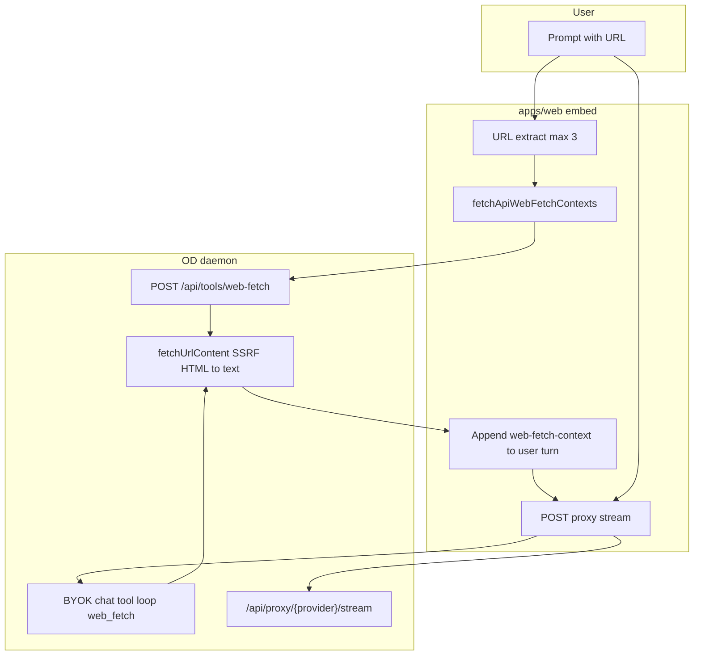

# Design embed — 웹 fetch 외부화 검토 (OpenAI web search vs 자체 fetch)

**문서 번호:** 48  
**작성:** 2026-07-27 (KST)  
**상태:** **ADR (Accepted 방향)** — “OpenAI로 전면 대체”는 **기각**, “daemon 계약 유지 + fetch 백엔드 교체/단계적 vendor tool”은 **채택**  
**목적:** Design embed에서 반복되는 **web fetch / 선-fetch / `<web-fetch-context>`** 이슈를 “직접 크롤 구현을 OpenAI API로 바꾸자”는 제안 관점에서 **기획·구현·운영**을 한 문서에 정리하고, **의사결정 근거**와 **로드맵**을 SSOT로 둔다.

## 변경 이력

| 일시 (KST) | 변경 내용 |
|------------|-----------|
| 2026-07-27 16:00 | v1.0 초안 — OpenAI web search 대체 검토, 현재 아키텍처, 비교표, ADR, Phase 로드맵 |
| 2026-07-27 16:35 | v1.1 — Phase 2 POC 착수·병합 반영 (§8 체크리스트 상태 갱신, [48-1 설계](./48-1-구현설계-webfetch-adapter.md)/[48-1 현황](./48-1-구현현황-webfetch-adapter.md) 상호 링크) |
| 2026-07-28 13:35 | **v1.2 — 조직 정책 갱신:** 새 SaaS 구독 금지 (Jina/Firecrawl/Browserless 등 reader-계열 벤더 계약 **불가**). §5 O2 코드 병합은 유지되지만 **staging enable 은 보류**. 크롤 품질 근본 개선은 **Phase 3 로 이관** (managed BYOK 답변 모델 자체를 OpenAI Responses `web_search` / Anthropic hosted `web_search` 로 확장 — Teamver 는 이미 두 vendor 의 API key 를 보유). §5.1 정책 note + §6 Phase 2/3 로드맵 재조정 + §8 체크리스트 재분류. |
| 2026-07-28 14:10 | **v1.3 — apex→www 리다이렉트 이슈 native 수준에서 해결:** staging 실측 결과 `neuralstudio.kr` 같은 apex-only 도메인이 `redirect: 'error'` 때문에 첫 홉에서 실패. 정공법 fix — `redirect: 'manual'` + **per-hop `assertExternalAssetUrl` 재검증** (SSRF 방어 유지) + max 3 hops + https→http downgrade 거부. curl/wget 표준 정책. 브랜치 `fix/web-fetch-safe-redirects` (base: `feat/web-fetch-adr`). 이 fix 로 흔한 실패 케이스가 해소되어 **O2 reader-SaaS enable · Phase 3 vendor tool loop 의 시급도가 함께 낮아진다** — §5.1.1 정책 자체는 유지, Phase 3 는 needs-based 로 지연 가능. 자세한 설계·회귀는 [48-1 §3.3.1](./48-1-구현설계-webfetch-adapter.md#331-redirect-policy-2026-07-28-갱신). |

**관련 SSOT**

| 문서 | 역할 |
|------|------|
| [15 웹참조 BYOK web_fetch FAQ](./15_웹참조_BYOK_web_fetch_FAQ.md) | **현재 구현** · FAQ · 선-fetch 주입 · BYOK tool loop |
| [29 BYOK api mode vs runs](./29_BYOK_api_mode_vs_runs_아키텍처.md) | API 모드 스트림 · tool loop 부재 |
| [36 BFF auth refresh 401](./36_BFF_auth_refresh_401_정리.md) | prefetch와 auth refresh 엮임 이슈 맥락 |
| `ns-teamver-be/docs/54_웹_참조_채팅_통합_기획.md` | Main 채팅 **벤더 native web search** |
| `ns-teamver-be/docs/모델별_web_search_비교.md` | GPT / Claude / Gemini search vs fetch |
| OpenAI [Web search 가이드](https://developers.openai.com/api/docs/guides/tools-web-search) | Responses API `web_search` hosted tool |

**코드 앵커 (ns-open-design)**

| 구성요소 | 경로·엔드포인트 |
|----------|----------------|
| SSRF-safe fetch 코어 | `apps/daemon` — `byok-url-tools.ts` (`fetchUrlContent`) |
| BYOK tool | `byok-tools.ts` — `web_fetch` / `executeWebFetch` |
| API 모드 선-fetch HTTP | `POST /api/tools/web-fetch` |
| FE URL 감지·주입 | `apps/web` — `api-web-fetch-context.ts` |
| 프롬프트 규칙 | `packages/contracts/src/prompts/system.ts` — `<web-fetch-context>` |

---

## 1. 배경 — 왜 “fetch 이슈”가 계속 보이는가

### 1.1 사용자 니즈 (불변)

대표 입력:

> `www.teamver.com 참고해서 제품 소개 슬라이드 만들어줘`

기대:

1. 사용자가 **지정한 URL(들)** 의 본문·구조·톤을 참고한다.
2. Design(deck/slide) 생성 파이프라인으로 **HTML 덱**을 만든다.
3. “API 모드라 웹을 읽을 수 없다” 같은 **허위 거절**이 없어야 한다.

이 니즈는 Main Teamver 채팅의 **“최신 뉴스 검색”** 과 **다르다**. [15 §4](./15_웹참조_BYOK_web_fetch_FAQ.md) — **정확한 URL fetch** vs **검색어 web search**.

### 1.2 제안 (검토 대상)

> 패치·크롤·HTML→text를 우리가 직접 하지 말고, **OpenAI API의 web fetch(실무상 `web_search` hosted tool)** 로 대체하자.

### 1.3 실제 장애·불만의 층 (2026-07 기준)

| 층 | 증상 | OpenAI 전환만으로 해결? |
|----|------|-------------------------|
| **A. 통합·부하** | 선-fetch가 workspace header / BFF auth refresh와 엮여 401·지연 | ❌ (호출 경로 격리 필요 — [15 §0](./15_웹참조_BYOK_web_fetch_FAQ.md), `skipTeamverWorkspaceHeaders` 등) |
| **B. 프롬프트·모델 행동** | `<web-fetch-context>`가 있는데도 “WebFetch unavailable”·“접근 불가” 응답 | ❌ (contracts/daemon prompt 정합 — [15 §0](./15_웹참조_BYOK_web_fetch_FAQ.md)) |
| **C. 프로토콜 분기** | managed **Anthropic** stream은 tool loop 없음; BYOK 일부만 `web_fetch` loop | △ (OpenAI Responses는 **별 프로토콜** — §4) |
| **D. 크롤 품질** | JS 렌더 SPA, 봇 차단, 빈 본문, 100KB cap | △ (hosted search/reader가 나을 **수 있음**) |
| **E. 보안·정책** | SSRF, redirect, private IP | △ (외부 SaaS로 **통제 지점 이동**) |

**결론:** 이슈 상당수는 **“크롤 라이브러리”** 가 아니라 **A~C (제품 wiring)** 이다. OpenAI로 fetch만 옮겨도 A~C는 남거나, **새로운 프로토콜·벤더 lock-in** 비용이 생긴다.

---

## 2. 현재 아키텍처 (Design embed SSOT)

### 2.1 두 경로



| 경로 | 언제 | 특징 |
|------|------|------|
| **선-fetch + 주입** | Teamver managed **Anthropic** 등 **tool loop 없는** API 모드 | FE가 **결정론적으로** URL 본문을 user turn에 넣음 |
| **BYOK tool loop** | `aihubmix`, `senseaudio` 등 loop 연결 프로토콜 | 모델이 **`web_fetch` tool call** → daemon 실행 |

### 2.2 선-fetch 계약 (요약)

- **입력:** 사용자 프롬프트에서 추출한 public http(s) URL (최대 3개).
- **실행:** daemon `POST /api/tools/web-fetch` — timeout, size cap, SSRF, redirect 정책은 BYOK `web_fetch`와 **동일 코어**.
- **출력:** 현재 user message에만 `<web-fetch-context>` 블록 (status, url, text 또는 failure reason).
- **실패:** fetch 실패만 컨텍스트에 실리고 **채팅 run 자체는 진행** (best-effort).
- **프롬프트:** block이 있으면 모델은 **이미 fetch된 text**를 쓰고 “URL 접근 불가”로 **일반화해 거절하지 말 것**.

### 2.3 Main Teamver 채팅과의 분리

| | Main (`ns-teamver-be`) | Design embed (`ns-open-design`) |
|--|------------------------|----------------------------------|
| 진입 | `POST /api/v2/chat` | FE → daemon proxy stream |
| 웹 | **벤더 native web search** (Responses, Claude tool, Gemini grounding) | **URL fetch** + (일부) **daemon web_fetch** |
| 스위치 | `ChatDTO.use_web_search` | (embed) 별도 UI 스위치 없음 — URL 있으면 선-fetch |

Main에 web search가 있어도 Design embed에 **자동 전파되지 않음** ([15 §3](./15_웹참조_BYOK_web_fetch_FAQ.md)).

---

## 3. OpenAI “web fetch”가 실제로 의미하는 것

### 3.1 공식 surface (2026-07)

OpenAI는 Design FAQ에서 말하는 **“사용자 URL을 GET해서 전문을 넣는다”** 와 1:1 대응하는 단일 API를 문서화하지 않는다. 실무에서 말하는 **OpenAI web fetch**는 주로:

| API | Tool | 동작 요약 |
|-----|------|-----------|
| **Responses API** | `{ "type": "web_search" }` | 모델이 **검색 필요**를 판단 → hosted search → 인용·sources |
| (legacy) | `web_search_preview`, Chat Completions search 모델 | 신규 통합은 **Responses + web_search** 권장 |

참고: [Using tools — web search](https://developers.openai.com/api/docs/guides/tools), [Web search guide](https://developers.openai.com/api/docs/guides/tools-web-search).

### 3.2 web_search의 action 모델 (개념)

Responses API reference상 web search call은 대략:

- `search` — 쿼리 기반 검색
- (reasoning 계열) `open_page`, `find_in_page` — 페이지 탐색·패턴 검색

즉 **“검색 + 선택적 페이지 열기”** 에 가깝고, Design이 필요로 하는 **“사용자가 적은 URL N개를 반드시 선-fetch”** 와 **계약이 다르다**.

### 3.3 OpenAI web_search — 장점

- JS-heavy·anti-bot 페이지에서 **자체 `fetch`+cheerio/text 추출**보다 성공률이 높을 **수 있음**
- 최신 정보·**인용(sources)** · `allowed_domains` 필터 등 **운영 기능** 내장
- 앱이 크롤러·브라우저 풀을 **직접 운영하지 않음**

### 3.4 OpenAI web_search — Design 관점 리스크

| 리스크 | 설명 |
|--------|------|
| **URL 고정 fetch 비보장** | 모델이 search를 **안 부를 수 있음**; 검색 결과가 사용자 URL과 **다를 수 있음** |
| **프로토콜 불일치** | staging 기본 **Anthropic managed stream** ≠ OpenAI Responses; **전면 대체 = 라우팅 재설계** |
| **비용·지연** | search tool + (often) multi-step; turn당 선-fetch 1~3 URL 패턴과 **과금 단위 상이** |
| **데이터 거주·컴플라이언스** | 고객 URL·페이지 본문이 OpenAI(및 grounding 파트너)로 — 엔터프라이즈/온프레미스 Design과 충돌 가능 |
| **멀티 벤더** | Anthropic/Google/BYOK 혼용 제품에서 **OpenAI-only 해법은 1차 경로가 될 수 없음** |
| **디버깅** | “왜 이 URL 본문이 비었는가”가 **우리 daemon 로그**가 아니라 **vendor tool call** 안에 묶임 |

---

## 4. 옵션 비교 (의사결정 표)

### 4.1 후보

| ID | 이름 | 요약 |
|----|------|------|
| **O0** | **현행 유지 + wiring 강화** | `fetchUrlContent` + 선-fetch + prompt; A~C 계속 수리 |
| **O1** | **OpenAI Responses `web_search`로 전면 대체** | Design run을 OpenAI Responses 중심으로; 자체 fetch 제거 |
| **O2** | **Reader/Crawl SaaS adapter** | `POST /api/tools/web-fetch` **계약 유지**, 내부만 Jina/Firecrawl/Browserless 등 |
| **O3** | **Main BE web capability BFF** | Main이 이미 쓰는 벤더 search/fetch를 Design 전용 **“URL→text”** API로 노출 |
| **O4** | **Managed Anthropic (+α) native tool loop** | proxy stream에 tool loop 부착 — FAQ “장기 선택지” |

### 4.2 니즈별 적합도

| 니즈 | O0 | O1 | O2 | O3 | O4 |
|------|----|----|----|----|-----|
| **정확한 URL 본문 (슬라이드)** | ◎ | △ | ◎ | △~◎ | ◎ |
| **managed Anthropic 기본 경로** | ◎ | ✗ | ◎ | ◎ | ◎ |
| **SSRF·allowlist 통제 (daemon)** | ◎ | △ | ◎ | △ | ◎ |
| **크롤 품질 (SPA)** | △ | ○~◎ | ◎ | ○ | △~◎ |
| **멀티 provider BYOK** | ◎ | ✗ | ◎ | ○ | ○ |
| **구현·롤백 비용** | ◎ | ✗ | ○ | △ | △ |
| **“최신 뉴스 검색”** | △ | ◎ | △ | ◎ | ○ |

범례: ◎ 적합 · ○ 부분 · △ 주의 · ✗ 부적합

### 4.3 OpenAI 전면 대체(O1)가 기각되는 이유 (한 줄)

> Design 1차 UX는 **“사용자 URL → deterministic prefetch → `<web-fetch-context>`”** 이고, OpenAI `web_search`는 **“모델 판단 검색”** 이며, **현 기본 inference 경로(Anthropic proxy)와 API 표면이 다르다.**

---

## 5. ADR — 채택 방향

### 5.1 Decision

| 항목 | 결정 |
|------|------|
| **OpenAI web_search로 자체 fetch 전면 대체** | **No** (O1 기각) |
| **단기 SSOT** | **O0** — 선-fetch + prompt + auth prefetch 격리 ([15 §0](./15_웹참조_BYOK_web_fetch_FAQ.md)) |
| **중기 (크롤 품질·운영)** | **O2 — 코드 인터페이스만 병합, 실 backend enable 은 보류.** `fetchUrlContent` 뒤에 adapter interface (`WebFetchBackend`) 를 두는 리팩터는 [48-1](./48-1-구현설계-webfetch-adapter.md) 로 병합됨. 다만 **v1.2 정책 갱신 (§5.1.1)** 으로 reader-SaaS 벤더 (Jina/Firecrawl/Browserless 등) **enable 은 금지**. Interface 만 유지 → Phase 3 에서 재활용. |
| **선택적** | **O3** — Main과 중복 투자 vs 통합 BFF는 **별 ADR** (조직·보안 경계 확인 후) |
| **장기 (승격됨)** | **O4** — managed vendor tool loop (OpenAI Responses `web_search` · Anthropic hosted `web_search`). Teamver 는 두 vendor 의 API key 를 이미 보유 → **새 SaaS 구독 없이도** 크롤 품질 개선 경로 확보. v1.2 정책 갱신으로 Phase 3 로 승격. |

### 5.1.1 정책 갱신 (v1.2 — 2026-07-28)

**조직 정책:** Teamver Design 은 **새 SaaS 구독을 늘리지 않는다.** 이는 O2 의 "reader-SaaS adapter enable" 옵션 (Jina, Firecrawl, Browserless 등 신규 계약) 을 **정책적으로 차단**하는 결정이다.

**영향:**

- 이미 병합된 [48-1](./48-1-구현설계-webfetch-adapter.md) 의 `WebFetchBackend` interface · `core.ts` dispatcher · `native-backend.ts` 는 **유지**. daemon 은 기본 native 로 동작하므로 사용자 영향 zero.
- `reader-backend.ts` · `select.ts` 의 reader 분기 · `WEB_FETCH_READER_*` env · reader 관련 회귀 테스트는 **코드로만 병합된 상태로 보존** (Phase 3 재활용 후보 · dead-code 태그). staging/prod 어느 곳에도 `WEB_FETCH_BACKEND=reader` 를 세팅하지 않는다.
- 크롤 품질 근본 개선 (`teamver.com` SPA · bot-block 페이지 등) 은 **Phase 3 로 승격**. Teamver 가 이미 보유한 OpenAI/Anthropic key 를 재사용해서 vendor 의 hosted `web_search` tool 을 답변 turn 안에서 실행하는 접근이 정공법 — 별도 관측·설계 문서 (48-2) 로 진입.

**추적:** [48-1 §4 env schema](./48-1-구현설계-webfetch-adapter.md#4-env-schema-신설-daemon-only) 의 reader-\* 행은 "🚫 정책 pending" 태그로 명시. [15 §5.1](./15_웹참조_BYOK_web_fetch_FAQ.md#51-web_fetch-backend-env-phase-2-poc--daemon-only) 도 동일. `.env.staging.example` 의 reader-\* 주석 블록에는 **강조 주석** 추가.

### 5.2 유지 불변식 (Invariants)

1. **FE↔daemon 계약:** `POST /api/tools/web-fetch` 요청/응답·`<web-fetch-context>` XML 형태는 **외부 노출 API**로 취급 (adapter 교체 시에도 유지).
2. **SSRF:** 최종 fetch URL은 **항상 daemon 정책**을 통과 (SaaS adapter도 allowlist·blocklist 연동).
3. **프로토콜 정직성:** tool loop **없는** proxy에는 prompt가 **“web_fetch tool 호출 가능”** 이라고 말하지 않음 (`byokChatToolNamesForProtocol()` — [00 누적 2026-07-03](./00_구현_내역_누적.md)).
4. **실패 허용:** fetch 실패가 **run 전체를 막지 않음**; failure reason만 context.

### 5.3 OpenAI를 쓸 수 있는 자리 (v1.2 갱신)

**v1.2 정책 갱신 (§5.1.1) 로 이 조항의 위상이 승격됨** — 새 SaaS 구독이 금지되면서 크롤 품질 개선 경로는 사실상 vendor hosted `web_search` (Teamver 이미 보유 key 재사용) 로 좁혀졌다. 자세한 통합 옵션은 [§6 Phase 3](#phase-3--vendor-hosted-web_search-통합-p1-승격--v12) 및 후속 별 ADR (48-2).

과거 v1.1 까지의 서술 (아래) 은 히스토리 목적으로 유지:

- runtime-config `protocol=openai` (또는 OpenAI Responses BYOK)
- 니즈가 **검색·최신 정보** 위주 (URL 고정 슬라이드 1차 UX 아님)
- 데이터 외부 전송·과금이 **고객 계약상 허용**

구현 형태: daemon OpenAI Responses proxy path 에 `tools: [{ type: "web_search" }]` — **선-fetch 주입과 병렬** 이 아니라 **대체 경로** 로 문서화 (Phase 3 에서 재정합).

---

## 6. 로드맵 (Phase)

### Phase 0 — 관측·분류 (진행 중)

**목표:** “fetch broken” 리포트를 **A~E 층**으로 분류.

| 체크 | 방법 |
|------|------|
| 선-fetch 호출됨 | Network: `POST /api/tools/web-fetch` (채팅 전) |
| auth noise 없음 | 동 호출에 `/teamver-bff/auth/refresh` **연쇄 없음** |
| context 주입됨 | request body / persist snapshot에 `<web-fetch-context>` |
| 모델 거절 | assistant가 “API 모드라 읽을 수 없음” **금지** (prompt regression test) |
| 본문 품질 | text length, title, status=failed reason |

**테스트 SSOT:** `apps/web/tests/api-web-fetch-context.test.ts`, `HomeView`·prefill 관련 회귀.

### Phase 1 — Wiring 안정화 (P0, O0)

- [15 §0](./15_웹참조_BYOK_web_fetch_FAQ.md) 항목 유지·회귀 테스트
- staging smoke: `www.teamver.com 참고해서 슬라이드…` ([15 §0 “다음 추천 작업”](./15_웹참조_BYOK_web_fetch_FAQ.md))

### Phase 2 — Fetch backend adapter (P1, O2) — **interface land, reader enable 보류**

**상태 (v1.2, 2026-07-28):** interface·dispatcher·native backend 는 [48-1](./48-1-구현설계-webfetch-adapter.md) 로 병합됨. reader-SaaS enable 은 **§5.1.1 정책 갱신으로 보류**.

**병합된 것 (계속 유지 · staging default 는 native)**

```text
fetchUrlContent(url, options)  // POST /api/tools/web-fetch · executeWebFetch — 계약 무변
  → SSRF (assertExternalAssetUrl on original URL)
  → resolveWebFetchBackend()  // env 기반, 기본 native
      ├─ native   : 기존 fetch + htmlToText  (staging/prod SSOT)
      └─ reader   : Jina-style prefix reader  (🚫 정책 pending — enable 금지)
  → 100KB cap + 12s timeout + never-throw contract
```

| 항목 | 상태 |
|------|------|
| `WebFetchBackend` interface · core dispatcher · native backend | ✅ 병합 (활성) |
| Config `WEB_FETCH_BACKEND=native` 이 실 기본값 | ✅ (env 미설정 시에도 native) |
| Reader backend code (`reader-backend.ts`, `select.ts` reader 분기, `WEB_FETCH_READER_*` env) | ⚠️ 코드는 병합, **enable 금지** (§5.1.1) |
| Reader-SaaS 벤더 계약 (Jina/Firecrawl/Browserless) | 🚫 **금지** (§5.1.1 정책) |
| Fallback flag `WEB_FETCH_READER_FALLBACK_TO_NATIVE` | ⚠️ 코드 병합, 실 enable 없음 |
| 로그 필드 (backend/url_host/status/duration_ms/text_bytes/error_code) | ✅ 병합 (`web-fetch-log.test.ts` 회귀) |

### Phase 3 — Vendor hosted `web_search` 통합 (P1, **승격** · v1.2)

**목표:** reader-SaaS 를 늘리지 않고, 이미 Teamver 가 key 를 보유한 **OpenAI Responses `web_search`** 및 **Anthropic messages hosted `web_search`** 를 활용해 크롤 품질을 근본 개선. 구독 zero.

**두 통합 위치 — 별 ADR (48-2) 로 상세 진입:**

1. **답변 turn 자체에서 vendor tool loop 실행** (ChatGPT UX 그대로) — daemon `TEAMVER_OD_API_PROTOCOL` 을 `openai` (Responses API) 또는 `anthropic` (Messages tool loop) 로 확장, `tools: [{ type: "web_search_preview" | "web_search" }]` 를 채팅 요청에 첨부. `<web-fetch-context>` 프리페치는 여전히 병행 가능 (모델이 URL 을 직접 볼 수 있으므로 프리페치 실패 시에도 backup).
2. **fetcher 위임** (48-1 `WebFetchBackend` 슬롯 재활용) — 새 `openai-backend.ts` / `anthropic-backend.ts` 를 등록하고, daemon 이 vendor Responses/Messages API 에게 "이 URL 원문 반환" 을 위임. 요약 스며듦 위험 · latency · cost 리스크 있음. Fallback 으로만 사용.

**핵심 리스크:**

- OpenAI/Anthropic hosted `web_search` 는 vendor-hosted 도구라 **outbound URL 이 vendor 도메인** — SSRF 는 daemon 이 자체 검증 불가 (vendor 정책 신뢰).
- 요금 체계 재검증 필요 (search fee + token). usage bridge (`ns-teamver-be` 과금 파이프) 와 정합.
- 프롬프트 시스템 SSOT 재정합 (모델이 web_search 를 자동 호출하지 않도록 vs 자동 호출 허용의 정책 결정).

**후속:** 48-2 ADR (별 문서, 이번 PoC 밖) — 벤더 계약·프로토콜·비용·usage bridge 매트릭스.

### Phase 4 — Main BFF (optional O3)

- Design이 Main BE를 호출하는 **cross-stack** — SSO, usage 귀속, latency, blast radius 검토 필요
- [06 Docs/Slides형 연동](./06_Docs슬라이드형_연동.md) · [41 Drive 인증](./41_Design_Drive_인증_계약_권고.md)과 **동일한 “경계 문서”** 수준으로 설계

---

## 7. OpenAI vs 자체 fetch — FAQ

### Q1. “OpenAI web fetch 쓰면 auth refresh 이슈도 사라지나?”

**아니다.** refresh 잡음은 **FE→daemon prefetch가 BFF/session 루틴을 탔기 때문**이다. fetch 실행 주체가 OpenAI여도 **선-fetch를 호출하는 FE 경로**는 남거나, OpenAI 호출을 **어디서** 하느냐에 따라 **새로운** auth·키 관리가 생긴다.

### Q2. “web search 켜면 teamver.com 전문이 들어오지 않나?”

**보장되지 않는다.** search는 **쿼리·랭킹·스니펫** 중심이다. “이 URL 전체” 니즈는 [15 §4](./15_웹참조_BYOK_web_fetch_FAQ.md) 표와 동일.

### Q3. “그럼 OpenAI는 언제 쓰나?”

Main 채팅 **`use_web_search`**, 또는 Design에서 **protocol=openai** + **검색형** 워크플로를 **의도적으로** 팔 때. URL 슬라이드 1차 UX의 **대체재가 아님**.

### Q4. “직접 크롤이 너무 고통스럽다”

**O2 adapter**가 OpenAI 전면보다 **낮은 리스크**다. FE·prompt·`<web-fetch-context>` **불변** 유지.

### Q5. BYOK `web_fetch` tool loop는?

**유지.** `aihubmix` / `senseaudio`에서 모델 주도 fetch; API 모드 선-fetch와 **prompt 규칙 공유** ([15 §0](./15_웹참조_BYOK_web_fetch_FAQ.md)).

---

## 8. 구현 체크리스트

**상태 (v1.2):** interface 병합 완료 (`feat/web-fetch-adr`). reader-SaaS 실 enable 은 **§5.1.1 조직 정책으로 금지 → Phase 3 로 이월**. 자세한 설계·현황은 [48-1 구현설계](./48-1-구현설계-webfetch-adapter.md) · [48-1 구현현황](./48-1-구현현황-webfetch-adapter.md).

### 8.1 병합·활성 항목

- [x] `WEB_FETCH_BACKEND` env dispatcher + daemon 단일 진입점 — `apps/daemon/src/web-fetch/{core,select,backend,native-backend}.ts`
- [x] SSRF regression — 원본 URL 은 `assertExternalAssetUrl` 통과 (link-local `169.254.169.254` 등 거부)
- [x] contracts test — `<web-fetch-context>` 규칙 unchanged (`apps/daemon/tests/byok-url-tools.test.ts` 무수정 통과)
- [x] 신규 회귀 — `web-fetch-select.test.ts` + `web-fetch-reader-backend.test.ts` + `web-fetch-log.test.ts` 총 4 files / 24 tests green
- [x] 로그 스키마 land — `web_fetch.backend / url_host / status / duration_ms / text_bytes / error_code / reader_fallback` (본문·title·path·query 미로그, 회귀로 pin)

### 8.2 코드 병합 · **정책상 enable 금지** (§5.1.1)

- [x] `reader-backend.ts` code — Jina-style prefix 구현 병합 (dead-code 태그)
- [x] `select.ts` reader 분기 · `WEB_FETCH_READER_*` env parse
- [x] `.env.staging.example` 주석 예시 — 정책 강조 주석 붙임 (`# 🚫 사용 금지 — 새 SaaS 구독 금지 (48 §5.1.1) · P3 재검토까지 native 유지`)
- [ ] ~~Reader SaaS 실측 (teamver.com / SPA / bot-block)~~ → **금지 (§5.1.1)**, Phase 3 재검토
- [ ] ~~Reader SaaS 비용 모니터링~~ → **금지 (§5.1.1)**, Phase 3 재검토

### 8.3 후속 (Phase 3 로 이월)

- [ ] **48-2 ADR 신규** — OpenAI Responses `web_search` + Anthropic hosted `web_search` 벤더 매트릭스, 답변 turn 통합 vs `WebFetchBackend` 슬롯 위임 트레이드오프, 요금·usage bridge 재정합
- [ ] daemon `TEAMVER_OD_API_PROTOCOL` 확장 검토 (openai · anthropic tool loop)
- [ ] [04 구현 우선순위](./04_구현_우선순위.md) L-472/L-473 상태 동기화 (v1.2 반영)

---

## 9. 참고 — OpenAI 문서 링크 (외부)

- [Web search (OpenAI API)](https://developers.openai.com/api/docs/guides/tools-web-search)
- [Using tools](https://developers.openai.com/api/docs/guides/tools)
- [Responses API reference — web_search tool](https://developers.openai.com/api/reference/resources/responses/)

---

## 10. 한 줄 요약 (경영·기획용)

> **URL 기반 슬라이드**는 OpenAI web search **전면 대체**보다, **지금의 선-fetch 계약을 유지**하고 **크롤 품질만 선택적으로 SaaS adapter로 바꾸는** 것이 기획·구현·멀티 벤더와 맞다. OpenAI `web_search`는 **검색형·OpenAI 전용 경로**의 **옵션**으로 둔다.
