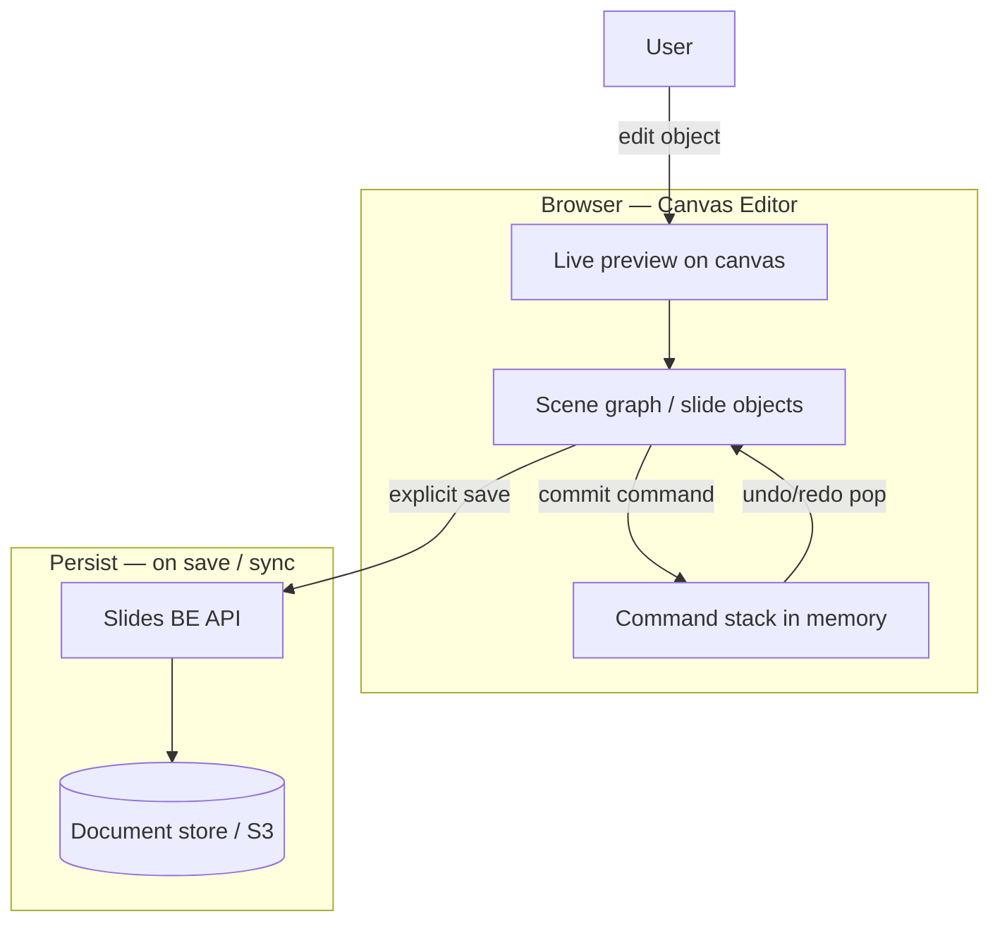
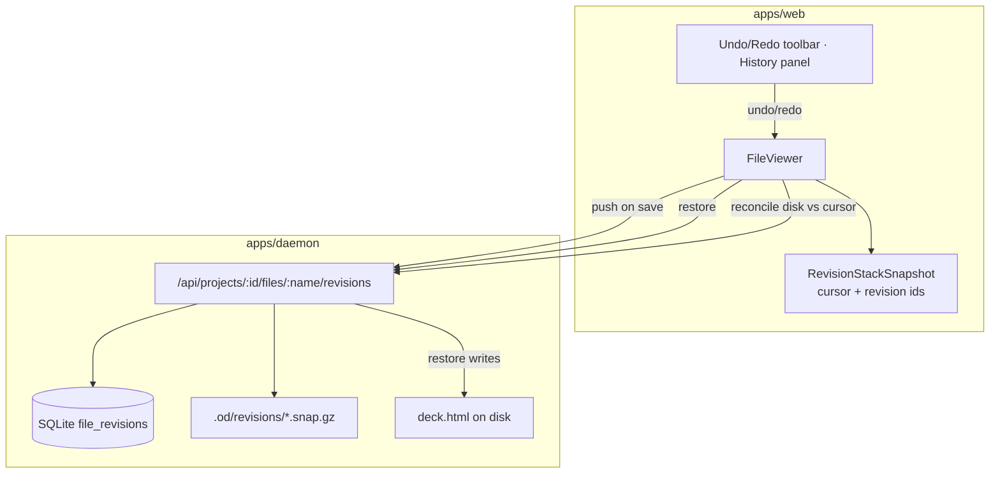
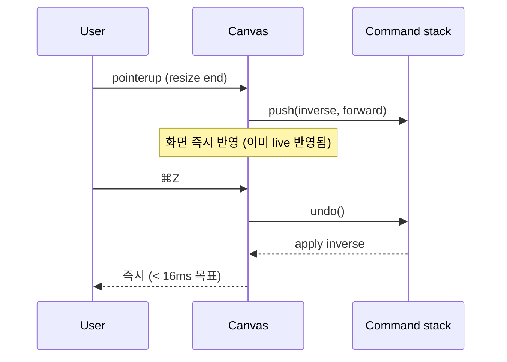
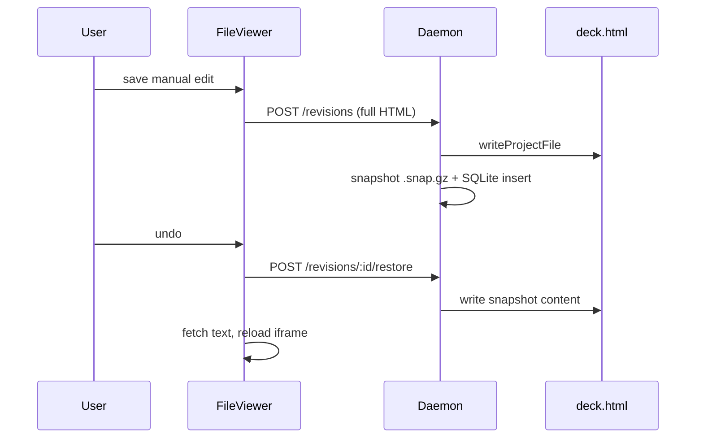

# 50-2 Teamver Canvas vs Design Undo/Redo 비교

**문서 번호:** 50-2  
**상위 SSOT:** [50 Undo/Redo 설계](./50_undo_redo_설계.md)  
**구현 현황:** [50-1 구현현황 — undo/redo](./50-1-구현현황-undo_redo.md)  
**작성:** 2026-07-30 (UTC)  
**상태:** 아키텍처 비교 SSOT (유지보수 시 teamver-slide 경로·수치 갱신)

---

## 1. 목적

Teamver **Main FE Canvas**(Slides / teamver-slide 계열)의 undo/redo와, **Design(Open Design embed)** 에 구현한 revision 기반 undo/redo의 **구현 방식·차이·선택 기준**을 한곳에 정리한다.

- 제품·엔지니어링 의사결정 시 “canvas 방식으로 통일할지 / revision을 유지할지” 판단 근거
- Manual Edit·드래그 리사이즈(51 시리즈)가 어느 레이어의 undo를 쓰는지 명확화
- 형제 레포(teamver-slide) 코드가 이 레포에 없을 때의 **문서상 계약** 역할

---

## 2. 범위와 한계

| 항목 | 내용 |
|------|------|
| **Design 구현** | `ns-open-design` 본 레포 코드·테스트 기준으로 **확정** 기술 |
| **Teamver Canvas** | teamver-slide / Main Slides FE는 **형제 레포** — 본 레포에 소스 없음 ([51-2 §teamver-slide 참고](./51-2_수동편집_드래그_리사이즈_구현현황.md)) |
| **Canvas 문서화 수준** | 51-0·51-1의 참고 매핑, 제품 관행(Figma/PPT/slide 에디터), Track A에서 Design이 canvas **handoff**만 받는 구조를 바탕으로 **아키텍처 수준**으로 기술 |
| **갱신 책임** | teamver-slide 레포 URL·핵심 파일 경로가 확보되면 §3.2 표를 채우고 “예상” 표기를 제거 |

---

## 3. 두 시스템 요약

### 3.1 Teamver Main FE Canvas (Slides / teamver-slide, 아키텍처 수준)



| 항목 | 전형적 구현 (teamver-slide 계열) |
|------|----------------------------------|
| **진실 원천 (편집 중)** | 캔버스 **오브젝트 모델** (슬라이드, 도형, 텍스트 박스, z-order, transform) |
| **Undo 단위** | Command / inverse op (이동·리사이즈·스타일 변경 등) |
| **저장 위치** | **클라이언트 메모리** (세션·문서 로드 ~ 저장 사이) |
| **Undo 동작** | 스택에서 pop → 씬 그래프 즉시 갱신 (디스크/API 왕복 없음) |
| **Redo** | undone command 스택에서 replay |
| **새로고침** | 저장 전 스택 **소실** (저장 후에는 서버 문서 버전에 의존) |
| **스택 깊이** | 제품별 상수 (수십~수백 step, 메모리 bounded) — **teamver-slide 실측값 TBD** |
| **서버 부하 (undo 시)** | 거의 없음 (클라이언트만) |
| **협업** | 단일 사용자 편집 가정; 실시간 OT/CRDT는 별도 영역 |

**51 시리즈에서 가져오기로 한 것 (UX만):** resize handle hit test, pointer capture, live vs commit, aspect lock, min size.  
**가져오지 않기로 한 것:** 캔버스 오브젝트 모델 전체, W/N 리사이즈 시 object x/y 앵커 보정(Phase 1 non-goal).

#### teamver-slide 참고 경로 (TBD)

| 항목 | 값 |
|------|-----|
| 레포 URL | _TBD — 확보 시 갱신_ |
| Undo/History 핵심 파일 | _TBD_ |
| 스택 깊이 상수 | _TBD_ |
| 비고 | [51-2 구현현황](./51-2_수동편집_드래그_리사이즈_구현현황.md) 표와 동기화 |

---

### 3.2 Design — 서버 File Revision (본 레포 구현)



| 항목 | 구현 |
|------|------|
| **진실 원천** | **디스크 HTML 파일** + daemon **revision 스냅샷** (설계 P1) |
| **Undo 단위** | **Commit 단위** — manual save 1회, inspect save 1회, agent persist 1회 = revision 1개 (설계 P3) |
| **저장 위치** | SQLite `file_revisions` + 스냅샷: `files` 모드는 `<project>/.od/revisions/…`, `sqlite` 모드는 daemon DB `file_revision_snapshots` |
| **Undo 동작** | cursor를 이전 revision으로 이동 → `POST .../revisions/:id/restore` → 디스크 overwrite → 프리뷰 reload |
| **Redo** | cursor를 다음 revision으로 이동 → 동일 restore |
| **새로고침** | 서버 목록 재조회 → 스택 복원 가능 |
| **스택 깊이** | **파일당 30개** (코드 기본, `FILE_REVISION_RETENTION_LIMIT_DEFAULT`) — `OD_FILE_REVISION_RETENTION_LIMIT` env (2~200). **Teamver 권장:** staging/prod **20** — [50-3 §7.1](./50-3_revision_스냅샷_저장소_RDS_용량관리.md#71-스택-깊이-od_file_revision_retention_limit-권장값) |
| **서버 부하 (undo 시)** | restore마다 `writeProjectFile` + 스냅샷 read (gzip diff chain) |
| **클라이언트 최적화 (2026-07-30)** | `revision-content-cache.ts` — undo/redo 인접 revision만 LRU 캐시(기본 8개·16MB/파일·항목 4MB 상한); restore 시 refetch 생략, 인접 prefetch는 `byteSize`로 대용량 스킵 |
| **Phase A fast undo (2026-07-31)** | 캐시 hit 시 프리뷰 즉시 갱신 + `POST restore` 백그라운드; push 시 parent snapshot 캐시; restore 실패 시 스택 invalidate |
| **통합 편집 경로** | manual_edit, inspect, agent_element_patch, agent_deck_patch, … 동일 스택 |
| **CLI** | `od project revisions list|restore` (UI/CLI dual-track) |

#### 핵심 코드 경로 (Design)

| 영역 | 경로 |
|------|------|
| Contract | `packages/contracts/src/api/revisions.ts` |
| Daemon service | `apps/daemon/src/file-revisions/service.ts` |
| Retention | `apps/daemon/src/file-revisions/persistence.ts` — `resolveFileRevisionRetentionLimit()` |
| Content cache | `apps/web/src/runtime/revision-content-cache.ts` |
| Fast restore | `apps/web/src/runtime/revision-restore.ts` — client-cache hit + background disk sync |
| Snapshot codec | `apps/daemon/src/file-revisions/snapshot-codec.ts` (gzip + prefix/suffix diff) |
| Client stack | `apps/web/src/runtime/revision-stack.ts` |
| 충돌 감지 | `apps/web/src/runtime/revision-conflict.ts`, `FileViewer.tsx` — `reconcileRevisionWithDisk` |
| UI | `FileViewerUndoRedoToolbar.tsx`, `FileRevisionHistoryPanel.tsx` |
| Agent hook | `ProjectView.tsx` — `pushProjectFileRevision` on `persistArtifact` |

#### API (Design)

```
GET    /api/projects/:id/files/:name/revisions
GET    /api/projects/:id/files/:name/revisions/:revId
POST   /api/projects/:id/files/:name/revisions            # push (write + snapshot)
POST   /api/projects/:id/files/:name/revisions/:revId/restore
```

---

### 3.3 Design 내 “Canvas형” in-memory undo (보조 레이어)

Design에도 **캔버스에 가까운** in-memory undo가 **별도** 존재한다. 파일 revision과 **통합되지 않음**.

| 항목 | `PreviewDrawOverlay` (주석 그리기) |
|------|-------------------------------------|
| 데이터 | `strokesRef` + `undoneStrokesRef` |
| Undo | 마지막 stroke pop |
| Persist | 전송/저장 전까지 **휘발** |
| 단축키 | draw overlay 활성 시 ⌘Z가 **stroke undo** 우선 (file revision undo 차단) |

Phase 0 이전 Manual Edit은 `ManualEditHistoryEntry[]` in-memory였으나, Phase 1+에서 **서버 revision으로 단일화** ([50-1](./50-1-구현현황-undo_redo.md)).

---

## 4. 구현 방법 상세 비교

### 4.1 상태 모델

| | Teamver Canvas | Design Revision |
|---|----------------|-----------------|
| 편집 대상 | Typed object (id, type, bounds, style, …) | **전체 HTML 문자열** (`deck.html`) |
| 클라이언트 캐시 | Command stack + scene graph | `RevisionStackSnapshot` (revision id 목록 + cursor) |
| 서버 메타 | 문서/슬라이드 ID, (선택) 버전 | `FileRevision` row per commit |
| 컨텐츠 blob | 직렬화된 slide JSON 등 (제품별) | gzip 스냅샷 파일 |

### 4.2 Commit / Undo 시퀀스

**Canvas (개념):**



**Design (구현):**



### 4.3 저장·용량

| | Teamver Canvas | Design |
|---|----------------|--------|
| Undo 시 스토리지 쓰기 | 없음 | restore = 파일 1회 overwrite |
| Commit 시 | (명시적 save 시) 문서 API | 매 commit마다 스냅샷 + DB row |
| 용량 (typical) | 오브젝트·command 크기 × depth | ~80KB/deck × 30 ≈ **2.4MB/파일** 상한 (diff로 실제는 더 작을 수 있음) |
| Prune | 스택 max depth 또는 LRU | push 시 `pruneOldestFileRevisions(keep=30)` — **DB DELETE + `.snap.gz` 삭제** |

오래된 Design revision은 **SQLite `file_revisions`에서도 제거**되며, 대응 `.snap.gz`도 함께 삭제된다. DB만 남거나 파일만 남는 orphan 정책은 없다 (`enforceRetention` → `pruneSnapshots`).

### 4.4 충돌·멀티탭

| | Teamver Canvas | Design |
|---|----------------|--------|
| 외부 변경 | (제품별) reload 또는 merge prompt | `reconcileRevisionWithDisk`: disk ≠ cursor snapshot → **스택 reset + toast** |
| Undo 후 새 편집 | redo branch discard (일반적) | `truncateAfterSequence` on push |
| 레이스 | 단일 탭 편집 가정에 가까움 | `revisionReconcileGeneration`으로 stale reconcile 무시 (2026-07-30 fix) |

---

## 5. 장단점

### 5.1 Teamver Canvas (in-memory command)

**장점**

- Undo/redo **체감 속도** 최상 (로컬만)
- 오브젝트 단위라 **메모리 효율** 좋음
- 드래그·리사이즈 등 **고빈도 조작**에 자연스러움
- Undo 시 **서버 부하 없음**

**단점**

- HTML artifact / AI agent / CLI와 **단일 스택 통합 어려움**
- 새로고침·크래시 시 **미저장 undo 소실**
- “파일 전체” SSOT 모델과 **맞지 않음** (Design은 `deck.html`이 canonical)
- 장기 버전 보관·감사(audit)는 **별도 publish/버전 시스템** 필요

### 5.2 Design (server revision)

**장점**

- manual / inspect / **AI persist** 한 스택
- **새로고침·재진입** 후에도 history 유지
- `od project revisions` **CLI parity**
- 디스크 = 권위 → embed·daemon·export와 **일관**
- retention cap으로 **bounded 스토리지**

**단점**

- Undo마다 **네트워크 + 디스크 I/O + iframe reload**
- 작은 CSS 변경도 **전체 HTML snapshot** (diff는 저장만 최적화)
- 멀티탭·외부 편집 시 **스택 invalidate** 가능
- cross-file transaction **미지원** (설계 Non-goal)

---

## 6. 왜 Design은 Canvas 방식을 채택하지 않았는가

[50 설계 §3](./50_undo_redo_설계.md) 원칙과 정합:

| 원칙 | Canvas만 쓸 때 문제 |
|------|---------------------|
| P1 Canonical truth = 디스크 revision | 클라이언트 command가 권위가 되면 agent가 쓴 HTML과 어긋남 |
| P3 Commit 단위 | AI turn·inspect·manual이 서로 다른 patch 형식 |
| P4 파일 스코프 | `deck.html` 단위 undo는 **파일 snapshot**이 직관적 |
| P6 UI/CLI dual-track | in-memory는 CLI에서 재현 불가 |

Track A 전략상 Design FE는 **OD UI embed**이고, SSOT는 open-design **daemon + HTML artifact** ([01 통합 아키텍처](./01_통합_아키텍처.md)). Canvas handoff는 **생성 진입**이지, 편집 중 SSOT가 canvas scene graph가 아니다 ([42 Canvas Apps](./42_Canvas_앱스_슬라이드_생성_기획설계.md)).

---

## 7. 권장: 하이브리드 레이어 (현재·향후)

두 방식은 **대체 관계가 아니라 레이어 분리**가 적절하다.

```text
┌─────────────────────────────────────────────────────────┐
│ Layer A — 세션 중 고빈도 (Canvas형, in-memory)          │
│  · 드래그 리사이즈 live preview (od-edit-preview-style) │
│  · Draw overlay stroke undo                             │
│  · (선택) 미저장 텍스트 편집 draft                      │
│  → pointerup / blur / save 시 Layer B로 commit          │
└─────────────────────────────────────────────────────────┘
                          │ commit
                          ▼
┌─────────────────────────────────────────────────────────┐
│ Layer B — 영구 편집 기록 (Design revision, 서버)         │
│  · manual save, inspect save, agent persist             │
│  · undo/redo toolbar, History panel, ⌘Z               │
│  · 파일당 30 revision, gzip diff                        │
└─────────────────────────────────────────────────────────┘
```

| 작업 | 권장 레이어 |
|------|-------------|
| 리사이즈 드래그 중 | A (preview only) — [51-1 §1](./51-1_수동편집_드래그_리사이즈_설계.md) |
| 리사이즈 pointerup 저장 | B (revision push 1회) |
| 주석 펜 stroke | A |
| AI 덱 패치 저장 | B |
| 사용자 “3일 전 버전” | B 범위 밖 → Drive publish / export (33 시리즈) |

**향후 개선 (속도):** Layer B undo를 유지하되, **Phase A (2026-07-31)** 에서 클라이언트 캐시 hit 시 프리뷰를 먼저 갱신하고 disk restore는 백그라운드로 처리한다. **Phase B** — 연속 manual style 편집 debounce/batch commit, optimistic undo. Canvas 전체 교체보다 리스크가 낮다.

---

## 8. 제품 경계 (Teamver 생태계)

```text
teamver.com Main
  ├─ Canvas / Slides FE (teamver-slide)     → Scene graph + command undo
  ├─ Docs FE                                → (자체 문서 모델, 본 문서 범위 외)
  └─ Design embed (OD apps/web)             → HTML file revision undo
        ↑ handoff (42, 49) — 생성 시 canvas → deck.html import
```

- **Canvas → Design handoff** 후 편집 SSOT는 **HTML 파일**이므로 revision 방식이 맞다.
- Canvas 앱 안에서의 undo와 Design 미리보기 안의 undo는 **사용자에게 동일 UX로 보이게** 할 수 있으나, **구현은 의도적으로 다르다** — 본 문서로 설명 가능.

---

## 9. 의사결정 체크리스트

새 기능·리팩터 시 아래로 판단:

| 질문 | Yes → | No → |
|------|-------|------|
| 편집 결과가 `deck.html` (또는 artifact 파일)에 반영되는가? | Design revision (B) | Canvas형 (A) 검토 |
| AI agent / inspect / CLI와 같은 history에 넣어야 하는가? | Design revision (B) | A 가능 |
| pointermove마다 undo step이 필요한가? | A (preview), B는 commit만 | — |
| 새로고침 후에도 undo가 필요한가? | Design revision (B) | A만으로 충분 |
| 서버 스토리지·감사가 필요한가? | B (+ retention cap) | A |

---

## 10. 관련 문서

| 문서 | 관계 |
|------|------|
| [50 Undo/Redo 설계](./50_undo_redo_설계.md) | Design revision 설계 SSOT |
| [50-1 구현현황](./50-1-구현현황-undo_redo.md) | 구현 체크리스트 |
| [51-0~2 드래그 리사이즈](./51-0_수동편집_드래그_리사이즈_기획.md) | Canvas UX → OD 매핑, commit 시 revision 1 entry |
| [42 Canvas Apps 슬라이드 생성](./42_Canvas_앱스_슬라이드_생성_기획설계.md) | Canvas ↔ Design handoff |
| [33 다운로드·Export](./33_프로젝트_다운로드_Export_아키텍처.md) | 장기 보관은 revision ≠ publish |

---

## 11. 갱신 로그

| 날짜 | 내용 |
|------|------|
| 2026-07-30 | 초안 — Canvas vs Design 비교 SSOT, 하이브리드 레이어, prune·DB 정책 명시 |
