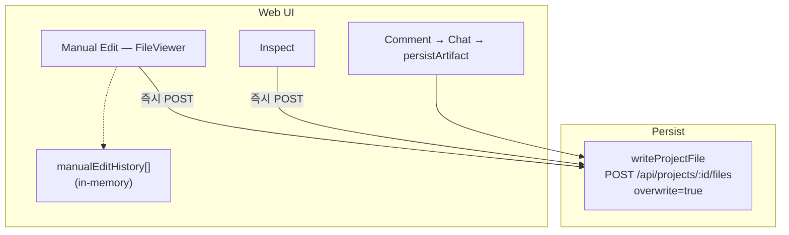
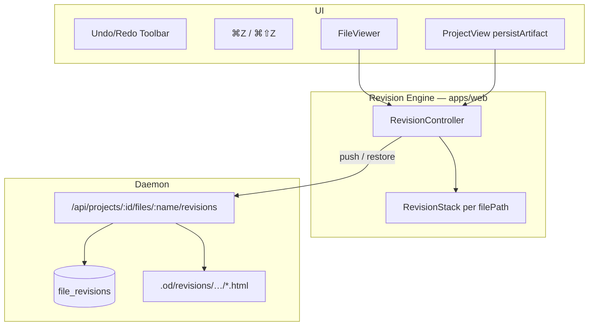

# 50 Undo/Redo 설계

**문서 번호:** 50  
**작성:** 2026-07-30 (UTC)  
**상위 SSOT:** [01 통합 아키텍처](./01_통합_아키텍처.md) · [33 프로젝트 다운로드·Export](./33_프로젝트_다운로드_Export_아키텍처.md)  
**구현 현황:** [50-1 구현현황 — undo/redo](./50-1-구현현황-undo_redo.md)  
**대상 브랜치:** `feat/undo-redo` (base: `staging`)  
**상태:** 설계 확정 · Phase 0~4 완료 (cross-file는 Non-goal으로 보류)

---

## 1. 목표 / Non-goals

### 목표

사용자가 슬라이드 덱(`deck.html` 등 HTML artifact) 편집 결과를 **되돌리기(Undo)** / **다시 적용(Redo)** 할 수 있게 한다.

| 편집 경로 | 현재 (2026-07-30) | 목표 |
|-----------|-------------------|------|
| 수동 편집 (Manual Edit) | `FileViewer` in-memory history, 패널 props만 존재 | **툴바 Undo/Redo + 서버 revision 연동** |
| Inspect (CSS 튜닝) | undo 없음 | revision push + undo |
| 댓글 → AI (element/deck-patch) | 덮어쓰기만 | 편집 turn 단위 undo |
| AI 전체 덱 생성/교체 | undo 없음 | “이전 revision으로 복원” |

### Non-goals (1차)

- Google Docs 수준 실시간 협업 OT/CRDT
- 슬라이드 branching / named version (Drive publish history와 역할 분리)
- 채팅 메시지 undo
- 프로젝트 전체 multi-file transaction undo

---

## 2. 현재 상태 (As-Is)

### 2.1 편집·저장 경로



### 2.2 기존 Manual Edit history

- 타입: `ManualEditHistoryEntry` (`apps/web/src/edit-mode/types.ts`)
  - `{ id, label, patch, beforeSource, afterSource, createdAt }`
- `undoManualEdit` / `redoManualEdit` (`FileViewer.tsx`): disk에 `beforeSource` / `afterSource` POST
- 외부 저장 감지 시 `confirmManualEditHistorySource` → history clear
- **제한:** 탭 전환·새로고침·수동 편집 모드 밖 저장 시 스택 소실; **툴바 버튼 없음** (패널 props만 전달)

### 2.3 Agent 편집

- `ProjectView.persistArtifact` → element-patch / deck-patch merge → 단일 파일 overwrite
- inverse patch / snapshot 미저장 → undo 불가

### 2.4 Drive publish

- `GET /api/v1/projects/{id}/outputs` — 발행 이력 (버전 라벨)
- 파일 content revision과 별개; undo 스택과 직접 연동하지 않음

---

## 3. 설계 원칙

| # | 원칙 | 설명 |
|---|------|------|
| P1 | **Canonical truth = 디스크 revision** | 클라이언트 스택은 캐시; 서버 revision이 권위 있는 undo 기준 |
| P2 | **Snapshot-first** | 1차는 파일 전체 HTML snapshot (평균 ~80KB). diff-only는 Phase 4 |
| P3 | **Commit 단위** | manual save 1회, inspect save 1회, agent turn 1회 = revision 1개 |
| P4 | **파일 스코프** | 활성 artifact 파일(`deck.html` 등) 단위. 프로젝트 전체 undo는 범위 밖 |
| P5 | **충돌 시 invalidate** | disk content ≠ 스택 top `afterSource` → clear + 사용자 알림 (기존 정책 유지) |
| P6 | **UI/CLI dual-track** | 웹 툴바 + `od project revisions …` (AGENTS.md capability exposure) |

---

## 4. 목표 아키텍처



### 레이어 책임

| 레이어 | 책임 |
|--------|------|
| `FileViewerUndoRedoToolbar` | 툴바 버튼, disabled/busy, analytics |
| `RevisionController` | push / undo / redo / canUndo / canRedo, 충돌 감지 |
| `RevisionStack` | cursor + revision id 목록 (서버 동기화) |
| Daemon revision API | snapshot 저장·목록·restore |
| `persistArtifact` | agent 성공 시 push hook |

---

## 5. 데이터 모델

### 5.1 Contract (`packages/contracts/src/api/revisions.ts` — 신규)

```ts
export type FileRevisionSource =
  | 'manual_edit'
  | 'inspect'
  | 'agent_element_patch'
  | 'agent_deck_patch'
  | 'agent_full_deck'
  | 'import'
  | 'restore';

export type FileRevision = {
  id: string;
  projectId: string;
  fileName: string;
  parentRevisionId: string | null;
  sequence: number;              // monotonic per (projectId, fileName)
  createdAt: number;
  byteSize: number;
  source: FileRevisionSource;
  label: string;
  conversationId?: string;
  assistantMessageId?: string;
};
```

### 5.2 Snapshot 저장 경로

**상세 (RDS 관계·용량):** [50-3_revision_스냅샷_저장소_RDS_용량관리.md](./50-3_revision_스냅샷_저장소_RDS_용량관리.md)

| 모드 | 경로 |
|------|------|
| `files` (기본) | `<project-dir>/.od/revisions/<fileName>/<revisionId>.snap.gz` |
| `sqlite` | DaemonDb `file_revision_snapshots.compressed` (`OD_DATA_DIR/app.sqlite` 또는 Postgres DaemonDb — 후속) |

- **Phase 4:** gzip 압축 + parent 대비 prefix/suffix diff (더 작을 때만 diff 선택)
- sequence 1, 6, 11… 은 full checkpoint (`REVISION_FULL_SNAPSHOT_INTERVAL=5`)
- legacy `{revisionId}.html` 은 읽기 호환만 유지; 신규 write는 `.snap.gz`만 생성
- Retention: 파일당 최근 **30** revision (코드 기본), 초과 시 oldest prune — `OD_FILE_REVISION_RETENTION_LIMIT` env (2~200). **Teamver 권장:** staging/prod **20**, dev **30** — [50-3 §7.1](./50-3_revision_스냅샷_저장소_RDS_용량관리.md#71-스택-깊이-od_file_revision_retention_limit-권장값) · env example `deploy/teamver/.env.*.example`

### 5.3 클라이언트 스택

```ts
type RevisionStackState = {
  fileName: string;
  headRevisionId: string;
  cursorIndex: number;
  revisions: FileRevisionMeta[];
};
```

- **Undo:** `cursorIndex--` → restore API → iframe `?v=mtime` cache-bust
- **Redo:** `cursorIndex++` → restore
- **새 push:** cursor 이후 redo branch truncate

---

## 6. 편집 경로별 통합

### 6.1 Manual Edit

| 단계 | 동작 |
|------|------|
| save 성공 | `revisionController.push({ source: 'manual_edit', before, after, patch, label })` |
| undo/redo | `RevisionController` → restore (Phase 1부터). Phase 0는 기존 `undoManualEdit` 위임 |
| history | in-memory stack 제거 또는 서버 스택 단일화 (Phase 1) |

### 6.2 Inspect

- save 시 `source: 'inspect'`, label `"스타일 조정"`
- `<style data-od-inspect-overrides>` 포함 snapshot

### 6.3 Agent / Comment (`persistArtifact`)

push 시점: `kind: 'persisted'` 직전

```ts
await revisionController.push({
  source: mapArtifactType(artifact),
  beforeSource: currentHtmlFromDisk,
  afterSource: mergedHtml,
  label: deriveLabel(commentAttachments),
  conversationId,
  assistantMessageId,
});
```

- `scope-rejected` / `skipped-incomplete` → push 안 함

---

## 7. Daemon API

| Method | Path | 설명 |
|--------|------|------|
| `GET` | `/api/projects/:id/files/:name/revisions` | 목록 (최신순, pagination) |
| `GET` | `/api/projects/:id/files/:name/revisions/:revId` | snapshot content |
| `POST` | `/api/projects/:id/files/:name/revisions` | push (write + snapshot atomic) |
| `POST` | `/api/projects/:id/files/:name/revisions/:revId/restore` | 복원 + head 이동 |

**Push 내부 (atomic):**

1. 현재 파일 read → `before`
2. `writeProjectFile` (new content)
3. revision row + snapshot file
4. `{ revisionId, sequence, mtime }` 반환

### CLI (`od`)

```bash
od project revisions list <projectId> deck.html --json
od project revisions restore <projectId> deck.html <revisionId>
```

---

## 8. UI/UX

### 8.1 툴바 (Phase 0)

- 위치: `FileViewer` `viewer-toolbar-actions`, 편집(연필) 버튼 **왼쪽**
- 아이콘: `arrow-go-back-line` / `arrow-go-forward-line` (Draw overlay와 동일)
- i18n: `manualEdit.undo` / `manualEdit.redo`
- `data-testid`: `file-viewer-undo`, `file-viewer-redo`
- 노출: `mode === 'preview'` && HTML source loaded
- Phase 0: `manualEditHistory` / `manualEditUndone` 연동 (수동 편집만)

### 8.2 키보드 (Phase 1)

| OS | Undo | Redo |
|----|------|------|
| macOS | ⌘Z | ⌘⇧Z |
| Windows/Linux | Ctrl+Z | Ctrl+Y 또는 Ctrl+Shift+Z |

- 입력 필드 focus 시 무시
- `manualEditSaving` 중 block

### 8.3 피드백

- disabled + tooltip (`되돌릴 편집이 없습니다`)
- undo 중 toolbar spinner
- 충돌 toast: 기존 manual edit 문구 재사용
- AI 편집 성공 toast에 “실행 취소” CTA (Phase 2)

### 8.4 History panel (Phase 3)

- 사이드 패널: 시간순 revision 목록, source 아이콘, “이 시점으로 복원”

---

## 9. 충돌·동시성

| 상황 | 정책 |
|------|------|
| undo 중 agent turn 완료 | turn 완료 후 stack refresh; undo 중이면 queue 또는 block |
| 탭 전환 | 파일별 독립 stack |
| 새로고침 | `GET revisions`로 stack 재구성 |
| multi-tab 동일 프로젝트 | `sequence` 기준; stale restore → 409 + refresh |
| Drive publish | publish는 revision 참조만; undo 대상 아님 |

---

## 10. 단계별 롤아웃

| Phase | 내용 | 산출물 |
|-------|------|--------|
| **0** | 툴바 Undo/Redo UI + manual history 위임 | `FileViewerUndoRedoToolbar`, 테스트 |
| **1** | Daemon revision store + manual undo 서버화 | API, `RevisionController`, CLI |
| **2** | `persistArtifact` push + AI undo CTA | agent 편집 undo |
| **3** | Inspect push + History panel | 사이드 패널 |
| **4** | delta storage, cross-file (요구 시) | 용량 최적화 |

---

## 11. 용량·성능

- `deck.html` ~80KB × 30 revisions ≈ 2.4MB/파일
- push: write + 1 fs copy (동기, 수 ms)
- restore: `writeProjectFile` + iframe mtime cache-bust

---

## 12. 불변식 (구현 시 검증)

| # | 불변식 |
|---|--------|
| I1 | undo/redo는 **활성 파일** content만 변경; 다른 탭 파일 무영향 |
| I2 | restore 후 `mtime` 갱신 → preview iframe reload |
| I3 | stub-guard / publication-guard는 restore에도 적용 |
| I4 | `scope-rejected` artifact는 revision push 금지 |
| I5 | analytics: `revision_push`, `revision_undo`, `revision_redo` |

---

## 13. 구현 파일 맵

| 영역 | 경로 |
|------|------|
| 설계 | `docs-teamver/50_undo_redo_설계.md` |
| 현황 | `docs-teamver/50-1-구현현황-undo_redo.md` |
| Canvas vs Design 비교 | `docs-teamver/50-2_Teamver_Canvas_vs_Design_Undo_비교.md` |
| 툴바 UI | `apps/web/src/components/FileViewerUndoRedoToolbar.tsx` |
| Manual history | `apps/web/src/components/FileViewer.tsx` |
| Contract (P1) | `packages/contracts/src/api/revisions.ts` |
| Daemon (P1) | `apps/daemon/src/projects.ts`, `project-routes.ts`, `db.ts` |
| Agent hook (P2) | `apps/web/src/components/ProjectView.tsx` |
| CLI (P1) | `apps/daemon/src/cli.ts` |
| Tests | `apps/web/tests/components/FileViewer.undo-redo-toolbar.test.tsx` |

---

## 14. 오픈 질문 (제품)

1. Undo 라벨: 파일 단위 vs 대화 turn 단위 표시?
2. AI가 1슬라이드만 변경해도 전체 snapshot — UI에 “슬라이드 N 수정” 라벨?
3. Drive publish된 revision undo 시 경고만 vs 차단?

---

## 15. 참고

- Manual edit history: `apps/web/src/edit-mode/types.ts` — `ManualEditHistoryEntry`
- **Teamver Canvas vs Design undo 비교:** [50-2 Teamver Canvas vs Design Undo/Redo 비교](./50-2_Teamver_Canvas_vs_Design_Undo_비교.md)
- Draw overlay undo UI: `apps/web/src/components/PreviewDrawOverlay.tsx` (아이콘·패턴 참고)
- Drive publish history: `TeamverDrivePublishHistory` (별도 제품 surface)
