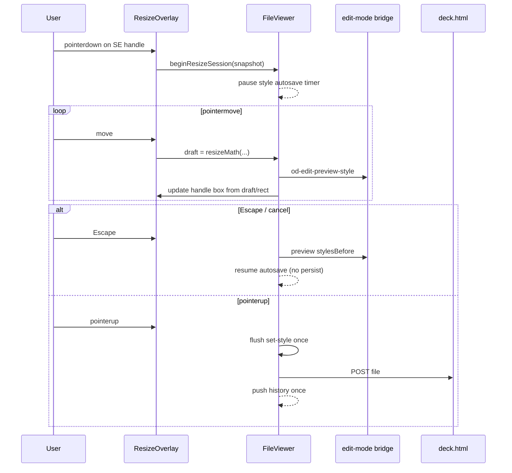
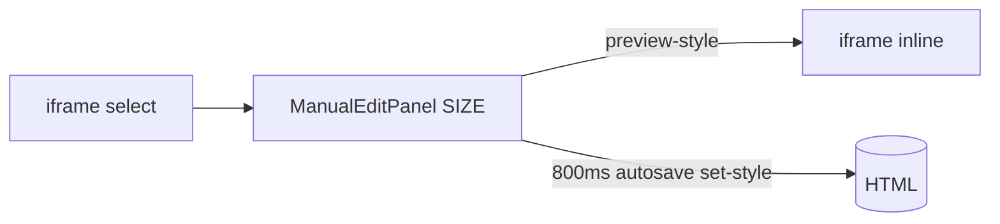
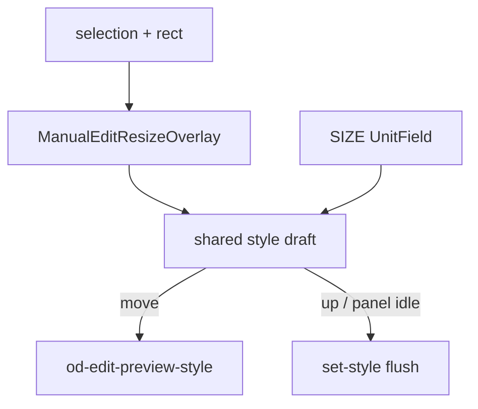
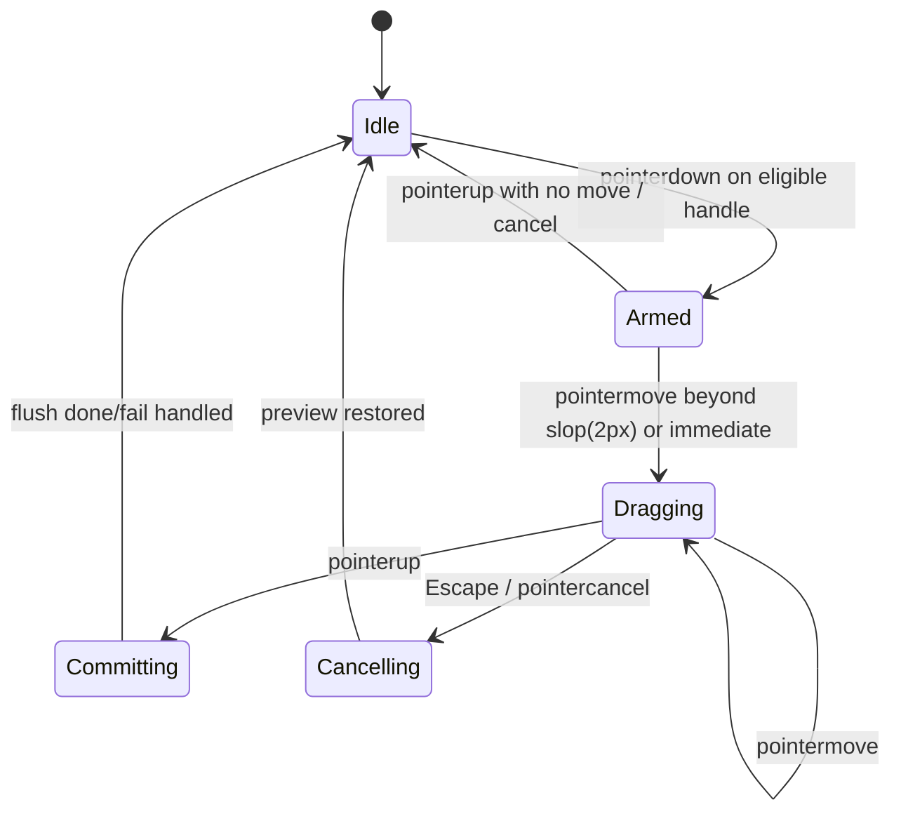

# 51-1 설계 — Manual Edit 요소 박스 드래그 리사이즈

**문서 번호:** 51-1 (설계)  
**기획:** [51-0 기획](./51-0_수동편집_드래그_리사이즈_기획.md)  
**구현 현황:** [51-2 구현현황](./51-2_수동편집_드래그_리사이즈_구현현황.md)  
**작성:** 2026-07-30 (UTC) · 보강판  
**상태:** 설계 SSOT (구현 전)

---

## 0. 변경 로그 (문서)

| 날짜 | 내용 |
|------|------|
| 2026-07-30 | 초안을 루트 `51_*`로 작성 |
| 2026-07-30 | 시리즈 00 폴더로 이관 후 보강 |
| 2026-07-30 | **폴더 폐기 → 루트 51-0 / 51-1 / 51-2 재편** |

---

## 1. 설계 요약

| 항목 | 결정 |
|------|------|
| 인터랙션 | 선택 요소 위 **Host overlay 8핸들** 드래그 |
| 미리보기 | `od-edit-preview-style` (기존) |
| 저장 | pointerup 시 `set-style` **1회** + history **1 entry** |
| 좌표 | 이미 검증된 `target.rect * previewScale` (플로팅 패널과 동일) |
| 수식 | 순수 함수 `resize-math.ts` (프레임 독립 테스트) |
| 위치 이동 | **비범위** |



---

## 2. As-Is / To-Be

### 2.1 As-Is



- 핸들 없음 (`bridge.ts` outline만)
- SIZE: `UnitField` width/height (`ManualEditPanel.tsx`)
- Persist: `manual-edit-style-persist.ts` + `source-patches.ts`

### 2.2 To-Be

드래그가 **SIZE 필드의 또 다른 입력면**이 된다. 상태·저장 경로는 패널과 공유한다.



---

## 3. 원칙 (Normative)

| ID | 원칙 | MUST / SHOULD |
|----|------|----------------|
| P1 | 디스크 HTML이 SSOT. 드래그는 UX | MUST |
| P2 | drag move ≠ persist. persist는 up/cancel 경계에서만 | MUST |
| P3 | Host overlay (iframe 내부 핸들 금지 — Phase 1) | MUST |
| P4 | 좌표 basis = `manualEditFloatingPanelStyle` 과 동일 | MUST |
| P5 | 패널 SIZE ↔ draft 단일 소스 | MUST |
| P6 | resize commit 1세션 = history 1개 | MUST |
| P7 | 인라인 텍스트 편집(`text-active`) 중 리사이즈 시작 금지 | MUST |
| P8 | Draw / Comment 모드와 overlay 동시 mount 금지 | MUST |
| P9 | slide root·token·hidden 은 핸들 없음 | MUST |
| P10 | 순수 수식은 DOM/React 없이 테스트 가능 | SHOULD |

---

## 4. 자격 (어떤 요소에 핸들을 그릴까)

`canResizeTarget(target): boolean`

| 조건 | 결과 |
|------|------|
| Edit 모드 아님 | ❌ |
| selection 없음 / `isHidden` | ❌ |
| `kind === 'token'` | ❌ |
| 인라인 텍스트 편집 중 | ❌ |
| tag/class가 slide root (`section.slide` / `[data-slide]` 등, 헬퍼로 판별) | ❌ |
| `rect.width < 4` 또는 `rect.height < 4` (bridge discovery와 동일) | ❌ |
| 그 외 `text` / `link` / `image` / `container` | ✅ |

slide root 판별 헬퍼(안):

```ts
function isDeckSlideRoot(target: ManualEditTarget): boolean {
  const tag = target.tagName.toLowerCase();
  const cls = ` ${target.className} `;
  return (
    (tag === 'section' || tag === 'div')
    && (/\bslide\b/.test(cls) || Boolean(target.attributes['data-slide']
      || target.attributes['data-slide-index']))
  );
}
```

(실제 DOM class 토큰 매칭은 bridge/host 중 한곳에서 SSOT로 둔다.)

---

## 5. UX 명세

### 5.1 핸들 기하

```
        NW    N    NE
         ●────●────●
         │         │
       W ●         ● E
         │         │
         ●────●────●
        SW    S    SE
```

| 항목 | 값 |
|------|-----|
| 핸들 시각 크기 | 8×8 px (@1x host). hit 영역 14×14 px |
| 테두리 | 선택 outline과 동일 `#2563eb`, 흰 fill |
| 박스 테두리 | 1.5–2px solid `#2563eb`, outline-offset 느낌으로 요소 border-box에 맞춤 |
| z-index | Draw overlay보다 아래, iframe 위. Edit 전용 레이어 |
| 커서 | N/S `ns-resize`, E/W `ew-resize`, NE/SW `nesw-resize`, NW/SE `nwse-resize` |

### 5.2 제스처

| 입력 | 동작 |
|------|------|
| pointerdown on handle | 세션 시작, `setPointerCapture` |
| pointermove | draft 갱신 + preview |
| pointerup / pointercancel | commit 또는 (cancel이면) rollback |
| Escape | rollback + 세션 종료 |
| Shift (컨테이너/텍스트) | aspect lock ON |
| Shift (이미지) | aspect lock **해제** (기본이 lock) |
| Alt | Phase 1 무시 (중심 리사이즈는 Phase 2+) |
| 더블클릭 핸들 | 없음 |

### 5.3 패널 동기화

- drag 중 UnitField는 draft px를 표시 (controlled).
- 필드 포커스 중 드래그 시작 → 필드 blur 후 드래그 우선.
- 패널 숫자 변경은 기존 autosave 유지; overlay 박스는 다음 rect/remeasure로 따라감.

### 5.4 피드백

- 드래그 중 선택 outline은 유지하되, overlay 박스가 진실.
- (선택) 박스 옆 작은 `320 × 180` 배지 — Phase 2. Phase 1은 패널 숫자로 충분.

---

## 6. 좌표 공간 (SSOT)

FileViewer는 이미 iframe→canvas 변환을 쓴다:

```ts
// apps/web/src/components/FileViewer.tsx — manualEditFloatingPanelStyle
const targetLeft = target.rect.x * scale;   // scale === previewScale
const targetTop  = target.rect.y * scale;
```

bridge `rect`는 iframe viewport의 `getBoundingClientRect()` (콘텐츠 CSS px, round).

### 6.1 정의

| 심볼 | 의미 |
|------|------|
| \(R_c = (x_c, y_c, w_c, h_c)\) | content 좌표 (iframe), bridge `rect` |
| \(s\) | `previewScale` (> 0) |
| \(R_h = (x_c s,\ y_c s,\ w_c s,\ h_c s)\) | host/canvas 좌표 (overlay 배치) |
| \(\Delta_h\) | pointer delta in host px |
| \(\Delta_c = \Delta_h / s\) | content delta |

### 6.2 Overlay 배치

핸들 박스의 host top-left / size = \(R_h\).  
캔버스 클리핑 밖으로 나가면 핸들은 clamp하지 않고 **잘릴 수 있음** (플로팅 패널과 동일 정책). 스크롤/슬라이드 변경 시 selection remasure 필수.

### 6.3 주의: 이중 scale

- Host shell `transform: scale(previewScale)` 와 bridge rect가 **이미 iframe layout 좌표**인 점을 혼동하지 말 것.
- Draw overlay의 snapshot scaleX/Y와 별개일 수 있음 → **resize는 floating panel helper를 재사용**하고 Draw 경로를 복제하지 않는다.
- 공통 헬퍼 추출 권장:

```ts
// edit-mode/preview-coords.ts (신설 후보)
export function contentRectToHostRect(rect: ManualEditRect, previewScale: number): ManualEditRect
export function hostDeltaToContentDelta(dx: number, dy: number, previewScale: number): { dx: number; dy: number }
```

---

## 7. 리사이즈 수식 (`resize-math.ts`)

### 7.1 타입

```ts
export type ResizeHandle = 'n' | 's' | 'e' | 'w' | 'ne' | 'nw' | 'se' | 'sw';

export type ResizeSessionStart = {
  /** border-box, content px — getBoundingClientRect 기준 */
  startRect: { x: number; y: number; width: number; height: number };
  /** 시작 시 적용할 명시 style (없으면 computed px 스냅 결과) */
  startWidthPx: number;
  startHeightPx: number;
  aspect: number; // width/height, height>0
  handle: ResizeHandle;
  aspectLock: boolean;
  minWidth: number;  // 24
  minHeight: number; // 24
};

export type ResizeMathInput = ResizeSessionStart & {
  /** content-space pointer delta from pointerdown */
  dx: number;
  dy: number;
};

export type ResizeMathResult = {
  widthPx: number;
  heightPx: number;
  /** Phase 1: position 변경 없음. 예약 필드(항상 startRect.x/y) */
  x: number;
  y: number;
};
```

### 7.2 축 기여

핸들이 만지는 엣지:

| handle | Δwidth 부호 | Δheight 부호 |
|--------|-------------|--------------|
| e | +dx | 0 |
| w | −dx | 0 |
| s | 0 | +dy |
| n | 0 | −dy |
| se | +dx | +dy |
| sw | −dx | +dy |
| ne | +dx | −dy |
| nw | −dx | −dy |

Phase 1은 **위치(x/y)를 소스에 쓰지 않는다**.  
서/북 핸들은 “반대편 엣지 고정”이 시각적으로 맞으려면 left/top도 바꿔야 하지만, 일반 flow 레이아웃 HTML에서는 left/top이 없거나 static이라 **서/북 드래그 시 박스가 반대쪽으로 자라는 것처럼 보일 수 있음**.

**Phase 1 제품 결정 (채택):**

- **동·남·남동(E/S/SE) 핸들만 1차 활성** 해도 되고,
- 또는 8핸들 모두 width/height만 변경하고 **레이아웃상 성장 방향은 CSS flow에 위임** (문서화·QA로 수용).

→ **채택: 8핸들 모두 제공하되, persist는 width/height만.**  
서/북의 “앵커 고정”은 Phase 3(위치) 또는 `position:absolute` 요소에 한정한 Phase 2로 미룬다.  
QA 노트에 “flow 레이아웃에서 W/N 핸들은 반대편 성장으로 보일 수 있음”을 명시.

### 7.3 기본 갱신 (aspectLock = false)

```
w' = clamp(startWidthPx  + signW * dx, minWidth,  +∞)
h' = clamp(startHeightPx + signH * dy, minHeight, +∞)
```

엣지 핸들은 해당 축만 갱신.

### 7.4 aspectLock = true

시작 `aspect = startWidthPx / startHeightPx`.

코너:

1. 주 축을 **절댓값이 큰 delta**로 선택 (또는 SE 기준 dx 우선 — 테스트로 고정).
2. `w' = clamp(...)`, `h' = w' / aspect` (또는 역).
3. 둘 다 min에 걸리면 min을 만족하는 쪽으로 재클램프.

엣지 + lock:

- E/W만 움직일 때 `h' = w' / aspect`
- N/S만 움직일 때 `w' = h' * aspect`

### 7.5 단위·스냅

| 시작 style | 동작 |
|------------|------|
| `320px` / `12rem` 등 절대 단위 | computed px를 start로 스냅 → persist는 **px** |
| `%` / `auto` / 빈 값 | `getBoundingClientRect` w/h를 start로 스냅 → persist **px** |
| `minHeight`만 있고 height auto | height 핸들 사용 시 height px를 **명시 기록**. minHeight는 건드리지 않음 (Phase 1) |

반올림: 표시·저장 모두 `Math.round` px.

### 7.6 순수 함수 계약 (테스트 고정)

```ts
export function computeResize(input: ResizeMathInput): ResizeMathResult
export function aspectLockForTarget(kind: ManualEditKind, shiftKey: boolean): boolean
// image: lock = !shiftKey
// else:  lock = shiftKey
```

---

## 8. 세션 상태머신



### 8.1 세션 객체 (host)

```ts
type ManualEditResizeSession = {
  targetId: string;
  handle: ResizeHandle;
  start: ResizeSessionStart;
  /** styles to restore on cancel (partial ManualEditStyles) */
  stylesBefore: Partial<ManualEditStyles>;
  lastDraft: Partial<ManualEditStyles>;
  pointerId: number;
};
```

### 8.2 autosave 상호작용

| 시점 | 동작 |
|------|------|
| 세션 시작 | `MANUAL_EDIT_STYLE_AUTOSAVE` 타이머 **clear + pause** |
| Dragging | preview만. pending draft는 메모리에 유지하되 **flush 금지** |
| Committing | `flushManualEditStyleSave` 1회. 성공 후 pause 해제. **실패 시 Cancelling과 동일 keyed 롤백** (`stylesBefore`). handle click/jitter(`previewed=false`)는 no-op |
| Cancelling | pending geometry 키 제거 + stylesBefore preview, pause 해제, **POST 없음**. Esc도 `previewed`일 때만 |
| W/N absolute | CSS left/top은 CB, overlay/rect.x/y는 `startRect+Δ` (`resizeViewportOrigin`). remasure가 viewport·offset* 갱신 |

기존 `shouldFlushManualEditStylesOnTargetBoundary`: 드래그 중 선택 변경 불가(pointer capture). 만약 외부에서 selection clear가 오면 cancel과 동일.

### 8.3 history

- Committing 성공 시 기존 Manual Edit history push **1회**.
- label 예: `Resize: {target.label}`.
- Dragging 중 undo 스택에 중간 프레임을 넣지 않음.

---

## 9. 모듈 분해

| 모듈 | 책임 | 의존 |
|------|------|------|
| `edit-mode/resize-math.ts` | 순수 수식 | types만 |
| `edit-mode/preview-coords.ts` | content↔host rect/delta | types |
| `edit-mode/resize-session.ts` | 세션 상태 전환 (순수+얇은) | resize-math |
| `components/ManualEditResizeOverlay.tsx` | 핸들 UI + pointer | session callbacks |
| `FileViewer.tsx` | mount 조건, preview/commit 배선, autosave pause | 기존 persist |
| `bridge.ts` | (Phase 1 최소) 변경 없음 또는 `od-edit-remeasure` | — |
| `ManualEditPanel.tsx` | draft 표시만 — 새 API 최소화 | shared draft props |

### 9.1 Overlay props (안)

```ts
type ManualEditResizeOverlayProps = {
  target: ManualEditTarget;
  previewScale: number;
  draftWidthPx: number | null;
  draftHeightPx: number | null;
  disabled?: boolean;
  onResizePreview: (styles: Partial<ManualEditStyles>) => void;
  onResizeCommit: (styles: Partial<ManualEditStyles>) => void;
  onResizeCancel: () => void;
};
```

드래그 중 박스 크기는 `draft*`가 있으면 그것을 host rect로 변환해 그리고, 없으면 `target.rect`를 쓴다.

---

## 10. 메시지 계약

새 HTTP 없음. CLI N/A.

| 방향 | type | Phase | 페이로드 |
|------|------|-------|----------|
| Host→iframe | `od-edit-preview-style` | 1 | 기존 `{ id, styles, version }` |
| Host→iframe | `od-edit-remeasure` | 2 | `{ id }` — 선택 요소 rect 재전송 요청 |
| iframe→Host | `od-edit-select` | 1 | 기존 (rect 포함) |
| iframe→Host | `od-edit-rect` | 2 | `{ id, rect }` — drag 중 추적 |

Phase 1은 commit 후 기존 select/targets 갱신으로도 충분할 수 있다.  
드래그 중 박스 추적: **draft px → host overlay 직접 갱신** (remeasure 없이도 MVP 가능).

---

## 11. Persist 상세

### 11.1 patch shape

```ts
{
  id: targetId,
  kind: 'set-style',
  styles: {
    width: `${widthPx}px`,
    // height 축을 건드린 세션만 포함
    height?: `${heightPx}px`,
  }
}
```

- E/W만 움직이면 `height` 키를 **omit** (기존 computed/auto 유지).
- S/N만 움직이면 `width` omit.
- 코너·aspectLock이면 둘 다 포함.

### 11.2 실패

- preview 적용 실패: 기존 `od-edit-preview-style-applied` ok=false 처리. 세션은 유지, 다음 move 재시도.
- commit POST 실패: pending은 `restoreManualEditPendingStyleAfterFailedFlush`로 복구한 뒤, commit이 넘긴 `stylesBefore`로 iframe/draft를 keyed 롤백 (`rollbackManualEditGestureStyles`). 디스크·미리보기 불일치를 남기지 않는다.

---

## 12. 모드·레이어 배타

| 모드 | Resize overlay |
|------|----------------|
| Preview | unmount |
| Edit | mount if `canResizeTarget` |
| Comment AI | unmount |
| Tweaks | unmount |
| Draw | unmount |

텍스트 더블클릭 편집 진입 시: 진행 중 세션이면 cancel, overlay 핸들 pointer-events none.

---

## 13. teamver-slide 참고 매핑

| teamver-slide 개념 (예상) | OD 매핑 |
|---------------------------|---------|
| resize handle hit test | `ManualEditResizeOverlay` host hit |
| pointer capture drag | 동일 |
| live size vs commit | `preview-style` / `set-style` |
| aspect lock | `aspectLockForTarget` |
| min size | 24px constants |
| object x/y on W/N resize | **미포트** (Phase 1 non-goal) |

확보 후 00-2 표에 레포·파일 경로를 채운다. 없어도 OD 단독 구현 가능.

---

## 14. 구현 Phase

### Phase 0 — 문서·기본값

- [x] 51-0 기획 / 51-1 설계 / 51-2 현황
- [ ] requirements non-goal 한 줄 개정
- [ ] teamver-slide 경로 기입 (가능 시)

### Phase 1 — MVP

1. `resize-math` + vitest (표 §7 케이스)
2. `preview-coords` 헬퍼 (+ floating panel이 동일 헬퍼 쓰도록 리팩터 가능하면)
3. `ManualEditResizeOverlay`
4. FileViewer: 세션·autosave pause·commit/cancel
5. 패널 draft 동기화
6. staging 수동 QA 체크리스트 (§16)

### Phase 2

- Shift/이미지 aspect 정책 폴리시 고정 검증
- `od-edit-rect` live tracking
- absolute 요소 W/N 앵커 보정 (선택)
- Playwright smoke
- undo(50) revision과 commit 단위 정합

### Phase 3 — 별도 기획

- 위치 이동 (layout DnD) — 본 51 시리즈가 아닌 **새 문서 번호**

---

## 15. 테스트 계획

### 15.1 단위 — `resize-math`

| 케이스 | 기대 |
|--------|------|
| SE +dx+20 +dy+10, no lock | w+20, h+10 |
| E +dx+20 | w+20, h 불변 |
| SE + lock aspect 2:1 | 비율 유지 |
| clamp min 24 | w/h ≥ 24 |
| image lock default / shift unlock | `aspectLockForTarget` |
| hostΔ→contentΔ scale 0.75 | dx_c = dx_h/0.75 |

### 15.2 단위 — session

| 케이스 | 기대 |
|--------|------|
| move then up | preview N회 + commit 1 |
| Escape | preview restore, commit 0 |
| autosave pause | drag 중 flush 호출 0 |

### 15.3 회귀

- `edit-mode/source-patches`, `bridge`, `manual-edit-style-persist` 기존 테스트 유지

### 15.4 수동 QA (§16)

---

## 16. 수동 QA 체크리스트 (staging)

- [x] zoom 100% / 75% 에서 핸들이 카드 모서리에 붙음 — e2e zoom 75%
- [x] SE 드래그 → 소스 inline width/height px 갱신 — e2e persist (+ image SE)
- [x] E만 드래그 → height 스타일 키 불필요하게 생기지 않음 — e2e E-only + unit
- [x] 이미지 코너: 기본 비율 유지, Shift로 해제 — e2e aspect + unit Shift unlock
- [x] 텍스트 박스 width 드래그, fontSize 불변 — unit `resizeResultToStyles` keys
- [x] `.slide` / `data-slide` 선택 시 핸들 없음 — e2e slide-root
- [x] Esc 취소 시 디스크 불변 — e2e Escape
- [x] 드래그 후 패널 숫자 일치, undo 1스텝에 리사이즈 전체 취소 — draft sync + flush 1회/`Resize:` label
- [x] Draw 모드 전환 시 overlay 사라짐 — e2e Draw
- [x] 인라인 텍스트 편집 중 핸들 비활성 — unit `canResizeTarget({ inlineTextEditing })`

---

## 17. 리스크와 완화

| 리스크 | 심각도 | 완화 |
|--------|--------|------|
| W/N 핸들 시각 앵커 불일치 (flow) | 중 | QA 문서화; absolute만 Phase 2 보정 |
| scale 이중 적용 | 고 | floating panel과 동일 헬퍼 강제 |
| autosave 레이스 | 고 | 세션 pause (§8.2) |
| agent/deck `transform` on ancestor | 고 | `layoutWidth`/`layoutHeight`=`offsetWidth`/`Height`; resize start+Δ는 layout 공간. `rect`는 overlay 전용(visual) |
| `%` → px 스냅 후 반응형 깨짐 | 중 | 의도적; 패널과 동일. 추후 “단위 유지”는 Phase 2+ |
| overlay가 iframe 클릭 가로채기 | 중 | 핸들 외 영역 `pointer-events: none` |

---

## 18. 수용 기준 (Definition of Done — Phase 1)

1. §4 자격 요소 선택 시 8핸들 표시.
2. SE/E/S 드래그로 미리보기·소스 크기 변경 확인.
3. commit 1회 / Esc 시 0회 POST.
4. zoom 75% 핸들 정렬 수동 QA 통과.
5. 기존 Manual Edit style 테스트 그린.
6. [51-2](./51-2_수동편집_드래그_리사이즈_구현현황.md) Phase 1 항목 전부 `[x]`.

---

## 19. 관련 코드 인덱스

| 경로 | 역할 |
|------|------|
| `apps/web/src/edit-mode/bridge.ts` | select/rect/preview-style |
| `apps/web/src/edit-mode/types.ts` | `ManualEditStyles`, `ManualEditRect` |
| `apps/web/src/edit-mode/source-patches.ts` | set-style persist |
| `apps/web/src/edit-mode/manual-edit-style-persist.ts` | autosave/flush |
| `apps/web/src/components/ManualEditPanel.tsx` | SIZE UnitField |
| `apps/web/src/components/FileViewer.tsx` | `manualEditFloatingPanelStyle`, mode host |
| `apps/web/src/components/PreviewDrawOverlay.tsx` | overlay 패턴 참고(좌표 SSOT는 아님) |

---

## 20. 결정 로그

| ID | 결정 | 일자 |
|----|------|------|
| D1 | Host overlay 채택 (iframe 핸들 비채택) | 2026-07-30 |
| D2 | 위치 이동 비범위 | 2026-07-30 |
| D3 | 이미지 기본 aspect lock, 기타 Shift-lock | 2026-07-30 |
| D4 | Phase 1 persist = width/height only; W/N 앵커 보정 연기 | 2026-07-30 |
| D5 | 문서 번호를 루트 **51-0 / 51-1 / 51-2** 로 재편 (폴더 없음) | 2026-07-30 |
