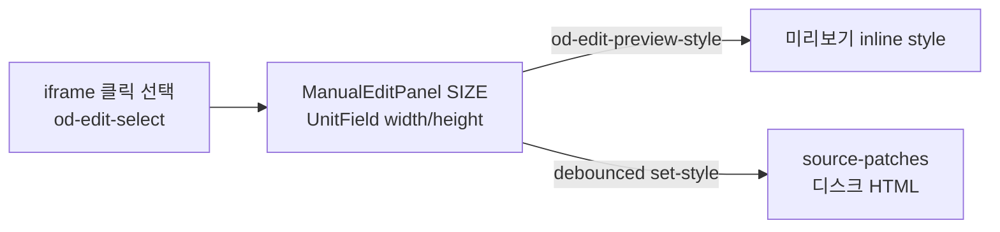
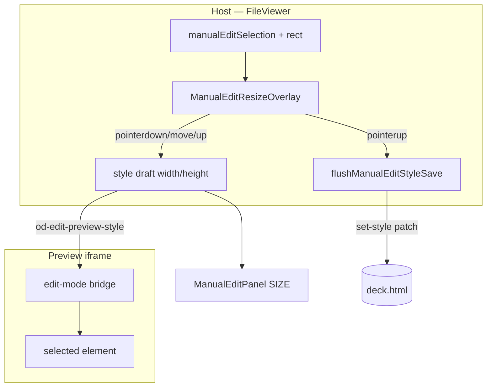

# 51 수동 편집 — 요소 박스 드래그 리사이즈 설계

**문서 번호:** 51  
**작성:** 2026-07-30 (UTC)  
**상위 SSOT:** [specs/current/manual-edit-mode-requirements.md](../specs/current/manual-edit-mode-requirements.md) · [50 Undo/Redo 설계](./50_undo_redo_설계.md)  
**구현 현황:** [51-1 구현현황 — 드래그 리사이즈](./51-1-구현현황-수동편집_드래그_리사이즈.md)  
**상태:** 설계 (구현 전) · 제품 확인 대기

---

## 1. 문제 / 동기

Manual Edit에서 요소(카드·이미지·컨테이너 등) 크기를 바꾸려면 플로팅 패널 **SIZE → Width / Height** 숫자 입력이 유일한 경로다.

| 현재 | 사용자 기대 |
|------|-------------|
| px 값 직접 입력 + autosave | 선택 박스 **핸들 드래그**로 크기 조절 |
| 미리보기에서 outline만 표시 | Figma / PowerPoint / teamver-slide 도형처럼 코너·엣지 핸들 |
| 비율 유지 수단 없음 | Shift(또는 코너)로 종횡비 잠금 |

숫자 입력은 정밀 조정용으로 유지하되, **1차 인터랙션은 드래그 리사이즈**로 올린다.

---

## 2. 목표 / Non-goals

### 목표 (Phase 1)

1. Edit 모드에서 요소 선택 시 **리사이즈 핸들** 표시.
2. 핸들 드래그로 `width` / `height` 실시간 미리보기.
3. pointerup 시 기존 `set-style` 경로로 소스 저장 (디스크 SSOT 유지).
4. 패널 SIZE 필드와 **양방향 동기화**.
5. preview zoom / deck scale 아래에서 좌표가 어긋나지 않을 것.

### Non-goals (1차)

| 항목 | 이유 |
|------|------|
| 자유 이동(드래그로 `left`/`top`/`transform` 위치 변경) | requirements v1 non-goal “Drag-and-drop layout”과 충돌. **리사이즈만** 예외적으로 허용 |
| 회전 / skew | 벡터 에디터 범위 |
| 멀티 셀렉트 일괄 리사이즈 | 선택 모델 미비 |
| class / stylesheet 규칙 수정 | Manual Edit는 inline `set-style` SSOT |
| AI 호출 | Comment AI 경로와 분리 |
| `min-width` / `max-*` 핸들 UI | Phase 2 후보 |

> **스펙 개정 메모:** `manual-edit-mode-requirements.md` Non-Goals의 “Drag-and-drop layout editing”은 **위치 이동·레이아웃 재배치**를 뜻한다. 본 문서는 **박스 크기 드래그**만 허용하도록 해석·개정한다 (구현 PR에서 requirements 한 줄 갱신).

---

## 3. As-Is (현재 구현)



| 영역 | 경로 | 역할 |
|------|------|------|
| 패널 SIZE | `apps/web/src/components/ManualEditPanel.tsx` | Width/Height `UnitField` |
| 브릿지 | `apps/web/src/edit-mode/bridge.ts` | 선택/hover outline, `od-edit-preview-style` — **핸들 없음** |
| 패치 | `apps/web/src/edit-mode/source-patches.ts` | `set-style` → inline CSS |
| 호스트 | `FileViewer.tsx` | selection, autosave flush, history |
| 타입 | `ManualEditStyles.width/height/minHeight` | 이미 존재 |

---

## 4. 참고: teamver-slide 도형 리사이즈

이 저장소(`ns-open-design`)에는 **teamver-slide 도형 리사이즈 코드가 없다**  
(`vendor/teamver`는 app-sdk만, shape handle / proportional resize 미포함).

구현 착수 시 **형제 저장소 `teamver-slide` (또는 ns-teamver-slide)** 에서 아래를 포팅·대조한다.

| 참고할 것 | OD에 옮길 때 |
|-----------|--------------|
| 8-핸들(또는 4코너) hit 영역 / 커서 | host overlay 또는 bridge chrome |
| pointer capture + delta → size | 동일 수식, 단위는 CSS px |
| Shift / 코너 비율 잠금 | `aspectLock` 플래그 |
| 최소 크기 clamp | `MIN_W` / `MIN_H` (예: 24px) |
| 드래그 중 라이브 vs commit 분리 | OD의 `preview-style` / `set-style` 에 매핑 |

OD 쪽이 다른 점:

- 캔버스가 **sandboxed iframe + srcDoc** 이고, deck preview에 **host zoom / deck-stage scale** 이 있음.
- 소스는 HTML artifact — 결과는 반드시 **inline `width`/`height`(및 필요 시 `minHeight`)** 로 persist.
- 선택 identity는 `data-od-id` / runtime-id / source-path.

teamver-slide 경로를 이 문서에 확정 기입하지 못한 경우, Phase 0에서 담당자가 레포 URL·파일 경로를 [51-1](./51-1-구현현황-수동편집_드래그_리사이즈.md)에 기입한다.

---

## 5. 설계 원칙

| # | 원칙 | 설명 |
|---|------|------|
| P1 | **소스 SSOT** | 드래그는 UX만; 최종 값은 기존 `set-style` / `applyManualEditPatch` |
| P2 | **미리보기 ≠ 저장** | drag move → `od-edit-preview-style`; pointerup → flush `set-style` (패널 autosave와 동일 계약) |
| P3 | **Host overlay 핸들 (권장)** | iframe 안 핸들은 contenteditable·agent CSS·pointer 충돌이 잦음. Draw overlay(`PreviewDrawOverlay`)와 같이 **호스트가 iframe 위 레이어**로 핸들을 그림 |
| P4 | **좌표는 iframe content → host** | `target.rect`(iframe viewport) + iframe getBoundingClientRect + preview scale 보정 |
| P5 | **패널과 단일 상태** | drag 중/후 WIDTH/HEIGHT UnitField가 같은 draft를 읽음 |
| P6 | **Undo는 50과 공유** | resize commit 1회 = history entry 1개 (드래그 프레임마다 push 금지) |
| P7 | **텍스트 인라인 편집과 상호배타** | `data-od-editing` / text-active 중에는 리사이즈 시작 불가 |

---

## 6. UX 명세

### 6.1 핸들 표시

- 대상: Edit 모드 + 선택 요소가 **리사이즈 가능 kind**일 때.
- 기본 8 핸들: N, S, E, W, NE, NW, SE, SW.
- 비주얼: 선택 outline과 동일 블루 계열, 8×8~10px 정사각(또는 원), 호스트 overlay.
- 텍스트 leaf(`kind === 'text'`)도 **박스(폭/줄박스)** 리사이즈 허용 — 폰트 크기 변경이 아님 (`fontSize`는 패널 typography 유지).
- `kind === 'token'` / 숨김 요소: 핸들 없음.
- slide root(`.slide` 전체) 리사이즈: **1차 비활성** (덱 프레임이 깨짐). 선택 시 패널 숫자만.

### 6.2 드래그 동작

| 입력 | 동작 |
|------|------|
| 엣지 드래그 | 해당 축만 변경 (E/W → width, N/S → height) |
| 코너 드래그 | width+height 동시. **기본 자유 비율** |
| Shift + 드래그 | 시작 시점 aspect ratio 유지 |
| Alt (옵션, Phase 2) | 중심 기준 리사이즈 — 1차 미구현 |
| Escape | 드래그 취소 → preview rollback to pre-drag styles |
| pointerup | commit |

최소 크기: `width ≥ 24px`, `height ≥ 24px` (이미지·컨테이너 공통).  
`height: auto` 인 요소: 세로 핸들 드래그 시 명시적 `height` px를 기록 (현재 렌더된 computed height에서 시작).

### 6.3 패널 동기화

- 드래그 중: UnitField에 실시간 px 반영 (입력 포커스와 충돌 시 drag 우선, 필드 blur).
- 패널에서 숫자 변경: 기존과 동일; 핸들 박스도 rect 갱신.

### 6.4 커서

핸들별 `ns-resize` / `ew-resize` / `nwse-resize` / `nesw-resize`.  
드래그 중 `user-select: none`, iframe `pointer-events`는 호스트가 capture하는 동안 무시 가능.

---

## 7. 아키텍처

### 7.1 권장: Host Resize Overlay



**새 모듈 (안):**

| 파일 | 책임 |
|------|------|
| `apps/web/src/edit-mode/resize-math.ts` | delta → width/height, aspect lock, clamp, edge flags — **순수 함수, 테스트 용이** |
| `apps/web/src/components/ManualEditResizeOverlay.tsx` | 핸들 DOM, pointer events, host 좌표 |
| `FileViewer.tsx` (배선) | selection rect → overlay; draft/commit 훅 연결 |
| `bridge.ts` (소폭) | drag 중 `od-edit-rect` 주기 보고 또는 preview 후 rect remeasure 요청 |

Draw overlay와 z-index / mode 배타: Edit 모드에서만 resize overlay mount. Draw·Comment와 동시 표시 금지.

### 7.2 대안 B: iframe 내부 핸들 (비권장 1차)

bridge CSS로 `::after` 핸들 + iframe pointer 처리.  
장점: 좌표 단순. 단점: agent `overflow:hidden`, stacking, contenteditable 충돌, host zoom 보정 여전히 필요.  
→ **Phase 1은 Host overlay 고정.** 문제 시에만 B 재검토.

### 7.3 좌표 변환

```
hostHandlePoint = iframeOffset + target.rect * previewScale
```

- `target.rect`: bridge가 `getBoundingClientRect()`로 보낸 iframe viewport 좌표.
- `previewScale`: FileViewer / deck-fit 이 iframe에 적용하는 CSS transform scale (이미 draw/comment overlay가 쓰는 값 재사용).
- 드래그 delta(host px) → content px: `deltaContent = deltaHost / previewScale`.

### 7.4 Persist 계약

드래그 세션:

1. **pointerdown:** snapshot `stylesBefore = { width, height }` (및 computed px fallback).
2. **pointermove:** `od-edit-preview-style` only — **autosave 타이머 일시 정지** 또는 무시 (flush는 up에서만).
3. **pointerup:** 최종 `{ width: 'Npx', height: 'Mpx' }` 로 `set-style` 1회 + history 1 entry.
4. **Escape / pointercancel:** preview를 `stylesBefore`로 복구, 저장 없음.

`height`만 바꾼 경우 `width`를 불필요하게 `auto`로 덮지 말 것 — partial `ManualEditStyles` 유지.

### 7.5 slide / flex 레이아웃 주의

- flex item에 `width`/`height` inline을 넣으면 레이아웃이 기대와 다를 수 있음 → 허용 (사용자가 원한 명시 크기).
- `%` 단위 width를 가진 요소: 드래그 시작 시 **computed px로 스냅** 후 이후 px로 저장 (패널 `autoUnit`과 동일 철학).
- `box-sizing`: computed border-box 기준으로 핸들 크기 = border box (getBoundingClientRect와 일치).

---

## 8. 메시지 / API

기존 채널 확장만. 새 HTTP API 없음.

| 방향 | type | 용도 |
|------|------|------|
| Host→iframe | `od-edit-preview-style` | 기존 — drag 중 사용 |
| Host→iframe | `od-edit-remeasure` (신규, 선택) | preview 후 rect 재전송 요청 |
| iframe→Host | `od-edit-select` / hover | 기존 — rect 포함 |
| iframe→Host | `od-edit-rect` (신규, 선택) | drag 중 주기적 rect (overlay 추적) |

CLI 표면: 해당 없음 (수동 편집 UI 전용). Surface checklist에서 CLI N/A 명시.

---

## 9. 구현 Phase

### Phase 0 — 설계 확정 + 참고 코드 확보

- [x] 본 설계 문서
- [ ] teamver-slide 리사이즈 파일 경로를 51-1에 기입 (형제 레포 접근 시)
- [ ] requirements non-goal 문구 개정 PR 메모

### Phase 1 — MVP 드래그 리사이즈

- 순수 `resize-math` + vitest
- `ManualEditResizeOverlay` 8 핸들
- FileViewer 배선: preview + pointerup commit
- 패널 SIZE 동기화
- Escape 취소
- slide root 제외, token 제외
- 단위 테스트 + 수동 staging QA

### Phase 2 — 품질

- Shift aspect lock
- 이미지 기본 aspect lock (Shift 없이 비율 유지 옵션 — 제품 선택)
- drag 중 rect live tracking (`od-edit-rect`)
- `minHeight` 패널 노출과 정합
- undo(50) revision 연동 확인
- Playwright: 핸들 드래그 → 소스 width 변경 smoke (`e2e/ui` 후보)

### Phase 3 — (요구 시) 위치 이동

- 별도 기획. 본 문서 범위 밖.
- requirements의 layout DnD non-goal을 명시적으로 뒤집는 결정 필요.

---

## 10. 테스트 계획

| 층 | 내용 |
|----|------|
| 단위 | `resize-math`: edge flags, aspect lock, clamp, scale 보정 |
| 단위 | overlay: pointerdown→move→up가 preview/commit 콜백 순서 보장 (jsdom) |
| 회귀 | 기존 `edit-mode/source-patches` · `bridge` · style persist 테스트 유지 |
| 수동 | staging: zoom 100%/75%, stacked deck, flex 카드, 이미지, 텍스트 박스 |
| e2e (Phase 2) | Edit → select card → SE handle drag → file contains new width |

---

## 11. 리스크

| 리스크 | 완화 |
|--------|------|
| preview scale 오차 → 핸들 어긋남 | Draw overlay와 동일 scale helper 재사용; remasure on scroll/slide change |
| 드래그 중 autosave 레이스 | pointer capture 동안 style autosave pause |
| agent CSS `!important` / transform | preview는 기존 bridge `!important` 경로 유지; 실패 시 패널 fallback |
| 큰 텍스트 박스 height 고정 후 내용 overflow | 허용; overflow는 기존 CSS. 필요 시 Phase 2에 “높이 자동” 토글 |
| teamver-slide 미확보 | OD 독자 구현 가능 — 참고는 UX/수식 정렬용 |

---

## 12. 결정 필요 (제품)

구현 들어가기 전 확인:

1. **이미지 기본 비율 잠금?** (권장: 코너 드래그는 기본 lock, Shift로 해제 — 또는 반대)
2. **텍스트 leaf 리사이즈 허용?** (권장: Yes — width 위주)
3. **slide 섹션 전체 리사이즈 금지 확정?** (권장: Yes)
4. teamver-slide 레포 접근 권한 / 참고 파일 경로

---

## 13. 관련 문서

- [50 Undo/Redo 설계](./50_undo_redo_설계.md) — commit 단위 history
- [00 구현 내역](./00_구현_내역_누적.md) — 구현 시 최상단 갱신
- `apps/web/src/edit-mode/*` — Manual Edit 런타임
- `apps/web/src/components/PreviewDrawOverlay.tsx` — host overlay 좌표 패턴 참고
