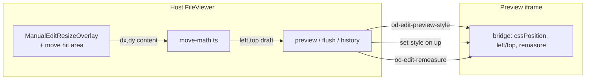

# 52-1 설계 — Manual Edit 요소 위치 이동

**문서 번호:** 52-1 (설계)  
**기획:** [52-0](./52-0_수동편집_위치_이동_기획.md) · **구현현황:** [52-2](./52-2_수동편집_위치_이동_구현현황.md)  
**선행 패턴:** [51-1 리사이즈 설계](./51-1_수동편집_드래그_리사이즈_설계.md)  
**작성:** 2026-07-30 (UTC)

---

## 1. 목표 / Non-goals

| | |
|--|--|
| 목표 | absolute/fixed 선택 요소를 overlay 본체 드래그로 이동, `left`/`top` px persist |
| Non-goals | re-parent, flow 이동, position 승격, 회전, multi-select |

---

## 2. 아키텍처 개요



리사이즈와 **같은 overlay 컴포넌트**를 확장한다 (별도 MoveOverlay 금지 — z-index·scale 이중 관리 방지).

---

## 3. 자격 (`canMoveTarget`)

```ts
export function canMoveTarget(
  target: ManualEditTarget | null | undefined,
  options?: { editMode?: boolean; inlineTextEditing?: boolean },
): boolean {
  if (!target) return false;
  if (options?.editMode === false) return false;
  if (options?.inlineTextEditing) return false;
  if (target.isHidden) return false;
  if (isDeckSlideRoot(target)) return false;
  if (!isAnchoredCssPosition(target.cssPosition)) return false; // absolute | fixed only
  if (target.rect.width < 4 || target.rect.height < 4) return false;
  return true;
}
```

- 리사이즈 가능하지만 move 불가면: 핸들만, 본체는 클릭=선택 유지 (커서 default).
- move 가능: 본체 `cursor: grab` / dragging `grabbing`.

---

## 4. 히트 테스트 우선순위

| 영역 | 동작 |
|------|------|
| 8 resize handle (14×14 hit) | resize 세션 (51) |
| overlay 본체 (handles 제외) | move 세션 (본 문서) |
| overlay 밖 | iframe 클릭 / 선택 변경 (기존) |

`pointer-events`: 본체는 `auto`, 바깥 래퍼는 기존처럼 투명 passthrough 유지.

---

## 5. 상태머신

```
idle
  │ pointerdown on body (canMove)
  ▼
moving  ── Escape / pointercancel ──► idle (left/top preview restore, no flush)
  │ pointermove → preview left/top
  │ pointerup (moved) → commit (flush 1, history 1, remasure) → idle
  │ pointerup (!moved, no preview) → idle no-op (pending 유지)
  │ pointerup (!moved, previewed) → cancel left/top only → idle
```

- `pointercancel`은 resize와 같이 **commit 금지** (터치 중단 시 디스크 오염 방지).
- cancel은 pending 전체를 지우지 않고 `left`/`top` 키만 롤백 (`cancelManualEditPendingStyles`) — 패널 중 편집 draft 보존.
- move도 resize와 **동일 ref**로 autosave pause를 공유한다 (`manualEditResizeSessionActiveRef`; 리네임은 선택).

---

## 6. 수식 (`move-math.ts`)

```ts
export type MoveSessionStart = {
  startLeftPx: number;
  startTopPx: number;
  startRect: ManualEditRect;
  minDeltaPx: number; // 2
};

export type MoveMathResult = {
  leftPx: number;
  topPx: number;
  moved: boolean;
};

export function computeMove(input: MoveSessionStart & { dx: number; dy: number }): MoveMathResult {
  const leftPx = Math.round(input.startLeftPx + input.dx);
  const topPx = Math.round(input.startTopPx + input.dy);
  const moved =
    Math.hypot(leftPx - input.startLeftPx, topPx - input.startTopPx) >= input.minDeltaPx;
  return { leftPx, topPx, moved };
}

export function startPositionFromTarget(target: ManualEditTarget): {
  startLeftPx: number;
  startTopPx: number;
} {
  return {
    startLeftPx: Math.round(parseExplicitPx(target.styles.left) ?? target.rect.x),
    startTopPx: Math.round(parseExplicitPx(target.styles.top) ?? target.rect.y),
  };
}

export function moveHistoryLabel(targetLabel: string): string {
  return `Move: ${targetLabel}`;
}
```

- `dx`/`dy`는 **content space** (`hostDeltaToContentDelta`).
- Phase 1: Shift 축 잠금 없음 (52-0 Q3).
- `moved === false` 이면 commit 생략 (클릭만으로 left/top 오염 방지).

### 6.1 right/bottom only

시작 시 computed `left`/`top`이 비어 있으면 `rect.x`/`rect.y`로 스냅.  
Phase 1은 `right`/`bottom` 스타일을 지우지 않는다 (브라우저가 left+right 동시 존재 시 동작을 유지). Phase 2에서 “이동 시 right/bottom 클리어” 검토.

---

## 7. Overlay UX

| 항목 | 값 |
|------|-----|
| 본체 hit | border box 안, 핸들 제외 |
| 커서 | grab / grabbing |
| 드래그 중 박스 | 51과 동일 테두리; draft left/top으로 hostRect 이동 |
| (선택 Phase 2) | `left, top` 작은 배지 |

리사이즈 드래그 중에는 move 시작 불가 (상호 배타 세션).

---

## 8. FileViewer 배선

1. `onMoveSessionChange` → autosave pause (resize와 공유).
2. `onMovePreview({ left, top })` → `od-edit-preview-style` + draft overlay rect 이동  
   (`rect.x/y` 또는 left/top draft로 hostRect 재계산).
3. `onMoveCommit` → pending label `moveHistoryLabel`, `flushManualEditStyleSave` 1회, remasure.
4. Overlay viewport는 항상 `startRect + (leftΔ, topΔ)`. CSS `left`/`top`을 host draft/rect에 직접 넣지 않는다 (nested absolute / promote 이후).
4. `onMoveCancel` → left/top 프리뷰 롤백.

패널: Phase 1은 POSITION 필드 신설 없이 SIZE 옆 숫자 동기화 생략 가능.  
Phase 2: 패널에 Left/Top UnitField (absolute일 때만).

---

## 9. Bridge

이미 있음:

- `cssPosition`
- `styles.left` / `styles.top`
- `od-edit-remeasure` → `od-edit-rect`

추가 메시지 **없음** (Phase 1).

---

## 10. History / Undo

| 계약 | 값 |
|------|-----|
| commit | `set-style` `{ left, top }` 1 flush |
| label | `Move: {label}` |
| Esc | 0 flush |
| 임계 미달 | 0 flush |

50 undo/redo revision과도 동일 persist 경로를 타므로 추가 daemon API 없음.

---

## 11. 모듈 계획

| 경로 | 역할 |
|------|------|
| `edit-mode/move-math.ts` | computeMove, canMoveTarget, labels |
| `ManualEditResizeOverlay.tsx` | body drag 세션 (+ 기존 8핸들) |
| `FileViewer.tsx` | preview/commit/cancel/pause |
| `tests/edit-mode/move-math.test.ts` | 수식·자격 |
| `e2e/ui/app-manual-edit.test.ts` | absolute 박스 드래그 → left 증가 |

이름: 컴포넌트를 `ManualEditGeometryOverlay`로 리네임하는 것은 **선택**. Phase 1은 파일명 유지 + move props 추가를 기본으로 한다.

---

## 12. 테스트

### 12.1 unit — move-math

| 케이스 | 기대 |
|--------|------|
| dx+20 dy+10 | left+20, top+10, moved |
| dx+1 dy+0 (min 2) | moved false |
| static target | canMove false |
| absolute target | canMove true |
| slide root | canMove false |

### 12.2 overlay / e2e

| 케이스 | 기대 |
|--------|------|
| body drag → up | preview N + commit 1, source에 left |
| handle drag | move 아님 (resize) |
| Esc | 디스크 left 불변 |
| Draw on | move/resize overlay 없음 |

---

## 13. 수동 QA

- [x] absolute 카드 본체 드래그 → 미리보기·소스 left/top 갱신 (`app-manual-edit` move)
- [x] 핸들 드래그는 여전히 resize만 (51 resize e2e + overlay handle-우선)
- [x] static 문단은 grab 커서/이동 없음 (`data-movable=false` + POSITION 힌트)
- [x] zoom 75% 정렬 (move overlay align + persist)
- [x] Esc 취소
- [x] undo 1스텝 복귀 (`file-viewer-undo`)
- [x] Draw·text-edit 중 비활성 (51 Draw overlay count 0 공유)

---

## 14. 리스크

| 리스크 | 완화 |
|--------|------|
| left+right 동시 지정 | Phase 1 스냅만; Phase 2 clear 정책 |
| transform이 있는 요소 | rect는 getBoundingClientRect; left는 레이아웃 — QA 노트 |
| 본체 드래그가 텍스트 선택과 충돌 | move 세션 중 `user-select: none` on overlay |
| flow 사용자 기대 | 자격 외 요소는 이동 불능 — 패널 힌트(Phase 2) |

---

## 15. 결정 로그

| ID | 결정 | 날짜 |
|----|------|------|
| M1 | 1차 자격 = absolute/fixed only | 2026-07-30 |
| M2 | position 승격 비범위 | 2026-07-30 |
| M3 | overlay 확장 (신규 MoveOverlay 금지) | 2026-07-30 |
| M4 | min move 2px | 2026-07-30 |
| M5 | history label `Move: …` | 2026-07-30 |
