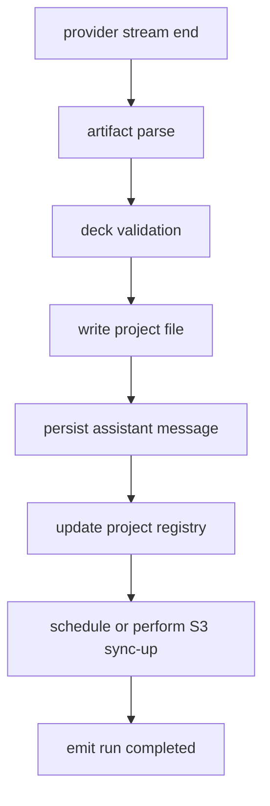

# Teamver Design MiniMax 전환 개발설계

**작성일:** 2026-08-03

**상위 문서:** [54 MiniMax 전환 기획·설계](./54_MiniMax_전환_기획_설계.md)

**목표:** 이 문서만 보고도 `ns-open-design` `staging` 브랜치에 MiniMax 기반 Teamver Design 실행 경로를 구현할 수 있도록 파일별 변경점, API 계약, 저장·인증·스트리밍·테스트·배포 절차를 상세히 정의합니다.

> 이 문서는 2026-08-03 현재 로컬의 `ns-open-design` `staging`, `ns-open-design` `main`, `teamver-design-demo`, `opendesign-minimax-byok`를 기준으로 작성했습니다. 이후 upstream/main 또는 Teamver 인증·저장소 구조가 바뀌면 이 문서의 파일명과 line-level 지시는 다시 검토해야 합니다.

---

## 0. 구현자가 먼저 알아야 할 결론

MiniMax 전환 구현의 핵심은 **Teamver managed API mode**를 Claude/Anthropic 키 하나에 묶어두지 않고, 서버 전용 MiniMax provider로 확장하는 것입니다.

구현 목표:

- 브라우저에는 MiniMax API key를 절대 내려주지 않습니다.
- FE는 `useManagedApiKey: true`, `apiProtocol: "minimax"`, `model: "MiniMax-M3"` 같은 비밀 없는 설정만 사용합니다.
- daemon은 `TEAMVER_MINIMAX_API_KEY` 또는 호환 env에서 key를 읽고 `/api/proxy/minimax/stream`을 호출합니다.
- MiniMax 요청에는 `max_tokens`를 보내지 않습니다.
- MiniMax tool loop에는 최소 `web_fetch`가 포함되어야 합니다.
- Teamver Design embed는 `deck` artifact만 최종 산출물로 인정합니다.
- 생성/수정/댓글/파일첨부/Drive/web_fetch/페이지 이탈/재진입/중지/S3/DB 저장 계약은 현재 Claude path와 동일해야 합니다.

최초 구현 단위는 5개 PR/커밋으로 나누는 것이 안전합니다.

1. **Provider skeleton:** 타입/env/runtime-config/proxy route
2. **MiniMax stream:** SSE parser, `max_tokens` 생략, error diagnostics
3. **Tool loop:** `web_fetch`, tool loop cap, tool result format
4. **Teamver deck safety:** deck-only, hidden markup sanitize, persisted message sanitize
5. **E2E readiness:** file/Drive context, S3/DB complete gate, smoke scripts

---

## 1. 현재 코드 지형

### 1.1 daemon

| 영역 | 현재 핵심 파일 | 구현 시 역할 |
|---|---|---|
| BYOK proxy stream | `apps/daemon/src/chat-routes.ts` | MiniMax stream route, tool loop, SSE parser |
| managed API key | `apps/daemon/src/teamver-managed-api-key.ts` | Teamver embed에서 client key 없이 서버 env key 사용 |
| Teamver project access | `apps/daemon/src/teamver-project-access.ts` | `X-Teamver-*` identity header 확인 |
| BYOK usage bridge | `apps/daemon/src/teamver-byok-usage-bridge.ts` | provider/model usage attribution |
| storage materialization | `apps/daemon/src/storage/byok-proxy-materialization.ts` | BYOK stream 전후 scratch/S3 sync hook |
| project materialization runtime | `apps/daemon/src/storage/project-materialization-runtime.ts` | active run 중 lazy sync와 cleanup 방어 |
| prompts | `apps/daemon/src/prompts/system.ts` | BYOK tool prompt, API mode prompt |
| official prompt | `apps/daemon/src/prompts/official-system.ts` | deck generation/edit 지침과 충돌 확인 |
| memory LLM | `apps/daemon/src/memory-llm.ts` | memory extraction provider/model 전달 |

### 1.2 web

| 영역 | 현재 핵심 파일 | 구현 시 역할 |
|---|---|---|
| app config 타입 | `apps/web/src/types.ts` | `apiProtocol`, `useManagedApiKey`, provider config |
| protocol registry | `apps/web/src/state/apiProtocols.ts` | `ApiProtocol`에 `minimax`, labels, defaults |
| config load/merge | `apps/web/src/state/config.ts` | runtime-config를 local config에 반영 |
| daemon provider calls | `apps/web/src/providers/daemon.ts` | `/api/proxy/*/stream` path routing |
| api proxy parser | `apps/web/src/providers/api-proxy.ts` | `thinking_delta`, tool events, MiniMax SSE compatibility |
| project run UI | `apps/web/src/components/ProjectView.tsx` | stream start/done/error, artifact parse/save, preview refresh |
| chat composer | `apps/web/src/components/ChatComposer.tsx` | running/stop state, current file context |
| chat pane | `apps/web/src/components/ChatPane.tsx` | visible message rendering, hidden markup filtering |
| internal markup filter | `apps/web/src/runtime/internalAgentMarkup.ts` | persisted message sanitize |

### 1.3 Teamver BFF/design-api

| 영역 | 현재 핵심 파일 | 구현 시 역할 |
|---|---|---|
| runtime config | `deploy/teamver/be/app/...`에서 `/api/v1/runtime-config` | FE에 managed provider 상태 전달, key 비노출 |
| auth/session | `deploy/teamver/be/app/...` | identity/workspace header 생성의 근거 |
| project registry | `deploy/teamver/be/app/...projects...` | project title/output registry |
| smoke scripts | `deploy/teamver/scripts/*.sh` | MiniMax configured/degraded 검증 추가 |

정확한 BFF 파일명은 구현 시 `rg -n "runtime-config|TEAMVER_OD_API_KEY|apiProtocol" deploy/teamver/be`로 다시 찾습니다. 이 문서는 endpoint 계약과 env contract를 정의합니다.

---

## 2. 신규/변경 타입 설계

### 2.1 `ApiProtocol` 확장

파일:

- `apps/web/src/types.ts`
- `apps/web/src/state/apiProtocols.ts`
- `packages/contracts/src/...`에 `ApiProtocol` mirror가 있으면 함께 수정

현재 `ApiProtocol`에는 `anthropic`, `openai`, `azure`, `google`, `ollama`, `senseaudio`, `aihubmix` 등이 있습니다. 여기에 `minimax`를 추가합니다.

```ts
export type ApiProtocol =
  | 'anthropic'
  | 'openai'
  | 'azure'
  | 'google'
  | 'ollama'
  | 'senseaudio'
  | 'aihubmix'
  | 'minimax';
```

`state/apiProtocols.ts` 변경:

```ts
export const API_PROTOCOL_LABELS: Record<ApiProtocol, string> = {
  ...,
  minimax: 'MiniMax API',
};

export const API_KEY_PLACEHOLDERS: Record<ApiProtocol, string> = {
  ...,
  minimax: 'sk-cp-...',
};

export const DEFAULT_BASE_URL_BY_PROTOCOL: Record<ApiProtocol, string> = {
  ...,
  minimax: 'https://api.minimax.io/v1',
};
```

`FIXED_ORIGIN_GATEWAYS`:

```ts
export const FIXED_ORIGIN_GATEWAYS = new Set<ApiProtocol>([
  'aihubmix',
  'minimax',
]);
```

이유:

- Teamver managed mode에서는 baseUrl 입력 UI가 불필요합니다.
- MiniMax는 endpoint가 고정되어 있고, 과거 `minimaxi.com`/`minimax.io` 혼동이 있었으므로 canonical URL을 코드에서 강제하는 편이 안전합니다.

### 2.2 provider config shape

FE config에는 key를 저장하지 않습니다.

```ts
type AppConfig = {
  mode: 'api' | 'daemon';
  apiProtocol?: ApiProtocol;
  model?: string;
  baseUrl?: string;
  apiKey?: string;
  useManagedApiKey?: boolean;
  teamverManagedProvider?: {
    provider: 'minimax' | 'anthropic';
    configured: boolean;
    source: 'runtime-config';
  };
};
```

Teamver embed runtime-config merge 후 기대 config:

```json
{
  "mode": "api",
  "apiProtocol": "minimax",
  "model": "MiniMax-M3",
  "baseUrl": "https://api.minimax.io/v1",
  "apiKey": "",
  "useManagedApiKey": true,
  "teamverManagedProvider": {
    "provider": "minimax",
    "configured": true,
    "source": "runtime-config"
  }
}
```

금지:

```json
{ "apiKey": "sk-cp-..." }
```

---

## 3. 환경변수 설계

### 3.1 daemon env

추가:

```bash
TEAMVER_DESIGN_DEFAULT_PROVIDER=minimax
TEAMVER_MINIMAX_API_KEY=sk-cp-...
TEAMVER_MINIMAX_BASE_URL=https://api.minimax.io/v1
TEAMVER_MINIMAX_CHAT_MODEL=MiniMax-M3
TEAMVER_MINIMAX_ENABLED=1
TEAMVER_CLAUDE_FALLBACK_ENABLED=0
TEAMVER_CLAUDE_FALLBACK_WORKSPACE_ALLOWLIST=
TEAMVER_AI_RUN_TIMEOUT_MS=240000
TEAMVER_AI_TOOL_LOOP_LIMIT=3
TEAMVER_WEB_FETCH_TIMEOUT_MS=12000
TEAMVER_WEB_FETCH_MAX_TEXT_BYTES=102400
```

호환:

```bash
OD_MINIMAX_API_KEY=sk-cp-...
MINIMAX_API_KEY=sk-cp-...
```

우선순위:

1. `TEAMVER_MINIMAX_API_KEY`
2. `OD_MINIMAX_API_KEY`
3. `MINIMAX_API_KEY`

`TEAMVER_OD_API_KEY`는 기존 Anthropic managed key 의미가 강하므로 MiniMax key alias로 쓰지 않습니다. 이름이 섞이면 “Anthropic key를 MiniMax로 보냄” 같은 운영 사고가 생깁니다.

### 3.2 design-api env

design-api는 MiniMax API를 직접 호출하지 않는 구조가 원칙입니다. 다만 runtime-config가 provider 상태를 알려야 하므로 다음 env를 읽습니다.

```bash
TEAMVER_DESIGN_DEFAULT_PROVIDER=minimax
TEAMVER_MINIMAX_CONFIGURED=1
TEAMVER_MINIMAX_CHAT_MODEL=MiniMax-M3
TEAMVER_MINIMAX_BASE_URL=https://api.minimax.io/v1
```

가능하면 `TEAMVER_MINIMAX_API_KEY`를 design-api에도 넣지 않습니다. runtime-config는 “configured boolean”만 알면 되고 실제 key는 daemon에만 있으면 됩니다.

예외:

- design-api가 provider health check를 직접 수행해야 한다면 key가 필요합니다.
- 이 경우에도 응답에는 key를 노출하지 않습니다.

---

## 4. Runtime-config 계약

### 4.1 endpoint

현재 Teamver FE는 다음 중 하나를 통해 runtime config를 받습니다.

- `/teamver-bff/runtime-config`
- `/api/v1/runtime-config`

MiniMax 전환 후 응답 예:

```json
{
  "configured": true,
  "mode": "api",
  "apiProtocol": "minimax",
  "baseUrl": "https://api.minimax.io/v1",
  "model": "MiniMax-M3",
  "useManagedApiKey": true,
  "managedProvider": {
    "provider": "minimax",
    "configured": true,
    "keyExposed": false
  }
}
```

응답에서 제거/금지할 필드:

- `apiKey`
- `maskedApiKey`
- `keyPrefix`
- `authorization`
- `headers`

### 4.2 configured 판정

`configured=true` 조건:

- `TEAMVER_DESIGN_DEFAULT_PROVIDER=minimax`
- daemon에 `TEAMVER_MINIMAX_API_KEY` 또는 alias 존재
- `TEAMVER_MINIMAX_ENABLED=1`

design-api가 daemon env를 직접 알 수 없다면, compose/env validation 단계에서 같은 boolean을 넣습니다.

### 4.3 fallback 상태

runtime-config에는 fallback availability를 사용자에게 자세히 알릴 필요가 없습니다. 운영 debug에는 다음만 허용합니다.

```json
{
  "fallback": {
    "anthropicAllowed": false
  }
}
```

---

## 5. daemon MiniMax runtime module

### 5.1 신규 파일

파일:

- `apps/daemon/src/minimax-runtime.ts`

역할:

- env key resolve
- base URL/model constant
- MiniMax target 판별
- `max_tokens` 생략 판별
- timeout/tool loop env resolve

구현:

```ts
export const MINIMAX_PROVIDER_ID = 'minimax' as const;
export const MINIMAX_DEFAULT_BASE_URL = 'https://api.minimax.io/v1';
export const MINIMAX_DEFAULT_CHAT_MODEL = 'MiniMax-M3';

export function resolveTeamverMiniMaxApiKeyFromEnv(): string {
  return (
    (process.env.TEAMVER_MINIMAX_API_KEY ?? '').trim()
    || (process.env.OD_MINIMAX_API_KEY ?? '').trim()
    || (process.env.MINIMAX_API_KEY ?? '').trim()
  );
}

export function resolveMiniMaxBaseUrl(): string {
  return (process.env.TEAMVER_MINIMAX_BASE_URL ?? '').trim()
    || MINIMAX_DEFAULT_BASE_URL;
}

export function resolveMiniMaxChatModel(): string {
  return (process.env.TEAMVER_MINIMAX_CHAT_MODEL ?? '').trim()
    || MINIMAX_DEFAULT_CHAT_MODEL;
}

export function isMiniMaxChatTarget(model: string, baseUrl?: string): boolean {
  const normalizedModel = model.trim().toLowerCase();
  const normalizedBase = (baseUrl ?? '').trim().toLowerCase();
  return normalizedModel === 'minimax-m3'
    || normalizedModel === 'minimax-m3'.toLowerCase()
    || normalizedBase.includes('api.minimax.io');
}

export function shouldOmitMaxTokens(model: string, baseUrl?: string): boolean {
  return isMiniMaxChatTarget(model, baseUrl);
}

export function resolveMiniMaxToolLoopLimit(): number {
  const raw = Number(process.env.TEAMVER_AI_TOOL_LOOP_LIMIT ?? '');
  if (Number.isFinite(raw) && raw > 0 && raw <= 6) return Math.floor(raw);
  return 3;
}
```

주의:

- `api.minimaxi.com`은 과거 domain 혼동이 있었으므로 새 구현에서는 `api.minimax.io`를 canonical로 둡니다.
- backward compatibility가 필요하면 `minimaxi.com`을 입력받아도 `minimax.io`로 normalize합니다.

---

## 6. managed API key resolver 확장

### 6.1 현재 문제

`apps/daemon/src/teamver-managed-api-key.ts`의 `resolveTeamverManagedApiKeyFromEnv()`는 현재 `TEAMVER_OD_API_KEY || ANTHROPIC_API_KEY`를 반환합니다.

MiniMax 전환 후에는 provider별 key resolver가 필요합니다.

### 6.2 변경 방향

기존 함수를 바로 의미 변경하지 않습니다. Anthropic 경로가 깨질 수 있기 때문입니다.

신규 타입:

```ts
export type ManagedProviderId = 'anthropic' | 'minimax';
```

신규 함수:

```ts
export function resolveTeamverManagedApiKeyFromEnvForProvider(
  provider: ManagedProviderId,
): string {
  if (provider === 'minimax') {
    return resolveTeamverMiniMaxApiKeyFromEnv();
  }
  return (
    (process.env.TEAMVER_OD_API_KEY ?? '').trim()
    || (process.env.ANTHROPIC_API_KEY ?? '').trim()
  );
}
```

기존 함수는 유지:

```ts
export function resolveTeamverManagedApiKeyFromEnv(): string {
  return resolveTeamverManagedApiKeyFromEnvForProvider('anthropic');
}
```

`resolveProxyStreamApiKeyDetailed` signature 확장:

```ts
export function resolveProxyStreamApiKeyDetailed(
  req: Request,
  body: { apiKey?: unknown; useManagedApiKey?: unknown },
  opts?: { provider?: ManagedProviderId },
): ProxyApiKeyResolution
```

내부:

```ts
const provider = opts?.provider ?? 'anthropic';
const managed = resolveTeamverManagedApiKeyFromEnvForProvider(provider);
```

error code도 provider별로 구분합니다.

```ts
export const PROXY_MINIMAX_API_KEY_MISSING_ERROR_CODE = 'MINIMAX_API_KEY_MISSING';
export const PROXY_ANTHROPIC_API_KEY_MISSING_ERROR_CODE = 'MANAGED_API_KEY_MISSING';
```

message:

```ts
'Server-managed MiniMax key is not configured on this daemon. '
+ 'Set TEAMVER_MINIMAX_API_KEY in deploy/teamver/.env.{staging,production} and restart the container.'
```

### 6.3 로그

```ts
console.warn(JSON.stringify({
  metric: 'teamver_managed_provider_key_missing',
  provider,
  ts: Date.now(),
  workspaceId,
  userId,
  route,
}));
```

기존 `teamver_managed_api_key_missing`는 Anthropic 호환으로 유지합니다.

---

## 7. `/api/proxy/minimax/stream` 설계

### 7.1 route 등록

파일:

- `apps/daemon/src/chat-routes.ts`

추가:

```ts
registerByokToolChatProxy('/api/proxy/minimax/stream', {
  providerId: 'minimax',
  logTag: 'proxy:minimax',
  defaultBaseUrl: MINIMAX_DEFAULT_BASE_URL,
  defaultModel: MINIMAX_DEFAULT_CHAT_MODEL,
  tools: BYOK_MINIMAX_TOOLS,
  buildHeaders: (apiKey) => ({ Authorization: `Bearer ${apiKey}` }),
  resolveManagedProvider: () => 'minimax',
  shouldOmitMaxTokens,
  runWebFetch: executeMiniMaxWebFetch,
  runImage: executeMiniMaxGenerateImage,
});
```

현재 `registerByokToolChatProxy`가 `resolveManagedProvider`/`shouldOmitMaxTokens` 옵션을 받지 않는다면, 옵션 타입부터 확장합니다.

```ts
type RegisterByokToolChatProxyOptions = {
  providerId: string;
  logTag: string;
  defaultBaseUrl: string;
  defaultModel?: string;
  tools: OpenAiTool[];
  buildHeaders: (apiKey: string) => Record<string, string>;
  resolveManagedProvider?: () => ManagedProviderId;
  shouldOmitMaxTokens?: (model: string, baseUrl?: string) => boolean;
  runWebFetch?: ToolExecutor;
  runImage?: ToolExecutor;
};
```

### 7.2 request body

FE -> daemon:

```json
{
  "model": "MiniMax-M3",
  "baseUrl": "https://api.minimax.io/v1",
  "apiKey": "",
  "useManagedApiKey": true,
  "systemPrompt": "...",
  "messages": [],
  "projectId": "...",
  "conversationId": "...",
  "assistantMessageId": "...",
  "teamver": {
    "workspaceId": "...",
    "requestKind": "deck_create"
  }
}
```

daemon은 `apiKey`가 비어 있고 `useManagedApiKey=true`이면 server env key를 사용합니다.

### 7.3 upstream payload

MiniMax upstream:

```json
{
  "model": "MiniMax-M3",
  "messages": [],
  "stream": true,
  "tools": [],
  "tool_choice": "auto"
}
```

보내지 않을 것:

- `max_tokens`
- FE에서 온 empty `apiKey`
- Teamver identity headers

선택:

- `temperature`: 초기에는 현행 default 사용
- `top_p`: MiniMax 품질 테스트 후 결정

### 7.4 response events

daemon -> FE SSE:

| event | data | 설명 |
|---|---|---|
| `start` | `{ model, provider }` | run 시작 |
| `delta` | `{ delta }` | 사용자 visible text |
| `thinking_delta` | `{ delta }` | 내부 thinking UI용. Teamver embed에서는 기본 접기/비노출 |
| `tool_call` | `{ name, status }` | optional diagnostics |
| `artifact_delta` | `{ delta }` | 있으면 artifact parser 전용 |
| `end` | `{ finishReason }` | 정상 종료 |
| `error` | `{ code, message, provider }` | 오류 |

현행 FE가 `artifact_delta`를 지원하지 않는다면 `delta`만 유지하되 parser/sanitize를 강화합니다. 장기적으로는 artifact body와 visible chat text를 분리하는 것이 더 안전합니다.

---

## 8. MiniMax SSE parser

### 8.1 처리 대상

OpenAI-compatible chunk:

```json
{
  "choices": [
    {
      "delta": {
        "content": "text",
        "tool_calls": []
      },
      "finish_reason": null
    }
  ]
}
```

처리:

```ts
for await (const event of parseSse(response.body)) {
  if (event === '[DONE]') break;
  const json = safeJsonParse(event);
  const choice = json.choices?.[0];
  const delta = choice?.delta;
  if (typeof delta?.content === 'string') {
    guard.sendDelta(delta.content);
    accumulated += delta.content;
  }
  if (Array.isArray(delta?.tool_calls)) {
    mergeToolCallDeltas(delta.tool_calls);
  }
  if (choice?.finish_reason) {
    finishReason = choice.finish_reason;
  }
}
```

### 8.2 tool call delta merge

OpenAI-compatible tool call arguments는 chunk로 나뉩니다.

```ts
type PendingToolCall = {
  id: string;
  type: 'function';
  function: {
    name: string;
    arguments: string;
  };
};
```

merge:

```ts
function mergeToolCallDeltas(pending: Map<number, PendingToolCall>, deltas: any[]) {
  for (const d of deltas) {
    const index = Number(d.index ?? 0);
    const prev = pending.get(index) ?? {
      id: '',
      type: 'function',
      function: { name: '', arguments: '' },
    };
    if (d.id) prev.id = d.id;
    if (d.function?.name) prev.function.name += d.function.name;
    if (d.function?.arguments) prev.function.arguments += d.function.arguments;
    pending.set(index, prev);
  }
}
```

name은 일반적으로 한 번에 오지만 chunk될 수 있으므로 append로 처리합니다.

### 8.3 finish_reason handling

| finish_reason | 처리 |
|---|---|
| `tool_calls` | tool 실행 후 다음 turn |
| `stop` | artifact validation |
| `length` | incomplete auto-continue |
| `content_filter` | 사용자 친화 오류 |
| null인데 stream 종료 | provider premature close |

`length` 또는 premature close에서 artifact가 incomplete이면:

1. visible error를 바로 표시하지 않음
2. auto-continue 1~2회
3. 그래도 incomplete이면 diagnostics card

---

## 9. Tool 구현

### 9.1 신규 파일

- `apps/daemon/src/minimax-byok-tools.ts`
- `apps/daemon/src/byok-url-tools.ts`가 없거나 불완전하면 보강

### 9.2 P0 tool list

```ts
export const BYOK_MINIMAX_TOOLS = [
  WEB_FETCH_TOOL,
  GENERATE_IMAGE_TOOL_OPTIONAL,
];
```

초기에는 `generate_speech`, `generate_video`를 넣지 않습니다. 이유:

- Teamver Design 기본 기능이 아닙니다.
- tool loop가 길어지고 비용/지연이 증가합니다.
- single-node production에서 video polling은 부하 위험이 큽니다.

### 9.3 web_fetch schema

```ts
export const WEB_FETCH_TOOL = {
  type: 'function',
  function: {
    name: 'web_fetch',
    description:
      'Fetch a public http(s) URL and return readable plain text. Use when the user asks to reference or analyze a URL. Not for private, authenticated, local, or internal URLs.',
    parameters: {
      type: 'object',
      properties: {
        url: {
          type: 'string',
          description: 'Absolute public http(s) URL. If the user gave a bare domain, normalize it to https://...',
        },
      },
      required: ['url'],
    },
  },
};
```

### 9.4 URL normalize

```ts
export function normalizeUserUrl(input: string): string {
  const raw = input.trim();
  if (/^https?:\/\//i.test(raw)) return raw;
  if (/^[a-z0-9.-]+\.[a-z]{2,}(\/.*)?$/i.test(raw)) return `https://${raw}`;
  return raw;
}
```

### 9.5 SSRF guard

필수 차단:

- private IPv4/IPv6
- loopback
- link-local
- metadata IP
- localhost hostname
- non-http protocol
- redirect 후 internal URL

의사 코드:

```ts
async function assertPublicHttpUrl(url: URL): Promise<void> {
  if (url.protocol !== 'http:' && url.protocol !== 'https:') throw blocked('protocol');
  const addresses = await dns.lookup(url.hostname, { all: true, verbatim: false });
  if (addresses.length === 0) throw blocked('dns_empty');
  for (const address of addresses) {
    if (isPrivateOrReservedIp(address.address)) throw blocked('private_ip');
  }
}
```

redirect:

```ts
for (let hop = 0; hop < 5; hop++) {
  await assertPublicHttpUrl(currentUrl);
  const res = await fetch(currentUrl, { redirect: 'manual', signal, headers });
  if (![301,302,303,307,308].includes(res.status)) return res;
  const location = res.headers.get('location');
  if (!location) throw error('redirect_missing_location');
  currentUrl = new URL(location, currentUrl);
}
throw error('too_many_redirects');
```

### 9.6 body cap

```ts
const MAX_BYTES = resolveWebFetchMaxBytes(); // default 100KB
const chunks = [];
let received = 0;

while (true) {
  const { value, done } = await reader.read();
  if (done) break;
  received += value.byteLength;
  if (received > MAX_BYTES) {
    chunks.push(value.subarray(0, value.byteLength - (received - MAX_BYTES)));
    truncated = true;
    await reader.cancel();
    break;
  }
  chunks.push(value);
}
```

### 9.7 HTML to text

외부 의존성 추가 없이 시작합니다.

```ts
function htmlToText(html: string): { title?: string; text: string } {
  const title = extractTitle(html);
  const text = html
    .replace(/<script\b[\s\S]*?<\/script\s*>/gi, ' ')
    .replace(/<style\b[\s\S]*?<\/style\s*>/gi, ' ')
    .replace(/<noscript\b[\s\S]*?<\/noscript\s*>/gi, ' ')
    .replace(/<svg\b[\s\S]*?<\/svg\s*>/gi, ' ')
    .replace(/<!--[\s\S]*?-->/g, ' ')
    .replace(/<br\s*\/?>/gi, '\n')
    .replace(/<\/(p|div|li|ul|ol|h[1-6]|section|article|header|footer|main|nav)>/gi, '\n')
    .replace(/<[^>]+>/g, ' ')
    .replace(/\s+\n/g, '\n')
    .replace(/[ \t]{2,}/g, ' ')
    .trim();
  return { title, text: decodeBasicHtmlEntities(text) };
}
```

---

## 10. Prompt 구현

### 10.1 BYOK tools override

파일:

- `apps/daemon/src/prompts/system.ts`
- `packages/contracts/src/prompts/system.ts`

목표:

- MiniMax에서 `WebFetch unavailable` 같은 기존 CLI-mode 문구를 넣으면 안 됩니다.
- 사용 가능한 tool은 `web_fetch`라고 명시합니다.
- pseudo-tool markup을 쓰지 말고 실제 tool call을 사용하라고 지시합니다.

prompt block:

```text
You are running in Teamver Design API mode.
Available server-side tools: web_fetch.

If the user gives a public URL and asks you to reference, analyze, summarize, or make slides from it, call web_fetch with the normalized absolute URL.
Do not claim that you cannot access URLs unless web_fetch fails.
Do not write pseudo tool markup such as <tool>, <invoke>, WebFetch(...), Read(...), Bash(...).
```

### 10.2 Teamver deck-only instruction

Teamver embed 전용 system prompt에 다음을 추가합니다.

```text
Teamver Design supports slide decks only.
The final deliverable must be exactly one deck artifact:
<artifact type="deck" identifier="deck">...</artifact>

Do not produce <artifact type="text/html">, standalone apps, videos, images, or markdown-only deliverables.
If editing an existing deck, preserve the deck shell and only change the requested scope unless the user explicitly asks for a full-deck rewrite.
```

다국어:

```text
Visible assistant prose, if any, must follow the user's language. Do not hard-code Korean or English status messages.
```

토큰 절약:

```text
Do not include a verbose plan unless the user asks for one. Prefer producing the deck artifact directly.
```

### 10.3 quick questions

빠른 질문 UI는 structured message로만 남기고 raw prompt는 visible text로 보내지 않습니다.

금지 visible:

- `<question`
- `[form answers`
- `[Deliverable instruction]`

만약 provider output에 섞이면 sanitize합니다.

---

## 11. Artifact parser/validator

### 11.1 parser input

MiniMax stream에서 받은 전체 text를 parser에 넣습니다.

```ts
const parseResult = parseAssistantArtifacts(accumulatedText);
```

### 11.2 validator

Teamver embed validator:

```ts
type TeamverArtifactValidation =
  | { ok: true; artifactType: 'deck'; identifier: string; html: string }
  | { ok: false; code: 'NO_ARTIFACT' | 'HTML_ARTIFACT' | 'INCOMPLETE' | 'MULTIPLE_ARTIFACTS' | 'UNSAFE_SCRIPT_TAIL'; retryable: boolean };
```

rules:

- `deck` artifact exactly 1개
- body 길이 1KB 이상
- `<!doctype html>` 또는 deck root structure 존재
- `<section class="slide">` 또는 known deck marker 존재
- closing artifact tag 존재
- trailing script fragment만 있는 경우 저장 금지

`text/html` 승격:

```ts
if (artifact.type === 'text/html' && looksLikeDeckHtml(artifact.content)) {
  return { ok: true, artifactType: 'deck', identifier: 'deck', html: artifact.content, upgradedFrom: 'text/html' };
}
```

주의:

- 승격은 compatibility safety입니다. prompt는 계속 `deck`을 요구해야 합니다.
- 승격 이벤트는 metric에 남깁니다.

### 11.3 incomplete auto-continue

조건:

- finish_reason=`length`
- stream closed without `[DONE]`
- artifact open tag만 있고 close tag 없음
- HTML closing tags 미완성
- validator `INCOMPLETE`

continue prompt:

```text
Continue the previous deck artifact from exactly where it stopped.
Do not restart.
Do not include explanations.
Close all open tags and finish the same <artifact type="deck" identifier="deck">.
```

최대:

- 기본 1회
- staging debug 2회 가능

auto-continue 후에도 실패하면 error code:

- `MINIMAX_INCOMPLETE_OUTPUT`

---

## 12. Hidden markup sanitize

### 12.1 daemon filter

파일:

- `apps/daemon/src/think-tag-splitter.ts`
- `apps/daemon/src/chat-routes.ts`

stream-safe splitter가 처리해야 할 open/close marker:

```ts
const HIDDEN_BLOCKS = [
  ['<think>', '</think>'],
  ['<thinking>', '</thinking>'],
  ['<analysis>', '</analysis>'],
  ['<tools>', '</tools>'],
  ['<tool>', '</tool>'],
  ['<invoke>', '</invoke>'],
  ['<question', '</question>'],
];
```

`<question`은 attributes가 붙을 수 있으므로 open marker detection은 prefix 기반이어야 합니다.

### 12.2 FE persisted sanitize

파일:

- `apps/web/src/runtime/internalAgentMarkup.ts`
- `apps/web/src/components/ChatPane.tsx`

원칙:

- streaming 중 sanitize
- persisted message hydrate 중 sanitize
- copy/share에는 sanitize된 text 사용
- artifact file card는 유지

필터할 line/tail:

```ts
const HIDDEN_LINE_PATTERNS = [
  /^\s*\[Deliverable instruction\]/i,
  /^\s*\[form answers\b/i,
  /^\s*TodoWrite\b/i,
  /^\s*WebFetch\s*\(/i,
  /^\s*Read\s*\(/i,
  /^\s*Write\s*\(/i,
  /^\s*Edit\s*\(/i,
  /^\s*Bash\s*\(/i,
  /^\s*var\s+total\s*=\s*document\.getElementById\('deck-total'\)/,
  /localStorage\.getItem\(STORE\)/,
  /slides\.length/,
  /deck-stage|deck-prev|deck-next|deck-cur|deck-total/,
];
```

### 12.3 artifact leakage policy

If visible assistant text contains a long CSS/JS/HTML fragment and artifact parse succeeded:

- visible text should be replaced with concise localized completion message or empty assistant body plus file card.
- never show raw artifact body in chat.

---

## 13. FE stream routing

### 13.1 proxy path resolve

파일:

- `apps/web/src/providers/daemon.ts`
- `apps/web/src/providers/api-proxy.ts`

의사 코드:

```ts
function proxyPathForProtocol(protocol: ApiProtocol): string {
  switch (protocol) {
    case 'minimax':
      return '/api/proxy/minimax/stream';
    case 'senseaudio':
      return '/api/proxy/senseaudio/stream';
    case 'aihubmix':
      return '/api/proxy/aihubmix/stream';
    default:
      return '/api/proxy/chat/stream';
  }
}
```

`streamMessage` 요청에는:

```ts
{
  apiKey: config.useManagedApiKey ? '' : config.apiKey,
  useManagedApiKey: config.useManagedApiKey === true,
  apiProtocol: config.apiProtocol,
  model: config.model,
  baseUrl: resolveFixedOriginBaseUrl(config.apiProtocol, config.baseUrl),
}
```

### 13.2 managed key UI

Teamver embed에서는 BYOK settings를 숨기거나 read-only로 둡니다.

표시 문구:

- “Teamver 관리형 AI”
- provider/model은 debug에서만 표시

금지:

- API key input
- show/hide key icon
- “Bring your own key” CTA

---

## 14. 백그라운드 run 상태

### 14.1 run status source

MiniMax API mode도 Claude managed run과 동일한 active run registry에 등록되어야 합니다.

필수 필드:

```ts
type ActiveRun = {
  runId: string;
  provider: 'minimax';
  model: 'MiniMax-M3';
  projectId: string;
  conversationId: string;
  assistantMessageId: string;
  status: 'running' | 'stopping' | 'stopped' | 'completed' | 'failed';
  startedAt: string;
  updatedAt: string;
  lastCheckpointAt?: string;
  artifactDetected?: boolean;
  artifactPersisted?: boolean;
};
```

### 14.2 page leave

SSE disconnect must not abort provider call unless user explicitly pressed stop.

Implementation:

- request abort from browser should close SSE client response
- backend run controller remains alive
- checkpoints continue to DB/daemon store
- run finish triggers artifact persist/S3 sync

### 14.3 re-entry

On project page mount:

1. fetch project metadata
2. fetch conversations/messages
3. fetch active runs
4. if active run exists:
   - composer button = stop
   - status dialog = visible or restorable
   - subscribe to run events if supported
   - poll files/preview at conservative interval
5. if completed run with artifact persisted:
   - refresh files
   - open latest deck preview

---

## 15. stop handling

### 15.1 stop API

Existing stop endpoint가 있으면 MiniMax run도 같은 endpoint에 연결합니다.

```http
POST /api/runs/{runId}/stop
```

또는 project/conversation scoped stop:

```http
POST /api/projects/{projectId}/conversations/{conversationId}/runs/{runId}/stop
```

### 15.2 stop propagation

```ts
run.status = 'stopping';
controller.abort();
pendingToolAbortController?.abort();
run.status = 'stopped';
persistTerminalMessage({ status: 'stopped' });
```

partial artifact:

- validator가 complete true면 저장 가능
- incomplete면 저장하지 않음
- stopped 상태는 auto-continue 금지

### 15.3 FE composer

완료/실패/중지 terminal event에서 반드시:

```ts
setIsStreaming(false);
setActiveRun(null);
setComposerMode('send');
```

이전 문제인 “완료 후에도 중지 버튼 유지”를 regression test로 고정합니다.

---

## 16. File/Drive context

### 16.1 첨부 파일 context contract

model에게 전달하는 block:

```xml
<attached_project_files>
  <file path="refs/drive/abc.md" mime="text/markdown" size="12345">
    <summary>...</summary>
    <excerpt>...</excerpt>
  </file>
</attached_project_files>
```

규칙:

- path는 project-relative
- raw local absolute path 금지
- S3 URL 직접 전달 금지
- 사용자 파일 본문이 너무 크면 summary/excerpt만

### 16.2 Drive 가져오기

Drive import가 끝난 후 model run을 시작해야 합니다.

```ts
await importDriveFileToProject(projectId, driveFile);
await ensureProjectFileVisible(projectId, importedPath);
await startMiniMaxRun({ attachments: [importedPath] });
```

실패 시:

- run 시작 금지
- 사용자에게 Drive import 실패 표시
- model prompt에는 해당 파일이 있다고 말하지 않음

### 16.3 PDF/DOC extraction

P0:

- text extract 가능한 경우 excerpt
- 불가능하면 filename/metadata만 전달하고 사용자가 내용을 붙여넣도록 안내

P1:

- async extractor cache
- page-level summary

---

## 17. 저장/S3/DB complete gate

### 17.1 완료 기준

MiniMax run은 다음이 끝나기 전까지 completed가 아닙니다.



### 17.2 failure code

| 단계 | code |
|---|---|
| provider key 없음 | `MINIMAX_API_KEY_MISSING` |
| upstream 401 | `MINIMAX_UPSTREAM_UNAUTHORIZED` |
| upstream timeout | `MINIMAX_UPSTREAM_TIMEOUT` |
| no artifact | `MINIMAX_NO_DECK_ARTIFACT` |
| incomplete | `MINIMAX_INCOMPLETE_OUTPUT` |
| file write 실패 | `MINIMAX_ARTIFACT_WRITE_FAILED` |
| registry 실패 | `MINIMAX_REGISTRY_UPDATE_FAILED` |
| S3 sync 실패 | `MINIMAX_S3_SYNC_FAILED` |

### 17.3 S3 sync policy

S3 sync 실패를 숨기지 않습니다.

- write success + S3 sync scheduled: preview 가능, status warning 가능
- write success + S3 sync failed: retry queue에 넣고 diagnostics 기록
- write fail: run failed

scratch cleanup은 artifact가 S3에 없으면 삭제하면 안 됩니다.

---

## 18. usage/cost telemetry

실제 크레딧 차감은 별도 결정이지만 telemetry는 넣습니다.

필드:

```json
{
  "provider": "minimax",
  "model": "MiniMax-M3",
  "workspaceId": "...",
  "projectId": "...",
  "runId": "...",
  "requestKind": "deck_create",
  "inputTokenEstimate": 1234,
  "outputTokenEstimate": 5678,
  "providerReportedInputTokens": null,
  "providerReportedOutputTokens": null,
  "toolCalls": [
    { "name": "web_fetch", "status": "ok", "durationMs": 432 }
  ],
  "fallback": false
}
```

MiniMax usage 응답 format이 불확실하면 providerReported는 nullable로 두고, 우선 estimate를 기록합니다.

---

## 19. 파일별 구현 체크리스트

### 19.1 daemon

#### `apps/daemon/src/minimax-runtime.ts`

- [ ] 신규 파일 추가
- [ ] key/base/model resolver
- [ ] `shouldOmitMaxTokens`
- [ ] timeout/tool loop env parser
- [ ] unit test 추가

#### `apps/daemon/src/teamver-managed-api-key.ts`

- [ ] provider별 key resolver 추가
- [ ] 기존 Anthropic resolver backward compatible 유지
- [ ] MiniMax missing key error code 추가
- [ ] structured log provider label 추가
- [ ] tests 추가

#### `apps/daemon/src/chat-routes.ts`

- [ ] `ApiProtocol=minimax` route 등록
- [ ] `registerByokToolChatProxy` option 확장
- [ ] MiniMax request builder에서 `max_tokens` 생략
- [ ] tool call delta merge 검증
- [ ] `finish_reason=length` 처리
- [ ] diagnostics에 provider/model/finish_reason 추가

#### `apps/daemon/src/minimax-byok-tools.ts`

- [ ] P0 tool list: `web_fetch`, optional `generate_image`
- [ ] web fetch executor
- [ ] image executor는 deck image 용도만
- [ ] TTS/video는 export하지 않거나 feature flag

#### `apps/daemon/src/byok-url-tools.ts`

- [ ] scheme normalize
- [ ] SSRF guard
- [ ] redirect guard
- [ ] body cap
- [ ] HTML text extraction
- [ ] per-run cache hook

#### `apps/daemon/src/prompts/system.ts`

- [ ] MiniMax/BYOK tools override
- [ ] `WebFetch unavailable`가 MiniMax에 들어가지 않도록 분기
- [ ] deck-only prompt block
- [ ] multilingual visible prose instruction

#### `apps/daemon/src/storage/byok-proxy-materialization.ts`

- [ ] MiniMax proxy stream도 before/after hooks 대상인지 확인
- [ ] active run 중 lazy sync-down/up 충돌 방지
- [ ] write success 후 sync-up schedule

### 19.2 web

#### `apps/web/src/types.ts`

- [ ] `ApiProtocol`에 `minimax`
- [ ] `teamverManagedProvider` optional type

#### `apps/web/src/state/apiProtocols.ts`

- [ ] labels/default base/key placeholder
- [ ] fixed-origin gateway
- [ ] `byokChatToolNamesForProtocol('minimax')`가 tools 반환

현재 함수는 `senseaudio`/`aihubmix`만 tool names를 반환합니다. MiniMax 추가 필요:

```ts
if (protocol === 'senseaudio' || protocol === 'aihubmix' || protocol === 'minimax') {
  return BYOK_CHAT_TOOL_NAMES;
}
```

단, P0에서 speech/video tool을 빼면 MiniMax 전용 tool list를 별도로 둡니다.

#### `apps/web/src/state/config.ts`

- [ ] runtime-config merge 시 `apiKey=''`
- [ ] `useManagedApiKey=true`
- [ ] `apiProtocol='minimax'`
- [ ] baseUrl canonical
- [ ] localStorage에 key 저장되지 않는 test

#### `apps/web/src/providers/daemon.ts`

- [ ] protocol -> proxy route mapping
- [ ] MiniMax request에 `useManagedApiKey` 전달
- [ ] no key warning이 MiniMax managed mode에서 뜨지 않음

#### `apps/web/src/providers/api-proxy.ts`

- [ ] `thinking_delta` event 처리
- [ ] error event에 provider/error code 유지
- [ ] `[DONE]`/end 처리 안정화

#### `apps/web/src/components/ProjectView.tsx`

- [ ] deck-only validator 결과 반영
- [ ] run terminal 상태에서 composer send로 복귀
- [ ] completed 후 files refresh
- [ ] re-entry active run hydrate
- [ ] hidden markup persisted sanitize

#### `apps/web/src/runtime/internalAgentMarkup.ts`

- [ ] MiniMax hidden block 추가
- [ ] artifact leakage line filter 추가
- [ ] tests에 streaming 완료 후 재진입 케이스 추가

### 19.3 deploy/teamver

#### `.env.staging.example`, `.env.production.example`

- [ ] MiniMax env 추가
- [ ] Anthropic fallback env 분리
- [ ] key 노출 주석 금지

#### `scripts/validate_deploy_env.sh`

- [ ] default provider minimax이면 `TEAMVER_MINIMAX_API_KEY` 필수
- [ ] production에서도 Anthropic key만 요구하지 않도록 수정
- [ ] fallback off일 때 Anthropic key 없어도 pass

#### `scripts/smoke_design.sh`

- [ ] runtime-config provider/model 확인
- [ ] key field 미노출 확인
- [ ] MiniMax configured/degraded 표시
- [ ] synthetic proxy route smoke optional

#### `scripts/run_staging_track_a_e2e.sh`

- [ ] runtime-config `apiProtocol=minimax` 허용
- [ ] model present check 유지
- [ ] key absent check 추가

---

## 20. 테스트 상세

### 20.1 daemon unit

추가 파일 예:

- `apps/daemon/tests/minimax-runtime.test.ts`
- `apps/daemon/tests/minimax-byok-tools.test.ts`
- `apps/daemon/tests/byok-url-tools.test.ts`
- `apps/daemon/tests/teamver-managed-api-key.test.ts`

테스트:

```ts
it('resolves TEAMVER_MINIMAX_API_KEY before aliases');
it('omits max_tokens for MiniMax-M3');
it('rejects localhost web_fetch');
it('follows apex to www redirect when both public');
it('rejects redirect to private ip');
it('caps response body at 100KB');
it('returns provider-specific missing key code');
```

### 20.2 web unit

추가/수정:

- `apps/web/tests/providers/api-proxy.test.ts`
- `apps/web/tests/internal-agent-markup.test.ts`
- `apps/web/tests/teamver-runtime-config.test.ts`
- `apps/web/tests/project-view-message-merge.test.ts`

테스트:

```ts
it('does not store runtime-config api key for managed minimax');
it('routes minimax protocol to /api/proxy/minimax/stream');
it('returns byok tool names for minimax');
it('hides <think> and <question> fragments after hydration');
it('sets composer to send after minimax terminal end');
it('does not render artifact body as chat text when file card exists');
```

### 20.3 integration

local/staging:

1. 새 deck 생성
2. 기존 deck 텍스트 수정
3. 댓글 scoped patch
4. `www.teamver.com 참고해서` 생성
5. Drive md 가져와서 생성
6. 파일 업로드해서 생성
7. 생성 중 페이지 이탈 후 재진입
8. 생성 중 stop
9. 완료 후 새로고침
10. S3 cleanup 이후 재조회

### 20.4 acceptance matrix

| 케이스 | 기대 |
|---|---|
| network tab | MiniMax key 없음 |
| runtime-config | `apiProtocol=minimax`, `model=MiniMax-M3`, `configured=true` |
| web_fetch | public URL 성공, private URL 차단 |
| 생성 | file tab에 `deck.html` 또는 프로젝트명 기반 deck 표시 |
| preview | 새로고침 없이 표시 |
| re-entry | 메시지와 작업 상태 유지 |
| stop | 버튼 send로 복귀, 자동 재개 없음 |
| hidden markup | 노출 0 |
| S3 | sync-up 성공 또는 retry visible diagnostics |

---

## 21. 구현 순서

### Commit 1. Protocol/env skeleton

변경:

- `minimax-runtime.ts`
- `teamver-managed-api-key.ts`
- `types.ts`
- `apiProtocols.ts`
- env examples
- tests

검증:

```bash
pnpm --filter @open-design/daemon test minimax-runtime
pnpm --filter @open-design/web exec vitest run tests/teamver-runtime-config.test.ts
```

### Commit 2. Proxy stream

변경:

- `chat-routes.ts`
- `api-proxy.ts`
- `daemon.ts`

검증:

```bash
curl -N -X POST http://127.0.0.1:7456/api/proxy/minimax/stream ...
```

### Commit 3. web_fetch tool

변경:

- `minimax-byok-tools.ts`
- `byok-url-tools.ts`
- prompt tools override

검증:

```bash
pnpm --filter @open-design/daemon test byok-url-tools
```

### Commit 4. Teamver deck safety

변경:

- prompt deck-only
- artifact validator
- hidden markup filters
- ProjectView done/error handling

검증:

```bash
pnpm --filter @open-design/web exec vitest run tests/internal-agent-markup.test.ts
```

### Commit 5. Smoke/deploy docs

변경:

- smoke scripts
- validate env
- docs update

검증:

```bash
bash deploy/teamver/scripts/validate_deploy_env.sh --staging
bash deploy/teamver/scripts/smoke_design.sh --staging
```

---

## 22. Rollback

env rollback:

```bash
TEAMVER_DESIGN_DEFAULT_PROVIDER=anthropic
TEAMVER_MINIMAX_ENABLED=0
TEAMVER_CLAUDE_FALLBACK_ENABLED=1
TEAMVER_OD_API_KEY=...
```

code rollback:

- MiniMax route는 남겨도 default만 Anthropic으로 돌리면 됩니다.
- runtime-config가 `apiProtocol=anthropic`을 내려주면 FE는 기존 path로 복귀해야 합니다.

rollback 검증:

- 새 deck 생성
- 기존 deck 수정
- runtime-config key 비노출 유지

---

## 23. 구현 중 주의할 함정

### 23.1 key resolver 재사용 함정

`resolveTeamverManagedApiKeyFromEnv()`를 MiniMax에 그대로 쓰면 Anthropic key가 MiniMax로 전송될 수 있습니다. provider별 resolver를 반드시 추가합니다.

### 23.2 `max_tokens` 함정

OpenAI-compatible이라고 해서 모든 필드가 호환되는 것은 아닙니다. MiniMax M3에는 `max_tokens`를 생략합니다.

### 23.3 tool prompt 함정

기존 API mode prompt가 `WebFetch unavailable`을 포함하면 MiniMax가 URL을 읽지 않습니다. MiniMax route에서는 BYOK tool prompt가 들어가야 합니다.

### 23.4 hidden markup 함정

streaming sanitize만 하면 재진입 시 저장된 메시지에서 다시 노출됩니다. 저장 전/후/렌더 전 모두 같은 sanitize를 적용합니다.

### 23.5 completion 함정

provider stream end를 run completed로 처리하면 파일이 없는데 완료로 보일 수 있습니다. artifact write/S3/DB gate 후 completed 처리합니다.

### 23.6 fallback 함정

fallback이 자동으로 Claude를 호출하면 비용 절감 목적이 깨집니다. fallback은 allowlist/flag/metric이 있어야 합니다.

### 23.7 Drive 함정

Drive session 401과 MiniMax provider error를 같은 “슬라이드 실패”로 뭉개면 원인 파악이 어렵습니다. failure code를 분리합니다.

---

## 24. Definition of Done

MiniMax P0 구현 완료 조건:

- [ ] runtime-config가 MiniMax managed provider를 key 없이 내려줌
- [ ] FE localStorage/network에 MiniMax key가 없음
- [ ] `/api/proxy/minimax/stream`이 server env key로 호출됨
- [ ] MiniMax request에 `max_tokens`가 없음
- [ ] `web_fetch`가 public URL을 읽고 private URL을 차단함
- [ ] 새 deck 생성 성공
- [ ] 기존 deck 수정 성공
- [ ] 댓글 scoped patch 성공
- [ ] 파일 첨부/Drive 가져오기 기반 생성 성공
- [ ] 페이지 이탈 후 재진입 복구
- [ ] 중지 요청 후 composer가 send 상태로 복귀
- [ ] hidden/internal markup 노출 0
- [ ] 결과 파일이 file tab/preview/S3/DB에 반영
- [ ] smoke script와 핵심 unit test 통과
- [ ] Claude fallback off 상태에서 비용 예측 가능

---

## 25. 다음 작업

바로 착수할 첫 작업은 **Commit 1. Protocol/env skeleton**입니다.

구현자는 다음 순서로 시작합니다.

1. `apps/daemon/src/minimax-runtime.ts` 추가
2. `apps/daemon/src/teamver-managed-api-key.ts` provider별 resolver 확장
3. `apps/web/src/types.ts`, `apps/web/src/state/apiProtocols.ts`에 `minimax` 추가
4. `deploy/teamver/*.env.example`, `validate_deploy_env.sh` MiniMax env 반영
5. runtime-config가 key 없이 MiniMax managed config를 내려주는 테스트 추가

이 단계는 실제 MiniMax 호출 전 skeleton이므로 기존 Claude 동작을 깨지 않고 안전하게 먼저 들어갈 수 있습니다.

---

## 26. 구현 착수 현황 (2026-08-04 현재)

**기준:** 2026-08-04 현재 별도 worktree `ns-open-design-minimax-impl`, branch `codex/minimax-provider-skeleton`에서 확인한 상태입니다. 아직 `staging` 기본 실행 경로로 병합하기 전 단계입니다.

### 26.1 완료한 skeleton/1차 구현

- `apps/daemon/src/minimax-runtime.ts`
  - `MINIMAX_PROVIDER_ID=minimax`
  - `MINIMAX_DEFAULT_BASE_URL=https://api.minimax.io/v1`
  - `MINIMAX_DEFAULT_CHAT_MODEL=MiniMax-M3`
  - `TEAMVER_MINIMAX_API_KEY` 우선, `OD_MINIMAX_API_KEY`, `MINIMAX_API_KEY` 호환 alias
  - legacy host `api.minimaxi.com`, `api.minimaxi.chat` → `api.minimax.io`
  - `MiniMax-M3` 계열 `max_tokens` 생략 판단 helper
  - tool loop cap 기본 3, env override 최대 6
- `apps/daemon/src/teamver-managed-api-key.ts`
  - Anthropic 전용 resolver와 MiniMax resolver 분리
  - proxy body의 `apiProtocol=minimax`를 보고 MiniMax env key 사용
  - MiniMax key 누락 진단을 `MINIMAX_API_KEY_MISSING`으로 분리
  - 브라우저 응답이나 runtime-config에는 MiniMax key를 내려주지 않는 기존 Teamver 보안 계약 유지
- `apps/daemon/src/chat-routes.ts`
  - proxy body에 `apiProtocol`을 포함해 managed key resolver가 provider를 식별할 수 있도록 준비
  - `/api/proxy/minimax/stream` route 추가
  - MiniMax route는 OpenAI-compatible SSE/tool-loop factory를 사용하되 MiniMax provider hint를 강제해 `TEAMVER_MINIMAX_API_KEY` 계열 env key를 사용
  - legacy MiniMax baseUrl을 canonical `https://api.minimax.io/v1`로 정규화
  - MiniMax-M3 요청에서 `max_tokens`, `stream_options` 생략
  - MiniMax tool loop cap은 `resolveMiniMaxToolLoopLimit()`로 제한
- `apps/daemon/src/byok-tools.ts`
  - `web_fetch` schema를 export하고 MiniMax P0 tool list를 `web_fetch` 단독으로 분리
- `apps/daemon/src/connectionTest.ts`
  - `minimax` protocol connection smoke 추가
  - MiniMax chat completions smoke에서도 `max_tokens` 생략
- `apps/daemon/src/providerModels.ts`
  - MiniMax model list endpoint를 canonical `/models`로 조회
- `apps/daemon/src/server.ts`
  - boot marker가 `TEAMVER_DESIGN_DEFAULT_PROVIDER=minimax`인 경우 MiniMax key 기준으로 readiness를 기록
  - Anthropic key 누락과 MiniMax key 누락 운영 로그를 분리
- `apps/web/src/types.ts`
  - `ApiProtocol`에 `minimax` 추가
- `apps/web/src/state/apiProtocols.ts`
  - MiniMax tab/label/key placeholder/default baseUrl/default model 등록
  - fixed-origin gateway로 등록해 사용자/저장값 drift 방지
  - MiniMax BYOK chat tool names를 `web_fetch` 단독으로 분리
- `apps/web/src/state/config.ts`
  - `KNOWN_PROVIDERS`에 MiniMax canonical entry 추가
  - `api.minimax.io`는 OpenAI-compatible heuristic이 아니라 `minimax` protocol로 식별
- `apps/web/src/providers/api-proxy.ts`
  - proxy body에 `apiProtocol` 포함
- `apps/web/src/providers/minimax-compatible.ts`
  - FE provider wrapper 추가. 향후 `/api/proxy/minimax/stream`으로 연결
- `apps/web/src/providers/anthropic.ts`
  - `apiProtocol=minimax`인 경우 MiniMax wrapper로 route
- `apps/web/src/teamver/applyTeamverRuntimeConfig.ts`
  - runtime-config가 MiniMax protocol을 key 없이 수용
  - runtime-config에 baseUrl/model이 생략돼도 protocol별 fixed origin/model로 정규화
- `apps/web/src/teamver/branding/pinnedExecutionConfig.ts`
  - pinned config가 MiniMax protocol의 baseUrl/model default를 Anthropic에서 물려받지 않도록 정규화
- `apps/web/src/teamver/branding/applyEmbedConfigLock.ts`
  - embed lock에서 MiniMax protocol 허용
- `packages/contracts/src/api/proxy.ts`
  - proxy stream request contract에 `apiProtocol?: string` 추가
- `packages/contracts/src/api/connectionTest.ts`
  - connection/model test protocol union에 `minimax` 추가

### 26.2 추가한 회귀 테스트

- `apps/daemon/tests/minimax-runtime.test.ts`
  - env key 우선순위
  - baseUrl alias 정규화
  - MiniMax target 판별
  - `max_tokens` 생략 helper
  - tool loop cap
- `apps/daemon/tests/teamver-managed-api-key.test.ts`
  - MiniMax key가 Anthropic key를 재사용하지 않음
  - proxy body `apiProtocol=minimax`에서 MiniMax env key 사용
  - MiniMax env 누락 시 `MINIMAX_API_KEY_MISSING`
- `apps/daemon/tests/proxy-routes.test.ts`
  - `/api/proxy/minimax/stream`이 MiniMax canonical endpoint로 SSE를 중계
  - MiniMax request에 `max_tokens`/`stream_options`를 보내지 않음
  - MiniMax tool list가 `web_fetch` 단독인지 검증
  - body에 `apiProtocol`이 없어도 MiniMax route는 Anthropic managed key가 아니라 MiniMax managed key를 사용
- `apps/daemon/tests/connection-test.test.ts`
  - `/api/provider/models`가 MiniMax `/models`를 조회
  - `/api/test/connection` MiniMax smoke가 `max_tokens` 없이 chat completions를 호출
- `apps/web/tests/state/api-protocols.test.ts`
  - MiniMax-M3 기본 모델 등록
  - tool-loop proxy 대상 protocol에 MiniMax 포함
  - MiniMax prompt tool list가 `web_fetch` 단독인지 검증
- `apps/web/tests/components/SettingsDialog.test.ts`
  - MiniMax 설정 전환 시 fixed origin/default model 적용
- `apps/web/tests/teamver-embed-config-lock.test.ts`
  - runtime-config가 `apiProtocol=minimax`만 내려줘도 Anthropic baseUrl/model을 물려받지 않음

### 26.3 완료된 1차 route 범위

- `/api/proxy/minimax/stream` 실제 daemon route
- OpenAI-compatible SSE parser/tool-call loop 재사용
- P0 tool `web_fetch` 연결
- MiniMax-M3 `max_tokens` 생략
- MiniMax route managed key 강제. body에 `apiProtocol`이 없어도 Anthropic key를 사용하지 않음
- `/api/provider/models`, `/api/test/connection` MiniMax protocol allowlist 및 smoke

### 26.4 아직 완료 전인 것

- MiniMax 실제 credential 기반 staging smoke: 새 deck 생성, 기존 deck 수정, 댓글 scoped patch, 파일/Drive 첨부, URL 참조
- MiniMax 응답의 hidden/thinking/tool markup streaming-safe sanitizer 저장/재진입 경로 QA
- MiniMax deck-only artifact validation과 incomplete_output recovery 정책 튜닝
- 실제 MiniMax usage 응답 형식 확인 후 비용/usage 기록 정책 확정
- 장시간 작업 중 페이지 이탈/재진입/중지 동작을 MiniMax provider에서 staging 브라우저로 확인

**2026-08-06 staging canary 준비 (코드):**
- design-api `runtime-config`가 `TEAMVER_OD_API_PROTOCOL` 미설정 시 `TEAMVER_DESIGN_DEFAULT_PROVIDER=minimax`를 상속.
- `deploy/teamver/scripts/smoke_minimax_staging.sh` + `smoke_design.sh` `SMOKE_EXPECT_MINIMAX=1` 옵션.
- 실제 MiniMax key가 있는 staging 호스트에서만 browser/curl smoke를 완료할 수 있음 (cloud agent VM에는 credential 없음).

### 26.5 검증 메모

2026-08-04 별도 worktree에서 `pnpm install` 후 skeleton과 1차 route 구현에 대해 다음을 확인했습니다.

- `pnpm install` postinstall workspace build 통과
- `pnpm --filter @open-design/contracts build`
  - contracts build 통과
- `pnpm --filter @open-design/daemon exec tsc -p tsconfig.json --noEmit`
  - daemon source-only typecheck 통과
- `pnpm --filter @open-design/daemon exec vitest run tests/proxy-routes.test.ts tests/connection-test.test.ts tests/minimax-runtime.test.ts tests/teamver-managed-api-key.test.ts`
  - 4 files, 230 tests 통과
- `pnpm --filter @open-design/web exec vitest run tests/state/api-protocols.test.ts tests/components/SettingsDialog.test.ts tests/teamver-embed-config-lock.test.ts`
  - 3 files, 57 tests 통과
- `PYTHONPATH=deploy/teamver/be pytest deploy/teamver/be/tests/test_runtime_config.py deploy/teamver/be/tests/test_config_hosted_guards.py`
  - 16 tests 통과
- `bash deploy/teamver/scripts/test_validate_deploy_env.sh`
  - 통과
- `git diff --check`
  - 통과

초기에는 별도 worktree에 `node_modules`가 없어 `vitest`/typecheck가 실행되지 않았고, `pnpm install --offline`은 local store에 빠진 tarball 때문에 실패했습니다. 이후 네트워크 허용 `pnpm install`로 workspace 의존성 링크와 postinstall build를 완료했습니다.

참고: `pnpm --filter @open-design/daemon run typecheck` 전체 명령은 기존 `tsconfig.tests.json` 테스트 타입 오류 묶음으로 실패했습니다. 실패 위치는 `tests/aws-imds-credentials.test.ts`, `tests/file-revisions-*.test.ts`, `tests/teamver-byok-usage-bridge.test.ts` 등 기존 테스트 파일 다수이며, 이번 MiniMax 변경 파일의 source build/typecheck와 targeted vitest는 통과했습니다.

### 26.6 다음 구현 순서

1. staging에 실제 MiniMax key를 넣고 `TEAMVER_DESIGN_DEFAULT_PROVIDER=minimax`를 제한적으로 켜 smoke합니다. (`TEAMVER_OD_API_PROTOCOL`을 비워두면 design-api가 default provider를 상속합니다. 명시하려면 `TEAMVER_OD_API_PROTOCOL=minimax`도 함께 설정.)
2. `TEAMVER_COOKIE=... bash deploy/teamver/scripts/smoke_minimax_staging.sh` 로 runtime-config canary를 확인한 뒤, 브라우저 P0 QA 체크리스트를 수행합니다.
3. URL 참조 생성에서 `web_fetch` 호출 여부와 SSRF 차단 로그를 확인합니다.
4. streaming 중 `<think>`, `<tool>`, `<invoke>`, `<question>`, deliverable instruction이 채팅 저장/렌더에 노출되지 않도록 MiniMax 실제 응답으로 QA합니다.
5. 파일/Drive 첨부 기반 생성과 댓글 scoped patch 수정이 기존 Claude path와 동일하게 S3/DB 저장되는지 확인합니다.
6. incomplete_output/auto-continue 횟수와 prompt verbosity를 실제 MiniMax 응답 기준으로 튜닝합니다.
7. 위 smoke가 통과하기 전에는 production default provider를 MiniMax로 전환하지 않습니다.
