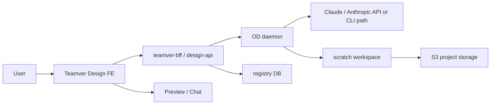
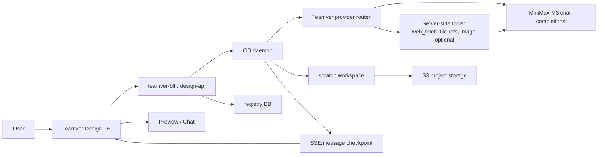
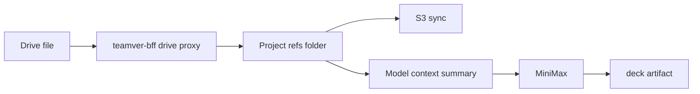

# Teamver Design MiniMax 전환 기획·설계

**작성일:** 2026-08-03

**기준:** 2026-08-03 현재 `ns-open-design` `staging` 브랜치, `ns-open-design` `main` 최신 커밋, `teamver-design-demo`, `opendesign-minimax-byok` 로컬 레포를 확인한 판단입니다.

**목표:** Claude 계열 모델 의존과 비용을 낮추기 위해 Teamver Design의 기본 AI 실행 경로를 MiniMax 기반으로 전환하되, 기존 슬라이드 생성/수정/댓글/Drive/S3/DB/백그라운드 동작을 깨지 않도록 단계적으로 적용합니다.

---

## 1. 결론

MiniMax 전환은 지금 추진할 가치가 있습니다. 단, 단순히 모델명만 MiniMax로 바꾸면 안 됩니다. Teamver Design에서 지금까지 문제가 되었던 영역이 모두 모델 실행 경로 주변에 있기 때문입니다.

- API key는 FE 응답에 절대 노출하지 않고, daemon/design-api 서버 환경변수에서만 사용해야 합니다.
- 산출물은 반드시 `deck` artifact로 생성해야 하며, 일반 `text/html` artifact로 빠지는 경로를 차단해야 합니다.
- `web_fetch`는 MiniMax tool loop에 포함되어야 합니다. `www.teamver.com 참고해서...` 같은 요청은 정상 지원 대상입니다.
- MiniMax M3는 `<think>` 또는 내부 추론 텍스트가 일반 content에 섞일 수 있으므로, streaming-safe 필터가 P0입니다.
- 파일 첨부/Drive 가져오기/댓글 수정/페이지 이탈 후 재진입은 Claude와 동일한 persist·resume·S3 sync 경로를 타야 합니다.
- Claude fallback은 초기에만 운영자 플래그로 제한해야 합니다. 무제한 자동 fallback은 비용 폭탄이 될 수 있습니다.

따라서 권장 방향은 **Teamver managed MiniMax provider**를 추가하고, Teamver embed에서는 MiniMax를 기본 provider로 사용하되, existing Claude/Anthropic 경로는 안전한 rollback/fallback 용도로 남기는 것입니다.

---

## 2. 참고한 근거

### 2.1 `opendesign-minimax-byok`

이 레포는 MiniMax 단일 키 통합 demo 문서가 잘 정리되어 있습니다.

핵심 포인트:

- `MiniMax-M3`를 OpenAI-compatible `/v1/chat/completions`로 호출합니다.
- MiniMax image/TTS/video는 같은 API key로 tool 실행이 가능합니다.
- `web_fetch`를 BYOK tool로 추가하여 URL 기반 요청을 처리합니다.
- `MAX_BYOK_TOOL_LOOPS`는 3회로 제한합니다.
- MiniMax M3는 `max_tokens`를 생략하는 처리가 필요합니다.
- `<think>...</think>` inline 추론 노출을 막기 위해 `createThinkTagSplitter` 계열 처리가 필요합니다.
- demo의 `/api/minimax/bootstrap`은 `apiKey`까지 응답하는 형태입니다. Teamver에는 그대로 적용하면 안 됩니다.

주요 문서:

- `opendesign-minimax-byok/README.md`
- `opendesign-minimax-byok/docs/01-overview.md`
- `opendesign-minimax-byok/docs/03-llm-chat.md`
- `opendesign-minimax-byok/docs/07-url-fetching.md`
- `opendesign-minimax-byok/docs/09-thinking-suppression.md`
- `opendesign-minimax-byok/docs/11-deployment.md`

### 2.2 `teamver-design-demo`

이 레포는 실제 UI/데모 흐름 확인용입니다. Teamver 스타일과 Open Design 구조가 섞여 있으므로, 구현 파일을 무조건 복사하기보다 다음 항목을 참고합니다.

- MiniMax 관련 provider/model slot UI 처리
- media model 등록 패턴
- e2e/컴포넌트 테스트에서 provider가 노출/비노출되는 기준
- demo에서 이미 겪은 “Teamver embed에서는 불필요한 provider UI를 숨기는” 처리

### 2.3 `ns-open-design` upstream/main

`main`의 MiniMax 관련 커밋과 주변 안정화 커밋 중 즉시 참고할 후보:

- `7b9864614 feat(media): wire MiniMax image-01 through the minimax provider slot`
- `e3739512c fix(byok): correct MiniMax LLM API domain from minimaxi.com to minimax.io`
- `a219a933e fix(memory): forward BYOK chat model through /api/memory/extract`
- `8f871f581 feat(teamver): loop 183 — thinking 분리, 내부 마크업 필터, deck 템플릿, workspace escape`
- `edfee9987 feat(teamver): loop 184 — BYOK web_fetch URL 읽기 + BYOK_TOOLS_OVERRIDE`
- `4f3a0b3c0 fix(daemon): continue stalled post-tool sessions`
- `c3de4d5b9 fix(daemon): classify model and timeout failures`
- `7787556cf fix(daemon): full ACP tool transcript and richer usage telemetry`

주의:

- `main` 전체 merge는 금지에 가깝습니다. Teamver staging에는 인증, Drive, S3/DB, deck-only, hidden UI 등 Teamver 전용 패치가 많아서 regression 위험이 큽니다.
- MiniMax 관련 코드는 **수동 포팅**이 맞습니다.

---

## 3. 현행 문제 정의

### 3.1 비용 문제

Claude 기반 생성/수정은 품질은 좋지만, 외부 데모와 실제 사용량이 증가하면 운영비 예측이 어렵습니다.

특히 Teamver Design의 주요 요청은 다음처럼 토큰과 시간이 많이 듭니다.

- 새 발표자료 8~12장 생성
- 웹사이트 분석 후 슬라이드 생성
- Drive/첨부 파일 기반 슬라이드 생성
- 댓글 기반 일부 요소 수정
- 기존 deck 전체를 읽고 스타일을 유지하며 수정
- 실패 시 auto-continue/retry

MiniMax를 기본 provider로 사용하면 평균 생성 비용을 낮출 수 있고, Claude는 예외적 fallback 또는 premium provider로 분리할 수 있습니다.

### 3.2 단순 모델 교체가 위험한 이유

Teamver Design은 일반 챗봇이 아니라 다음 계약을 만족해야 합니다.

- AI 메시지가 대화에 저장되어야 합니다.
- 생성 결과물이 파일 탭과 미리보기 패널에 자동 표시되어야 합니다.
- 생성 결과물이 scratch에만 남지 않고 S3/DB registry에 저장되어야 합니다.
- 페이지 이탈 후 재진입해도 진행 상태와 메시지를 복구해야 합니다.
- 중지 요청이 running state, stream, backend run에 모두 반영되어야 합니다.
- `todo`, `thinking`, `invoke`, `tools`, script tail, deliverable instruction 같은 내부 텍스트는 노출되지 않아야 합니다.
- Teamver embed는 deck-only여야 합니다. 일반 HTML/이미지/동영상 생성 UI가 노출되면 안 됩니다.
- FE에 API key가 노출되면 안 됩니다.

MiniMax 전환은 이 계약 위에서 수행해야 합니다.

---

## 4. 목표 범위

### 4.1 P0

- Teamver Design 기본 slide/deck 생성 provider를 MiniMax로 전환합니다.
- 기존 Claude 경로는 운영자 fallback으로 남깁니다.
- API key는 서버 환경변수에서만 읽고, runtime-config/bootstrap/session 응답에 노출하지 않습니다.
- 새 프로젝트 생성, 기존 프로젝트 수정, 댓글 기반 수정, 파일 첨부, Drive에서 가져온 파일 첨부, web_fetch 기반 생성이 MiniMax에서 동작해야 합니다.
- `artifact type="deck"` 강제와 저장 후 S3/DB registry 반영이 보장되어야 합니다.
- 페이지 이탈/재진입 시 메시지, running state, 결과물 미리보기가 복구되어야 합니다.
- MiniMax streaming에서 내부 추론/도구 마크업/질문 블록 앞뒤 태그가 채팅창에 노출되지 않아야 합니다.
- 실패 시 error diagnostics에 provider/model/finish_reason/tool_loop/output_bytes/persist_result를 남깁니다.

### 4.2 P1

- MiniMax image generation을 deck 내부 이미지 생성 도구로 제한적으로 사용합니다.
- URL fetch cache, file summary cache를 도입해 반복 요청 비용을 낮춥니다.
- 작업 종류별 provider routing을 나눕니다.
  - 작은 텍스트 수정: MiniMax fast path
  - 전체 deck 생성: MiniMax standard path
  - 고난도 디자인 복원/fallback: Claude optional path

### 4.3 P2

- MiniMax TTS/video는 Teamver Design 기본 기능에는 아직 필요하지 않으므로 출시 후 별도 검토합니다.
- 크레딧 차감/과금 정책은 회의 후 결정합니다. 다만 usage telemetry는 미리 남깁니다.

### 4.4 명시적 비범위

- Teamver Main BE의 실제 크레딧 차감 정책 결정
- 전체 OD main merge
- 일반 HTML 앱/이미지/동영상 생성 제품화
- FE에서 사용자가 임의 provider key를 입력하는 BYOK UI 노출

---

## 5. 권장 아키텍처

### 5.1 현재 경로



### 5.2 MiniMax 전환 후



핵심은 provider만 바꾸는 것이 아니라, **Teamver provider router**를 둬서 요청 종류와 workspace 정책에 따라 MiniMax/Claude/fallback을 결정하는 것입니다.

---

## 6. 서버 전용 키 관리

### 6.1 원칙

MiniMax API key는 절대 브라우저로 내려가면 안 됩니다.

금지:

- `runtime-config` 응답에 `apiKey` 포함
- `/api/minimax/bootstrap`이 `apiKey`를 반환
- localStorage에 MiniMax key 저장
- network tab에서 key 확인 가능
- frontend provider config에 key 주입

허용:

- daemon 컨테이너 환경변수
- design-api 컨테이너 환경변수
- AWS Secrets Manager 또는 EC2 env file
- `.env.staging` / `.env.production` 배포 파일. 단, repo commit 금지

### 6.2 권장 env

```bash
TEAMVER_DESIGN_DEFAULT_PROVIDER=minimax
TEAMVER_MINIMAX_API_KEY=sk-cp-...
TEAMVER_MINIMAX_BASE_URL=https://api.minimax.io/v1
TEAMVER_MINIMAX_CHAT_MODEL=MiniMax-M3
TEAMVER_MINIMAX_ENABLED=1
TEAMVER_CLAUDE_FALLBACK_ENABLED=0
TEAMVER_CLAUDE_FALLBACK_WORKSPACE_ALLOWLIST=
TEAMVER_AI_RUN_TIMEOUT_MS=240000
TEAMVER_AI_TOOL_LOOP_LIMIT=3
TEAMVER_WEB_FETCH_TIMEOUT_MS=12000
TEAMVER_WEB_FETCH_MAX_TEXT_BYTES=102400
```

`OD_MINIMAX_API_KEY`는 demo 호환용 alias로 읽을 수는 있지만, Teamver 표준은 `TEAMVER_MINIMAX_API_KEY`가 더 명확합니다.

### 6.3 runtime-config 응답

FE에는 다음 정도만 내려줍니다.

```json
{
  "ai": {
    "defaultProvider": "minimax",
    "defaultModel": "MiniMax-M3",
    "managedProvider": true,
    "apiKeyConfigured": true
  }
}
```

`apiKeyConfigured`는 boolean만 허용합니다. key prefix, hash, masked key도 network tab에서 정보가 되므로 불필요합니다.

---

## 7. Provider 설계

### 7.1 provider id

Teamver 내부 provider는 다음처럼 정의합니다.

```ts
type TeamverDesignProvider = 'minimax' | 'anthropic';
```

UI에는 provider switcher를 노출하지 않는 것이 기본입니다. 운영자가 staging debug flag로만 볼 수 있게 합니다.

### 7.2 request routing

```ts
function resolveTeamverDesignProvider(input): ProviderDecision {
  if (!env.TEAMVER_MINIMAX_ENABLED) return anthropicFallback("minimax_disabled");
  if (!env.TEAMVER_MINIMAX_API_KEY) return anthropicFallback("minimax_key_missing");
  if (input.forceProvider === "anthropic" && allowlistedWorkspace(input.workspaceId)) {
    return anthropic("operator_override");
  }
  return minimax("default");
}
```

Fallback은 항상 기록합니다.

- `provider_decision`
- `fallback_reason`
- `workspace_id`
- `project_id`
- `run_id`
- `estimated_input_tokens`
- `estimated_output_tokens`

### 7.3 MiniMax request payload

MiniMax M3에는 `max_tokens`를 보내지 않는 처리가 필요합니다.

```ts
const payload = {
  model: "MiniMax-M3",
  messages,
  stream: true,
  tools,
  tool_choice: "auto"
};
```

`temperature`, `top_p` 등은 처음에는 현행 Claude prompt tuning과 최대한 동일한 체감이 나도록 보수적으로 둡니다. 생성 품질이 불안정하면 provider별 default를 따로 조정합니다.

### 7.4 SSE parser

MiniMax는 OpenAI-compatible SSE 형태로 처리하되 다음을 모두 받아야 합니다.

- `choices[].delta.content`
- `choices[].delta.tool_calls`
- `choices[].finish_reason`
- provider error JSON
- premature stream close
- empty first delta timeout

Teamver 쪽 error diagnostics에는 다음을 남깁니다.

```json
{
  "provider": "minimax",
  "model": "MiniMax-M3",
  "finish_reason": "stop | tool_calls | length | content_filter | error | unknown",
  "tool_loop_count": 0,
  "visible_text_bytes": 0,
  "artifact_bytes": 0,
  "artifact_type": "deck",
  "persisted": true,
  "s3_sync": "uploaded | skipped | failed"
}
```

---

## 8. Tool Loop 설계

### 8.1 P0 tools

MiniMax P0 도구는 최소화합니다.

| Tool | P0 여부 | 설명 |
|---|---:|---|
| `web_fetch` | 예 | 공개 URL 본문 추출 |
| `read_project_file` 또는 기존 파일 context adapter | 예 | 첨부/Drive 파일 참조 |
| `generate_image` | 제한적 | deck 내부 이미지 필요 시만 |
| `generate_speech` | 아니오 | 출시 기능 아님 |
| `generate_video` | 아니오 | 출시 기능 아님 |

demo의 `generate_speech`, `generate_video`는 참고만 하고, Teamver deck 기본 출시에는 넣지 않습니다. 도구가 많을수록 모델이 엉뚱한 tool call을 시도하고 지연될 수 있습니다.

### 8.2 loop limit

권장 기본:

- `MAX_TOOL_LOOPS=3`
- 같은 tool+args 반복 호출은 1회만 허용
- `web_fetch` 실패 후 동일 URL 재시도 금지
- tool 결과가 너무 크면 summary를 생성해 다음 turn에 전달

### 8.3 tool result 형식

모델에게는 짧고 구조화된 텍스트로 반환합니다.

```text
web_fetch ok
url: https://www.teamver.com/
title: Teamver
content_chars: 3779
truncated: false

[plain text body]
```

실패 시:

```text
web_fetch failed
reason: blocked_private_ip
instruction: Do not invent page contents. Ask the user to paste relevant text.
```

---

## 9. web_fetch 설계

### 9.1 사용자 기대

다음 요청은 정상 동작해야 합니다.

- `www.teamver.com 참고해서 슬라이드 만들어줘`
- `https://neuralstudio.kr 분석해서 회사소개 덱 만들어줘`
- `이 랜딩페이지의 톤을 참고해 8장 발표자료 만들어줘`

사용자가 `www.teamver.com`처럼 scheme 없이 입력하면 `https://www.teamver.com`으로 보정합니다.

### 9.2 SSRF 차단

web_fetch는 반드시 서버에서 실행하므로 SSRF 차단이 필요합니다. 이 차단은 정상 공개 사이트 분석을 막기 위한 것이 아니라, 내부망 공격을 막기 위한 안전장치입니다.

차단 대상:

- `localhost`, `127.0.0.1`, `::1`
- RFC1918 private IP
- link-local, metadata IP
- `file:`, `ftp:`, `data:`, `javascript:`
- DNS rebinding 의심 케이스
- redirect 후 private/internal로 들어가는 URL

허용 대상:

- 공개 `http://`, `https://`
- apex -> www redirect
- http -> https redirect
- 최대 5회 redirect

### 9.3 cache

초기 P0에서는 per-run memory cache만 적용합니다.

- 같은 run 안에서 같은 URL을 여러 번 fetch하지 않습니다.
- 10~30분 TTL의 daemon local cache는 P1로 검토합니다.
- workspace 단위 장기 cache는 개인정보/권한 이슈가 있어 별도 설계가 필요합니다.

---

## 10. Prompt 설계

### 10.1 언어 정책

Teamver Design은 다국어 서비스입니다. 따라서 prompt에 한국어 고정 문구를 넣으면 안 됩니다.

권장:

- user locale 또는 user message language를 따릅니다.
- 내부 지시는 영어여도 되지만, visible assistant text는 사용자의 언어를 따르도록 합니다.
- 상태 문장을 반드시 출력하라고 강제하지 않습니다. 토큰 절약을 위해 자연어는 짧게 허용하고, artifact 생성이 우선입니다.

금지:

- `슬라이드 초안을 작성 중입니다. 잠시만 기다려 주세요.` 같은 고정 한국어 문구 강제
- `brief에 맞춘 짧은 한국어 상태 문장 1개` 같은 단일 언어 지시
- 사용자에게 보이면 안 되는 `Deliverable instruction`, `[form answers]`, `<question>` 원문 노출

### 10.2 deck-only 계약

Teamver Design embed에서는 산출물이 반드시 deck이어야 합니다.

```xml
<artifact type="deck" identifier="deck">
...
</artifact>
```

금지:

```xml
<artifact type="text/html">
```

MiniMax가 HTML로 만들려고 할 가능성이 있으므로 system prompt와 post-processor 양쪽에서 방어합니다.

Post-processor 정책:

- `type="deck"`이면 정상 처리
- `type="text/html"`이지만 deck 구조가 명확하면 Teamver 내부에서 `deck`으로 승격 가능
- 일반 HTML 앱/랜딩페이지면 저장하지 않고 재시도/수정 지시

### 10.3 빠른 질문

빠른 질문은 모델 provider와 별개로 안정적으로 동작해야 합니다.

권장:

- 사용자의 요청이 빈약하면 quick question을 먼저 표시합니다.
- URL, Drive, 첨부 파일이 있어도 목표/대상/톤이 불명확하면 질문을 표시할 수 있습니다.
- 단, 답변 스킵 후에는 `[Deliverable instruction]`이 visible chat에 노출되지 않아야 합니다.
- 질문 UI 데이터는 chat visible text가 아니라 structured event/message metadata로 저장합니다.

### 10.4 토큰 절약

자연어 응답을 강제하지 않습니다. 대신 다음 원칙을 둡니다.

- 생성 전 짧은 상태 문장은 optional
- deck artifact는 required
- 기존 deck 수정은 전체 재작성보다 patch intent를 우선
- 첨부/Drive 파일은 원문 전체보다 요약/청크 기반 context
- 이전 대화는 compact summary + 최근 메시지만 전달

---

## 11. Hidden/Internal Markup 안전장치

MiniMax 전환 시 가장 위험한 UX regression은 내부 텍스트 노출입니다.

반드시 숨겨야 하는 패턴:

- `<think>...</think>`
- `<thinking>...</thinking>`
- `<analysis>...</analysis>`
- `<tools>...</tools>`
- `<invoke>...</invoke>`
- `<question>...</question>` raw marker
- `[Deliverable instruction]`
- `[form answers ...]`
- `TodoWrite`, `Read`, `Write`, `Edit`, `Bash`, `WebFetch` pseudo-tool narration
- `try { ... localStorage.getItem(STORE) ... } catch`
- `var total = document.getElementById('deck-total')`
- `slides.length`, `deck-stage`, `deck-prev`, `deck-next` 등 deck navigation tail
- HTML/CSS/JS artifact body가 chat text로 새는 경우

방어 레이어:

1. daemon stream filter
2. FE stream parser filter
3. persisted message sanitize
4. re-entry message hydrate sanitize
5. artifact parser가 실패했을 때 visible text fallback 금지

중요: streaming 중에만 필터하면 안 됩니다. 이미 저장된 메시지를 재진입 시 다시 렌더링할 때도 같은 sanitize가 적용되어야 합니다.

---

## 12. 파일 첨부·Drive 가져오기 설계

### 12.1 파일 첨부

파일 첨부는 다음 순서로 처리합니다.

1. 업로드 파일을 project workspace에 저장
2. S3 mode이면 sync 대상에 포함
3. message metadata에는 project-relative path와 MIME/size만 저장
4. model context에는 요약 또는 safe text extract를 전달
5. deck에 파일을 embed해야 하면 `/api/projects/{id}/raw/...`가 아니라 project-relative 경로를 사용하도록 지시

### 12.2 Drive 가져오기

Drive에서 가져온 파일도 로컬 첨부와 동일하게 취급합니다.



주의:

- Drive API token/session 문제와 MiniMax key 문제를 섞으면 안 됩니다.
- Drive 파일 원문이 너무 크면 token budget 초과로 이어질 수 있으므로 extractor/summarizer가 필요합니다.
- Drive 가져오기 실패 시 모델에게 “파일 내용을 읽었다”고 전달하면 안 됩니다.

---

## 13. 저장·S3·DB 계약

MiniMax 전환은 저장 경로를 변경하지 않습니다.

필수 계약:

- 생성 결과는 project scratch에 파일로 저장
- 파일 목록 API에서 즉시 조회 가능
- preview-url 또는 raw endpoint에서 즉시 접근 가능
- S3 mode에서는 sync-up 성공 또는 명시적 retry 상태 기록
- registry DB에는 project title, workspace_id, output metadata가 저장
- scratch cleanup 전에 S3/DB 저장이 완료되어야 함

Run 완료 조건:

```text
LLM stream end
-> artifact parse success
-> deck validation success
-> file write success
-> message persist success
-> project registry update success
-> S3 sync scheduled/success
-> FE run state done
```

`stream end`만으로 완료 처리하면 안 됩니다.

---

## 14. 백그라운드·재진입·중지 처리

### 14.1 백그라운드 처리

페이지를 이탈해도 daemon/design-api run은 계속되어야 합니다.

필수:

- SSE 연결 종료와 run 종료를 분리
- assistant message delta checkpoint 저장
- run status를 project/conversation/message 단위로 조회 가능
- 재진입 시 active run을 자동 복구
- 완료 후 파일이 있으면 새로고침 없이 preview가 열림

### 14.2 중지 요청

중지는 다음을 모두 만족해야 합니다.

- FE composer 버튼이 즉시 disabled/done 상태로 바뀜
- backend run abort signal 전달
- provider stream abort
- tool loop 중이면 tool abort 또는 이후 loop 중단
- partial artifact는 complete validation 전까지 저장하지 않음
- stopped 상태는 재진입 후 자동 재개하지 않음

### 14.3 MiniMax 특화 위험

MiniMax tool loop 중 `finish_reason=tool_calls` 후 후속 turn이 오래 걸릴 수 있습니다. FE가 “첫 출력 대기 중”처럼 보이지 않도록 다음 이벤트를 저장/전달합니다.

- `run_started`
- `provider_connected`
- `tool_call_started`
- `tool_call_finished`
- `artifact_detected`
- `artifact_write_started`
- `artifact_write_finished`

이 이벤트는 사용자에게 모두 노출할 필요는 없지만, 상태 판단과 diagnostics에는 필요합니다.

---

## 15. 품질·속도 전략

### 15.1 작은 수정 fast path

요소 하나의 폰트 크기 변경 같은 작업은 전체 deck 재생성이 아니라 patch path를 우선합니다.

MiniMax 전환과 함께 다음 라우팅을 적용합니다.

| 요청 | 권장 처리 |
|---|---|
| 특정 텍스트/색상/크기 변경 | selected element patch |
| 댓글 대상 수정 | scoped patch + merge guard |
| 전체 톤 변경 | whole deck edit |
| 새 deck 생성 | MiniMax full generation |
| URL/파일 분석 deck 생성 | fetch/extract -> compact brief -> MiniMax generation |

### 15.2 prompt compaction

속도 단축을 위해 다음을 우선합니다.

- 기존 deck 전체 HTML을 매번 넣지 않고, 수정 대상 subtree + global style summary를 전달
- 파일/웹 본문은 1차 extract 후 short brief로 압축
- 최근 N개 메시지 + conversation summary만 전달
- artifact body가 chat visible text에 섞이지 않도록 별도 channel/metadata 유지

### 15.3 Claude fallback 기준

Claude fallback은 다음 경우에만 허용합니다.

- MiniMax provider 장애
- 특정 workspace allowlist
- 운영자 debug override
- MiniMax가 2회 연속 incomplete deck을 반환하고, 데모/긴급 복구가 필요한 경우

fallback이 발생하면 사용량과 비용이 커지므로 반드시 metrics에 남깁니다.

---

## 16. 단계별 실행 계획

### Phase 0. 문서·의사결정

상태: 이 문서가 Phase 0 산출물입니다.

- MiniMax 기본 전환 방향 확정
- server-only key 원칙 확정
- deck-only/hidden-markup/S3/DB 계약 명시
- 적용 후보 커밋과 demo 참고 범위 정리

### Phase 1. 코드 차이 분석

작업:

- `opendesign-minimax-byok` 문서의 symbol을 현재 `staging` 파일에 매핑
- `main`의 MiniMax/web_fetch/thinking 관련 커밋 diff 확인
- 이미 staging에 들어온 패치와 빠진 패치 구분
- 충돌 위험 목록 작성

산출물:

- 포팅 체크리스트
- 파일별 patch plan

### Phase 2. 서버 전용 MiniMax provider

작업:

- daemon/design-api env loader 추가
- runtime-config에는 boolean만 반환
- FE config는 managed provider를 사용하되 key를 가지지 않음
- `/api/proxy/minimax/stream` 또는 기존 proxy router에 managed provider route 추가

Acceptance:

- network tab 어디에도 MiniMax API key가 보이지 않음
- key missing 시 명확한 `MINIMAX_KEY_MISSING`
- Claude fallback off 상태에서도 에러 메시지가 사용자 친화적

### Phase 3. deck 생성/수정 안정화

작업:

- MiniMax-M3 request builder
- `max_tokens` 생략
- OpenAI-compatible SSE parser
- deck artifact 강제
- incomplete output auto-continue
- visible text sanitize
- message persist

Acceptance:

- 새 deck 생성 성공
- 기존 deck 수정 성공
- 댓글 기반 scoped patch 성공
- 결과물이 파일 탭과 preview에 즉시 표시

### Phase 4. web_fetch·파일·Drive context

작업:

- `web_fetch` tool
- SSRF guard
- redirect support
- per-run URL cache
- Drive/imported file summary
- attached file path contract

Acceptance:

- `www.teamver.com 참고해서...` 성공
- Drive에서 가져온 md/doc/pdf 기반 deck 생성 성공
- 실패한 URL/파일은 모델이 내용을 지어내지 않음

### Phase 5. staging canary

작업:

- staging workspace allowlist
- MiniMax default on
- Claude fallback controlled
- smoke script 보강
- synthetic deck create/edit/comment/web-fetch/drive-import test

Acceptance:

- 20회 연속 생성/수정에서 incomplete output 0~1회 이하
- S3/DB 저장 실패 0
- key 노출 0
- session/auth refresh 폭증 없음

### Phase 6. production rollout

작업:

- single-node production 상태를 고려해 동시성 cap 보수 적용
- provider fail-open 금지
- Claude fallback 비용 alert
- rollback env 준비

Acceptance:

- MiniMax default production 적용
- 장애 시 env rollback으로 Claude default 복귀 가능
- 기존 프로젝트 조회/다운로드/Drive/export 영향 없음

---

## 17. 테스트 계획

### 17.1 Unit

- MiniMax payload에 `max_tokens`가 포함되지 않는지
- SSE parser가 content/tool_calls/finish_reason을 처리하는지
- `<think>` chunk가 여러 조각으로 나뉘어도 visible text에 남지 않는지
- `web_fetch`가 private IP와 redirect-to-private을 차단하는지
- `www.teamver.com`을 `https://www.teamver.com`으로 보정하는지
- `artifact type="text/html"`을 deck-only 정책에서 차단/승격하는지
- persisted message sanitize가 재진입 시에도 적용되는지

### 17.2 Integration

- 새 deck 생성
- 기존 deck 수정
- 댓글 대상 scoped patch
- 파일 첨부 기반 생성
- Drive 가져오기 기반 생성
- URL 기반 생성
- 페이지 이탈 후 재진입
- 중지 요청
- S3 sync-up
- registry DB 저장

### 17.3 E2E smoke

```bash
bash scripts/smoke_design.sh --staging
TEAMVER_AI_PROVIDER=minimax bash scripts/run_staging_track_a_e2e.sh
```

추가할 smoke:

- `GET /teamver-bff/runtime-config`에 key 미포함
- MiniMax key configured/degraded 상태 확인
- `POST /api/proxy/minimax/stream` synthetic request
- URL fetch synthetic request
- deck artifact save -> preview-url -> S3 sync 상태

---

## 18. 운영 지표

최소 지표:

- `teamver_ai_provider_selected`
- `teamver_ai_provider_fallback`
- `teamver_ai_run_started`
- `teamver_ai_first_delta_ms`
- `teamver_ai_first_artifact_ms`
- `teamver_ai_run_completed_ms`
- `teamver_ai_run_failed`
- `teamver_ai_incomplete_output`
- `teamver_ai_tool_call`
- `teamver_ai_web_fetch`
- `teamver_ai_artifact_persist`
- `teamver_ai_s3_sync`

라벨:

- provider
- model
- workspace_id
- project_id
- run_id
- request_kind
- artifact_type
- failure_code
- fallback_reason

주의:

- API key, URL query의 민감 정보, 파일 본문, prompt 전문은 로그에 남기지 않습니다.

---

## 19. 위험과 대응

| 위험 | 영향 | 대응 |
|---|---|---|
| MiniMax가 deck 대신 HTML 생성 | preview/file tab 실패 | prompt + post-processor deck-only guard |
| `<think>` 노출 | UX/보안 문제 | daemon+FE+persist sanitize |
| 긴 deck output 중간 종료 | incomplete_output | auto-continue + artifact validator |
| tool loop 지연 | 사용자 대기 증가 | loop cap, status events, timeout |
| web_fetch SSRF | 보안 사고 | DNS/IP/redirect guard |
| FE key 노출 | 비용/보안 사고 | server-only managed provider |
| Claude fallback 남용 | 비용 증가 | allowlist/flag/metric |
| Drive token 이슈와 provider 이슈 혼동 | 원인 파악 어려움 | failure_code 분리 |
| S3 sync 누락 | 결과물 영구 접근 불가 | run complete gate에 persist/sync 포함 |
| single-node production 부하 | 데모 장애 | 동시성 cap, timeout, no video tool |

---

## 20. 출시 판단 체크리스트

MiniMax default production 적용 전 필수:

- [ ] FE network tab에서 MiniMax key 비노출
- [ ] 새 deck 생성 10회 연속 성공
- [ ] 기존 deck 수정 10회 연속 성공
- [ ] 댓글 scoped patch 5회 성공
- [ ] URL 기반 생성 5회 성공
- [ ] Drive md/pdf/doc 기반 생성 5회 성공
- [ ] 페이지 이탈 후 재진입 5회 성공
- [ ] 중지 요청 5회 성공
- [ ] S3 sync-up 실패 0
- [ ] registry DB 저장 실패 0
- [ ] hidden markup/chat leakage 0
- [ ] `auth/refresh`, `runtime-config`, `active`, `runs` 불필요 반복 호출 증가 없음
- [ ] Claude fallback off 상태의 실패 메시지 정상
- [ ] Claude fallback on 상태의 비용 metrics 정상

---

## 21. 바로 다음 추천 작업

### P0-1. 포팅 diff 작성

`opendesign-minimax-byok`와 `main`의 MiniMax 관련 파일을 현재 `staging` 파일에 매핑합니다.

우선 파일:

- `apps/daemon/src/chat-routes.ts`
- `apps/daemon/src/byok-tools.ts`
- `apps/daemon/src/byok-url-tools.ts`
- `apps/daemon/src/think-tag-splitter.ts`
- `apps/daemon/src/prompts/system.ts`
- `apps/web/src/providers/api-proxy.ts`
- `apps/web/src/components/ProjectView.tsx`
- `apps/web/src/runtime/internalAgentMarkup.ts`

### P0-2. server-only MiniMax managed provider 구현

- env loader
- key non-exposure runtime-config
- managed provider route
- key missing diagnostics

### P0-3. MiniMax deck create/edit smoke

- `MiniMax-M3`
- `max_tokens` 생략
- deck-only prompt
- hidden markup filtering
- incomplete auto-continue
- S3/DB complete gate

### P0-4. web_fetch + Drive/file context

- URL scheme 보정
- SSRF-safe redirect
- per-run cache
- Drive imported file summary
- attached file path contract

### P0-5. staging canary

- workspace allowlist
- 20회 synthetic run
- auth/session/API 호출량 확인
- rollback env 문서화

---

## 22. 최종 권고

MiniMax 전환은 **비용 절감을 위해 지금 바로 착수**하는 것이 맞습니다. 다만 외부 데모 전 안정성이 중요한 상태이므로, 바로 production default를 바꾸기보다 다음 순서가 안전합니다.

1. 문서/설계 확정
2. staging에서 server-only MiniMax provider 구현
3. deck create/edit/comment/file/URL/Drive smoke 통과
4. 소수 workspace canary
5. Claude fallback off/on 양쪽 검증
6. production default 전환

가장 중요한 원칙은 하나입니다. **MiniMax는 모델 provider만 교체하고, Teamver의 인증·Drive·S3·DB·백그라운드·deck-only UX 계약은 그대로 유지해야 합니다.**
