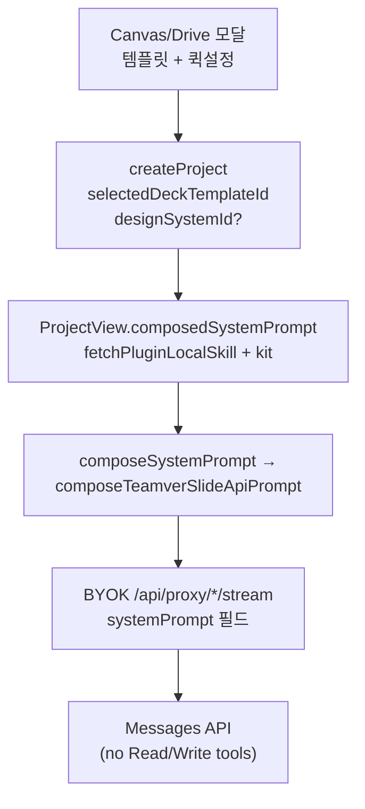

# Canvas → Slide 시스템 프롬프트 · 템플릿 적용 개선 SSOT

**작성:** 2026-08-10  
**브랜치:** `staging`  
**범위:** Teamver embed slide-only · BYOK / Messages API (`config.mode === 'api'`) · Canvas/Drive → 슬라이드 모달 3스텝「템플릿 선택」  
**목적:** “템플릿을 골랐는데 Neutral Modern처럼 나온다” 회귀의 **근본 원인 · 프롬프트 우선순위 · FE/BE 역할 · 조건부 조립 · 회귀 리스크 · 검증법**을 한 문서에 고정한다.

**관련 SSOT (읽는 순서 권장):**

| 순서 | 문서 | 역할 |
|------|------|------|
| 1 | [29 BYOK api mode vs runs](./29_BYOK_api_mode_vs_runs_아키텍처.md) | 왜 FE가 systemPrompt를 조립·전송하는지 |
| 2 | [47 body-first compact deck](./47_body-first_compact_deck_아키텍처_검토_및_0716이후_변경판단.md) | compact / body-first trade-off |
| 3 | [46 embed 슬라이드 품질](./46_embed_슬라이드_품질_원인분석_개선로드맵.md) | 품질 Phase 로드맵 |
| 4 | [42 Canvas Apps 슬라이드 생성](./42_Canvas_앱스_슬라이드_생성_기획설계.md) · [49 런치 모달 UX](./49_Canvas_Design_슬라이드_런치_모달_UX_안_비교.md) | 모달·handoff UX |
| 5 | **이 문서 (60)** | 템플릿 시각 소유권 · prompt compose SSOT |
| 6 | [00 구현 내역 누적](./00_구현_내역_누적.md) | 날짜별 커밋 기록 |

---

## 0. 한 줄 결론 (바쁠 때)

| 질문 | 답 |
|------|-----|
| 템플릿 선택이 UI에서 안 잡힌 건가? | **대체로 아님.** `selectedDeckTemplateId`·kit/scaffold는 들어갔는데, **뒤에 붙은 Neutral wireframe / DESIGN.md가 시각을 덮음** |
| 시스템 프롬프트에 문제가 있었나? | **예.** API mode 서두보다 **조립 순서·마지막 구체 HTML 샘플·조건부 누락**이 문제 |
| 왜 FE가 매번 systemPrompt를 보내나? | BYOK Messages API에는 daemon `Read` 툴이 없고, 템플릿 kit·퀵설정·locale이 **턴마다 가변**이므로 FE compose가 필요 |
| Daisy Days happy path는? | **token-safe content-swap:** kit + Template scaffold map + Motif + READ LAST → cream `#F5F0E6` / Fredoka / Motif SVG |
| 개선으로 품질이 떨어지나? | happy path는 **개선**. kit-miss·장수 충돌은 회귀 위험이 있어 **별도 완화 패치**로 닫음 |
| full skeleton API 복귀? | **금지** ([47](./47_body-first_compact_deck_아키텍처_검토_및_0716이후_변경판단.md)) — truncation 재발 |
| full example.html을 프롬프트에? | **기본 금지.** 입·출력 토큰 위험. kit(~2k) + scaffold map으로 계약 |
| scaffold로 갑자기 바꾸면? | **안 됨.** kit hard cutover 금지. full HTML scaffold도 기본 inject 하지 않음 |

### 0.0 2026-08-13 정책 — **token-safe content-swap** (full HTML scaffold 기본 off)

**제품 판단:** 미리보기 look을 유지하고 Source 텍스트만 바꾸는 **의도(content-swap)** 는 맞다. 다만 `example.html` 전체(Daisy Days ~87KB, trim해도 ≤12KB)를 시스템 프롬프트에 넣으면 kit와 합쳐 ~5k input tokens + 모델이 전체를 rewrite하며 output truncation이 난다.

**구현 (기본 경로):**
- `fetchPluginLocalSkill` / daemon `local-skill` — **compact visual kit만** append (palette/fonts/Motif + `Template scaffold map`), kit ≤11KB · Motif sprites 우선 패킹(daisy+star+rainbow)
- scaffold map `deco=`는 **실제 Motif sprite kind만** 노출 (sun/cloud 등 미제공 슬롯 제거)
- `neutralizeFilesystemCloneWorkflow` — SKILL.md `Clone example.html` 단계를 API 모드에서 무력화
- wrap / canvas launch / deck-framework / READ LAST — “Do NOT dump full example.html”
- kit-miss title stub — anti-`#c96442` / anti-emoji 강화
- `extractTemplateScaffoldFromHtml` — 유닛·opt-in용으로 모듈 유지, **hot path 기본 주입 off**
- 완전한 closed deck > 잘린 shell

### 0.0b (이력) CONTENT-SWAP full HTML scaffold additive dual-path — superseded

잠시 kit+scaffold(≤12KB) dual-path를 올렸으나 토큰 압력으로 **0.0 token-safe**로 재조정. scaffold preferred 문구는 폐기.

### 0.1 2026-08-11 추가 판단 — Daisy Days가 “꽃 이모지”로 대체된 회귀

첨부 사례처럼 `Html Ppt Zhangzara Daisy Days`를 선택했는데 실제 결과가 cream/Fredoka/손그림 daisy가 아니라 일반 파스텔 원형과 `🌼`류 이모지로 나온 경우는 **템플릿 선택 UI 자체의 실패로 보지 않는다.** 현재 코드상 선택 id/title은 프로젝트 metadata와 turn meta로 전달되고, 재진입 compose는 plugin-local `SKILL.md`와 `example.html` visual kit를 읽도록 되어 있다.

남아 있던 취약점은 최초 Canvas→Slide run prompt에서 `[Selected slide template]` 블록이 `[Quick settings]`, `[Source brief]`, `[User instruction]`보다 앞에 있어, 모델이 마지막에 읽은 소스/사용자 지시를 더 강하게 반영하거나 템플릿 이름의 의미만 얕게 해석하는 점이었다. 그래서 “Daisy Days”를 실제 템플릿의 굵은 외곽선 SVG/CSS daisy가 아니라 “꽃 느낌” 이모지로 대체할 수 있었다.

2026-08-11 패치 기준:

| 보강 | 내용 |
|------|------|
| run prompt READ LAST | explicit template일 때 `[Selected slide template priority]`를 프롬프트 끝에 다시 배치 |
| motif 대체 금지 | 템플릿 모티프를 emoji/Unicode로 대체하지 말고 CSS/SVG/템플릿 kit 기반으로 재현하도록 명시 |
| fallback 금지 | kit가 일시적으로 불완전해도 Neutral Modern / Simple Deck / generic pastel / source-page 장식으로 돌아가지 않도록 명시 |
| plugin inputs 보강 | `selectedDeckTemplateId`, `selectedDeckTemplateTitle`, `selectedTemplatePriorityInstruction`를 scenario plugin inputs에도 포함 |

이 패치는 OD 소스 구조를 크게 바꾸지 않고, 선택 템플릿의 **시각 소유권 우선순위**만 더 강하게 고정하는 변경이다.

### 0.2 2026-08-11 추가 판단 — Canvas 외 전체 템플릿 적용 품질

추가 검토 결과, 문제는 Canvas→Slide 전용 UI만의 문제가 아니라 **선택 템플릿 preview/thumbnail에 보이는 실제 디자인 요소가 프롬프트에 충분히 구조화되어 전달되는가**의 공통 문제다. 기존 `Template visual kit`는 `:root` 색상, 폰트, 첫 슬라이드 일부 HTML 중심이어서, 템플릿의 핵심 인상인 daisy/star/sticker/badge/chunky border/SVG 장식이 약하게 전달될 수 있었다.

2026-08-11 추가 패치 기준:

| 보강 | 내용 |
|------|------|
| visual kit 추출 확장 | `example.html`에서 motif/component class cue, 관련 CSS rule, inline SVG 존재 단서를 추출 |
| 공통 prompt 강화 | kit가 있으면 drawn motif를 emoji/Unicode로 대체하지 말고 CSS/SVG/HTML shape로 재현하도록 명시 |
| web/daemon wrapper 동시 보강 | web BYOK compose와 daemon `/api/runs` compose 모두 selected template guard에 같은 motif 규칙 적용 |
| 회귀 테스트 | Daisy Days kit에 `deco-daisy-*`, `deco-star-*`, shadow/border cue, emoji 대체 금지 문구가 포함되는지 검증 |

따라서 “템플릿 제목만 보고 분위기를 흉내내는 것”이 아니라, **썸네일/preview HTML에 실제로 들어있는 시각 토큰과 장식 vocabulary를 모델 입력으로 밀어 넣는 방식**을 공통 경로에서 강화한다.

### 0.3 2026-08-11 추가 점검 — 전체 템플릿 적용 경로 회귀 방어

여러 루프에 걸쳐 코드 경로를 다시 확인하면서 다음 위험을 추가로 닫았다.

| 항목 | 문제 | 보완 |
|------|------|------|
| contracts public export | `readSkillFrontmatterDescription`가 contracts public export에 없으면 web의 plugin-local SKILL 로더가 런타임에서 `undefined`를 호출하고, frontmatter visual summary가 조용히 빠질 수 있음 | contracts public export/dist 상태를 확인하고 `teamver-fetch-plugin-local-skill` 테스트로 SKILL.md + frontmatter + `example.html` kit 로딩을 재고정 |
| plugin asset fetch | plugin asset은 프로젝트 raw 파일이 아닌데 workspace header/recovery 경로에 과하게 의존하면 kit miss가 발생할 수 있음 | plugin asset fetch에서 workspace header를 생략하고, embed wrapper 실패 시 plain same-origin fetch fallback |
| Canvas 외 일반 템플릿 시작 | Home/Community template card로 시작하는 경로는 metadata/system prompt에 의존하고 plugin inputs에는 템플릿 제목만 들어가 visual priority가 약함 | `explicitSlideOnlyDeckTemplatePluginInputs`로 selected id/title + Template visual kit/Motif sprites 우선 정책을 plugin inputs에도 포함 |

이로써 Canvas→Slide 모달뿐 아니라 커뮤니티 템플릿 카드, 일반 Home prompt-loop, 재진입 compose 경로 모두 “선택 템플릿의 preview/kit가 시각 소유권을 가진다”는 같은 계약을 사용한다.

### 0.4 2026-08-11 추가 장애 — run-scoped 템플릿 pin 누락

사용자 재현: 선택 템플릿을 골라도 결과가 기본 템플릿처럼 나오고, `terminalPersistResultKind=skipped-incomplete reason=incomplete-html-document-shell`로 종료.

추가 원인은 FE가 `selectedDeckTemplateId/Title`을 `ChatSendMeta`에는 넣었지만, hosted daemon 경로의 `/api/runs` request에는 이 값을 top-level로 보내지 않았던 것이다. daemon `composeDaemonSystemPrompt`도 project metadata만 읽었기 때문에, `patchProject(metadata)`가 늦거나 이중화 노드 간 캐시/DB 반영 타이밍이 어긋나면 선택 템플릿이 primary skill로 승격되지 못하고 기본 scenario/simple-deck 경로가 다시 우선될 수 있었다.

보완:

- `ChatRequest` / `DaemonStreamOptions`에 `selectedDeckTemplateId`, `selectedDeckTemplateTitle`을 명시 필드로 추가.
- `ProjectView → streamViaDaemon → /api/runs → composeDaemonSystemPrompt` 전 구간에 run-scoped template pin 전달.
- daemon prompt compose는 `selectedDeckTemplateFromRun`을 project metadata보다 우선한다.
- daemon/web 회귀 테스트로 “metadata patch race가 있어도 선택 템플릿이 drop되지 않음”을 고정.

### 0.5 2026-08-11 추가 장애 — 선택 템플릿 CSS 우선 출력으로 인한 `incomplete-html-document-shell`

사용자 재현: 선택 템플릿을 고른 뒤에도 `terminalPersistResultKind=skipped-incomplete reason=incomplete-html-document-shell`로 종료. 이는 저장/S3 문제가 아니라, 모델 응답이 `<!doctype html><html><head><style>...` 형태의 **문서 shell / 장식 CSS**에서 끊겨 실제 `<section class="slide">` 본문이 충분히 생성되지 않은 경우다. pre-write gate가 이를 저장하지 않는 것은 정상 방어다.

추가 원인: 0.1~0.4 패치로 템플릿 시각 소유권을 강하게 만든 결과, 일부 모델이 “Motif sprites / Decoration CSS를 유지하라”를 **전체 CSS를 먼저 복사하라**로 해석할 수 있었다. 특히 Daisy Days류는 SVG/CSS motif가 많아, 첫 슬라이드 본문 전에 토큰을 소모하면 `incomplete-html-document-shell`로 끝난다.

2026-08-11 추가 패치 기준:

| 보강 | 내용 |
|------|------|
| selected-template compact contract | `<artifact>` 뒤 첫 1200자 안에 `<body>`와 첫 완성 `<section class="slide">`가 나오도록 명시 |
| head/style shell 금지 | 선택 템플릿 경로에서 `<head>` 시작, 긴 `<style>` 선출력, full Decoration CSS 덤프 금지 |
| motif 재현 방식 조정 | 전체 CSS 복사가 아니라 palette/font/border/shadow + 1~3개 motif cue의 compact inline subset으로 재현 |
| 자동 이어쓰기 | head-only / CSS-only shell은 fenced partial로 재사용하지 않고, 버린 뒤 새 complete deck artifact를 만들도록 회귀 테스트 고정 |
| Canvas prompt/plugin inputs | “verbatim copy” 표현을 제거하고 “compact recognizable cues + complete output first”로 정리 |

제품 판단: **완성된 덱이 우선**이다. 선택 템플릿과 100% 동일한 CSS를 복사하다가 결과물이 비어버리는 것보다, 템플릿의 palette/font/motif cue가 보이는 compact static deck을 완성하는 것이 낫다. 따라서 pre-write gate는 계속 shell 저장을 막고, prompt는 shell이 생기지 않도록 body-first로 유도한다.

### 0.6 2026-08-13 추가 판단 — 템플릿은 “설명 재현”이 아니라 content-swap (token-safe)

사용자 피드백: Daisy Days 템플릿을 선택했는데 결과가 어두운 배경 + 임의 꽃 도형으로 나옴. 이는 “템플릿을 잘 설명해 주면 모델이 비슷하게 그릴 것”이라는 접근의 한계다. 선택 템플릿은 스타일 참고자료가 아니라 **미리보기 look을 base로 내용만 교체**해야 한다. 다만 full `example.html`을 프롬프트에 싣는 방식은 토큰 위험이 커서(**§0.0**), kit + scaffold map으로 계약을 전달한다.

2026-08-13 패치 기준:

| 보강 | 내용 |
|------|------|
| template-as-base 계약 | `example.html`의 slide class, layout role, surface color, decorative wrapper, border/shadow/card treatment, SVG motif language를 보존하고 **visible content만 교체**하도록 명시 |
| scaffold map | visual kit에 `Template scaffold map` 추가 — `slide-title`, `slide-weekly` 등 section class/order/deco wrapper를 구조화해 모델 입력에 제공 |
| motif 우선순위 | Daisy Days의 실제 multi-petal daisy SVG가 prompt에 남도록 SVG classifier와 budget을 조정. 흰색 cloud SVG가 daisy로 오분류되지 않게 `#FCDF6C` center를 요구 |
| surface lock | `--cream #F5F0E6` 같은 main surface/background token이 있으면 cover와 대부분의 slide에 적용. light pastel template을 dark deck으로 바꾸는 것 금지 |
| token budget | full HTML scaffold 기본 inject off — kit(~2.7k tok)만 hot path |
| 전 템플릿 일반화 | Motif `other` fallback · `div.slide` scaffold map · slide-paper surface · Daisy 하드코딩 제거 · official deck golden matrix |

제품 판단: **템플릿 선택 결과물은 “사용자 요청으로 내용을 바꾼 템플릿 HTML”에 가까워야 한다.** Daisy Days만이 아니라 **모든 selected deck template**에 동일 계약이 적용되어야 한다. 입력은 kit+map으로 압축한다.

---

## 1. 배경 — 사용자가 체감한 증상

### 1.1 재현

1. Canvas → Design 슬라이드 모달 3스텝에서 템플릿 **Html Ppt Zhangzara Daisy Days** 선택  
2. 생성 결과물: cream/daisy/Fredoka가 아니라 **sparse Neutral Modern** (off-white, Inter/system-ui, slate cover 분위기)  
3. 네트워크/디버그로 보면 FE가 `systemPrompt`를 매 요청에 실어 보냄

### 1.2 Daisy Days 실제 시각 토큰 (정답지)

플러그인 `plugins/_official/examples/html-ppt-zhangzara-daisy-days/example.html` `:root`:

| 토큰 | 값 |
|------|-----|
| cream | `#F5F0E6` |
| turquoise | `#7ECDC0` |
| display font | `Fredoka One` |
| body font | `Quicksand` |
| border | `3px` chunky + offset shadow |
| motif | daisy / star / pastel badges |

결과물에 위 토큰·밀도가 거의 없으면 **템플릿 시각 소유권 실패**로 본다.

### 1.3 선행 수정과의 관계

이 문서의 핵심 커밋 이전에 이미 쌓여 있던 Canvas→Slide 하드닝:

| 커밋 | 요약 |
|------|------|
| `4ff045797` / `640a67ce3` | Selected template body를 summarize로 잘리지 않게 |
| `111cfbc71` | YAML `description: \|` frontmatter 파싱 |
| `96f636148` | Simple Deck이 시각을 소유하지 않게 |
| `7c8d88f78` | `example.html` visual kit 주입 · DS demote |
| `63c225ff9` ~ `06cdfa04d` | Canvas HTML leak · cover · catalog · race |

그럼에도 Daisy Days → Neutral이 남았던 이유는 **kit가 들어가도 그 뒤에 Neutral 샘플이 “마지막 권위”처럼 동작**했기 때문이다.

---

## 2. 아키텍처 — 누가 systemPrompt를 만드는가

### 2.1 실행 경로



- Teamver slide-only BYOK는 **`POST /api/runs` daemon agent loop가 아님** ([29](./29_BYOK_api_mode_vs_runs_아키텍처.md)).
- 모델은 `Read`로 `example.html`을 열 수 없다 → FE가 asset fetch 후 prompt에 **kit를 인라인**해야 한다.
- 따라서 “BE에 고정 system prompt 하나만 두고 FE는 안 보낸다”는 **현재 아키텍처와 맞지 않다.**

### 2.2 FE vs BE 역할

| 계층 | 역할 | 비고 |
|------|------|------|
| FE (`ProjectView`, `canvasSlideLaunch`, `fetchPluginLocalSkill`) | 템플릿 SKILL.md + example.html kit fetch · wrap · DS omit · plugin scenario-only · 퀵설정→Plugin inputs | BYOK compose 입력 조립 |
| contracts (`composeTeamverSlideApiPrompt`) | 섹션 순서 · compact 분기 · READ LAST · skipDiscovery | **프롬프트 SSOT** |
| daemon compose | CLI/`/api/runs` 경로 | slide-only BYOK와 **별개** |
| BE 고정 skeleton (미래 옵션) | API override / streaming rules만 BE | kit·metadata는 여전히 가변 주입 필요 |

### 2.3 early-return 조건

`composeSystemPrompt`는 다음일 때 lean Teamver composer로 early-return한다:

```text
streamFormat === 'plain'
&& mediaExecution.mode === 'disabled'   // slide-only MVP
&& sessionMode !== 'chat'
→ composeTeamverSlideApiPrompt(...)
```

이 경로에서는 전체 OD charter / discovery philosophy / skill seed copy workflow를 **넣지 않는다** ([47](./47_body-first_compact_deck_아키텍처_검토_및_0716이후_변경판단.md)).

---

## 3. 증상 재현 시점의 프롬프트 실패 모드

모델은 **마지막에 나온 구체 HTML 샘플**을 강하게 따른다. 실패 시 대략 다음 순서였다:

1. Neutral Modern `DESIGN.md` 본문 (“No ornament”, Inter, slate…) — SECONDARY라고 써도 본문이 길면 영향大  
2. Selected deck template + `## Template visual kit` (`#F5F0E6`, Fredoka…)  
3. **`DECK_FRAMEWORK_DIRECTIVE_COMPACT` wireframe** — `background:#0f172a;color:#f8fafc` 등 Neutral 샘플이 **kit 뒤**에 위치  

결과: Daisy Days kit가 있어도 slate/sparse corporate 커버가 나옴.

추가 악화 요인:

| 요인 | 효과 |
|------|------|
| Canvas create 시 `resolveEmbedSlideDesignSystemId` → `default`(Neutral) 자동 바인딩 | DESIGN.md가 compose에 유입 |
| App create가 `designSystemId: null`을 다시 Neutral로 resolve | FE가 null을내도 Neutral 재주입 |
| Simple Deck scenario SKILL을 Selected body에 append (이전) | “기본 템플릿” 리듬이 시각 계약으로 오인 |
| 기본 덱에도 `wrapSelectedDeckTemplateSkillBody` (“user explicitly picked”) | 거짓 framing |
| 퀵설정 Length가 Plugin `slideCount`로 안 들어감 | 장수/audience가 “stakeholders” 등 고정값과 충돌 |

---

## 4. 현재 compose 섹션 순서 (SSOT)

`composeTeamverSlideApiPrompt` (`packages/contracts/src/prompts/system.ts`), join delimiter: `\n\n---\n\n`

| # | 섹션 | 조건 |
|---|------|------|
| 1 | API mode — no tools + Teamver deliverable | 항상 |
| 2 | Teamver slide-only scope | 항상 |
| 3a | Teamver skip-discovery (**Site-ref 없음**) | `skipDiscoveryBrief` / `examplePrompt` |
| 3b | Turn-1 quick brief schema | discovery 경로 |
| 4 | Lean UI locale (Teamver) | non-`en` |
| 5–6 | user / project instructions | 있으면 |
| 7 | Active design system | 있으면. **템플릿 선택 시 본문 omit + SECONDARY stub** |
| 8 | Project metadata | 있으면 |
| 9 | Plugin / scenario-only block | 있으면 |
| 10 | From-template visual signature | `ProjectTemplate` 있을 때 |
| 11 | Skill visual signature (cue extract) | **kit 없을 때만** (kit 있으면 생략) |
| 12a | Selected deck template — MUST MATCH (verbatim body) | `hasSelectedTemplate` |
| 12b | Visual style reference (summarized) | 템플릿 없음 |
| 13a | `DECK_FRAMEWORK_DIRECTIVE_COMPACT_FOR_SELECTED_TEMPLATE` | 템플릿 있음 |
| 13b | `DECK_FRAMEWORK_DIRECTIVE_COMPACT` (Neutral 샘플) | 템플릿 없음 |
| 14 | Framework emission override (open-early) | 항상 |
| 15 | Discovery binding | discovery만 |
| 16a/b | Direct / Unified streaming (READ LAST) | 분기 |
| 17–18 | Comment-edit / existing-deck image 계약 | **FE 플래그 true일 때만** (greenfield 생략) |
| 19 | Selected template visual READ LAST | 템플릿 있음 · **kit 유무에 문구 분기** |

### 4.1 `hasSelectedTemplate` 판정

다음 중 하나면 true:

1. `metadata.selectedDeckTemplateId` non-empty  
2. skill body에 `## Visual summary (from template frontmatter)`  
3. skill body에 `## Template visual kit (from example.html)`  

(2)(3)는 Canvas confirm → send 같은 tick에서 React metadata가 stale여도 kit/summary가 살아 있게 하는 **race 방어**다.

### 4.2 kit 유무에 따른 분기 (회귀 완화)

| | kit 있음 | kit 없음 (title stub / fetch 실패) |
|--|----------|-------------------------------------|
| Skill visual signature | 생략 (중복 방지) | **유지** (cue 추출) |
| Selected hard requirements | kit hex/fonts 필수 | Visual summary/title cue + Neutral slate 금지 |
| READ LAST | “kit만이 유일한 palette” | “kit incomplete — summary/title 따르고 Neutral invent 금지” |
| DS stub 문구 | kit owns colors | summary/title cues for look |

---

## 5. 수정 내용 — 커밋 타임라인

### 5.1 핵심 3커밋 (2026-08-10)

| 커밋 | 제목 | 핵심 |
|------|------|------|
| `4e4d69bae` | stop Neutral compact wireframes from overriding selected templates | template-aware compact · DS omit · create 시 Neutral 미바인딩 · READ LAST |
| `7a9a39085` | harden slide API prompt priority, conditionals, and quick settings | open-early 통일 · Teamver skip-discovery · 퀵설정→slideCount/audience/tone · false wrap 제거 · lean locale · 1920×1080 |
| `745a89fd7` | close prompt-regression risks from kit-miss and slideCount | kit-miss READ LAST 분기 · 유저 장수 > quick Length · wireframe 1920×1080 |

### 5.2 `4e4d69bae` 상세

**contracts**

- `DECK_FRAMEWORK_DIRECTIVE_COMPACT_FOR_SELECTED_TEMPLATE` + structure-only vocabulary  
  - `#0f172a` / `#1e293b` 샘플 **제거**  
- 템플릿 있을 때 Neutral compact 대신 위 contract 사용  
- DESIGN.md 본문 생략 (SECONDARY stub만)  
- `TEAMVER_SELECTED_TEMPLATE_VISUAL_READ_LAST` 추가  

**web**

- `isExplicitCanvasSlideVisualTemplate`  
- HomeView Canvas/Drive confirm: 명시 템플릿이면 `designSystemId: null`  
- App create: `selectedDeckTemplateId` 있으면 null을 Neutral로 재resolve하지 않음  
- ProjectView: slide-only API + selected template이면 DS body 로드 스킵  

**plugin**

- Daisy Days `SKILL.md`에 Teamver API 안내 (`type="deck"`, cream/Fredoka, Neutral 금지)

### 5.3 `7a9a39085` 상세

| 변경 | 의도 |
|------|------|
| Framework override: “완성될 때까지 열지 마” → **stream promptly / open early** | DIRECT_STREAMING과 충돌 해소 |
| `SKIP_DISCOVERY_BRIEF_OVERRIDE_TEAMVER_SLIDE` (Site-ref 없음) | skipDiscovery vs discovery 재질문 충돌 제거 |
| `renderTeamverSlideUiLocalePrompt` | OD task-type / 잘못된 discovery 스키마 제거 |
| 퀵 Length → `slideCount` `5-6` / `8-10` / `12-15` / `6-8` | Plugin inputs와 compact guidance 정렬 |
| audience/tone을 퀵설정에서 Plugin inputs로 | `"stakeholders"` 고정 제거 |
| 비선택 덱에 selected wrap 중단 | 거짓 “user picked” framing 제거 |
| kit 있을 때 skill visual signature 생략 | 중복·stale “ask quick brief” 제거 (이후 kit-miss에서 재조정) |
| `deckGuidance` → contracts re-export | FE/contracts 장수 문구 단일화 |
| DIRECT: fixed `1920×1080` canvas | user run prompt와 기하 정렬 |

### 5.4 `745a89fd7` 상세 (회귀 방어)

| 리스크 | 수정 |
|--------|------|
| kit 없이 “kit only palette” 단정 → sparse/헤맴 | WITH_KIT / WITHOUT_KIT READ LAST 분리 |
| Length=short + “15 slides” → 5–6장 | `parseExplicitSlideCountFromText`가 Plugin `slideCount` 우선 |
| Plugin block “authoritative slide count”가 유저를 이김 | “user message count wins” 문구 |
| selected wireframe가 여전히 `min-height:100vh` | `width:1920px;height:1080px;overflow:hidden` 샘플로 교체 |
| UNIFIED “never style” vs DIRECT kit style | UNIFIED도 short kit `<style>`/`@import` 허용 |

---

## 6. FE 입력 조립 (`ProjectView` / `canvasSlideLaunch`)

### 6.1 템플릿 skill body

1. `selectedDeckTemplateMetadata(project.metadata, turnMeta)` — **턴 meta가 project metadata보다 우선** (race)  
2. `fetchPluginLocalSkill(id)`  
   - SKILL.md frontmatter → `## Visual summary`  
   - preview `example.html` → `extractTemplateVisualKitFromHtml` → `appendTemplateVisualKit`  
3. 캐시는 kit 헤더가 있을 때만 rich로 인정 (구 prose-only 캐시 bust)  
4. 실패 시 title stub (Simple Deck body를 Selected로 쓰지 않음)  
5. `wrapSelectedDeckTemplateSkillBody` — **명시 선택(또는 동등 조건)일 때만**  
6. slide-only API + selected template → scenario SKILL secondary **append 금지**  
7. slide-only API + selected template → DESIGN.md **로드 스킵**

### 6.2 퀵설정 → Plugin inputs

`canvasCreateSlidesPluginInputs(...)`:

| 필드 | 소스 |
|------|------|
| `audience` | quick audience (`infer from source` / internal / client / …) |
| `tone` | quick tone |
| `slideCount` | **유저 free-text 장수** > quick length 매핑 |
| `visualTemplate` / `designSystem` | 템플릿 title (Neutral 이름 대신) |
| `quickSettingsInstruction` | 사람 읽기용 + “유저 장수가 Length보다 우선” |

Length 매핑:

| Length | slideCount |
|--------|------------|
| auto | `6-8` |
| short | `5-6` |
| standard | `8-10` |
| detailed | `12-15` |

Free-text 파서 (`parseExplicitSlideCountFromText`):

- `15 slides`, `10-12 pages`, `8~10장`, `슬라이드 10장으로` 등  
- 범위 1–40  

### 6.3 create 시 designSystemId

```text
명시 시각 템플릿 (Daisy Days 등)
  → designSystemId = null
  → App.create도 Neutral로 재resolve 하지 않음

기본 슬라이드 템플릿 / scenario only
  → resolveEmbedSlideDesignSystemId(...) 유지 (Neutral 등)
```

---

## 7. 조건부 include / exclude 매트릭스

| 조건 | 넣어야 함 | 빼야 / 완화 |
|------|-----------|-------------|
| **명시 템플릿 + kit** | Selected verbatim · template compact · WITH_KIT READ LAST · scenario-only plugin | Neutral compact 샘플 · full DESIGN.md · cue signature |
| **명시 템플릿 · kit 없음** | Selected verbatim · template compact · WITHOUT_KIT READ LAST · cue signature | “kit only palette” 단정 · Neutral invent |
| **기본 템플릿** | Neutral/DS compact · summarized skill · DS 본문(있으면) | selected wrap · template READ LAST |
| **퀵설정** | Plugin slideCount/audience/tone | 하드코딩 `stakeholders` |
| **유저 명시 장수** | 그 값이 Plugin slideCount | quick Length 값 |
| **skipDiscovery (Canvas)** | DIRECT + Teamver skip block | turn-1 form · Site-ref · discovery binding |
| **discovery** | turn-1 + UNIFIED + binding | DIRECT |
| **edit 턴** | comment/image patch (이상적으로 이때만) | greenfield에서도 현재는 항상 붙음 → follow-up |

---

## 8. 회귀 검토 결과 (개선 후)

### 8.1 시나리오 판정

| 시나리오 | 판정 |
|----------|------|
| A. Daisy Days + kit + short + education | **개선** |
| B. 기본 슬라이드 템플릿 | **안전/개선** |
| C. discovery 있는 일반 덱 | **대체로 불변** |
| D. skipDiscovery 프로젝트의 comment edit | **안전** (edit 계약 유지) |
| E. kit fetch 실패 | **완화됨** (WITHOUT_KIT READ LAST) |
| F. Length=short + “15 slides” | **수정됨** (유저 장수 우선) |
| G. URL-only + skipDiscovery | **허용 tradeoff** (Canvas/Drive엔 source brief 있음) |

### 8.2 남은 잔여 리스크 (낮음~중간)

| 항목 | 심각도 | 메모 |
|------|--------|------|
| greenfield에 edit 계약 bloat | P1 토큰 | 턴 플래그 gating 필요 (`hasPreviewComments` 등) |
| 여러 “READ LAST” 공존 | P2 | 장기적으로 Final authority 섹션 통합 |
| auto Length → 항상 6–8 | P2 | 유저 장수 있으면면 override됨 |
| kit fetch 실패 UX | P2 | 프롬프트 완화는 됨 · FE 에러 표시는 별도 |
| lean path에서 `byokToolNames` 무시 | P2 | URL-only embed 지원 여부는 제품 결정 |
| brand DS + visual template 동시 | P2 | 현재 Canvas는 DS null · 필요 시 brand stub만 |

### 8.3 하지 말아야 할 것

- API 경로에 full `DECK_FRAMEWORK_DIRECTIVE` skeleton(~11KB) 복귀 → truncation  
- 템플릿 선택 시 Neutral DESIGN.md 본문 재주입  
- template compact 뒤에 `#0f172a` 샘플 다시 넣기  
- Selected body를 `summarizeApiModeSkillBody`로 18줄 truncate  
- Simple Deck scenario SKILL을 Selected 섹션에 append  

---

## 9. 검증

### 9.1 자동 테스트

| 패키지 | 파일 | 보는 것 |
|--------|------|---------|
| contracts | `tests/teamver-selected-template-compose.test.ts` | Daisy Days kit hex/Fredoka · no `#0f172a` samples · kit-miss softened READ LAST |
| contracts | `tests/deck-framework-compact.test.ts` | selected-template compact에 Neutral 샘플 없음 |
| contracts | `tests/system-prompt-api-mode.test.ts` | skipDiscovery / open-early / streaming |
| web | `tests/teamver-canvas-slide-launch.test.ts` | slideCount 매핑 · 유저 장수 override · 퀵설정 |

로컬:

```bash
cd packages/contracts && pnpm exec vitest run \
  tests/teamver-selected-template-compose.test.ts \
  tests/deck-framework-compact.test.ts \
  tests/system-prompt-api-mode.test.ts

cd apps/web && pnpm exec vitest run tests/teamver-canvas-slide-launch.test.ts
```

### 9.2 수동 스모크 (staging)

1. **Daisy Days happy path**  
   - Canvas → Daisy Days → 생성  
   - 결과: cream / chunky border / Fredoka 계열  
   - DevTools에서 전송 `systemPrompt`에 포함되어야 함:  
     - `## Selected deck template — … — MUST MATCH`  
     - `## Template visual kit` / `#F5F0E6` / `Fredoka`  
     - `API compact contract with Selected deck template`  
     - `Selected deck template visual — READ LAST`  
     - `**only** allowed palette` (kit 있을 때)  
   - 없어야 함: `background:#0f172a;color:#f8fafc`, Neutral DESIGN.md 본문, `Site-ref:`

2. **퀵설정**  
   - Length=short → Plugin/inputs에 `slideCount: "5-6"`  
   - Audience=education → `education / training`  
   - 같은 모달에서 user prompt에 `15 slides` → `slideCount: "15"` (short를 이김)

3. **기본 템플릿**  
   - Neutral/DS compact 경로 · selected wrap/READ LAST 없음

4. **kit 실패 시뮬레이션** (가능하면)  
   - READ LAST에 `Template visual kit may be incomplete`  
   - `**only** allowed palette` 없음

---

## 10. 주요 코드 맵

| 영역 | 경로 |
|------|------|
| Lean compose | `packages/contracts/src/prompts/system.ts` → `composeTeamverSlideApiPrompt` |
| Compact contracts | `packages/contracts/src/prompts/deck-framework.ts` |
| Plugin block | `packages/contracts/src/prompts/plugin-block.ts` |
| Visual kit extract | `packages/contracts/src/template-visual-kit.ts` |
| FE compose | `apps/web/src/components/ProjectView.tsx` (`composedSystemPrompt`) |
| Template selection meta | `apps/web/src/runtime/selected-deck-template.ts` |
| Modal / run prompt / inputs | `apps/web/src/teamver/canvasSlideLaunch.ts` |
| Plugin skill+kit fetch | `apps/web/src/teamver/fetchPluginLocalSkill.ts` |
| Create DS resolve | `apps/web/src/App.tsx`, `apps/web/src/components/HomeView.tsx` |
| Slide-count FE re-export | `apps/web/src/runtime/deckGuidance.ts` |
| Daisy Days assets | `plugins/_official/examples/html-ppt-zhangzara-daisy-days/` |

---

## 11. FAQ

### Q1. 시스템 프롬프트를 BE에 고정하면 안 되나?

**전부 고정은 불가.** BYOK에는 툴이 없고 kit·퀵설정·locale·selected template이 턴 가변이다.  
가능하면 중기에:

- BE/contracts: 고정 skeleton (API override, streaming, deliverable)  
- FE: 가변 파트만 주입 (kit, metadata, plugin inputs)

지금처럼 FE가 **완성된 systemPrompt 문자열**을 보내는 것은 BYOK에 맞는 실용적 형태다.

### Q2. “READ LAST”가 여러 개인데 괜찮은가?

역할이 다르다 (streaming / comment-edit / image-edit / template visual).  
당장 치명적이진 않으나, 장기적으로 **Final authority 한 블록**으로 묶는 편이 모델 혼란이 적다.

### Q3. DESIGN.md를 아예 안 넣으면 브랜드가 깨지지 않나?

Canvas 명시 템플릿 경로에서는 create 시 `designSystemId=null`이라 **브랜드 DS를 쓰려는 경로가 아니다.**  
브랜드+템플릿을 동시에 쓰려면 full Neutral DESIGN.md가 아니라 **로고/제품명 stub만** 넣는 쪽이 안전하다.

### Q4. open-early가 truncation을 늘리지 않나?

이론상 가능하나, 이전 “완성될 때까지 열지 마” vs “빨리 열어라” **충돌이 head-only shell을 더 자주 만들었다.**  
resume/auto-continue가 있으므로 open-early + “같은 턴에 닫아라”가 현재 계약이다.

### Q5. 템플릿 SKILL.md의 clone/`type="text/html"` 지시는?

daemon 로컬 skill 워크플로 잔재다. Daisy Days에는 Teamver API 노트를 넣었다.  
다른 Zhangzara 템플릿도 동일 패턴으로 보강하는 것이 좋다 (후속).

---

## 12. 후속 작업 (우선순위)

| 우선순위 | 항목 | 상태 |
|----------|------|------|
| P0 | Neutral wireframe/DS가 selected template을 덮지 않게 | **완료** (`4e4d69bae`) |
| P0 | 퀵설정·우선순위·locale·skipDiscovery 정렬 | **완료** (`7a9a39085`) |
| P0 | kit-miss · 유저 장수 회귀 방어 | **완료** (`745a89fd7`) |
| P1 | edit 계약을 greenfield에서 FE 플래그로 gate | **완료** — `includeCommentEditPatchRule` / `includeExistingDeckImageEditRule` |
| P1 | 다른 Zhangzara SKILL.md에 Teamver API 노트 | **완료** — 31개 Zhangzara + Daisy Days |
| P2 | kit fetch 5xx/network 1회 재시도 | **완료** (`fetchPluginAssetText`) |
| P0 | truncated HTML → `skipped-discovery-turn` → `incomplete_output` 오판 | **완료** — `hasArtifactHtml` + `resolveSlideOnlySkipDiscoveryBrief` + run pin ref |
| P0 | 잘린 HTML 자동 보완(salvage) — mid-slide close · soft quality · persist 신뢰 | **완료** — `closeUnclosedSlideSectionsForSalvage` + truncation soft bar + salvage 재거부 제거 |
| P0 | soft re-reject · `kind:deck` discovery 회귀 · emergency UI/order · doctype poison | **완료** — 다회 감사 핫픽스 (`isClosedSoftSalvageDeckHtml` 등) |
| P0 | `skipped-incomplete` hard fail (CSS/title truncation · AC head fence · 비가시) | **완료** — title salvage · body excerpt · BODY-FIRST · AC cap 4 · background AC |
| P2 | READ LAST 통합 / Final authority 섹션 | 미착수 |
| P2 | kit fetch 실패 UX(사용자 알림) | 미착수 |
| P0 | motif 구현 — kit에 작은 complete SVG sprite + `.deco` CSS · emoji 대체 금지 | **완료** — `extractTemplateVisualKitFromHtml` 재작성 + READ LAST/vocab/SKILL |
| P2 | motif 구현 힌트 · Google Fonts `@import` 레시피 일반화 | **부분 완료** — kit에 `@import` 레시피 + Motif sprites; 추가 템플릿별 튜닝은 후속 |
| P2 | lean compose에 slide-safe `web_fetch` 노출 여부 | 제품 결정 |

### 12.1 Edit-contract gating (상세)

| 플래그 | FE가 true로 주는 때 |
|--------|---------------------|
| `includeCommentEditPatchRule` | `runCommentAttachments.length > 0` |
| `includeExistingDeckImageEditRule` | `autoAttachedDeckPath != null` 또는 slide image embed paths 존재 |

Greenfield Canvas→Slide create는 둘 다 false → 시스템 프롬프트에서 comment-edit / existing-deck image **READ LAST 블록 생략** (~3–4KB 절감).  
User-message 쪽 `[Existing deck edit]` / `<attached-preview-comments>` 주입은 기존대로 유지.

---

## 13. 변경 이력

| 날짜 | 내용 |
|------|------|
| 2026-08-10 | 초안 — Daisy Days Neutral 덮어쓰기 RCA · compose SSOT · 3커밋 타임라인 · 회귀 검토 · 검증 체크리스트 |
| 2026-08-10 | 후속 — edit-contract FE gate · Zhangzara×31 Teamver 노트 · kit asset 5xx retry |
| 2026-08-10 | 핫픽스 — turn-1 truncated HTML을 discovery skip하지 않음; Canvas skipDiscovery persist 레이스 방어 |
| 2026-08-10 | salvage 강화 — mid-slide `</section>` close · truncation soft quality · persist/bestArtifact가 salvage 재거부 안 함 · AC for rejected/discovery-skip |
| 2026-08-10 | 다회 감사 — soft re-reject / kind:deck over-skip / ChatComposer metadata / emergency-first+error clear / doctype segments / AC missing-disk 신호 |
