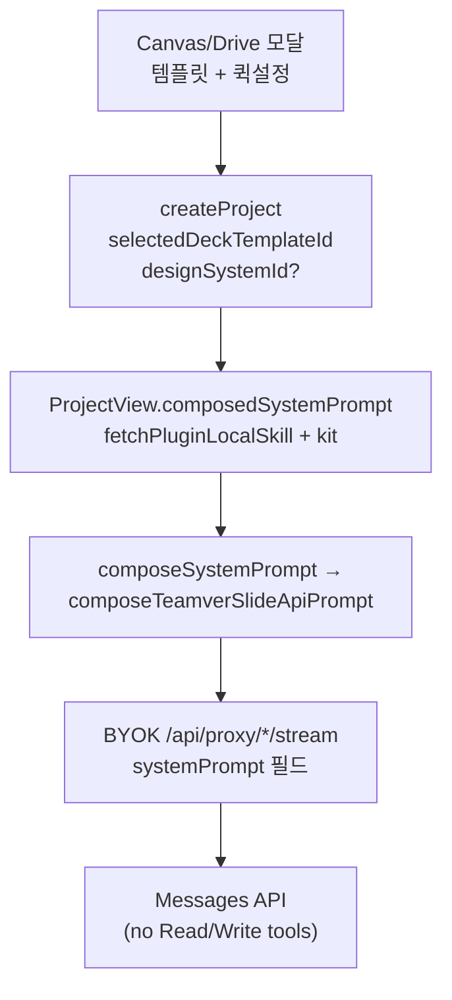

# Canvas → Slide 시스템 프롬프트 · 템플릿 적용 개선 SSOT

**작성:** 2026-08-10  
**브랜치:** `staging`  
**범위:** Teamver embed slide-only · BYOK / Messages API (`config.mode === 'api'`) · Canvas/Drive → 슬라이드 모달 3스텝「템플릿 선택」  
**목적:** “템플릿을 골랐는데 Neutral Modern처럼 나온다” 회귀의 **근본 원인 · 프롬프트 우선순위 · FE/BE 역할 · 조건부 조립 · 회귀 리스크 · 검증법**을 한 문서에 고정한다.

**관련 SSOT (읽는 순서 권장):**

| 순서 | 문서 | 역할 |
|------|------|------|
| 1 | [29 BYOK api mode vs runs](./29_BYOK_api_mode_vs_runs_아키텍처.md) | 왜 FE가 systemPrompt를 조립·전송하는지 |
| 2 | [47 body-first compact deck](./47_body-first_compact_deck_아키텍처_검토_및_0716이후_변경판단.md) | compact / body-first trade-off |
| 3 | [46 embed 슬라이드 품질](./46_embed_슬라이드_품질_원인분석_개선로드맵.md) | 품질 Phase 로드맵 |
| 4 | [42 Canvas Apps 슬라이드 생성](./42_Canvas_앱스_슬라이드_생성_기획설계.md) · [49 런치 모달 UX](./49_Canvas_Design_슬라이드_런치_모달_UX_안_비교.md) | 모달·handoff UX |
| 5 | **이 문서 (60)** | 템플릿 시각 소유권 · prompt compose SSOT |
| 6 | [00 구현 내역 누적](./00_구현_내역_누적.md) | 날짜별 커밋 기록 |

---

## 0. 한 줄 결론 (바쁠 때)

| 질문 | 답 |
|------|-----|
| 템플릿 선택이 UI에서 안 잡힌 건가? | **대체로 아님.** `selectedDeckTemplateId`·kit/scaffold는 들어갔는데, **뒤에 붙은 Neutral wireframe / DESIGN.md가 시각을 덮음** |
| 시스템 프롬프트에 문제가 있었나? | **예.** API mode 서두보다 **조립 순서·마지막 구체 HTML 샘플·조건부 누락**이 문제 |
| 왜 FE가 매번 systemPrompt를 보내나? | BYOK Messages API에는 daemon `Read` 툴이 없고, 템플릿 kit·퀵설정·locale이 **턴마다 가변**이므로 FE compose가 필요 |
| Daisy Days happy path는? | **token-safe content-swap:** kit + Template scaffold map + Motif + READ LAST → cream `#F5F0E6` / Fredoka / Motif SVG |
| 개선으로 품질이 떨어지나? | happy path는 **개선**. kit-miss·장수 충돌은 회귀 위험이 있어 **별도 완화 패치**로 닫음 |
| full skeleton API 복귀? | **금지** ([47](./47_body-first_compact_deck_아키텍처_검토_및_0716이후_변경판단.md)) — truncation 재발 |
| full example.html을 프롬프트에? | **기본 금지.** 입·출력 토큰 위험. kit(~2k) + scaffold map으로 계약 |
| scaffold로 갑자기 바꾸면? | **안 됨.** kit hard cutover 금지. full HTML scaffold도 기본 inject 하지 않음 |
| 1장짜리 템플릿 결과가 저장되는가? | **제품 경로는 첫 fill 3장.** 잘리면 제목 있는 1장은 저장하고 top-up이 덧붙인다. 제목 없는 빈 셸만 미완성으로 차단. 사용자가 1장을 명시한 경우도 허용 |

### 0.0 2026-08-13 정책 (개정) — **template = layout vocabulary + visual look, 페이지 수/순서/구성은 브리프 기반**

**제품 판단 (2026-08-13 09:00 KST 업데이트):** 이전 "token-safe content-swap" 정책은 템플릿 shell 순서/개수/구성을 그대로 preserve하고 텍스트만 바꾸는 방향이었다. 그러나 이 방침으로 Daisy Days sales-pitch 브리프에 template의 Weekly Grid / Timeline / Day-of-Week 슬라이드가 강제 삽입되어 브리프와 맞지 않는 결과가 반복됐다.

**새 정책:** 템플릿은 **시각 identity (palette, fonts, borders, shadows, motif SVG)** + **레이아웃 어휘 사전 (cover, welcome, weekly-grid, timeline, three-column, chart, quote, closing 등 role catalog)** 이다. 페이지 수, 페이지 순서, 페이지 구성은 **사용자 브리프**가 결정한다.

- 시각은 preserve: palette hex, fonts, border/shadow tokens, Motif SVG는 kit에서 그대로 사용.
- 레이아웃 role은 pick-and-choose: 브리프 semantic에 맞는 role만 사용, 안 맞는 role (예: 정적 explainer에 timeline, sales pitch에 weekly grid)은 skip.
- 슬라이드 개수: user brief > Plugin `slideCount` > auto default 6–8. **템플릿의 자연 shell 개수는 무시**.
- 같은 role을 여러 슬라이드에 재사용 OK.

**변경된 구현 (2026-08-13):**
- `HARD_RULES`의 top rule "LOOK LIKE THE TEMPLATE — but restructure for the brief" + "LAYOUT VOCABULARY, NOT SHELL COPY"
- `### Template scaffold map` 소개문을 "catalog of available layouts"로 재정의
- `DECK_FRAMEWORK_DIRECTIVE_COMPACT_FOR_SELECTED_TEMPLATE` rule 5 = "Layout vocabulary, not shell copy"
- READ LAST first bullet = "kit-driven visual, brief-driven structure"
- daemon Clone: outline 없을 때 default slide count `shells.length` → **6**
- daemon Clone `pickTemplateShells`: 순서-기반 evenly-spaced → **role-based scoring** (generic body 선호, weekly/timeline/chart 등 특수 role은 후순위, closing role은 tail로)

full `example.html`을 시스템 프롬프트에 넣지 않는다는 방침은 유지 (kit + scaffold map으로 압축). daemon Clone은 여전히 `deck.html` seed를 담당하지만, seed된 deck의 shell 개수는 이제 브리프 기반이지 template 기반이 아니다.

### 0.0a 2026-08-18 추가 보강 — 1장 cover-only 저장 방지 + 대표 motif 입력값 기반 검증

**증상:** `Html Ppt Zhangzara Daisy Days` 등 템플릿을 선택해도 결과가 1/1 커버만 저장되고, Daisy/꽃 같은 대표 요소가 빠지는 사례가 발생했다. 이 경우 모델 응답 자체는 closed artifact처럼 보이므로 기존 persist 단계가 “완료된 deck”으로 저장해 버렸다.

**원인:** 8/13 이후 token-safe fill 정책에서 `Prefer 5–6`은 있었지만 hard requirement가 아니었고, 템플릿 fill은 대형 LOOK seed를 compact deck으로 줄이는 정상 경로 때문에 slide-count reduction guard가 풀려 있었다. 그래서 “사용자가 1장을 요청하지 않았는데도 1장만 만든 산출물”이 저장 전 검증을 통과했다.

**수정 원칙:**
- 사용자 입력값 우선: `정확히 1장`처럼 사용자가 1장을 명시하면 1장은 정상 산출물이다.
- 사용자가 2–4장을 명시하면 그 수 미만은 저장하지 않는다.
- 미지정/기본/다장 요청의 Template Clone content-fill은 최소 3장 미만이면 미완성으로 보고 `skipped-incomplete` 경로로 보낸다.
- UI quick setting이 비어 있어도 사용자 자연어 본문(`1장`, `2페이지`, `8장 발표자료`)에서 명시 장수를 추출한다. first fill은 안정성을 위해 5–6장으로 cap할 수 있지만, `User requested slide count`는 원래 목표로 남겨 후속 top-up/guard가 사용자 의도를 잃지 않게 한다.
- first fill이 안정성 cap 때문에 사용자 요청 장수보다 짧게 끝나면 slide-count top-up 턴을 자동 예약할 수 있다. 이 내부 프롬프트는 auto-continue와 같은 숨김 사용자 턴으로 렌더링되어야 하며, 댓글 편집/미완성 복구와 동시에 실행하지 않는다.
- seed/system prompt에는 기본 5–6장, topic-only 기본 outline, named motif fidelity를 명시한다. Daisy/Capsule/Terminal 등 제목·kit vocabulary에 있는 대표 motif는 cover와 body slide에 실제로 보여야 하며, generic circles/stars는 대체물이 아니다.

이 보강은 템플릿별 one-off가 아니라 전체 Template Clone fill 공통 guard다. 1장 명시 요청은 막지 않으면서, 사용자가 다장 발표자료를 기대하는 기본 흐름에서 1장짜리 placeholder가 “완료”로 저장되는 회귀를 막는다.

### 0.0-legacy 2026-08-13 (이전) — token-safe content-swap + daemon Clone

**제품 판단 (초기):** 미리보기 look을 유지하고 Source 텍스트만 바꾸는 **의도(content-swap)** 는 맞다. full `example.html`을 시스템 프롬프트에 넣지 않는다. OD의 `Clone example.html`은 BYOK 모델 툴이 없으므로 **daemon이 디스크에서 Clone**한다 (FE는 트리거만).

| 경로 | 역할 |
|------|------|
| **Explicit 템플릿 Canvas→Slide (우선)** | FE → `POST /api/projects/:id/template-clone-deck` → daemon이 **plugin 설치 경로**에서 preview 읽고 heading swap → 프로젝트에는 **`deck.html`만** 기록 (`refs/`에 템플릿 원본 복사 금지). 성공 시 모델 structure gen / auto-send **스킵**. Home modal은 커뮤니티에서 고른 deck을 기본 선택으로 승격 |
| **시드 실패 (explicit 템플릿)** | **모델 Neutral fallthrough 금지.** 에러 표시 + 재시도. (`deck.html`이 이미 seeded면 recover로 유지) |
| **기본 템플릿만** | 기존 kit+map 모델 경로 (full HTML scaffold 프롬프트 inject 금지) |

**구현:**
- `apps/daemon/src/template-clone-deck.ts` + project-routes endpoint
- contracts `template-clone-fill` / `resolveTemplateCloneSlidesFromBrief`
- FE `seedTemplateClonedDeck` — daemon POST only (+ `recoverExistingTemplateClonedDeck`)
- Clone 성공 시 daemon이 `pendingPrompt` clear + metadata `templateClonedDeckSeeded`
- Clone 성공 시 사용자 프롬프트를 chat transcript로 시드 (`registerProjectFileRoutes` + `conversations`/`ids` deps, PG는 Async list/insert)
- Clone write는 `skipArtifactStubGuard` (trusted reseed)
- Clone **content-fill** persist도 `skipArtifactStubGuard` (LOOK 대형 seed → compact fill; FE `allowCompactReplacement`와 대칭) — 미전달 시 `ARTIFACT_REGRESSION`
- Capsule Motif: Google Fonts `@import` 잔여물·surface-bleed `!important`가 `.pill`/gradient를 깨지 않도록 `repairArtifactStyleSheets` + bleed를 html/body만으로 제한
- **전 템플릿:** kit Font는 example이 `@import`여도 `<link>`로 통일; `pin-*`/sakura/pastel title cue; daemon preview `@import` strip도 quote-aware
- **루프 보강:** intact css2 `@import`를 remnant 정화에서 보호; Pin-and-Paper 등 sibling `assets/*.css`를 kit `supplementalCss`로 병합; streaming/scaffold는 Motif `<style>` 안 font `@import` 금지
- **Capsule 원형 회귀:** Motif snippet이 year-dot 원을 고르지 않도록 oblong deco-pill 우선; 채팅 `:root{--token:#hex}` 덤프 scrub
- **Motif 기하 일반화:** `inferMotifGeometryKind`로 kit 우세 기하(oblong/disc/svg/chrome)를 추론해 snippet 점수·가이드·FORBIDDEN을 전 템플릿 공통 적용 (Capsule-only 문구 제거)
- `fetchPluginLocalSkill` / daemon `local-skill` — kit+map fallback only (+ sibling CSS 병합)
- `neutralizeFilesystemCloneWorkflow` — prompt의 filesystem Clone 문구 무력화 (daemon 시드가 대체)
- 완전한 closed deck > 잘린 shell
- fill Motif: title-first + light Motif (1–2) + capped Layout — Motif-before-title hang 금지

### 0.0b (이력) CONTENT-SWAP full HTML scaffold additive dual-path — superseded

잠시 kit+scaffold(≤12KB) dual-path를 올렸으나 토큰 압력으로 **0.0 token-safe**로 재조정. scaffold preferred 문구는 폐기.

### 0.1 2026-08-11 추가 판단 — Daisy Days가 “꽃 이모지”로 대체된 회귀

첨부 사례처럼 `Html Ppt Zhangzara Daisy Days`를 선택했는데 실제 결과가 cream/Fredoka/손그림 daisy가 아니라 일반 파스텔 원형과 `🌼`류 이모지로 나온 경우는 **템플릿 선택 UI 자체의 실패로 보지 않는다.** 현재 코드상 선택 id/title은 프로젝트 metadata와 turn meta로 전달되고, 재진입 compose는 plugin-local `SKILL.md`와 `example.html` visual kit를 읽도록 되어 있다.

남아 있던 취약점은 최초 Canvas→Slide run prompt에서 `[Selected slide template]` 블록이 `[Quick settings]`, `[Source brief]`, `[User instruction]`보다 앞에 있어, 모델이 마지막에 읽은 소스/사용자 지시를 더 강하게 반영하거나 템플릿 이름의 의미만 얕게 해석하는 점이었다. 그래서 “Daisy Days”를 실제 템플릿의 굵은 외곽선 SVG/CSS daisy가 아니라 “꽃 느낌” 이모지로 대체할 수 있었다.

2026-08-11 패치 기준:

| 보강 | 내용 |
|------|------|
| run prompt READ LAST | explicit template일 때 `[Selected slide template priority]`를 프롬프트 끝에 다시 배치 |
| motif 대체 금지 | 템플릿 모티프를 emoji/Unicode로 대체하지 말고 CSS/SVG/템플릿 kit 기반으로 재현하도록 명시 |
| fallback 금지 | kit가 일시적으로 불완전해도 Neutral Modern / Simple Deck / generic pastel / source-page 장식으로 돌아가지 않도록 명시 |
| plugin inputs 보강 | `selectedDeckTemplateId`, `selectedDeckTemplateTitle`, `selectedTemplatePriorityInstruction`를 scenario plugin inputs에도 포함 |

이 패치는 OD 소스 구조를 크게 바꾸지 않고, 선택 템플릿의 **시각 소유권 우선순위**만 더 강하게 고정하는 변경이다.

### 0.2 2026-08-11 추가 판단 — Canvas 외 전체 템플릿 적용 품질

추가 검토 결과, 문제는 Canvas→Slide 전용 UI만의 문제가 아니라 **선택 템플릿 preview/thumbnail에 보이는 실제 디자인 요소가 프롬프트에 충분히 구조화되어 전달되는가**의 공통 문제다. 기존 `Template visual kit`는 `:root` 색상, 폰트, 첫 슬라이드 일부 HTML 중심이어서, 템플릿의 핵심 인상인 daisy/star/sticker/badge/chunky border/SVG 장식이 약하게 전달될 수 있었다.

2026-08-11 추가 패치 기준:

| 보강 | 내용 |
|------|------|
| visual kit 추출 확장 | `example.html`에서 motif/component class cue, 관련 CSS rule, inline SVG 존재 단서를 추출 |
| 공통 prompt 강화 | kit가 있으면 drawn motif를 emoji/Unicode로 대체하지 말고 CSS/SVG/HTML shape로 재현하도록 명시 |
| web/daemon wrapper 동시 보강 | web BYOK compose와 daemon `/api/runs` compose 모두 selected template guard에 같은 motif 규칙 적용 |
| 회귀 테스트 | Daisy Days kit에 `deco-daisy-*`, `deco-star-*`, shadow/border cue, emoji 대체 금지 문구가 포함되는지 검증 |

따라서 “템플릿 제목만 보고 분위기를 흉내내는 것”이 아니라, **썸네일/preview HTML에 실제로 들어있는 시각 토큰과 장식 vocabulary를 모델 입력으로 밀어 넣는 방식**을 공통 경로에서 강화한다.

### 0.3 2026-08-11 추가 점검 — 전체 템플릿 적용 경로 회귀 방어

여러 루프에 걸쳐 코드 경로를 다시 확인하면서 다음 위험을 추가로 닫았다.

| 항목 | 문제 | 보완 |
|------|------|------|
| contracts public export | `readSkillFrontmatterDescription`가 contracts public export에 없으면 web의 plugin-local SKILL 로더가 런타임에서 `undefined`를 호출하고, frontmatter visual summary가 조용히 빠질 수 있음 | contracts public export/dist 상태를 확인하고 `teamver-fetch-plugin-local-skill` 테스트로 SKILL.md + frontmatter + `example.html` kit 로딩을 재고정 |
| plugin asset fetch | plugin asset은 프로젝트 raw 파일이 아닌데 workspace header/recovery 경로에 과하게 의존하면 kit miss가 발생할 수 있음 | plugin asset fetch에서 workspace header를 생략하고, embed wrapper 실패 시 plain same-origin fetch fallback |
| Canvas 외 일반 템플릿 시작 | Home/Community template card로 시작하는 경로는 metadata/system prompt에 의존하고 plugin inputs에는 템플릿 제목만 들어가 visual priority가 약함 | `explicitSlideOnlyDeckTemplatePluginInputs`로 selected id/title + Template visual kit/Motif sprites 우선 정책을 plugin inputs에도 포함 |

이로써 Canvas→Slide 모달뿐 아니라 커뮤니티 템플릿 카드, 일반 Home prompt-loop, 재진입 compose 경로 모두 “선택 템플릿의 preview/kit가 시각 소유권을 가진다”는 같은 계약을 사용한다.

### 0.4 2026-08-11 추가 장애 — run-scoped 템플릿 pin 누락

사용자 재현: 선택 템플릿을 골라도 결과가 기본 템플릿처럼 나오고, `terminalPersistResultKind=skipped-incomplete reason=incomplete-html-document-shell`로 종료.

추가 원인은 FE가 `selectedDeckTemplateId/Title`을 `ChatSendMeta`에는 넣었지만, hosted daemon 경로의 `/api/runs` request에는 이 값을 top-level로 보내지 않았던 것이다. daemon `composeDaemonSystemPrompt`도 project metadata만 읽었기 때문에, `patchProject(metadata)`가 늦거나 이중화 노드 간 캐시/DB 반영 타이밍이 어긋나면 선택 템플릿이 primary skill로 승격되지 못하고 기본 scenario/simple-deck 경로가 다시 우선될 수 있었다.

보완:

- `ChatRequest` / `DaemonStreamOptions`에 `selectedDeckTemplateId`, `selectedDeckTemplateTitle`을 명시 필드로 추가.
- `ProjectView → streamViaDaemon → /api/runs → composeDaemonSystemPrompt` 전 구간에 run-scoped template pin 전달.
- daemon prompt compose는 `selectedDeckTemplateFromRun`을 project metadata보다 우선한다.
- daemon/web 회귀 테스트로 “metadata patch race가 있어도 선택 템플릿이 drop되지 않음”을 고정.

### 0.5 2026-08-11 추가 장애 — 선택 템플릿 CSS 우선 출력으로 인한 `incomplete-html-document-shell`

사용자 재현: 선택 템플릿을 고른 뒤에도 `terminalPersistResultKind=skipped-incomplete reason=incomplete-html-document-shell`로 종료. 이는 저장/S3 문제가 아니라, 모델 응답이 `<!doctype html><html><head><style>...` 형태의 **문서 shell / 장식 CSS**에서 끊겨 실제 `<section class="slide">` 본문이 충분히 생성되지 않은 경우다. pre-write gate가 이를 저장하지 않는 것은 정상 방어다.

추가 원인: 0.1~0.4 패치로 템플릿 시각 소유권을 강하게 만든 결과, 일부 모델이 “Motif sprites / Decoration CSS를 유지하라”를 **전체 CSS를 먼저 복사하라**로 해석할 수 있었다. 특히 Daisy Days류는 SVG/CSS motif가 많아, 첫 슬라이드 본문 전에 토큰을 소모하면 `incomplete-html-document-shell`로 끝난다.

2026-08-11 추가 패치 기준:

| 보강 | 내용 |
|------|------|
| selected-template compact contract | `<artifact>` 뒤 첫 1200자 안에 `<body>`와 첫 완성 `<section class="slide">`가 나오도록 명시 |
| head/style shell 금지 | 선택 템플릿 경로에서 `<head>` 시작, 긴 `<style>` 선출력, full Decoration CSS 덤프 금지 |
| motif 재현 방식 조정 | 전체 CSS 복사가 아니라 palette/font/border/shadow + 1~3개 motif cue의 compact inline subset으로 재현 |
| 자동 이어쓰기 | head-only / CSS-only shell은 fenced partial로 재사용하지 않고, 버린 뒤 새 complete deck artifact를 만들도록 회귀 테스트 고정 |
| Canvas prompt/plugin inputs | “verbatim copy” 표현을 제거하고 “compact recognizable cues + complete output first”로 정리 |

제품 판단: **완성된 덱이 우선**이다. 선택 템플릿과 100% 동일한 CSS를 복사하다가 결과물이 비어버리는 것보다, 템플릿의 palette/font/motif cue가 보이는 compact static deck을 완성하는 것이 낫다. 따라서 pre-write gate는 계속 shell 저장을 막고, prompt는 shell이 생기지 않도록 body-first로 유도한다.

### 0.26 2026-08-18 — 전 템플릿 per-slide surface (Daisy/Cartesian/Poster/Biennale)

0.25의 `.slide-N`만으로는 부족하다. 공식 카탈로그는 슬라이드 바탕을 이렇게 칠한다.

- Daisy / Cartesian: `class="slide slide-title|weekly|quote"` + `.slide-weekly { background: var(--turquoise) }`
- Bold Poster: `.slide-red { background: var(--red) }`
- Biennale / Neo Grid: `class="slide s-cover"`
- Scatterbrain: `class="slide bg-cork"`
- 다수: `.slide::before` grain

`--cream/--bg`로 `.slide { background: paper !important }`를 넣으면 **모든** 슬라이드가 한 색이 된다. surface selector와 “per-slide paint가 있으면 letterbox만” 규칙을 카탈로그 공통으로 두고, 공식 example.html 전부에 persist+bleed 회귀를 건다.

재진입 시 주입된 `[data-od-slide-surface-bleed]` 시트는 author paint로 보지 않는다 (`html, body, .slide`를 per-slide로 오인하면 `!important`가 중첩된다). 카탈로그 회귀는 generic `.slide` letterbox는 허용하고, 슬라이드별 칠이 있는 덱만 flatten을 실패로 본다. css2 remnant는 `<style>` 선두 debris만 잡는다 (Capsule 등 정상 `<link href>`의 `1,6..96`는 허용).

구현 현황:

- [x] surface selector 카탈로그 공통 (`.slide-N` / `.slide-weekly|red|title` / `.s-cover` / 호스트 extra, chrome 제외)
- [x] per-slide paint면 bleed는 `html, body`만
- [x] letterbox paper는 solid token (wash의 마지막 색), 주입 시트 재진입 idempotent
- [x] 공식 `mode:deck` example.html persist+bleed 카탈로그 회귀
- [x] remnant heal이 유효 css2 `@import`를 자르지 않음
- [x] 인라인 장별 색도 per-slide paint
- [x] daemon cover-batch가 persisted flatten bleed를 `html, body`로 완화 (cache v6)

### 0.49 2026-08-19 — Daisy svg-sprite Motif fill/merge

Capsule은 empty `.deco-pill` + look CSS로 살아나지만 Daisy 정체성은 ~2KB flower SVG. fill의 `>~800 chars` Motif budget·empty deco 셸·symbol-only Motif HTML merge가 꽃을 빠뜨림.

- capped kit Motif sprite는 ~800자 예산 면제 + cover 필수 paste (title-first 유지)
- `svg-sprite` Motif geometry guidance 부착; empty `.deco-*`는 child SVG 필요 명시
- `extractOfficialDeckMotifHtml`이 visible Motif instances(deco+svg) 추출 → 슬라이드 주입 / empty shell fill
- kit maxChars 17k (daisy+star+rainbow 유지)
- export cache `v24`

구현 현황:

- [x] prompt/kit Motif budget exemption for capped kit sprite
- [x] Daisy Motif instance merge heal
- [x] empty deco shell SVG fill
- [x] export cache v24

### 0.53 2026-08-19 — 카탈로그 전체 루프에서 남은 Motif 구멍

54개 `mode:deck` example을 sparse Linux Internals fill에 합쳐 직접 돌렸다.

남은 실패:
- Cobalt Grid `pixel-glitch` — 계단 SVG가 chart-like로 스킵, `pixel-*` 클래스가 particles/face만 허용
- Retro Windows `win-titlebar` — `win-*` 미등록, `win-window` 통째는 본문이라 스킵해야 함
- Block-frame `deco-green-circle` — `deco-dots`만 팩
- Sakura `stamp` — 캡션 위젯, petals가 identity (요구하지 않음)

수정:
- 페인트 클래스에 `pixel-*` / `win-titlebar` / `cover-blob` / `ts-stripe` / `zigzag-deco` / `geo-decoration` / `sunglow` / `corner-bracket` 추가
- chart-like에서 pixel/zigzag 제외
- dots+circle · titlebar 팩
- 전 catalog official-body → sparse element 루프 스펙
- export cache `v28`

구현 현황:

- [x] 54개 mode:deck sparse 루프
- [x] Cobalt / Retro Windows / Block-frame circle
- [x] Pitch cover-blob · Safety stripe · Coral zigzag · Cartesian geo · Blue cover-decoration · Biennale sunglow
- [x] export cache v28

### 0.57 2026-08-20 — 1장 게이트 / head-only shell → incomplete_output 재발

사용자 재현 (같은 대화, 연속 두 배너):
1. `skipped-incomplete reason=Template fill produced 1 slide(s), but expected at least 3`
2. 이어쓰기 후 `skipped-incomplete reason=incomplete-html-document-shell`

§0.56은 제목(`h1–h3`) 있는 1장만 저장했다. 제목 없는 커버·`<p>`만 있는 1장은 그대로 차단 → auto-continue가 덱을 `<head>`부터 다시 쓰다가 shell로 끝남.

수정:
- 1장 장수 게이트 제거. 1장 이상이 있으면 저장하고 top-up이 덧붙임
- Template fill head-only shell은 브리프 제목(`<h1>`/`<title>`, Daisy chrome 제목 제외)으로 1920 표지 초안을 salvage 한 뒤 저장
- 빈 템플릿 타이틀(`Daisy Days — Presentation Template`)은 만들지 않음

구현 현황:

- [x] untitled 1장 persist (gate null)
- [x] Linux Internals head-only → cover draft
- [x] Daisy Days title → no draft (fallback은 §0.58)

### 0.58 2026-08-20 — persist/auto-continue 잔여 incomplete_output 구멍

§0.57 이후에도 같은 배너가 날 수 있는 경로:

1. 닫힌 1장 + 짧은 제목(`<h1>AI</h1>`)은 `meetsMinimum` 실패 → `incomplete-html-document-shell`
2. Daisy chrome `<title>`만 있는 head-only는 salvage null → 다시 shell skip
3. auto-continue 문구가 옛 게이트(`expected at least 3`)를 말해 모델이 `<head>`부터 3장을 다시 쓰다 끊김
4. Write-tool이 같은 shell을 디스크에 쓰면 persist salvage를 건너뜀
5. clone fill이 아닌 slide-only 1장은 top-up 대상이 아님

수정:
- `isPersistableShortDeckDraft` — 상태문/빈 장/패롯이 아니면 1장 초안 저장
- cover salvage에 브리프 fallback + 마지막 `초안` 표지
- auto-continue는 body-first 덧붙임 (3장 reject 문구 삭제)
- same-turn Write shell은 persist로 넘김
- greenfield slide-only도 default 6장 top-up

구현 현황:

- [x] 짧은 1장 제목 persistable
- [x] Daisy title + Linux brief → cover
- [x] last-resort 초안
- [x] auto-continue 문구
- [x] same-turn shell은 reuse 안 함

### 0.59 2026-08-20 — 첫 fill 잘림 / 1장·초안 산출을 예방

§0.57–§0.58은 **잘린 뒤** 1장/`초안`을 저장하는 안전망이다. 사용자는 그 경로 자체를 막고 싶어 한다.

**원인:** 첫 fill 턴이 공식 Daisy `<head>` + Motif SVG(~2KB) + 5–6장을 한 번에 쓰라고 해서 BYOK `max_tokens`에 커버 전에 끊긴다.

**예방 (제품 경로):**
- 첫 fill은 compact wireframe과 같이 **이번 턴 3장**만 닫는다. 사용자 요청 장수(8장 등)는 `User requested slide count`로 남기고 hidden top-up이 덧붙인다
- Motif SVG / 긴 `<head>`는 이번 턴 금지. 공식 look은 persist 이후 merge
- fill 스트림이 `<head>`/`<style>` 800자 이상인데 titled slide가 없으면 Motif-SVG abort와 같이 즉시 중단 → 브리프 제목 표지 salvage + top-up
- persist last-resort 제목 `초안` 제거 (브리프/`deriveDeckCoverTitleFromBrief`만)

salvage/1장 persist는 최후 안전망으로 유지한다.

구현 현황:

- [x] first-fill hint/cap = 3
- [x] fill hard rules / compact / READ LAST: Motif SVG 이번 턴 비필수
- [x] `shouldAbortStreamForHeadOnlyKitDump`
- [x] persist `초안` last-resort 제거

### 0.60 2026-08-20 — 1장 이후 수정/top-up이 3분째 다음 장을 안 냄

**증상:** 1장만 저장된 뒤 hidden top-up 또는 “다음 페이지” 요청이 「수정 반영 중」으로 몇 분 동안 돌고 다음 장이 안 나온다.

**원인:** persist가 공식 Daisy look을 `deck.html`에 합친 뒤, top-up이 그 파일 전체를 첨부하고 “existing slides를 verbatim copy한 complete `<artifact type="deck">`” + 「수정 반영 중」을 요구함. 모델이 `<head>`/Motif CSS부터 다시 쓰다 BYOK가 멈춘다. head-kit abort는 fill 턴에만 걸려 있었음.

**수정:**
- top-up/다음-장 요청은 `deck.html`을 첨부하지 않고 existing-deck edit 톤을 쓰지 않음
- 모델은 새 `<section class="slide">`만 냄 (이번 턴 3장). persist가 저장된 덱 뒤에 붙임
- head-kit / Motif-SVG abort를 top-up에도 적용
- batch 6 → 3

구현 현황:

- [x] append-only top-up prompt
- [x] `appendIncomingSlidesOntoExistingDeck`
- [x] top-up은 deck attach / 「수정 반영 중」 없음
- [x] top-up head-kit abort

### 0.56a 2026-08-20 — compact 3장 wireframe · Daisy slide-title · kit tiny-flower 금지

§0.56 Motif/persist heal에 더해 모델 측 계약 + cover role class:
- `DECK_FRAMEWORK_DIRECTIVE_COMPACT` 3장 wireframe + flex center
- kit Daisy Motif 예시 inset-safe (음수 offset 금지)
- fill hard rules: invented 12–48px flower / emoji daisy 금지
- Daisy cover에 `slide-title` (official Motif CSS 스코프)
- export cache `v32`

### 0.56 2026-08-20 — Daisy 꽃 미사용 · 16:9 비율 · 1장 incomplete_output

사용자 재현 (Linux Internals + Daisy Days):
- 커버 오른쪽 아래에 40px급 꽃 아이콘만 보임. 공식 표지는 네 귀퉁이 큰 `deco-daisy-*` + `.deco svg{width:100%}`
- 본문이 프레임 위 2/3에 몰리고 아래가 빔 (16:9가 아님)
- first fill이 1장이면 `skipped-incomplete expected at least 3` → `incomplete_output`

원인:
1. persist가 Daisy를 장당 꽃 1 + 별 1만 찍고, 180px 고정이라 preview scale(≈0.5)에서 점처럼 보임. 모델이 만든 작은 `deco-daisy`는 identity로 통과해 공식 SVG 주입을 스킵
2. `LOOK_NEUTRALIZE_CSS`가 `flex-direction: unset`만 넣어 공식 Daisy의 column+center가 깨지고, 짧은 커버가 1920×1080 상단에 붙음
3. 제목 있는 1장 초안도 저장 전 차단 → 사용자는 에러만 봄

수정:
- 표지 4귀퉁이 + 본문/클로징은 대각 쌍. 크기는 1920 기준 % (TL 22%)
- 작은 발명 꽃은 걷고 공식 팩으로 교체. `.deco svg` 100% fill
- neutralize = column + `justify-content:center`, split만 `unset`
- 제목 있는 1–2장 초안은 저장하고 top-up이 6장(또는 요청 장수)까지 덧붙임
- export cache `v31`

구현 현황:

- [x] Daisy 커버 4귀퉁이 red spec
- [x] 40px 발명 꽃은 official paint가 아님
- [x] neutralize column+center + split unset
- [x] titled 1장 → persist + top-up
- [x] export cache v31

### 0.55 2026-08-20 — 커버 Motif가 전 장에 고정되는 문제

사용자 재현: Capsule 덱에서 표지와 본문에 **같은 알약/원**이 같은 좌표로 반복. 의도 아님.

공식 Capsule은 장 역할이 다르다:
- 표지 `.deco-pills` > `.deco-pill`
- 본문 `.floating-pills` > `.f-pill`
- 클로징 `.deco-pills-closing` > `.c-pill`

persist는 cover cluster만 남기고 전 장에 찍었다.

수정:
- cover/body/closing 클러스터를 함께 추출
- `slideMotifRole`로 장별 팩
- 이미 찍힌 official cover 스탬프는 걷고 역할 팩으로 교체
- export cache `v30`

구현 현황:

- [x] 6장 Capsule sparse — cover 1 / body floating / closing 1
- [x] 전 장 deco-pills 스탬프 heal
- [x] catalog loop 회귀
- [x] export cache v30

### 0.54 2026-08-20 — Motif identity 오탐 / wrong shell fill / content chrome

§0.53 카탈로그 paint 이후에도 persist가 **가짜 identity**로 진짜 Motif를 스킵하거나 잘못된 SVG를 채웠다.

잔여 구멍:
1. `#fcdf6c` + 아무 `<path>` = Daisy → butter chart가 커버 꽃 주입 차단
2. 빈 `.deco-pill` = Capsule paint → oblong pill 미주입
3. `includes('data-od-official-look-css')` → HTML 주석만으로 look sheet 스킵
4. `fillEmptyMotifShells(instances[0])` → star shell에 flower SVG
5. `pill-accent` / `pixel-label` / `stat-bar` CSS seed 오탐

수정:
- Daisy identity = `deco-daisy`+flower 또는 multi-path butter SVG
- CSS Motif paint evidence (deco-pill geometry vs CSS-disc empty host)
- look attr는 `<style data-od-…>`만 인정
- shell family별 SVG fill · content chrome denylist · particles static dots
- export cache `v29`

구현 현황:

- [x] chart / empty-pill / comment-poison / star-shell / chrome red specs
- [x] 54 mode:deck Motif proof + idempotent
- [x] export cache v29

### 0.52 2026-08-19 — §0.51 seed 이후에도 카탈로그 전부가 실패하는 이유

왜 계속 실패했는가: persist가 템플릿을 **Daisy 꽃** 또는 **4가족 seed(slide 0/1)** 로만 처리했다.

잔여 구멍:
1. Playful doodle / Graphify orb / Pin `<use>` / block-frame dots / scatterbrain post-it은 seed 4가족 밖
2. `\bdeco-pills\b`가 `deco-pills-closing`을 커버로 오인 → 빈 closing/래퍼만 있어도 Capsule 주입 스킵
3. look CSS 셀렉터만 합쳐지면 장 위에 도형이 없고 모델이 generic pill/원을 다시 그림

수정 (full `example.html` 프롬프트 금지, §0.51 seed/host/`s-cover` 유지):
- kit `MOTIF_CLASS_TOKEN_RE`에 맞춘 카탈로그 Motif instance 추출
- identity는 exact class token + cluster child paint. hex + 아무 svg 금지
- cluster 우선순위 `deco-pills` > `floating-pills` > closing
- compact 전 장 주입 + `.s-cover` 스코프를 `.slide`로 풀어 배치
- export cache `v27`

구현 현황:

- [x] Capsule / Sakura / Pin / Playful / Graphify / pastel / block-frame / scatterbrain / Hermes sparse fill red spec
- [x] empty `deco-pills` · `deco-pills-closing`은 Capsule paint가 아님
- [x] Daisy flower + SVG dots 회귀
- [x] catalog sweep가 추출된 instance를 fill **element**로 요구
- [x] export cache v27

### 0.50 2026-08-19 — Daisy 대표 SVG가 CSS hex + 점 SVG에 가려 persist 주입 스킵

§0.49가 Daisy flower instance를 persist에 넣었지만, Linux Internals 커버처럼 **크림 + 네오브루탈 태그 + 작은 원**만 남는 결과가 계속 나왔다.

잔여 구멍:
1. `extractOfficialDeckLookAssets`가 Motif SVG 안의 `<style>.cls-1{fill:#FCDF6C}</style>`까지 page look CSS로 흡입
2. `destHasVisibleMotifIdentity`가 “문서 어딘가에 `#fcdf6c` + `<svg>` 하나”면 이미 Daisy paint로 판정
3. 모델이 찍은 12px circle SVG가 그 조건을 충족 → **꽃/별 instance 주입 스킵**
4. look CSS 셀렉터 `.deco-daisy-tl`만 있으면 화면에 아무 도형도 안 그려짐

수정 (persist HTML, full `example.html` 프롬프트 금지 유지):
- SVG 내부 `<style>`은 look CSS에서 제외
- identity는 **실제 flower SVG** (`deco-daisy` + path + `#fcdf6c` in `<svg>`)만 인정
- cover/body 전 장에 daisy + star pack 주입 (empty deco shell은 계속 heal)
- export cache `v25`

구현 현황:

- [x] Linux Internals + SVG dots red spec
- [x] look CSS가 SVG `.cls-1` hex를 흡입하지 않음
- [x] catalog sweep이 flower SVG instance를 요구
- [x] export cache v25

### 0.51 2026-08-19 — 카탈로그 CSS Motif identity seed (Capsule/Sakura/Hermes/Pastel)

§0.50 Daisy SVG heal 위에 **CSS Motif 템플릿** identity seed를 얹는다. Capsule oblong `.deco-pill`, Sakura `<div class="petals">`, Hermes `.hc-scanlines`(+ `tpl-*` host), Pastel `.xp-blob`이 sparse fill에서 빠지면 look CSS만으로는 정체성이 안 보인다.

수정:
- `extractCssMotifSeeds` / `mergeCssMotifSeeds` — seed 최대 2개, slide 0·1 주입
- `extractIdentityHostClass` + `ensureIdentityHostClass` — Hermes 등 scoped Motif CSS
- Sakura seed 시 첫 슬라이드에 `s-cover`
- Motif floor 필수 (cover에 kit Motif seed 1개) — optional polish 아님
- snippet scoring: `hc-scanlines` 우선, `var(--hc-` false positive 스킵
- Daisy v25 로직(`svgBlocksContainDaisyIdentity` / `mergeVisibleMotifInstances` / SVG-internal style 제외) 유지
- export cache `v26`

구현 현황:

- [x] Capsule/Sakura/Hermes sparse → Motif seed inject red specs
- [x] catalog sweep Capsule/Sakura/Hermes/Pastel seeds
- [x] Motif floor prompt
- [x] export cache v26

### 0.48 2026-08-19 — 연속 `incomplete_output` (shell → 1장 fill)

사용자 재현: 같은 대화에서
1. `skipped-incomplete reason=incomplete-html-document-shell`
2. `Template fill produced 1 slide(s), but expected at least 3`

원인: persist의 1장 차단은 정책대로 맞다. 그런데 선택 템플릿 compact **fallback 샘플이 1장짜리 완결 `</html></artifact>`** 라, `<head>` 트런케이션 후 auto-continue가 BODY-FIRST로 재시작할 때 모델이 그 샘플을 복사하고 표지만 닫는다. persist가 다시 skip.

수정 (프롬프트/AC only, persist min-3 게이트 유지, cache bump 없음):
- fallback wireframe을 cover+body+closing **3장**으로 교체
- “1장 닫기 금지 / persist가 official look CSS를 합침 → `<head>` 금지”를 fill hard rules + auto-continue에 명시

구현 현황:

- [x] 3-slide fallback red spec
- [x] AC template-fill min-3 (shell 및 1장 partial)
- [x] persist 1장 차단 테스트 유지

### 0.49 2026-08-19 — 대표 Motif wrapper/snippet 누락 (Daisy 등)

현재 시점(2026-08-19 KST) 판단: Daisy/Capsule 같은 템플릿에서 대표 SVG/CSS/도형이 빠지는 잔여 원인은 선택 전달 실패가 아니라 **fill prompt의 concrete Motif 예시 부족**이었다.

발견한 구멍:
1. Daisy `example.html`에는 실제 대표 요소가 `<div class="deco deco-daisy-tl"><svg ...>` wrapper 안에 있지만, `extractMotifHtmlSnippets`가 opening tag만 뽑으면서 star/rainbow 같은 짧은 보조 장식을 우선했다.
2. slim 결과에는 daisy SVG 자체가 있어도 wrapper snippet이 빈 `<div class="deco deco-daisy-tl"></div>`로 남아, 모델이 그대로 복사하면 화면에 아무 motif가 보이지 않는다.
3. `rainbow` 분류가 차트 SVG를 더 크게 선호해, scaffold/deco가 rainbow를 요구하면서 정작 pasteable rainbow sprite는 Motif block에 빠질 수 있었다.

수정:
- primary Motif wrapper(`deco-daisy*`, petal/blob, pin/post-it/stamp/tape, capsule pill)를 star/rainbow 보조 장식보다 우선한다.
- SVG를 포함한 wrapper snippet은 `<!-- paste capped Motif sprite here -->` placeholder를 넣어, capped sprite를 실제 배치 wrapper에 넣도록 유도한다.
- Daisy fill cap에는 `Daisy placement recipe`를 추가해 star/rainbow/circle만으로는 Daisy identity를 만족하지 않는다고 명시한다.
- chart SVG는 rainbow로 분류하지 않고, rainbow는 큰 chart가 아니라 compact ornament를 우선한다.

검증:
- `template-visual-kit.test.ts`: Daisy slim에 `deco-daisy` wrapper + capped sprite placeholder + placement recipe가 남는지 고정.
- `template-visual-kit-all-official.test.ts`: 전체 official deck motif/deco/layout survival 및 Capsule 예시 오주입 회귀 확인.

### 0.47 2026-08-19 — `.presentation` compact fill 16:9 중심 고정

§0.46이 body-first Motif fill을 compact 1920으로 되돌린 뒤에도, 모델이 Capsule `<div class="presentation">`를 베끼고 `data-od-official-look-css`를 붙인 `deck.html`은 stacked letterbox를 못 탔다.

사이즈/중심이 장마다 달랐던 잔여 구멍:
1. `.presentation`이면 compact stacked **무조건 제외** → 페이지가 콘텐츠 높이로 줄거나 host scale이 갈라짐
2. neutralize `flex-direction:unset` + reveal `display:flex`가 Motif-only 장을 **row + top**으로 떨어뜨림. `slide-N`만 look CSS `justify-content:center`

수정 (preview JS + detector only, persist HTML/`v23` 불변):
- official look fill은 `.presentation` / `.deck` wrapper여도 stacked letterbox
- 카탈로그 presenter(look 마커 없음)는 계속 native 100% fill
- 작성자 style 스냅샷 후: Motif-only → column+center, 인라인 `display:flex` split → row

구현 현황:

- [x] presentation+look CSS compact stacked red spec
- [x] 같은 stage transform으로 next/next
- [x] catalog Capsule presenter는 여전히 stacked 제외
- [x] 16:9 split column clip 회귀 유지

### 0.46 2026-08-19 — filled Motif 덱 페이지별 중심/사이즈 불일치

§0.44 absolute-only presenter 판정이 body-first Motif fill을 catalog로 오인해 compact 1920 letterbox에서 빠뜨림. 콘텐츠는 device-width로 짜이고 호스트는 1920을 가정 → 좌상단 쏠림·페이지별 중심 불일치.

- presenter = shell/opacity-stack 필수 (bare absolute 금지)
- body-first slide deck은 presenter 제외 + viewport lock 대상
- export cache `v23`

구현 현황:

- [x] narrowed `looksLikeOfficialFullscreenPresenterDeck`
- [x] body-first `needsStackedDesignViewportLock`
- [x] Motif absolute fill → compact 1920 red spec
- [x] export cache v23

### 0.45 2026-08-19 — 공식 템플릿 미리보기 방향키/`< >` 페이지 고정

카탈로그 PreviewModal은 iframe keydown을 capture로 가로채고 `postMessage({ type: 'od:slide' })`로 deck-bridge `go()`를 돌린다. 공식 Capsule chrome은 **1-based** (`data-slide="1"` = 첫 장, `#current` = `01`).

잔여 구멍:
1. `activeIndex`가 slide `.active`보다 pagination을 먼저 읽어, 첫 장인데도 host chrome이 `2 / 10`으로 시작
2. `controlIndex`가 `data-slide="1"`을 index `1`(둘째 장)로 해석 → Next가 셋째 장으로 점프
3. `updateDeckChrome`이 `#deck-cur`만 갱신해 `#current` / `.nav-dot`이 1장에 남음 → 이후 Next가 계속 같은 타깃

수정 (iframe bridge JS only, persist/heal HTML 불변 → **cache bump 없음**):
- `activeIndex` 순서: transform → slide `.active` → pagination → visibility
- nav-dot `data-slide`가 `1..count`이면 1-based로 해석 (`n - 1`)
- `updateDeckChrome`이 `#current`와 `.nav-dot`도 동기화

구현 현황:

- [x] 1-based pagination + chrome sync
- [x] Capsule presenter red spec (load `active:0` → next → next)
- [ ] 인접: `srcdoc-deck-bridge-nested-slides` stacked hoist 2건은 staging 기존 실패 — 별도 후속

### 0.44 2026-08-19 — 카탈로그 템플릿 1920 lock opt-in (전수)

§0.43이 Capsule만 막은 뒤에도 `lockStackedDeckCanvasForPreview`가 “presenter가 아니면 전부 1920”이라 Daisy/Hermes/Sakura 등 대다수 html-ppt example이 viewport=1920을 받았다.

- presenter 감지: absolute/fixed + `100%`/`100vw·vh`/`inset:0`, `.deck`/`.slides-container`, opacity stack
- viewport lock **opt-in**: look CSS / stacked stage / neutralize proof만 1920
- html-ppt `example.html` 전수 회귀
- export cache `v22`

구현 현황:

- [x] `needsStackedDesignViewportLock` opt-in
- [x] widened `looksLikeOfficialFullscreenPresenterDeck`
- [x] catalog sweep test (no meta 1920 / neutralize)
- [x] export cache v22

### 0.43 2026-08-19 — 공식 템플릿 preview/썸네일 1920 neutralize 오적용

§0.42가 cover·srcdoc wrap·`/raw`까지 1920 lock을 넓히면서 공식 Capsule 등 `example.html` 프레젠터(`.slide { position:absolute; width/height:100% }` + `.presentation`)에도 stacked 캔버스가 적용됐다. 카탈로그 미리보기 모달·썸네일은 iframe에 맞춰 100% fill인데 1920×1080 `position:relative`로 바뀌며 호가 잘리고 줌된 것처럼 보인다.

- official presenter는 neutralize/viewport=1920 금지. 잘못 주입된 `data-od-stacked-canvas-neutralize`는 제거
- compact fill(`data-od-official-look-css` 또는 stacked host)은 §0.42 1920 lock 유지
- `looksLikeCompactApiStackedDeck`도 공식 프레젠터를 제외해 PreviewModal이 1280 scaler + native fill을 씀
- `lockStackedDeckCanvasForPreview`가 preview/cover/export/`/raw` 공용 gate
- export cache `v21`

구현 현황:

- [x] `looksLikeOfficialFullscreenPresenterDeck`
- [x] presenter neutralize strip + viewport restore
- [x] stacked-host-only fallback (bare absolute 100% 금지)
- [x] `lockStackedDeckCanvasForPreview` (srcdoc / cover / standalone / `/raw`)
- [x] compact stacked 검출 제외
- [x] Capsule example + cover + srcdoc red spec
- [x] export cache v21

### 0.42 2026-08-18 — stacked neutralize/viewport 잔여 구멍 전수 닫기

- neutralize early-return = marker + relative + 1920/1080 + flex unset proof (poison 주석만으로 skip 금지)
- merge / cover / `/raw` serve / standalone / deck srcdoc wrap 후 viewport·canvas 정렬
- export cache `v20`

구현 현황:

- [x] proof-based ensure + poison upgrade
- [x] merge/cover/raw/standalone/srcdoc 패리티
- [x] export cache `v20`

### 0.41 2026-08-18 — official look max-width MQ · stacked grid reveal

§0.40 이후에도 공식 Capsule/다수 example의 `@media (max-width: …)`가 **iframe 레이아웃 폭**에 반응한다. preview는 1920×1080을 transform으로 줄이므로 패널이 900px면 3열 카드·timeline이 모바일 column으로 접혀 `overflow:hidden`에 잘린다. stacked reveal은 인라인 `display:grid`까지 flex로 덮었다.

- merge/heal이 official look 시트에서 max-width/max-height `@media`만 제거. 작성자 다른 `<style>`은 유지
- `#od-stacked-deck-stage` reveal은 인라인 grid/inline-grid 보존, 그 외 flex
- export cache `v19`

구현 현황:

- [x] `stripOfficialLookViewportMediaQueries`
- [x] stale v18 look 시트 heal (unset 있어도 MQ면 업그레이드)
- [x] catalog official look 시트 max-width 부재
- [x] stacked grid reveal
- [x] export cache v19

### 0.40 2026-08-18 — 16:9 분할 슬라이드 column 강제 잘림

§0.39가 absolute 100%는 풀었지만, 공식 `.slide { flex-direction:column }`과 preview host `flex-direction:column; justify-content:center`가 남았다. 좌우 split(`display:flex`만, flex-direction 없음)이 세로로 쌓이며 제목/우측 카드가 `overflow:hidden`에 잘림.

- neutralize에 `flex-direction:unset` (인라인 column은 유지)
- v17 고정캔버스 neutralize도 heal에서 업그레이드
- stacked host는 1920×1080 lock만
- export cache `v18`

구현 현황:

- [x] flex-direction unset (not !important)
- [x] stale v17 neutralize refresh
- [x] stacked host column/center 제거
- [x] split-slide red spec
- [x] export cache v18

### 0.39 2026-08-18 — official look absolute 100% 잘림 방지

- stacked neutralize = `position:relative` + 1920×1080 (프레젠테이션 absolute 100% 해제)
- 기존 opacity-only neutralize heal/preview 업그레이드
- deck viewport `width=1920`
- export cache `v17`

구현 현황:

- [x] LOOK_NEUTRALIZE_CSS 고정 캔버스
- [x] ensure + lock in heal/preview
- [x] export cache `v17`

### 0.38 2026-08-18 — Preview/PDF/HTML 잔여 드리프트 전수 정리

- desktop PDF = PPT inches + scale (headless와 동일)
- `@page 1920px` 방출 제거 + patch rewrite
- Motif `grain-overlay` chrome hide 제외
- headless HTML reveal = static flex-preserve
- browser PDF heal + CSS zoom (host API scale와 분리)
- export cache `v16`

구현 현황:

- [x] desktop preferCSSPageSize false + scale
- [x] framework/compact/emergency/templates `@page` inches
- [x] grain Motif host 보존
- [x] HTML reveal 패리티
- [x] export cache `v16`

### 0.37 2026-08-18 — Write-tool `deck-2` / entry heal / preservedFilled

§0.36 persist 고정 이후에도 Write-tool이 fill을 `deck-2.html`에 쓰면 same-turn recover가 persist를 건너뛰고, entry/cover는 Clone seed `deck.html`을 유지한다.

- slide-only same-turn recover는 root `deck.html`만 재사용
- finalize: seed `deck.html` + filled sibling → sibling을 canonical로 복사
- `resolveCanonicalDeckEntryPath`는 filled sibling을 seed보다 우선
- clone 응답 `preservedFilled` — recover/FE가 LOOK seed로 재스탬프하지 않음
- HTML revision persist도 cover cache bust

구현 현황:

- [x] Write-tool `deck-2` persist skip 금지
- [x] sibling → `deck.html` 승격
- [x] entry 해석 seed skip
- [x] `preservedFilled` + recover filled skip
- [x] revision cover bust

### 0.36 2026-08-18 — 생성된 덱이 템플릿 기본 `deck.html`로 되돌아가지 않음

제대로 채워진 덱이 새로고침/재진입 후 공식 example LOOK(Daisy 마케팅 헤드라인 등)으로 돌아간다. 썸네일 캐시가 아니라 **deliverable 파일 자체**가 Clone seed로 되돌아가는 버그.

- Clone은 같은 턴에 `deck.html` LOOK seed를 쓴다. fill persist가 identifier가 비면 `deck-2.html`을 민트하고, Home/`entryFile`은 root `deck.html`을 본다
- reattach가 identifier/`deck.html`만 보고 Clone seed를 “이미 저장된 산출물”로 복구하면 fill persist를 건너뛴다
- 늦은 `POST /template-clone-deck`(재시도·더블 런치)가 `overwrite: true`로 fill을 다시 example.html로 덮는다

구현 현황:

- [x] slide-only persist는 `preferredFileName`이 없을 때 항상 기존 `deck.html`을 덮어씀 (`deck-2` 금지)
- [x] `findExistingArtifactProjectFile` / reattach / regression은 Clone LOOK seed(`templateClonedDeckSeeded`)를 fill 타겟으로 쓰지 않음
- [x] fill persist는 `templateCloneContentFilled` 스탬프. Clone reseed는 Neutral stub만 교체하고 채워진 덱은 보존
- [x] 보이는 본문이 다른데 stale seed 플래그만 있으면 overwrite 금지

### 0.35 2026-08-18 — Preview / PDF / HTML 스케일·위치 정렬

- PDF MediaBox = PPT `13.333in×7.5in` + print scale (더 이상 1920px→20″ 아님)
- HTML export viewport `width=1920`, flex Motif 보존, preview와 같은 W+H letterbox(pad 32)
- export cache `v15`

구현 현황:

- [x] `buildDeckPdfPagePdfOptions` / `@page` inches SSOT
- [x] headless deck PDF가 px MediaBox를 쓰지 않음
- [x] standalone HTML flex + design-canvas viewport
- [x] export cache `v15`

### 0.34 2026-08-18 — 공식 Motif HTML(스프라이트·호스트) persist/export 병합

look CSS만 합치면 Pin-and-Paper compact fill의 `<use href="#pin">`가 빈 SVG로 남는다. Capsule/Retro-zine grain, Retro-windows CRT도 호스트 div가 없으면 CSS만 떠 있다.

- 공식 example에서 재사용 `<symbol>` 시트 + 슬라이드 앞 `grain-overlay`/`crt-overlay` 호스트를 `data-od-official-motif-html`로 주입
- look CSS가 이미 있어도 Motif HTML은 따로 판정 (early-return 금지)
- persist sanitize가 Motif 시트를 지우지 않음
- export는 metadata `skillIds`로 템플릿 id 추론. FE PDF/ZIP 폴백도 동일 병합
- export cache `v14`

구현 현황:

- [x] Pin `#pin` / `#pin-open` 심볼을 compact fill `<use>`에 합침
- [x] Capsule/Retro grain · Retro-windows CRT 호스트 주입
- [x] 전 `mode:deck` official example Motif HTML 카탈로그 회귀
- [x] CSS-already-present여도 Motif 주입
- [x] sanitize Motif SVG 보존
- [x] export cache `v14`

### 0.33 2026-08-18 — look CSS 병합 잔여 경로 닫기

kit Motif 2규칙·Write-tool disk 경로·stale metadata·FE HTML 폴백이 공식 스타일을 다시 빠뜨렸다.

- 증명: mid-sheet CSS window 3/4 (첫 Motif 스니펫만으로는 skip 금지)
- persist: `runSelectedDeckTemplateIdRef` + Write/recover 경로도 `mergeOfficialLookCssForTemplate`
- FE fallback export도 같은 병합. heal은 official look style을 건드리지 않음
- export cache `v13`

구현 현황:

- [x] kit snippet은 full official stylesheet로 치지 않음
- [x] Write-tool / recovered HTML에도 look 병합
- [x] FE standalone fallback 병합
- [x] official look style heal skip
- [x] export cache `v13`

### 0.32 2026-08-18 — 템플릿 적용 P0 (Pin Motif · body 폰트 · export bleed)

- fill slim이 Pin `#pin` `<symbol>`을 차트 polyline보다 우선
- persist가 body-first Google Fonts `<link>` 보존
- standalone heal이 persisted `.slide` bleed를 먼저 완화
- export cache `v12`

구현 현황:

- [x] Pin-and-Paper fill slim에 `#pin` 유지 · polyline 제외
- [x] body font `<link>` persist + evil body stylesheet strip
- [x] `healDeckHtmlForStandaloneExport` + bleed 회귀
- [x] export cache `v12`

### 0.31 2026-08-18 — 공식 덱 템플릿 전부 look CSS 병합 (catalog-wide)

Capsule-only 휴리스틱은 Daisy/Hermes/Pin-and-Paper/Cobalt 등에서 실패한다. compact fill이 `.slide-1` / `.slide-title` 규칙을 복사하면 “이미 look CSS 있음”으로 skip 된다.

- 증명 클래스는 generic slide/deck chrome 제외
- `@import` 웹폰트를 `<link>`로 승격
- persist·plugin GET이 `html-ppt-*` ↔ `example-html-ppt-*` 별칭
- export cache `v11`

구현 현황:

- [x] 전 `mode:deck` official example.html compact fill 병합 회귀
- [x] pin-and-paper sibling CSS 포함
- [x] generic `.slide-title` chrome은 skip 금지

### 0.30 2026-08-18 — 독립 HTML/PDF에 공식 템플릿 look CSS 합치기

compact fill은 “전체 example.html stylesheet 금지”. 그 결과 persist/다운로드 HTML에 Capsule `.pill-*` / grain / 폰트 `<link>`가 없고 크림 타이포만 남는다. preview kit은 프롬프트용이지 파일에 주입되지 않았다.

- 공식 example(+ sibling CSS) Motif 규칙이 없으면 `data-od-official-look-css`로 합친다
- `.slide { opacity:0 }` 등 프레젠테이션 크롬은 stacked export를 가리지 않게 neutralize
- persist + daemon export(HTML/PDF/…) 모두 적용 (`healDeckHtmlForStandaloneExport` 이후)
- export cache `v10`으로 Motif 합치기 전 cream-only 캐시를 무효화

구현 현황:

- [x] contracts `mergeOfficialDeckLookCss` + 공식 Capsule example 회귀
- [x] persist sanitize가 official look style을 보존
- [x] daemon export가 `selectedDeckTemplateId` example을 합침
- [x] standalone document wrap 후에도 `.pill-coral` / 폰트 `<link>` 유지
- [x] export cache `v10`

### 0.29 2026-08-18 — 독립 HTML/PDF `--shell` 레터박스 (look 미적용처럼 보임)

미리보기는 compact letterbox에 `#0b0c10`을 넣지 않는데, 독립 HTML/PDF는 `buildDeckHtmlExportScreenCss`가 `--shell`(#0a0c10) + 카드 shadow를 강제하고, compact export CSS도 `#0b0c10`을 다시 칠했다. 크림 템플릿이 어두운 띠 안의 카드처럼 보여 “디자인이 적용되지 않았다”로 읽힌다.

- HTML export screen: paper-first `--bg/--paper`, shadow 없음, column flex 강제 없음
- compact export: body background 미선언
- daemon payload: persist와 동일 stylesheet + bleed heal

구현 현황:

- [x] `--shell`/`#0b0c10` 레터박스 제거
- [x] 슬라이드 카드 shadow 제거
- [x] export payload heal = persist/preview

### 0.28 2026-08-18 — `div.slide` persist/salvage (incomplete-html-document-shell)

공식 카탈로그 다수는 `<div class="slide">`다. persist 게이트·`salvageTruncatedHtmlDocument`·body-first wrap이 `<section class="slide">`만 보면, 잘린 BYOK 응답이 `skipped-incomplete` / `incomplete-html-document-shell`로 끝난다 (run_id n/a는 API agent 정상).

- 호스트: `section|div` + 정확 `slide` 토큰. `.slide-inner` 등 chrome은 제외
- unclosed close는 매칭 태그(`</div>`/`</section>`)로
- 이미 닫힌 soft-salvage 덱도 `div.slide`면 persist 신뢰

구현 현황:

- [x] extract / quality / salvage / body-first / low-substance count가 동일 호스트
- [x] `.slide-inner` false-positive 회귀
- [x] 잘린·body-first `div.slide`가 persist skip 되지 않음

### 0.27 2026-08-18 — persist/preview/cover 잔여 경로 (전 템플릿)

0.26 이후 전체 경로 재검토에서 남은 구멍:

1. `repairStyleSheetText` remnant prefix가 `;`를 허용 → Hermes/XHS 등 **유효** `@import url('…opsz,wght@0,6..96…;1,6..96…&family=')` 가 잘리고, 따옴표가 열려 Motif 규칙이 다시 삼켜짐. Cover/srcdoc/bleed heal이 이 경로를 탄다.
2. 모델이 CSS role class 없이 장마다 inline `background`만 칠하면 flatten.
3. Web cover는 bleed heal을 하지만 daemon `cover-hints`/`cover-html-batch`는 stylesheet heal만 해서, 디스크에 남은 `.slide { paper !important }`가 홈 카드를 납작하게 둠.

커버는 첫 장만 보여도 `.slide !important` flatten을 적용하면 안 된다.

### 0.25 2026-08-18 — Capsule `.slide-1` wash + 깨진 파일 cover heal

0.23은 **inline** `.slide { background: radial-gradient }`만 decorative로 봤다. Capsule `example.html`은 워시를 `.slide-1 { background: radial-gradient…, var(--bg) }`에 두고 generic `.slide`는 layout/`opacity:0`만 갖는다.

결과: `--bg:#F5F5F0` 추론 → `.slide { background:#F5F5F0 !important }`가 `.slide-1`보다 이긴다 (동일 specificity + important). 홈 카드는 그 깨진 HTML을 isolation만 해서 썸네일도 납작하다.

- surface selector: `.slide` / `.slide-N` / `.slide.active` — `.slide-inner`·`.slide-header`·`.slide-counter` 제외
- `extractRuleBackground`는 gradient/`url(`/`image-set`를 solid보다 우선
- debris heal은 `repairStyleSheetText` SSOT (persist·plugin preview·bleed가 약한 복사본을 쓰지 않음)
- `buildHtmlCoverSrcDoc` / daemon cover-batch가 isolation 전에 stylesheet(+bleed) heal
- preview CSP font origin은 `artifactFontStylesheetHttpsOrigins()`

### 0.24 2026-08-18 — persist 밖 `@import[^;]` · preview CSP · font `<link>` 잔여

0.23 persist sanitize만 고치면 같은 `;` 절단이 plugin preview · snapshot clone · srcDoc CSP에 남는다.

- `stripRemoteCssImportsQuoteAware` / `rewriteCssImportsForPersist`를 contracts SSOT로 두고 daemon plugin preview도 quote-aware strip (css2 debris 금지, local `@import` 유지)
- snapshot JS `@import[^;]+` → quote-aware
- project preview CSP `font-src`/`style-src`에 Google Fonts 허용 (Bodoni/Space Grotesk 실제 로드)
- srcDoc meta CSP relax도 동일 host 추가
- persist sanitize가 Capsule `example.html` 패턴의 head `<link rel=stylesheet|preconnect>` 폰트 CDN을 지우지 않음

### 0.23 2026-08-18 — Capsule fill은 맞는데 persist/preview가 look을 지움

모델이 Capsule kit을 따라 `.pill` / `.deco-pill` / 코랄·라임 radial wash를 냈는데도 결과물이 납작한 회색 슬라이드 + 작은 검정 라벨로 보였다.

원인은 kit/prompt가 아니라 **저장·미리보기 후처리**다.

1. `sanitizeManualEditFullSource`가 `@import[^;]*`로 Google Fonts css2 URL을 첫 `;`(축 구분자)에서 잘라 `1,6..96…swap');` debris를 `<style>` 앞에 남긴다. CSS 파서가 debris+`:root`를 한 규칙으로 먹어 `--coral` 등이 안 먹고, preview scale에서 pill이 무스타일 텍스트처럼 보인다.
2. `repairDeckSlideSurfaceBleed`가 `:root --bg`를 종이색으로 추론한 뒤 `html, body, .slide { background:#F5F5F0 !important }`를 넣어 Capsule 슬라이드 inline radial-gradient를 덮는다.

수정: @import는 quote-aware strip + fonts.googleapis.com 등 allowlist 유지. 이미 잘린 debris는 style에서 제거. surface-bleed는 그라데이션/이미지 슬라이드에 `.slide !important`를 쓰지 않고 letterbox(`html, body`)만 고친다. 이미 저장된 flatten bleed도 preview에서 완화한다.

### 0.22 2026-08-18 — Motif/Layout fill 강화 (밀도 + composition)

Motif lexicon만으로는 부족했다. fill이 Layout CSS를 통째로 omit하고 Motif HTML snippet 없이 클래스명만 주어서 generic flex title로 붕괴했다. 이제 fill은 **capped Layout CSS를 유지**하고, example.html에서 뽑은 **Motif HTML snippets** + scaffold `deco=` 밀도(≥2)를 요구하며, Capsule 예시는 진짜 Capsule Motif에만 주입한다.

### 0.21 2026-08-18 — 전체 템플릿 Motif cue 보존 강화 (현재 시점 판단)

현재 시점(2026-08-18 KST) 판단: Daisy/Capsule처럼 신고된 템플릿을 개별 패치하는 방식은 재발을 막지 못한다. 모든 `mode:deck` 공식 `example.html`에서 대표 시각 언어가 `extractTemplateVisualKitFromHtml` → `slimTemplateVisualKitForFill` → model fill prompt까지 살아남아야 한다.

보강:
- 템플릿명 자체를 compact motif cue로 해석한다. 예: `Capsule`은 capsule/pill object, `Daisy`는 flower/daisy object, `Terminal`은 CRT chrome, `Cobalt Grid`는 grid/cobalt palette.
- source CSS/HTML에서 검출된 실제 `.deco-*`, `.pill-*`, `.blob`, `.stamp`, `.pixel-*`, `.orb` 등 concrete class/token 목록을 별도 `### Motif vocabulary (required compact cue)`로 유지한다.
- 사용 가능한 sprite 종류와 맞지 않는 장식 슬롯(`deco-sun`/`deco-cloud` 등)은 concrete cue에서 제외해 모델이 없는 장식을 새로 발명하지 않게 했다.
- full `example.html`, long `<head>`, multi-KB SVG 선출력 금지는 유지한다. 대신 capped SVG는 title/lead 뒤 1개 이하, 또는 실제 Decorations CSS class로 같은 motif를 구현하도록 유도한다.

검증:
- `packages/contracts/tests/template-visual-kit-all-official.test.ts`가 공식 deck example 전체를 순회한다.
- ornament-heavy template은 kit에만 motif가 남는 것이 아니라, first-fill slim 결과에도 concrete motif vocabulary가 남아야 한다.
- Capsule/Daisy title cue가 slim에서 사라지면 실패한다.

### 0.20 2026-08-18 — html-ppt identity scope (shared white `:root` ≠ 템플릿 look)

html-ppt full-deck은 공유 `base.css` `:root`가 `--bg:#ffffff` / Inter 이고, 실제 look은 `.tpl-* { --hc-bg:#0a0c10; … }` + `.tpl-* .slide { background: var(--hc-bg) }` 에 있다. kit이 첫 `:root`만 보면 Hermes/Graphify가 Neutral 흰 슬라이드로 나온다. **identity host** (`.tpl-*` / `.theme-*`) 토큰·슬라이드 surface·폰트가 prompt `:root` / Slide surface / Must-match anchors를 이긴다. SKILL.md의 `copy index.html` / `skills/html-ppt/templates/` filesystem 지시도 Clone `example.html`과 같이 neutralize.

### 0.19 2026-08-18 — Motif 카탈로그 일반화 (전 템플릿)

Capsule/Daisy one-off로는 부족하다. Motif 파이프라인을 **kit lexicon 기반**으로 바꿨다: extract/slim이 pills·petals·blobs·pins·geometric `.deco-*`·pixel 등 공통 Motif class를 보존하고, fill 프롬프트는 kit에 실제로 실린 Motif vocabulary만 요구한다 (없는 Capsule 예시 주입 금지). official deck `example.html` 전수 Motif survival 회귀 테스트로 고정.

### 0.18 2026-08-18 — 템플릿 Motif 복원 (Capsule pills ≠ generic circles)

썸네일(Clone LOOK)은 Daisy flower / Capsule pills가 보이는데 fill 결과는 pastel circle만 남는 회귀: hang 방지용 ZERO-SVG가 Motif vocabulary까지 지웠고, Capsule은 SVG가 아니라 `.deco-pill` / `.pill-*` CSS가 정체성이다. fill은 **title-first + capped Motif** (sprites AFTER title, Decorations CSS pills)로 되돌리고, kit에 pills/sprites가 있으면 generic CSS circles 대체를 금지한다. SVG-before-heading mid-stream abort는 유지.

### 0.17 2026-08-18 — cream 배경 위아래 흰 띠 (full-bleed surface)

템플릿 palette는 맞는데 preview에서 cream 사각형 위아래에 흰 띠가 남는 경우: `html`/`body` letterbox 또는 outer `.slide`가 white이고 cream이 안쪽 패널에만 칠해진 것. fill 계약에 **edge-to-edge full-bleed**를 명시하고, persist/srcdoc에서 `repairDeckSlideSurfaceBleed`로 paper hex를 `html, body, .slide`에 promote한다.

### 0.16 2026-08-14 — Motif SVG hang: 스트림 중 abort + auto-continue dump 재주입 차단

fill ZERO-SVG / Motif budget(title-first)과 kit HARD_RULES의 `Paste sprites VERBATIM` · Daisy `cover MUST show daisy SVG` · wrap `at most one short snippet`가 충돌하면 모델이 다시 Motif `<svg><style>`를 선두에 연다. kit Motif 규칙을 **title-first optional**로 맞추고, `slimTemplateVisualKitForFill`이 wrap/scaffold/Daisy 잔여 문구까지 scrub한다.

### 0.14 2026-08-14 — fill Motif SVG 선두 hang (시스템 READ LAST가 fill 규칙을 덮음)

kit에서 Motif 섹션을 빼도 compact/READ LAST가 "sprites verbatim"을 다시 강제해, 모델이 커버 제목 전에 Daisy `<svg><style>`를 덤프하고 수 분 정지한다. fill 턴은 시스템 최후단에서 ZERO `<svg>`를 선언하고, persist는 SVG-before-heading을 거부한다. 첫 완성 덱의 look은 palette/fonts/CSS shape로 충분하다.

### 0.13 2026-08-14 — salvage여도 지시문 커버는 persist 거부

Soft truncation salvage는 previewable 잘림을 살리지만, 커버가 `looksLikeInstructionCopy` / `looksLikeTemplateMarketingTitle`이면 실패한 generate다. `trustSoftTruncationSalvage`가 low-substance 게이트를 우회하지 못하게 `deckSlideHeadingsLookLikeFailedGenerate`를 persist에서 항상 적용한다.

### 0.12 2026-08-14 — persist 지시문 제목 거부 · Clone 실패 시에도 fill · DESIGN.md omit

**잔여 구멍:** 프롬프트만으로는 커버에 "만들어줘"가 남는 덱이 저장됐고, Clone HTTP 실패 시 fill 마커 없이 create dump가 나갔으며, daemon compose는 선택 템플릿과 Neutral DESIGN.md를 같이 넣었다.

**계약 추가:**
- Persist: 커버(또는 과반 heading)가 `looksLikeInstructionCopy` / `looksLikeTemplateMarketingTitle`이면 `low-substance` → 저장 skip + auto-continue.
- Clone 실패여도 Home/Canvas/Drive는 kit-driven CREATE fill을 보낸다.
- fill seed가 이미 있으면 hard rules를 재첨부하지 않는다.
- daemon: `selectedDeckTemplate` + deck kind이면 DESIGN.md / token channel 생략 (web API compose와 동일).

### 0.11 2026-08-14 — Clone content-fill stall (`<head>` 재작성) 근본 차단

**증상:** 명시 템플릿 Clone 후 fill이 `수정 반영 중` + 열린 `<artifact type="deck"><!doctype html>…<head>` 에서 수분 정지.

**원인:** fill 턴이 cloned `deck.html`을 첨부하면 existing-deck-edit가 켜지고, staging deck-patch 안내와 "full deck rewrite" 지시가 충돌한다. 모델은 50KB clone을 `<head>`부터 복사한다.

**계약:**
- Clone = LOOK preview seed. AI fill은 항상 실행.
- fill 턴은 `deck.html`을 첨부하지 않는다. existing-deck-edit / image-edit rule OFF.
- fill = kit-driven compact CREATE (body-first, 짧은 `<style>`). FORBIDDEN: clone `<head>` 스트림, "수정 반영 중".
- queued fill seed가 create `pendingPrompt`보다 우선 (`resolveTemplateCloneAutoSendSeed`).
- Clone `deckTitle`은 `sanitizeTemplateCloneDeckTitle` — 지시문/템플릿 마케팅 금지.
- fill incomplete auto-continue도 fill CREATE 마커를 유지하고 `deck.html`을 다시 붙이지 않는다. 짧은 `<head>` 잘림에도 BODY-FIRST.
- **Content expansion:** 사용자 brief는 TOPIC이지 슬라이드 텍스트가 아님. 도메인 지식으로 실제 내용을 채운다. brief/「만들어줘」를 커버에 붙이면 실패.

### 0.10 2026-08-13 후속 — Home Clone 커버 heading에 user prompt 반영 · letterbox `transparent`도 잘못 → 완전 제거

**증상:** 스크린샷 신고 "생성 요청 했는데, 템플릿 클론만 하고 내용을 바꾸지 않은 것 같다. 게다가 레이아웃/사이즈 등이 템플릿 미리보기와 달라진 것들이 존재한다".

두 문제를 각각 진단·수정:

- **내용 미교체 (커버 heading)**: staging App.tsx Home Clone 호출이 `deckTitle: templateTitle || null`을 넘겨서, `resolveTemplateCloneSlidesFromBrief`가 outline 없는 자유 프롬프트에 `[]`을 반환하는 경우(§0.8) `buildTemplateClonedDeckHtml`이 슬라이드 1의 heading을 deckTitle=templateTitle로 채움. 커버가 "Html Ppt Zhangzara Daisy Days"로 유지됨.
  - **수정:** App.tsx Home Clone `deckTitle` fallback chain을 `Drive filename → derivedPendingPrompt → templateTitle` 순으로 재정렬. 사용자 프롬프트가 커버 heading으로 반영됨.

- **letterbox 흰색**: 직전 §0.9의 `background: transparent !important` 변경이 역효과. `!important`가 여전히 deck 자체 `body { background: var(--cream) }`을 override → iframe 기본색(흰색)이 letterbox로 노출됨.
  - **수정:** `compactStackedDeckFix`에서 html/body `background` 선언 자체를 완전 제거. 이제 deck 자체 body bg (Daisy Days cream, 다크 계열 dark 등)가 letterbox 영역에 그대로 반영. compact model deck (body bg 없음)은 iframe transparent 유지.

**검증:** `teamver-canvas-slide-launch.test.ts` + `compact-api-stacked-deck.test.ts` — 52/52 passed.

**교훈:** 컴팩트 stacked-deck 렌더 파이프라인에서 letterbox 영역 backgrounds 처리는 `!important` 대신 declaration 자체를 두지 않는 게 정답. deck의 자체 body bg cascade가 자연스럽게 letterbox를 채운다.

### 0.9 2026-08-13 최종 관찰 — Preview panel letterbox `#0b0c10` 하드코딩이 template look을 가리고 있었다

**증상:** 사용자 반복 신고 "여전히 내가 선택한 템플릿이 사용되지 않고 있다". daemon Clone 파이프라인은 이미 다층으로 하드닝된 상태 (0.6~0.8 + staging Home Clone + Neutral fallthrough 금지). Clone 결과 deck.html은 실제로 template의 CSS/SVG/layout을 온전히 담고 있음을 검증 — 그런데도 사용자 화면에는 template look이 안 보였다.

**원인:** `apps/web/src/runtime/srcdoc.ts`의 `compactStackedDeckFix` (compact stacked deck 렌더 파이프라인)가 iframe html/body에 **`background: #0b0c10 !important`** (near-black)을 강제. `looksLikeCompactApiStackedDeck` 판정을 통과하는 모든 deck (daemon Clone된 Daisy Days 포함, template CSS의 `.slide{height:100vh}` 때문에 detection이 true) letterbox 영역을 검정으로 칠했다. Cream `#F5F0E6` 슬라이드가 검정 letterbox에 감싸여 시각적으로 "dark 계열 deck"으로 인식됨.

즉 지금까지의 "template not applied" 신고는 대부분 daemon Clone이 정상 작동하고 있었지만 **letterbox의 검정색이 template의 실제 look을 시각적으로 지우고 있었기 때문**이었다.

**수정:** `compactStackedDeckFix` CSS `background: #0b0c10 !important` → `background: transparent !important`. Deck 자체 `body { background: var(--cream) }` 또는 dark 계열 자체 body bg가 letterbox 영역에 그대로 반영. Compact 모델 deck (body bg 없음)은 iframe 기본값을 상속해 neutral canvas로 표시. Presenter mode dark letterbox의 원래 UX 의도는 유지되지 않지만, embedded scaled preview에서는 template 정체성 유지가 더 중요하다는 제품 판단.

**부수 개선:** `DECK_FRAMEWORK_DIRECTIVE_COMPACT_FOR_SELECTED_TEMPLATE`에 "Body-first output order" 접두 + "1–3 recognizable Motif sprites per slide" 밀도 규칙 추가. Pre-existing red-spec 테스트 `deck-framework-compact.test.ts` 이제 통과 — 405/405 첫 클린 상태.

### 0.8 2026-08-13 추가 관찰 — Home 템플릿 카드 outline 없는 프롬프트에서 slide 1장으로 collapse

**증상:** 사용자 반복 신고 "여전히 내가 선택한 템플릿대로 안만들어지고있다". staging `9c59b683d`이 App.tsx에 Home community/design-template 카드 경로의 daemon Clone 호출을 이미 landed. 그러나 사용자가 outline 없는 자유 프롬프트("이 주제로 만들어줘")만 넣으면 clone 결과가 슬라이드 1장으로 축소되는 부차 문제가 남아 있었다.

**원인:** `resolveTemplateCloneSlidesFromBrief`가 Visible headings / numbered `1.` 형식 outline을 찾지 못하면 `[{title: deckTitle}]`(슬라이드 1개)을 반환. 이걸 `buildTemplateClonedDeckHtml`에 넘기면 `cleanedSlides.length === 1`이라 `targetCount = 1`로 잘려 template의 cover/body/timeline/summary 등 자연 layout 다양성이 사라진다. staging App.tsx가 프롬프트를 `sourceBrief`로도 넘겨 outline 탐지에 도움이 되지만, 실제 사용자는 outline 없이 자유 프롬프트를 넣는 케이스가 훨씬 흔하다.

**수정:** `packages/contracts/src/template-clone-fill.ts` — `resolveTemplateCloneSlidesFromBrief`가 outline을 못 찾으면 `[{title: deckTitle}]` 대신 **`[]`을 반환**. 빈 slides 배열이면 `buildTemplateClonedDeckHtml`이 템플릿의 자연 shell count (`shells.length`)를 그대로 사용해 원본 layout 다양성 보존. 회귀 테스트 3건: Canvas Visible headings 파싱 유지, 자유 프롬프트에 `[]` 반환, numbered outline은 title 추출.

**제품 판단:** template Clone은 "미리보기 look 그대로 + 텍스트만 교체"이 원칙. 사용자가 outline을 안 줬다는 이유로 다양한 layout을 슬라이드 1장으로 뭉개면 template의 시각적 정체성이 그대로 사라진다. outline 부재 = "특별한 지시 없음" 상태로 해석해 template의 자연 count로 fallback.

### 0.7 2026-08-13 추가 장애 — kit CSS의 viewport 사이징이 preview panel을 늘림

**증상:** 템플릿 + BYOK 결과물이 PPT 사이즈(1920×1080)에 맞지 않고, 브라우저 크기에 따라 슬라이드 비율이 바뀜. Canvas→Slide 전용이 아니라 **모든 템플릿+BYOK 경로**에서 재현.

**원인:** kit-only 모드에서도 `extractDecorationCss` / `extractLayoutCss`가 `example.html`의 원본 CSS 룰(`.slide{width:100vw;height:100vh;scroll-snap-align:start}`, `.slides-container{scroll-snap-type:y mandatory}`, `html,body{width:100%;height:100%;overflow:hidden}`)을 그대로 Decoration/Layout CSS 블록에 실어 보내고 있었다. `example.html`은 **전체 화면 presenter-mode**로 설계돼 있기 때문이다. Zhangzara/html-ppt 계열 90개 이상이 이 형태.

모델이 kit이 시키는 대로 short body `<style>`에 그 룰을 붙이면, 인라인 `width:1920px`(더 강한 specificity)가 있어도 `<style>` 경로만 선택했을 때 class-level `100vw`가 렌더 컨텍스트를 지배한다. Teamver 미리보기 패널은 scaled canvas이므로 슬라이드가 브라우저에 맞춰 늘어난다.

**수정:**

| 보강 | 내용 |
|------|------|
| CSS rule sanitizer | `sanitizeCssRuleForFixedCanvas`: bare `.slide` / `html` / `body` / `.slides-container` 룰 drop, 살아남은 룰(`.slide-title`, `.deco`, `.card`)의 viewport 단위 width/height/min-height/max-height + scroll-snap-*/scroll-behavior 선언 strip |
| 컴팩트 컨트랙트 강화 | step 3에 "Every slide MUST be a fixed 1920×1080 canvas" + "Do NOT use `width:100vw`/`100vh`/scroll-snap presenter-mode plumbing" |
| READ LAST 삼중 강화 | WITH_SCAFFOLD / WITH_KIT / WITHOUT_KIT 세 variant 모두에 "Fixed 1920×1080 canvas is non-negotiable" 절 추가하고 preview panel이 scaled canvas라는 근거 설명 |
| 회귀 방어 | 90개 viewport-based 템플릿 전수 audit — Decoration/Layout CSS 블록의 100v[wh]/scroll-snap-* leak 0 확인. `template-visual-kit.test.ts`에 sanitizer 스펙 픽스처 추가 |

**제품 판단:** 미리보기 패널은 브라우저 뷰포트가 아니라 scaled canvas다. 템플릿의 `example.html`이 전체 화면 프레젠터로 만들어졌더라도, Teamver 결과물은 **PPT 슬라이드 종횡비(16:9, 1920×1080)를 보존**해야 한다. viewport 단위 사이징은 kit에서 원천적으로 제거하고, prompt 세 층(compact / READ LAST 세 variant)에서도 명시 금지.

### 0.6 2026-08-13 추가 판단 — 템플릿은 “설명 재현”이 아니라 content-swap (token-safe)

사용자 피드백: Daisy Days 템플릿을 선택했는데 결과가 어두운 배경 + 임의 꽃 도형으로 나옴. 이는 “템플릿을 잘 설명해 주면 모델이 비슷하게 그릴 것”이라는 접근의 한계다. 선택 템플릿은 스타일 참고자료가 아니라 **미리보기 look을 base로 내용만 교체**해야 한다. 다만 full `example.html`을 프롬프트에 싣는 방식은 토큰 위험이 커서(**§0.0**), kit + scaffold map으로 계약을 전달한다.

2026-08-13 패치 기준:

| 보강 | 내용 |
|------|------|
| template-as-base 계약 | `example.html`의 slide class, layout role, surface color, decorative wrapper, border/shadow/card treatment, SVG motif language를 보존하고 **visible content만 교체**하도록 명시 |
| scaffold map | visual kit에 `Template scaffold map` 추가 — `slide-title`, `slide-weekly` 등 section class/order/deco wrapper를 구조화해 모델 입력에 제공 |
| motif 우선순위 | Daisy Days의 실제 multi-petal daisy SVG가 prompt에 남도록 SVG classifier와 budget을 조정. 흰색 cloud SVG가 daisy로 오분류되지 않게 `#FCDF6C` center를 요구 |
| surface lock | `--cream #F5F0E6` 같은 main surface/background token이 있으면 cover와 대부분의 slide에 적용. light pastel template을 dark deck으로 바꾸는 것 금지 |
| token budget | full HTML scaffold 기본 inject off — kit(≤12KB ≈3k tok)만 hot path |
| 전 템플릿 일반화 | Motif `other` fallback · `div.slide` scaffold map · slide-paper surface · Daisy 하드코딩 제거 · official deck golden matrix |
| look must-match | 배경/폰트/배치 불일치 = failed deliverable · `### Must-match look` + Layout CSS |

제품 판단: **템플릿 선택 결과물은 “사용자 요청으로 내용을 바꾼 템플릿 HTML”에 가까워야 한다.** Daisy Days만이 아니라 **모든 selected deck template**에 동일 계약이 적용되어야 한다. 입력은 kit+map으로 압축한다.

---

## 1. 배경 — 사용자가 체감한 증상

### 1.1 재현

1. Canvas → Design 슬라이드 모달 3스텝에서 템플릿 **Html Ppt Zhangzara Daisy Days** 선택  
2. 생성 결과물: cream/daisy/Fredoka가 아니라 **sparse Neutral Modern** (off-white, Inter/system-ui, slate cover 분위기)  
3. 네트워크/디버그로 보면 FE가 `systemPrompt`를 매 요청에 실어 보냄

### 1.2 Daisy Days 실제 시각 토큰 (정답지)

플러그인 `plugins/_official/examples/html-ppt-zhangzara-daisy-days/example.html` `:root`:

| 토큰 | 값 |
|------|-----|
| cream | `#F5F0E6` |
| turquoise | `#7ECDC0` |
| display font | `Fredoka One` |
| body font | `Quicksand` |
| border | `3px` chunky + offset shadow |
| motif | daisy / star / pastel badges |

결과물에 위 토큰·밀도가 거의 없으면 **템플릿 시각 소유권 실패**로 본다.

### 1.3 선행 수정과의 관계

이 문서의 핵심 커밋 이전에 이미 쌓여 있던 Canvas→Slide 하드닝:

| 커밋 | 요약 |
|------|------|
| `4ff045797` / `640a67ce3` | Selected template body를 summarize로 잘리지 않게 |
| `111cfbc71` | YAML `description: \|` frontmatter 파싱 |
| `96f636148` | Simple Deck이 시각을 소유하지 않게 |
| `7c8d88f78` | `example.html` visual kit 주입 · DS demote |
| `63c225ff9` ~ `06cdfa04d` | Canvas HTML leak · cover · catalog · race |

그럼에도 Daisy Days → Neutral이 남았던 이유는 **kit가 들어가도 그 뒤에 Neutral 샘플이 “마지막 권위”처럼 동작**했기 때문이다.

---

## 2. 아키텍처 — 누가 systemPrompt를 만드는가

### 2.1 실행 경로



- Teamver slide-only BYOK는 **`POST /api/runs` daemon agent loop가 아님** ([29](./29_BYOK_api_mode_vs_runs_아키텍처.md)).
- 모델은 `Read`로 `example.html`을 열 수 없다 → FE가 asset fetch 후 prompt에 **kit를 인라인**해야 한다.
- 따라서 “BE에 고정 system prompt 하나만 두고 FE는 안 보낸다”는 **현재 아키텍처와 맞지 않다.**

### 2.2 FE vs BE 역할

| 계층 | 역할 | 비고 |
|------|------|------|
| FE (`ProjectView`, `canvasSlideLaunch`, `fetchPluginLocalSkill`) | 템플릿 SKILL.md + example.html kit fetch · wrap · DS omit · plugin scenario-only · 퀵설정→Plugin inputs | BYOK compose 입력 조립 |
| contracts (`composeTeamverSlideApiPrompt`) | 섹션 순서 · compact 분기 · READ LAST · skipDiscovery | **프롬프트 SSOT** |
| daemon compose | CLI/`/api/runs` 경로 | slide-only BYOK와 **별개** |
| BE 고정 skeleton (미래 옵션) | API override / streaming rules만 BE | kit·metadata는 여전히 가변 주입 필요 |

### 2.3 early-return 조건

`composeSystemPrompt`는 다음일 때 lean Teamver composer로 early-return한다:

```text
streamFormat === 'plain'
&& mediaExecution.mode === 'disabled'   // slide-only MVP
&& sessionMode !== 'chat'
→ composeTeamverSlideApiPrompt(...)
```

이 경로에서는 전체 OD charter / discovery philosophy / skill seed copy workflow를 **넣지 않는다** ([47](./47_body-first_compact_deck_아키텍처_검토_및_0716이후_변경판단.md)).

---

## 3. 증상 재현 시점의 프롬프트 실패 모드

모델은 **마지막에 나온 구체 HTML 샘플**을 강하게 따른다. 실패 시 대략 다음 순서였다:

1. Neutral Modern `DESIGN.md` 본문 (“No ornament”, Inter, slate…) — SECONDARY라고 써도 본문이 길면 영향大  
2. Selected deck template + `## Template visual kit` (`#F5F0E6`, Fredoka…)  
3. **`DECK_FRAMEWORK_DIRECTIVE_COMPACT` wireframe** — `background:#0f172a;color:#f8fafc` 등 Neutral 샘플이 **kit 뒤**에 위치  

결과: Daisy Days kit가 있어도 slate/sparse corporate 커버가 나옴.

추가 악화 요인:

| 요인 | 효과 |
|------|------|
| Canvas create 시 `resolveEmbedSlideDesignSystemId` → `default`(Neutral) 자동 바인딩 | DESIGN.md가 compose에 유입 |
| App create가 `designSystemId: null`을 다시 Neutral로 resolve | FE가 null을내도 Neutral 재주입 |
| Simple Deck scenario SKILL을 Selected body에 append (이전) | “기본 템플릿” 리듬이 시각 계약으로 오인 |
| 기본 덱에도 `wrapSelectedDeckTemplateSkillBody` (“user explicitly picked”) | 거짓 framing |
| 퀵설정 Length가 Plugin `slideCount`로 안 들어감 | 장수/audience가 “stakeholders” 등 고정값과 충돌 |

---

## 4. 현재 compose 섹션 순서 (SSOT)

`composeTeamverSlideApiPrompt` (`packages/contracts/src/prompts/system.ts`), join delimiter: `\n\n---\n\n`

| # | 섹션 | 조건 |
|---|------|------|
| 1 | API mode — no tools + Teamver deliverable | 항상 |
| 2 | Teamver slide-only scope | 항상 |
| 3a | Teamver skip-discovery (**Site-ref 없음**) | `skipDiscoveryBrief` / `examplePrompt` |
| 3b | Turn-1 quick brief schema | discovery 경로 |
| 4 | Lean UI locale (Teamver) | non-`en` |
| 5–6 | user / project instructions | 있으면 |
| 7 | Active design system | 있으면. **템플릿 선택 시 본문 omit + SECONDARY stub** |
| 8 | Project metadata | 있으면 |
| 9 | Plugin / scenario-only block | 있으면 |
| 10 | From-template visual signature | `ProjectTemplate` 있을 때 |
| 11 | Skill visual signature (cue extract) | **kit 없을 때만** (kit 있으면 생략) |
| 12a | Selected deck template — MUST MATCH (verbatim body) | `hasSelectedTemplate` |
| 12b | Visual style reference (summarized) | 템플릿 없음 |
| 13a | `DECK_FRAMEWORK_DIRECTIVE_COMPACT_FOR_SELECTED_TEMPLATE` | 템플릿 있음 |
| 13b | `DECK_FRAMEWORK_DIRECTIVE_COMPACT` (Neutral 샘플) | 템플릿 없음 |
| 14 | Framework emission override (open-early) | 항상 |
| 15 | Discovery binding | discovery만 |
| 16a/b | Direct / Unified streaming (READ LAST) | 분기 |
| 17–18 | Comment-edit / existing-deck image 계약 | **FE 플래그 true일 때만** (greenfield 생략) |
| 19 | Selected template visual READ LAST | 템플릿 있음 · **kit 유무에 문구 분기** |

### 4.1 `hasSelectedTemplate` 판정

다음 중 하나면 true:

1. `metadata.selectedDeckTemplateId` non-empty  
2. skill body에 `## Visual summary (from template frontmatter)`  
3. skill body에 `## Template visual kit (from example.html)`  

(2)(3)는 Canvas confirm → send 같은 tick에서 React metadata가 stale여도 kit/summary가 살아 있게 하는 **race 방어**다.

### 4.2 kit 유무에 따른 분기 (회귀 완화)

| | kit 있음 | kit 없음 (title stub / fetch 실패) |
|--|----------|-------------------------------------|
| Skill visual signature | 생략 (중복 방지) | **유지** (cue 추출) |
| Selected hard requirements | kit hex/fonts 필수 | Visual summary/title cue + Neutral slate 금지 |
| READ LAST | “kit만이 유일한 palette” | “kit incomplete — summary/title 따르고 Neutral invent 금지” |
| DS stub 문구 | kit owns colors | summary/title cues for look |

---

## 5. 수정 내용 — 커밋 타임라인

### 5.1 핵심 3커밋 (2026-08-10)

| 커밋 | 제목 | 핵심 |
|------|------|------|
| `4e4d69bae` | stop Neutral compact wireframes from overriding selected templates | template-aware compact · DS omit · create 시 Neutral 미바인딩 · READ LAST |
| `7a9a39085` | harden slide API prompt priority, conditionals, and quick settings | open-early 통일 · Teamver skip-discovery · 퀵설정→slideCount/audience/tone · false wrap 제거 · lean locale · 1920×1080 |
| `745a89fd7` | close prompt-regression risks from kit-miss and slideCount | kit-miss READ LAST 분기 · 유저 장수 > quick Length · wireframe 1920×1080 |

### 5.2 `4e4d69bae` 상세

**contracts**

- `DECK_FRAMEWORK_DIRECTIVE_COMPACT_FOR_SELECTED_TEMPLATE` + structure-only vocabulary  
  - `#0f172a` / `#1e293b` 샘플 **제거**  
- 템플릿 있을 때 Neutral compact 대신 위 contract 사용  
- DESIGN.md 본문 생략 (SECONDARY stub만)  
- `TEAMVER_SELECTED_TEMPLATE_VISUAL_READ_LAST` 추가  

**web**

- `isExplicitCanvasSlideVisualTemplate`  
- HomeView Canvas/Drive confirm: 명시 템플릿이면 `designSystemId: null`  
- App create: `selectedDeckTemplateId` 있으면 null을 Neutral로 재resolve하지 않음  
- ProjectView: slide-only API + selected template이면 DS body 로드 스킵  

**plugin**

- Daisy Days `SKILL.md`에 Teamver API 안내 (`type="deck"`, cream/Fredoka, Neutral 금지)

### 5.3 `7a9a39085` 상세

| 변경 | 의도 |
|------|------|
| Framework override: “완성될 때까지 열지 마” → **stream promptly / open early** | DIRECT_STREAMING과 충돌 해소 |
| `SKIP_DISCOVERY_BRIEF_OVERRIDE_TEAMVER_SLIDE` (Site-ref 없음) | skipDiscovery vs discovery 재질문 충돌 제거 |
| `renderTeamverSlideUiLocalePrompt` | OD task-type / 잘못된 discovery 스키마 제거 |
| 퀵 Length → `slideCount` `5-6` / `8-10` / `12-15` / `6-8` | Plugin inputs와 compact guidance 정렬 |
| audience/tone을 퀵설정에서 Plugin inputs로 | `"stakeholders"` 고정 제거 |
| 비선택 덱에 selected wrap 중단 | 거짓 “user picked” framing 제거 |
| kit 있을 때 skill visual signature 생략 | 중복·stale “ask quick brief” 제거 (이후 kit-miss에서 재조정) |
| `deckGuidance` → contracts re-export | FE/contracts 장수 문구 단일화 |
| DIRECT: fixed `1920×1080` canvas | user run prompt와 기하 정렬 |

### 5.4 `745a89fd7` 상세 (회귀 방어)

| 리스크 | 수정 |
|--------|------|
| kit 없이 “kit only palette” 단정 → sparse/헤맴 | WITH_KIT / WITHOUT_KIT READ LAST 분리 |
| Length=short + “15 slides” → 5–6장 | `parseExplicitSlideCountFromText`가 Plugin `slideCount` 우선 |
| Plugin block “authoritative slide count”가 유저를 이김 | “user message count wins” 문구 |
| selected wireframe가 여전히 `min-height:100vh` | `width:1920px;height:1080px;overflow:hidden` 샘플로 교체 |
| UNIFIED “never style” vs DIRECT kit style | UNIFIED도 short kit `<style>`/`@import` 허용 |

---

## 6. FE 입력 조립 (`ProjectView` / `canvasSlideLaunch`)

### 6.1 템플릿 skill body

1. `selectedDeckTemplateMetadata(project.metadata, turnMeta)` — **턴 meta가 project metadata보다 우선** (race)  
2. `fetchPluginLocalSkill(id)`  
   - SKILL.md frontmatter → `## Visual summary`  
   - preview `example.html` → `extractTemplateVisualKitFromHtml` → `appendTemplateVisualKit`  
3. 캐시는 kit 헤더가 있을 때만 rich로 인정 (구 prose-only 캐시 bust)  
4. 실패 시 title stub (Simple Deck body를 Selected로 쓰지 않음)  
5. `wrapSelectedDeckTemplateSkillBody` — **명시 선택(또는 동등 조건)일 때만**  
6. slide-only API + selected template → scenario SKILL secondary **append 금지**  
7. slide-only API + selected template → DESIGN.md **로드 스킵**

### 6.2 퀵설정 → Plugin inputs

`canvasCreateSlidesPluginInputs(...)`:

| 필드 | 소스 |
|------|------|
| `audience` | quick audience (`infer from source` / internal / client / …) |
| `tone` | quick tone |
| `slideCount` | **유저 free-text 장수** > quick length 매핑 |
| `visualTemplate` / `designSystem` | 템플릿 title (Neutral 이름 대신) |
| `quickSettingsInstruction` | 사람 읽기용 + “유저 장수가 Length보다 우선” |

Length 매핑:

| Length | slideCount |
|--------|------------|
| auto | `6-8` |
| short | `5-6` |
| standard | `8-10` |
| detailed | `12-15` |

Free-text 파서 (`parseExplicitSlideCountFromText`):

- `15 slides`, `10-12 pages`, `8~10장`, `슬라이드 10장으로` 등  
- 범위 1–40  

### 6.3 create 시 designSystemId

```text
명시 시각 템플릿 (Daisy Days 등)
  → designSystemId = null
  → App.create도 Neutral로 재resolve 하지 않음

기본 슬라이드 템플릿 / scenario only
  → resolveEmbedSlideDesignSystemId(...) 유지 (Neutral 등)
```

---

## 7. 조건부 include / exclude 매트릭스

| 조건 | 넣어야 함 | 빼야 / 완화 |
|------|-----------|-------------|
| **명시 템플릿 + kit** | Selected verbatim · template compact · WITH_KIT READ LAST · scenario-only plugin | Neutral compact 샘플 · full DESIGN.md · cue signature |
| **명시 템플릿 · kit 없음** | Selected verbatim · template compact · WITHOUT_KIT READ LAST · cue signature | “kit only palette” 단정 · Neutral invent |
| **기본 템플릿** | Neutral/DS compact · summarized skill · DS 본문(있으면) | selected wrap · template READ LAST |
| **퀵설정** | Plugin slideCount/audience/tone | 하드코딩 `stakeholders` |
| **유저 명시 장수** | 그 값이 Plugin slideCount | quick Length 값 |
| **skipDiscovery (Canvas)** | DIRECT + Teamver skip block | turn-1 form · Site-ref · discovery binding |
| **discovery** | turn-1 + UNIFIED + binding | DIRECT |
| **edit 턴** | comment/image patch (이상적으로 이때만) | greenfield에서도 현재는 항상 붙음 → follow-up |

---

## 8. 회귀 검토 결과 (개선 후)

### 8.1 시나리오 판정

| 시나리오 | 판정 |
|----------|------|
| A. Daisy Days + kit + short + education | **개선** |
| B. 기본 슬라이드 템플릿 | **안전/개선** |
| C. discovery 있는 일반 덱 | **대체로 불변** |
| D. skipDiscovery 프로젝트의 comment edit | **안전** (edit 계약 유지) |
| E. kit fetch 실패 | **완화됨** (WITHOUT_KIT READ LAST) |
| F. Length=short + “15 slides” | **수정됨** (유저 장수 우선) |
| G. URL-only + skipDiscovery | **허용 tradeoff** (Canvas/Drive엔 source brief 있음) |

### 8.2 남은 잔여 리스크 (낮음~중간)

| 항목 | 심각도 | 메모 |
|------|--------|------|
| greenfield에 edit 계약 bloat | P1 토큰 | 턴 플래그 gating 필요 (`hasPreviewComments` 등) |
| 여러 “READ LAST” 공존 | P2 | 장기적으로 Final authority 섹션 통합 |
| auto Length → 항상 6–8 | P2 | 유저 장수 있으면면 override됨 |
| kit fetch 실패 UX | P2 | 프롬프트 완화는 됨 · FE 에러 표시는 별도 |
| lean path에서 `byokToolNames` 무시 | P2 | URL-only embed 지원 여부는 제품 결정 |
| brand DS + visual template 동시 | P2 | 현재 Canvas는 DS null · 필요 시 brand stub만 |

### 8.3 하지 말아야 할 것

- API 경로에 full `DECK_FRAMEWORK_DIRECTIVE` skeleton(~11KB) 복귀 → truncation  
- 템플릿 선택 시 Neutral DESIGN.md 본문 재주입  
- template compact 뒤에 `#0f172a` 샘플 다시 넣기  
- Selected body를 `summarizeApiModeSkillBody`로 18줄 truncate  
- Simple Deck scenario SKILL을 Selected 섹션에 append  

---

## 9. 검증

### 9.1 자동 테스트

| 패키지 | 파일 | 보는 것 |
|--------|------|---------|
| contracts | `tests/teamver-selected-template-compose.test.ts` | Daisy Days kit hex/Fredoka · no `#0f172a` samples · kit-miss softened READ LAST |
| contracts | `tests/deck-framework-compact.test.ts` | selected-template compact에 Neutral 샘플 없음 |
| contracts | `tests/system-prompt-api-mode.test.ts` | skipDiscovery / open-early / streaming |
| web | `tests/teamver-canvas-slide-launch.test.ts` | slideCount 매핑 · 유저 장수 override · 퀵설정 |

로컬:

```bash
cd packages/contracts && pnpm exec vitest run \
  tests/teamver-selected-template-compose.test.ts \
  tests/deck-framework-compact.test.ts \
  tests/system-prompt-api-mode.test.ts

cd apps/web && pnpm exec vitest run tests/teamver-canvas-slide-launch.test.ts
```

### 9.2 수동 스모크 (staging)

1. **Daisy Days happy path**  
   - Canvas → Daisy Days → 생성  
   - 결과: cream / chunky border / Fredoka 계열  
   - DevTools에서 전송 `systemPrompt`에 포함되어야 함:  
     - `## Selected deck template — … — MUST MATCH`  
     - `## Template visual kit` / `#F5F0E6` / `Fredoka`  
     - `API compact contract with Selected deck template`  
     - `Selected deck template visual — READ LAST`  
     - `**only** allowed palette` (kit 있을 때)  
   - 없어야 함: `background:#0f172a;color:#f8fafc`, Neutral DESIGN.md 본문, `Site-ref:`

2. **퀵설정**  
   - Length=short → Plugin/inputs에 `slideCount: "5-6"`  
   - Audience=education → `education / training`  
   - 같은 모달에서 user prompt에 `15 slides` → `slideCount: "15"` (short를 이김)

3. **기본 템플릿**  
   - Neutral/DS compact 경로 · selected wrap/READ LAST 없음

4. **kit 실패 시뮬레이션** (가능하면)  
   - READ LAST에 `Template visual kit may be incomplete`  
   - `**only** allowed palette` 없음

---

## 10. 주요 코드 맵

| 영역 | 경로 |
|------|------|
| Lean compose | `packages/contracts/src/prompts/system.ts` → `composeTeamverSlideApiPrompt` |
| Compact contracts | `packages/contracts/src/prompts/deck-framework.ts` |
| Plugin block | `packages/contracts/src/prompts/plugin-block.ts` |
| Visual kit extract | `packages/contracts/src/template-visual-kit.ts` |
| FE compose | `apps/web/src/components/ProjectView.tsx` (`composedSystemPrompt`) |
| Template selection meta | `apps/web/src/runtime/selected-deck-template.ts` |
| Modal / run prompt / inputs | `apps/web/src/teamver/canvasSlideLaunch.ts` |
| Plugin skill+kit fetch | `apps/web/src/teamver/fetchPluginLocalSkill.ts` |
| Create DS resolve | `apps/web/src/App.tsx`, `apps/web/src/components/HomeView.tsx` |
| Slide-count FE re-export | `apps/web/src/runtime/deckGuidance.ts` |
| Daisy Days assets | `plugins/_official/examples/html-ppt-zhangzara-daisy-days/` |

---

## 11. FAQ

### Q1. 시스템 프롬프트를 BE에 고정하면 안 되나?

**전부 고정은 불가.** BYOK에는 툴이 없고 kit·퀵설정·locale·selected template이 턴 가변이다.  
가능하면 중기에:

- BE/contracts: 고정 skeleton (API override, streaming, deliverable)  
- FE: 가변 파트만 주입 (kit, metadata, plugin inputs)

지금처럼 FE가 **완성된 systemPrompt 문자열**을 보내는 것은 BYOK에 맞는 실용적 형태다.

### Q2. “READ LAST”가 여러 개인데 괜찮은가?

역할이 다르다 (streaming / comment-edit / image-edit / template visual).  
당장 치명적이진 않으나, 장기적으로 **Final authority 한 블록**으로 묶는 편이 모델 혼란이 적다.

### Q3. DESIGN.md를 아예 안 넣으면 브랜드가 깨지지 않나?

Canvas 명시 템플릿 경로에서는 create 시 `designSystemId=null`이라 **브랜드 DS를 쓰려는 경로가 아니다.**  
브랜드+템플릿을 동시에 쓰려면 full Neutral DESIGN.md가 아니라 **로고/제품명 stub만** 넣는 쪽이 안전하다.

### Q4. open-early가 truncation을 늘리지 않나?

이론상 가능하나, 이전 “완성될 때까지 열지 마” vs “빨리 열어라” **충돌이 head-only shell을 더 자주 만들었다.**  
resume/auto-continue가 있으므로 open-early + “같은 턴에 닫아라”가 현재 계약이다.

### Q5. 템플릿 SKILL.md의 clone/`type="text/html"` 지시는?

daemon 로컬 skill 워크플로 잔재다. Daisy Days에는 Teamver API 노트를 넣었다.  
다른 Zhangzara 템플릿도 동일 패턴으로 보강하는 것이 좋다 (후속).

---

## 12. 후속 작업 (우선순위)

| 우선순위 | 항목 | 상태 |
|----------|------|------|
| P0 | Neutral wireframe/DS가 selected template을 덮지 않게 | **완료** (`4e4d69bae`) |
| P0 | 퀵설정·우선순위·locale·skipDiscovery 정렬 | **완료** (`7a9a39085`) |
| P0 | kit-miss · 유저 장수 회귀 방어 | **완료** (`745a89fd7`) |
| P1 | edit 계약을 greenfield에서 FE 플래그로 gate | **완료** — `includeCommentEditPatchRule` / `includeExistingDeckImageEditRule` |
| P1 | 다른 Zhangzara SKILL.md에 Teamver API 노트 | **완료** — 31개 Zhangzara + Daisy Days |
| P2 | kit fetch 5xx/network 1회 재시도 | **완료** (`fetchPluginAssetText`) |
| P0 | truncated HTML → `skipped-discovery-turn` → `incomplete_output` 오판 | **완료** — `hasArtifactHtml` + `resolveSlideOnlySkipDiscoveryBrief` + run pin ref |
| P0 | 잘린 HTML 자동 보완(salvage) — mid-slide close · soft quality · persist 신뢰 | **완료** — `closeUnclosedSlideSectionsForSalvage` + truncation soft bar + salvage 재거부 제거 |
| P0 | soft re-reject · `kind:deck` discovery 회귀 · emergency UI/order · doctype poison | **완료** — 다회 감사 핫픽스 (`isClosedSoftSalvageDeckHtml` 등) |
| P0 | `skipped-incomplete` hard fail (CSS/title truncation · AC head fence · 비가시) | **완료** — title salvage · body excerpt · BODY-FIRST · AC cap 4 · background AC |
| P2 | READ LAST 통합 / Final authority 섹션 | 미착수 |
| P2 | kit fetch 실패 UX(사용자 알림) | 미착수 |
| P0 | motif 구현 — kit에 작은 complete SVG sprite + `.deco` CSS · emoji 대체 금지 | **완료** — `extractTemplateVisualKitFromHtml` 재작성 + READ LAST/vocab/SKILL |
| P2 | motif 구현 힌트 · Google Fonts `@import` 레시피 일반화 | **부분 완료** — kit에 `@import` 레시피 + Motif sprites; 추가 템플릿별 튜닝은 후속 |
| P2 | lean compose에 slide-safe `web_fetch` 노출 여부 | 제품 결정 |
| P0 | 슬라이드 surface hex를 example.html에서 resolve · html/body/.slide 이중 바인딩 (dark-on-dark, cream-slides-on-dark-shell 방지) | **완료** — `extractSlideSurfaceBinding` + READ LAST triple + `### Slide surface` 블록 |
| P0 | kit CSS에서 viewport 사이징 / scroll-snap plumbing 제거 (template+BYOK 1920×1080 강제) | **완료** — `sanitizeCssRuleForFixedCanvas` + 컴팩트 컨트랙트 강화 + READ LAST 3-variant |
| P0 | Home 템플릿 카드 경로도 daemon Clone으로 라우팅 | **완료** — staging `9c59b683d`이 App.tsx `!pendingCanvasHandoff && isExplicitCanvasSlideVisualTemplate` Clone 호출 landed |
| P0 | outline 없는 자유 프롬프트에서 clone 결과가 슬라이드 1장으로 collapse되는 문제 | **완료** — `resolveTemplateCloneSlidesFromBrief`가 outline 못 찾을 때 `[]` 반환해 자연 shell count 보존 |
| P0 | preview panel `compactStackedDeckFix` letterbox가 `#0b0c10` 하드코딩이라 daemon Clone된 template look을 시각적으로 지우던 문제 | **완료** — `background: transparent`로 교체, template body bg가 letterbox로 노출 |
| P0 | compact contract for selected template의 red-spec (body-first output order + 1–3 recognizable Motif sprites per slide) | **완료** — `DECK_FRAMEWORK_DIRECTIVE_COMPACT_FOR_SELECTED_TEMPLATE`에 규칙 추가, 405/405 첫 클린 상태 |
| P0 | Home Clone 커버 heading이 user prompt 대신 templateTitle로 남던 문제 | **완료** — App.tsx `deckTitle` fallback을 `Drive filename → derivedPendingPrompt → templateTitle` 순으로 재정렬 |
| P0 | letterbox `transparent !important`가 deck 자체 body bg를 여전히 override하던 문제 | **완료** — `compactStackedDeckFix`에서 html/body `background` 선언 완전 제거 |
| P0 | **정책 개정** — template = layout vocabulary, 페이지 수/순서/구성은 브리프 기반 (§0.0 개정) | **완료** — HARD_RULES 재작성, scaffold map을 catalog로 재정의, daemon Clone default `shells.length` → 6, `pickTemplateShells` role-based scoring |
| P0 | Clone content-fill에서 motif/deco가 과도하게 제거되어 썸네일과 실제 결과가 달라지는 문제 | **완료** — full SVG/CSS dump 금지는 유지하되 compact Motif recipe + Decoration/Layout CSS cues 보존 |
| P0 | html-ppt shared white `:root`가 `.tpl-*` identity look을 덮는 문제 | **완료** — identity host tokens/surface/fonts + `copy index.html` SKILL neutralize (§0.20) |
| P0 | 신고 템플릿별 one-off가 아니라 전체 템플릿의 대표 motif cue가 fill까지 살아남는지 보장 | **완료** — title cue + concrete motif class 목록을 `Motif vocabulary` 섹션으로 유지하고, official deck `example.html` 전수 slim survival 테스트 강화 (§0.21) |
| P0 | 미지정/다장 Template Clone fill이 1장 cover-only로 저장되는 문제 | **완료** — 사용자 입력값 기반 최소 slide count guard + 기본 5–6장 seed + named motif fidelity |

### 12.1 Edit-contract gating (상세)

| 플래그 | FE가 true로 주는 때 |
|--------|---------------------|
| `includeCommentEditPatchRule` | `runCommentAttachments.length > 0` |
| `includeExistingDeckImageEditRule` | `autoAttachedDeckPath != null` 또는 slide image embed paths 존재 |

Greenfield Canvas→Slide create는 둘 다 false → 시스템 프롬프트에서 comment-edit / existing-deck image **READ LAST 블록 생략** (~3–4KB 절감).  
User-message 쪽 `[Existing deck edit]` / `<attached-preview-comments>` 주입은 기존대로 유지.

---

## 13. 변경 이력

| 날짜 | 내용 |
|------|------|
| 2026-08-10 | 초안 — Daisy Days Neutral 덮어쓰기 RCA · compose SSOT · 3커밋 타임라인 · 회귀 검토 · 검증 체크리스트 |
| 2026-08-10 | 후속 — edit-contract FE gate · Zhangzara×31 Teamver 노트 · kit asset 5xx retry |
| 2026-08-10 | 핫픽스 — turn-1 truncated HTML을 discovery skip하지 않음; Canvas skipDiscovery persist 레이스 방어 |
| 2026-08-10 | salvage 강화 — mid-slide `</section>` close · truncation soft quality · persist/bestArtifact가 salvage 재거부 안 함 · AC for rejected/discovery-skip |
| 2026-08-10 | 다회 감사 — soft re-reject / kind:deck over-skip / ChatComposer metadata / emergency-first+error clear / doctype segments / AC missing-disk 신호 |
| 2026-08-13 | §0.7 추가 — kit CSS의 viewport 사이징/scroll-snap이 preview panel을 늘리는 문제 · sanitizer + compact + READ LAST 삼중 방어 |
| 2026-08-13 | §12 P0 항목 두 개 추가·완료 표시 — 슬라이드 surface hex resolve · kit viewport 사이징 strip |
| 2026-08-13 | §0.8 추가 — Home 템플릿 카드 outline 없는 프롬프트에서 clone 결과가 슬라이드 1장으로 collapse되는 부차 문제 · `resolveTemplateCloneSlidesFromBrief`가 outline 없을 때 `[]` 반환 (staging `9c59b683d`이 App.tsx Home Clone 라우팅은 이미 landed) |
| 2026-08-13 | §12 P0 두 항목 추가·완료 표시 — Home 템플릿 카드 Clone 라우팅 · outline 없는 프롬프트 slide-count fallback |
| 2026-08-13 | §0.9 추가 (최종) — preview panel `compactStackedDeckFix` letterbox의 `#0b0c10` 하드코딩이 daemon Clone 결과 template look을 시각적으로 지우고 있었다 · `transparent`로 교체 · compact contract에 body-first + 1–3 sprites 규칙 · red-spec 405/405 첫 클린 상태 |
| 2026-08-13 | §0.10 후속 — Home Clone 커버 heading에 user prompt 반영 (`derivedPendingPrompt`로 fallback) · letterbox `transparent !important`도 역효과였음이 확인되어 `background` 선언 자체 제거로 재조정 |
| 2026-08-13 | **§0.0 정책 개정** — template = layout vocabulary + visual look, 페이지 수/순서/구성은 브리프 기반. content-swap → pick-and-choose layout roles. daemon Clone default count = 6 (shells.length 아님), `pickTemplateShells` role-based scoring 도입. `template-visual-kit.ts` HARD_RULES 재작성, `DEFAULT_MAX_CHARS` 12000 → 14000. |
| 2026-08-18 | Clone content-fill motif 보정 — 8/13 SVG hang 방지 패치가 first fill에서 `Motif sprites`/`Decoration CSS`/`Layout CSS`를 통째로 생략해 Daisy/Capsule 템플릿 정체성이 약해졌다. `slimTemplateVisualKitForFill`이 큰 SVG sprite sheet와 전체 stylesheet dump는 계속 제거하되, Daisy star/rainbow·Capsule pill/capsule·Terminal scanline 같은 compact motif recipe와 짧은 Decoration/Layout CSS cue를 보존하도록 변경했다. |
| 2026-08-18 | §0.20 — html-ppt identity scope. 공유 `:root --bg:#ffffff` 대신 `.tpl-*` host 토큰/슬라이드 surface/폰트를 kit 계약으로 쓰고, SKILL `copy index.html` filesystem 지시를 neutralize. |
| 2026-08-20 | §0.61 — Motif merge harden after Motif-defer. slide cap 16 · Capsule pill geometry · no-head viewport · Daisy ≥100px · top-up edit skip · fill kit Motif SVG deferred · cache v33. |
| 2026-08-20 | §0.60 — 1장 이후 top-up/다음-장이 공식 Daisy `deck.html`을 다시 써서 멈추던 문제. append-only + persist merge + top-up abort. |
| 2026-08-20 | §0.59 — 첫 fill을 3장·body-first로 cap · Motif SVG 이번 턴 금지 · head-kit dump mid-stream abort · persist `초안` 제목 제거. |
| 2026-08-20 | §0.58 — 짧은 1장 초안 persist · Daisy chrome+브리프 fallback · auto-continue 3장 reject 문구 삭제 · same-turn shell은 persist salvage. |
| 2026-08-20 | §0.57 — 1장 게이트 제거 + head-only Template fill을 브리프 제목 표지 초안으로 salvage. `expected at least 3` → shell 연속 실패 차단. |
| 2026-08-20 | §0.56a — compact 3-slide wireframe · Daisy `slide-title` · kit/fill tiny-flower·음수 Motif offset 금지 · cache v32. |
| 2026-08-20 | §0.56 — Daisy 표지 4귀퉁이 % 스케일 · 작은 발명 꽃 제거 · 16:9 column+center · titled 1장 persist+top-up · cache v31. |
| 2026-08-20 | §0.55 — Capsule 커버 Motif 전 장 스탬프. 장 역할별 deco-pills / floating-pills / closing · cache v30. |
| 2026-08-20 | §0.54 — Motif identity 오탐(chart/empty-pill/comment) · wrong shell fill · content chrome denylist · cache v29. |
| 2026-08-19 | §0.53 — 카탈로그 54개 루프. pixel-glitch/win-titlebar/deco-green-circle 및 cover-blob 등 장식 추출 · cache v28. |
| 2026-08-19 | §0.52 — Motif persist가 Daisy/4-seed one-off라 카탈로그 도형이 빠짐. exact token · cluster child paint · 전 장 instance 주입 · cache v27. |
| 2026-08-19 | §0.51 — Capsule/Sakura/Hermes/Pastel CSS Motif identity seed extract+merge · Motif floor · cache v26. |
| 2026-08-19 | §0.50 — Daisy flower persist가 CSS `#FCDF6C` + 점 SVG에 스킵됨. SVG-internal style 제외 · flower SVG identity · cache v25. |
| 2026-08-19 | §0.45 — Motif fill이 presenter로 오인되어 1920 letterbox 이탈. shell 필수 · body-first compact · cache v23. |
| 2026-08-19 | §0.44 — html-ppt catalog 1920 lock opt-in. presenter 감지 확대 · look/stage만 lock · cache v22. |
| 2026-08-19 | §0.43 — 공식 example 프레젠터에 stacked 1920 neutralize가 들어가 템플릿 preview/썸네일이 잘림. presenter 제외 · cache v21. |
| 2026-08-19 | §0.49 추가 — Daisy 등 대표 Motif wrapper/snippet 누락 RCA. primary wrapper 우선순위, capped sprite placeholder, Daisy placement recipe, chart/rainbow 오분류 방지 및 official 회귀 테스트 고정. |
| 2026-08-18 | §0.42 — stacked neutralize/viewport 잔여 구멍. proof-based ensure · merge/cover/raw/standalone/srcdoc · cache v20. |
| 2026-08-18 | §0.41 — official look max-width MQ가 좁은 iframe에서 16:9를 접음. MQ strip + grid reveal · cache v19. |
| 2026-08-18 | §0.40 — 16:9 split이 host/official `flex-direction:column`에 잘림. unset + host lock-only · cache v18. |
| 2026-08-18 | §0.39 — official look absolute 100% 잘림 방지. stacked 1920×1080 neutralize · viewport 1920 · cache v17. |
| 2026-08-18 | §0.38 — Preview/PDF/HTML 잔여 드리프트. desktop scale · @page inches · grain 보존 · HTML reveal 패리티 · cache v16. |
| 2026-08-18 | §0.37 — Write-tool `deck-2` persist skip 금지 · sibling→`deck.html` 승격 · `preservedFilled` · revision cover bust. |
| 2026-08-18 | §0.36 — 생성된 덱이 Clone LOOK `deck.html`로 되돌아가지 않음. persist는 `deck.html` 덮어쓰기, reattach는 seed skip, late clone은 fill 보존. |
| 2026-08-18 | §0.35 — Preview/PDF/HTML 스케일 정렬. PDF PPT inches+scale · HTML viewport 1920·flex · cache v15. |
| 2026-08-18 | §0.34 — 공식 Motif HTML(`#pin` symbol · grain/crt host) persist/export 병합. cache v14. |
| 2026-08-18 | §0.33 — kit Motif 스니펫/Write 경로/턴 핀/FE 폴백/heal skip. cache v13. |
| 2026-08-18 | §0.32 — Pin Motif slim `#pin` 우선 · body Google Fonts `<link>` persist · heal+bleed · cache v12. |
| 2026-08-18 | §0.31 — 전 official `mode:deck` 템플릿 look CSS 병합. generic `.slide-title` chrome 오인 skip 금지. `@import` 폰트·`example-` 별칭·cache v11. |
| 2026-08-18 | §0.30 — compact fill에 빠진 공식 Capsule/템플릿 look CSS를 persist·독립 HTML/PDF에 합침. `.pill-*` / 폰트 `<link>` / Motif 규칙. |
| 2026-08-18 | §0.29 — 독립 HTML/PDF가 `--shell` 레터박스·카드 shadow로 look을 지우지 않음. compact export `#0b0c10` 제거. daemon payload가 persist heal을 탐. |
| 2026-08-18 | §0.28 — persist/salvage가 `<div class="slide">`를 1급 호스트로 봄. `.slide-inner`는 제외. 잘린 BYOK 덱이 `incomplete-html-document-shell`로 skip 되지 않음. |
| 2026-08-18 | §0.27 — persist/preview/cover 잔여. remnant heal이 유효 css2 `@import`를 자르지 않음. 인라인 장별 색 flatten 금지. daemon cover-batch가 persisted `.slide !important`를 완화. cache v6. |
| 2026-08-18 | §0.26 — 전 템플릿 per-slide surface. Daisy `.slide-weekly` / Poster `.slide-red` / Biennale `.s-cover`를 `--bg !important`로 덮지 않음. 공식 example.html persist+bleed 카탈로그 회귀. |
| 2026-08-18 | §0.25 — Capsule `.slide-1` Motif wash를 surface로 보고 flatten 금지. 깨진 persist HTML은 cover isolation 전에 `repairArtifactStyleSheets`+bleed heal. debris SSOT = `repairStyleSheetText`. CSP font host를 `ARTIFACT_FONT_STYLESHEET_HOSTS`에서 파생. |
| 2026-08-18 | §0.24 — 잔여 `@import[^;]` (plugin preview·snapshot) + preview/srcDoc CSP font CDN + persist가 Capsule `<link>` 폰트를 지우던 문제. contracts `cssImportSanitize` SSOT. |
| 2026-08-18 | §0.23 — Capsule persist/preview 후처리. Google Fonts css2 `@import` `;` 절단 debris + surface-bleed `.slide !important`가 fill look을 지움. quote-aware allowlist import + 그라데이션 슬라이드는 letterbox만 promote. |
| 2026-08-18 | §0.21 — 전체 템플릿 Motif cue 보존 강화. 템플릿명 cue + 실제 motif class/token 목록을 `### Motif vocabulary`로 유지하고, 공식 deck 전체에서 slim 결과까지 motif가 살아남는지 테스트한다. |
| 2026-08-18 | §0.0a — Template Clone fill 1장 cover-only 저장 방지. 사용자 1장 명시는 허용하되, 미지정/다장 요청에서 1–2장 결과는 미완성으로 저장 전 차단하고 기본 5–6장 outline + named motif fidelity를 seed/system prompt에 고정했다. |
| 2026-08-18 | §0.0a 보강 — UI slideCountHint가 없어도 자연어 본문에서 `1장/2페이지/8장`을 추출한다. 명시 1장은 허용, 큰 장수는 first-fill cap과 원래 목표를 분리 기록해 1장 cover-only 회귀와 사용자 입력 무시를 동시에 방지한다. |
| 2026-08-18 | §0.0a 보강 — first-fill 안정성 cap 이후 부족한 장수는 slide-count top-up 자동 턴으로 이어갈 수 있게 하고, 해당 내부 프롬프트는 채팅창에서 숨김 처리하도록 회귀 테스트를 추가했다. |
| 2026-08-18 | §0.0a 테스트 보강 — `User requested slide count: 15.`처럼 seed에 마침표가 붙은 값도 원래 장수로 복원하고, 자연어 장수 추출/first-fill cap/top-up 예약 조건을 단위 테스트로 고정했다. |
